# ReactJIT Layout Investigation 3

Files fully read:
- `lua/layout.lua` (1775 lines)
- `lua/measure.lua` (341 lines)

## Full layout path (entry -> `child.computed = {x,y,w,h}`)

```mermaid
flowchart TD
  A["Layout.layout(node,x,y,w,h)<br/>layout.lua:1722-1773"] --> B["Set viewport + root autofill signals<br/>_flexW/_stretchH<br/>1733-1742"]
  B --> C["Layout.layoutNode(node, px,py,pw,ph)<br/>554"]
  C --> D{"Early skip? display:none / non-visual / mask / bg effect<br/>564-620"}
  D -- yes --> E["node.computed = 0x0 and return<br/>566-619"]
  D -- no --> F["Resolve percentage basis pctW/pctH from parent inner<br/>628-631"]
  F --> G["Resolve min/max + explicit width/height<br/>634-643"]
  G --> H["Resolve width source: explicit | fit-content | parent pw | content intrinsic<br/>648-662"]
  H --> I["Resolve height initial state + aspectRatio<br/>664-681"]
  I --> J["Apply parent-assigned flex/stretched sizes<br/>_flexW/_stretchH<br/>686-709"]
  J --> K["Resolve own padding + maybe measure text/code/input/visual leaf<br/>713-797"]
  K --> L["Clamp width/height + compute x,y,innerW,innerH<br/>799-830"]
  L --> M["Scan children, pre-measure each child, compute basis/margins/min-content<br/>858-1054"]
  M --> N["Split visible children into lines (wrap/nowrap)<br/>1064-1110"]
  N --> O["For each line: compute free space, grow/shrink basis<br/>1120-1190"]
  O --> P["Persist flexInfo + remeasure affected text/container heights<br/>1192-1274"]
  P --> Q["Compute line cross size + justify offsets<br/>1280-1345"]
  Q --> R["Place each child, compute cw_final/ch_final<br/>1350-1419"]
  R --> S["Signal child with _flexW/_stretchH when needed<br/>1421-1461"]
  S --> T["Seed child.computed + pass _parentInnerW/H + recurse child layoutNode<br/>1463-1468"]
  T --> U["After recurse: use actual child computed size for cursor/content extents<br/>1469-1493"]
  U --> V["After all lines: resolve auto-height + final clamps<br/>1514-1551"]
  V --> W["Set node.computed final rect<br/>1567"]
  W --> X["Layout absolute children (intrinsic/offset sizing) + recurse<br/>1576-1656"]
  X --> Y["Update scroll state + timing<br/>1661-1709"]
```

Notes on the `child.computed` path:
1. Parent writes a provisional `child.computed` before recursion at `layout.lua:1463`.
2. Parent then calls `Layout.layoutNode(child, cx, cy, cw_final, ch_final)` at `1467`.
3. Child overwrites its own final computed rect at end of its call (`1567`).

## 1) How `Layout.layoutNode()` resolves width and height

### Width
1. Resolve `%` basis first: `pctW = node._parentInnerW or pw` (`628`).
2. Resolve explicit width: `explicitW = ru(s.width, pctW)` (`640`).
3. Width selection order (`648-662`):
   - explicit width (`649-651`)
   - `fit-content` intrinsic width via `estimateIntrinsicMain(..., isRow=true, ...)` (`652-654`)
   - parent available width `pw` (`655-657`)
   - content intrinsic width fallback (`659-661`)
4. Optional aspect ratio can rewrite width from height (`671-680`).
5. Parent flex assignment (`node._flexW`) can override width (`686-693`).
6. Text measurement can overwrite width for text nodes without explicit width and without `parentAssignedW` (`726-746`).
7. Width clamped by min/max (`799-803`).

### Height
1. Resolve `%` basis: `pctH = node._parentInnerH or ph` (`629`).
2. Resolve explicit height: `explicitH = ru(s.height, pctH)` (`641`).
3. Initial height is explicit, otherwise deferred (`664-669`).
4. Optional aspect ratio can derive height (`673-677`).
5. Parent stretch/flex-grow height assignment can set `h` (`697-705`).
6. Text/code/input/capability measurement may set height (`726-797`).
7. Clamp height if set (`812-815`).
8. If still nil, auto-height from laid out content (`1514-1531`), then surface fallback (`1541-1547`), then final clamp (`1550`).

## 2) `estimateIntrinsicMain()` behavior and call sites

Definition: `layout.lua:413-545`.

What it does:
1. Computes axis padding (`417-424`).
2. Text nodes:
   - measures text via `Measure.measureText(...)` (`450-452`)
   - when estimating height (`isRow=false`), uses `pw - horizontalPadding` as wrap width (`439-449`)
3. TextInput:
   - intrinsic height from font metrics for vertical measurement (`457-466`)
4. Container nodes:
   - skips hidden/absolute children (`497`, `522`)
   - main-axis estimate: sum child sizes + margins + gaps (`492-517`)
   - cross-axis estimate: max child size + margins (`518-544`)
   - checks explicit child size first in both branches (`507`, `533`)

Where it is called:
1. Node own width when `width: fit-content` (`653`).
2. Node own width when no explicit width and no parent width (`660`).
3. Child pre-measure fallback for unsized non-text children (`945`, `948`).
4. Re-estimate container height after row flex width changes (`1267`).
5. Absolute child intrinsic width/height fallback (`1603`, `1613`).

Why it matters for bugs:
- For row children with `flexGrow > 0`, intrinsic width estimation is intentionally skipped (`941`), forcing basis to start at 0 (`1030`) unless explicit/flexBasis exists.

## 3) Flex grow/shrink distribution: where remaining space is computed and split

Core line-processing region: `1120-1190`.

Steps per flex line:
1. Aggregate:
   - total basis: `lineTotalBasis` (`1126`, `1138`)
   - total grow factor: `lineTotalFlex` (`1127`, `1139-1141`)
   - total main-axis margins: `lineTotalMarginMain` (`1128`, `1137`)
   - total fixed gaps: `lineGaps` (`1144`)
2. Remaining space:
   - `lineAvail = mainSize - lineTotalBasis - lineGaps - lineTotalMarginMain` (`1145`)
3. Positive space grow:
   - if `lineAvail > 0 and lineTotalFlex > 0`, each grow item adds proportional share:
   - `ci.basis += (ci.grow / lineTotalFlex) * lineAvail` (`1162-1168`)
4. Negative space shrink:
   - if `lineAvail < 0`, compute `totalShrinkScaled = sum(flexShrink * basis)` (default shrink=1) (`1171-1179`)
   - each item shrinks proportionally (`1181-1188`)
5. Final positioned size in row:
   - `cw_final = ci.basis` at placement (`1368`)

## 4) Percentage widths: `pctW` vs `pw` vs `innerW`

### `pctW`
- Current node's percentage reference width.
- Computed at function start: `pctW = node._parentInnerW or pw` (`628`).
- Used for resolving node's `%` width/min/max: `ru(s.width, pctW)` (`640`), `min/max` (`634-635`).
- Cleared immediately after read (`630-631`).

### `pw`
- "Allocated width" argument passed by parent into `layoutNode(node,...,pw,ph)` (`554`, call at `1467`).
- Used as fallback width if node has no explicit width (`655-657`).
- Also used in many measurement constraints and margins (for example `820-822`, `729`).

### `innerW`
- Node's own content-box width: `innerW = w - padL - padR` (`828`).
- Used to resolve child dimensions during parent pre-measure (`870`, `883-884`, `996-997`).
- Passed to children as percentage basis signal: `child._parentInnerW = innerW` (`1465`, also absolute path `1653`).

### Practical relationship
1. Parent resolves its own `w`.
2. Parent computes `innerW`.
3. Parent passes child both:
   - allocated size (`pw = cw_final`) via recursion call (`1467`)
   - percentage reference (`_parentInnerW = innerW`) (`1465`)
4. Child resolves `%` from `_parentInnerW` (`628`, `640`), not from `pw`.

## 5) How text nodes receive wrapping constraint

There are three text measurement stages:

1. Parent pre-measure of text children (`896-923`):
   - `outerConstraint = cw or innerW` (`908`)
   - `constrainW = outerConstraint - childPadding` (`915-916`)
   - measure call: `measureTextNode(child, constrainW)` (`918`)

2. Node-level text measurement for current node (`726-753`):
   - `outerConstraint = explicitW or pw or 0` (`729`)
   - optional maxWidth clamp (`732-734`)
   - `constrainW = outerConstraint - ownPadding` (`736-737`)
   - measure call: `measureTextNode(node, constrainW)` (`739`)

3. Post-flex remeasurement (only grow text with auto height) (`1219-1247`):
   - `finalW = ci.basis` in row (`1224-1226`)
   - `constrainW = finalW - childPadding` (`1235-1236`)
   - measure call for new height (`1237-1242`)

Important measure-side behavior:
- `Measure.measureText(...)` only wraps when `maxWidth > 0` (`measure.lua:249`).
- If `maxWidth` is `0` or `nil`, it uses unconstrained single-line logic (`measure.lua:290-304`).

## 6) How parent resolved width becomes child constraint

Width propagation chain:
1. Parent resolves own width `w` (`648-662`, possibly overridden `686-693`).
2. Parent computes child final width `cw_final` from basis/alignment (`1368`, `1400`, clamp at `1372`/`1403`).
3. Parent stores provisional child computed rect (`1463`).
4. Parent passes:
   - `Layout.layoutNode(child, cx, cy, cw_final, ch_final)` (`1467`) -> child gets `pw=cw_final`
   - `child._parentInnerW = innerW` (`1465`) -> child gets `%` basis
5. Child chooses width in its own call:
   - explicit `%` from `pctW` (`628`, `640`)
   - or fallback to passed `pw` when no explicit width (`655-657`)

This dual path (`pctW` + `pw`) is intentional: one value for percent resolution, another for final allocated size fallback.

## Thesis: why `flexGrow: 1` can produce `w: 0`

Primary suspected failure chain:
1. Row child with `flexGrow > 0` intentionally skips intrinsic width estimation (`skipIntrinsicW`) at `941`.
2. That leaves `cw=nil`, so basis falls back to `0` (`1030`).
3. Growth only happens if line free space is positive (`1162-1168`).
4. If container `mainSize` is effectively content-sized or otherwise has no positive free space, `lineAvail <= 0` (`1145`), so no grow distribution occurs.
5. Child final width remains `ci.basis == 0` (`1368`) and is passed into child recursion as `pw=0` (`1467`).
6. Child width fallback then uses `w = pw` (`655-657`), preserving zero.

Why this is brittle:
- `skipIntrinsicW` avoids inflation (good), but also removes any non-zero floor unless there is explicit width, flexBasis, minWidth, or positive free space.
- In layouts where free space is not positive at distribution time, grow items can collapse to zero even though authors expect "fill remaining".

Code paths that look risky for this bug:
- `layout.lua:941`
- `layout.lua:1030`
- `layout.lua:1145`
- `layout.lua:1162`
- `layout.lua:1368`

## Thesis: why percentage widths can fail to constrain text (overflow)

Most likely combined causes:

1. Constraint width can become `0`, which is treated as unconstrained text.
   - Layout computes `constrainW` and clamps negatives to `0` (`736-737`, `915-916`, `1235-1236`).
   - Measure layer treats `maxWidth <= 0` as unconstrained (`measure.lua:249`, `290`).
   - Result: text measured/rendered at natural single-line width, not wrapped.

2. Node-level text measurement prefers `explicitW` over parent-assigned width.
   - `outerConstraint = explicitW or pw or 0` (`729`).
   - When parent flex/shrink has assigned a different final width (via `_flexW`), this constraint can still use the old explicit percentage width.
   - That decouples text wrap width from actual final node width.

3. Post-flex text remeasurement is narrow in scope.
   - Only runs for `ci.isText and ci.grow > 0 and not ci.explicitH` (`1222`).
   - Text nodes that changed width due shrink or other adjustments but are not `grow > 0` may not be remeasured in parent line pass.

Code paths that look wrong/suspicious for this bug:
- `layout.lua:729` (`explicitW` precedence over parent-assigned final width)
- `layout.lua:736-737` / `915-916` / `1235-1236` (zeroed constraints)
- `layout.lua:1222` (remeasure gate too narrow)
- `measure.lua:249` + `290` (`0` width interpreted as unconstrained)

## Marked bug hotspots and behavior concerns

| Location | Why it seems wrong / risky |
|---|---|
| `layout.lua:941` | Flex-grow row items skip intrinsic width entirely; can zero basis. |
| `layout.lua:1030` | Basis fallback `(cw or 0)` gives hard zero with no floor if cw missing. |
| `layout.lua:1145` + `1162` | Grow only runs with positive free space; if none, zero basis survives. |
| `layout.lua:729` | Text constraint chooses `explicitW` first, even when parent assigned different final width via flex signals. |
| `layout.lua:742-746` | Auto-width text can overwrite parent-provided width (unless `_flexW` set), enabling shrink-wrap instead of fill behavior. |
| `layout.lua:1222` | Re-measure after flex runs only for grow text, not all width-changed text. |
| `layout.lua:1465` + `1467` | Child gets two width references (`_parentInnerW` and `pw`); if they diverge and downstream code picks wrong one, wrapping mismatch appears. |
| `measure.lua:249` / `290` | `maxWidth=0` acts as unconstrained text, so zero/negative constraints explode into natural width overflow. |

## Direct answer summary

1. `Layout.layoutNode()` resolves width in this order: explicit -> fit-content intrinsic -> parent `pw` -> content intrinsic, then aspect ratio, then parent flex override, then text measurement overwrite, then min/max clamp (`640`, `648-662`, `671-693`, `726-746`, `799-803`).
2. `estimateIntrinsicMain()` recursively estimates content size using padding, text/font measurement, child margins, and gap; called for fit-content, auto-size fallback, child intrinsic pre-measure, re-estimation after row flex width change, and absolute intrinsic sizing (`413-545`, callsites `653`, `660`, `945`, `948`, `1267`, `1603`, `1613`).
3. Flex distribution happens per line at `1120-1190`; remaining space is `lineAvail` at `1145`; grow split at `1162-1168`; shrink split at `1171-1188`.
4. `%` width resolution uses `pctW` (`628`, `640`), not `pw`; `pw` is allocated size fallback (`655-657`); `innerW` is content box width and parent-to-child percent reference (`828`, `1465`).
5. Text wrapping width is derived from `outerConstraint - padding` at `729/736`, `908/915`, `1235`; actual wrap only occurs if constraint `> 0` in `measure.lua:249`.
6. Parent width flows down as both assigned size (`pw` through recursive call `1467`) and percentage basis (`_parentInnerW` set at `1465`); child reads both at start (`628`).

