# ReactJIT Flex Layout Trace (`layout.lua` + `measure.lua`)

This document traces the exact execution path from `Layout.layoutNode()` entry to every place where `child.computed = { x, y, w, h }` is assigned.

Files read completely:
- `lua/layout.lua` (1775 lines)
- `lua/measure.lua` (341 lines)

## Mermaid Flowchart (Complete Layout Path)

```mermaid
flowchart TD
  A["Layout.layoutNode(node, px, py, pw, ph) [layout.lua:554]"] --> A0{"node is nil? [555]"}
  A0 -- yes --> A0R["return [555]"]
  A0 -- no --> B["s = node.style or {} [557]"]

  B --> C{"display:none? [564]"}
  C -- yes --> C1["node.computed={px,py,0,0}; return [566-567]"]
  C -- no --> D{"non-visual / own-surface / bg-effect / mask skip? [575-620]"}
  D -- yes --> D1["node.computed={px,py,0,0}; return [587-599,608-619]"]
  D -- no --> E["Resolve percent context pctW/pctH from node._parentInnerW/H or pw/ph [628-631]"]

  E --> F["Resolve min/max + explicitW/H + fit-content flags [634-643]"]
  F --> G["Resolve w/h sources (explicit, fit-content, parent, content, aspectRatio, _flexW/_stretchH) [648-710]"]
  G --> H["Resolve node padding [713-717]"]
  H --> I{"Node type branch [722-797]"}

  I -- "Text/__TEXT__" --> I1["measureTextNode(constrainW) -> w/h from text if needed [726-753]"]
  I -- "CodeBlock" --> I2["CodeBlockModule.measure -> h [754-767]"]
  I -- "TextInput" --> I3["font:getHeight + padding -> h [768-777]"]
  I -- "Other visual cap with measure" --> I4["capDef.measure -> h [781-795]"]
  I1 --> J
  I2 --> J
  I3 --> J
  I4 --> J
  I --> J["Clamp node w/h, resolve node margin, x/y/innerW/innerH [799-830]"]

  J --> K["Resolve flex container settings isRow,gap,justify,align,wrap,mainSize [832-839]"]
  K --> L["Init allChildren + visibleIndices + absoluteIndices + childInfos [852-857]"]
  L --> M{"Iterate children [858-1054]"}

  M -- "child display:none" --> M1["child.computed={0,0,0,0} [862-864]"]
  M -- "child position:absolute" --> M2["push absoluteIndices [864-867]"]
  M -- "normal flex item" --> M3["Pre-measure child: cw/ch, intrinsic, aspectRatio, clamp, margin, basis, minContent -> childInfos[i] [870-1052]"]
  M1 --> M
  M2 --> M
  M3 --> M
  M --> N["Build flex lines (nowrap or wrap split) [1064-1110]"]

  N --> O{"for each line [1120-1501]"}
  O --> O1["Compute line totals + lineAvail [1126-1146]"]
  O1 --> O2{"lineAvail > 0 && totalGrow>0 ? [1162]"}
  O2 -- yes --> O2a["Grow: ci.basis += (grow/totalGrow)*lineAvail [1164-1168]"]
  O2 -- no --> O3{"lineAvail < 0 ? [1170]"}
  O3 -- yes --> O3a["Shrink: ci.basis -= ((sh*basis)/sum(sh*basis))*overflow [1171-1188]"]
  O3 -- no --> O4["No basis change"]
  O2a --> O5
  O3a --> O5
  O4 --> O5["Persist flexInfo for devtools [1195-1211]"]

  O5 --> O6["Re-measure text grow items after final width [1219-1249]"]
  O6 --> O7["Row only: re-estimate non-text child heights after width changes [1258-1274]"]
  O7 --> O8["Compute lineCrossSize (+ fullCross override in nowrap) [1280-1310]"]
  O8 --> O9["Compute justify offsets lineMainOff/lineExtraGap [1315-1345]"]
  O9 --> O10{"for each child in line [1352-1494]"}

  O10 --> P["Compute cx/cy/cw_final/ch_final from basis, alignment, margins, cursor, crossCursor [1366-1419]"]
  P --> Q["Apply parent->child sizing hints _flexW/_stretchH/_flexGrowH [1421-1461]"]
  Q --> R["child.computed={cx,cy,cw_final,ch_final} [1463]"]
  R --> S["child._parentInnerW/H=innerW/innerH; recurse Layout.layoutNode(child,cx,cy,cw_final,ch_final) [1465-1467]"]
  S --> T["Advance cursor with actualMainSize from child.computed [1471-1493]"]
  T --> O10
  O10 --> U["Advance crossCursor between lines [1496-1500]"]
  U --> O

  O --> V["Resolve node auto-height/content/scroll-default/surface-fallback + clamp [1514-1550]"]
  V --> W["node.computed={x,y,w,h,wSource,hSource} [1567]"]
  W --> X{"Process absolute children [1576-1656]"}
  X --> X1["Resolve cw/ch from explicit or offsets or estimateIntrinsicMain; clamp [1580-1619]"]
  X1 --> X2["Resolve cx/cy from offsets/align/margins [1621-1648]"]
  X2 --> X3["child.computed={cx,cy,cw,ch} [1651]"]
  X3 --> X4["child._parentInnerW/H=innerW/innerH; recurse Layout.layoutNode(child,cx,cy,cw,ch) [1653-1655]"]
  X4 --> X

  X --> Y["If scroll container: compute contentW/H + scrollState [1661-1704]"]
  Y --> Z["node.computed.layoutMs set [1706-1709]"]
```

## 1. Entry Conditions and Early Exits (Before Any Child Layout)

### 1.1 Function entry
- `Layout.layoutNode(node, px, py, pw, ph)` starts at `layout.lua:554`.
- Immediate nil guard: `if not node then return end` (`555`).
- `s = node.style or {}` is captured (`557`).

### 1.2 Hard skip branches
- `display:none` node: sets `node.computed = { x = px, y = py, w = 0, h = 0, ... }` and returns (`564-567`).
- Non-visual capabilities (and some own-surface capability cases): set zero-size computed and return (`575-599`).
- Background effects: zero-size computed and return (`603-610`).
- Mask nodes: zero-size computed and return (`613-620`).

These branches prevent child traversal entirely for that node.

## 2. Percentage Context and Node Dimension Resolution

### 2.1 Percent base comes from parent inner box
- `pctW = node._parentInnerW or pw`, `pctH = node._parentInnerH or ph` (`628-629`).
- Then `_parentInnerW/H` are cleared (`630-631`).
- This is the main mechanism making `%` dimensions resolve against parent inner dimensions, not the child allocation rectangle.

### 2.2 `resolveUnit` behavior used everywhere
- `Layout.resolveUnit(value, parentSize)` (`88-116`):
1. `nil` or `"fit-content"` -> `nil` (`89-90`)
2. Number -> same number (`91`)
3. String parsing:
   - `calc(X% ± Ypx)` supported (`95-100`)
   - `%` uses `parentSize` (`106-107`)
   - `vw`/`vh` use viewport cache (`108-112`)
   - bare/unknown unit treated as px number (`114-115`)

### 2.3 Node width/height source matrix (exact branches)

Width (`w`) branches:
- Explicit width: `explicitW = ru(s.width, pctW)` and if truthy `w = explicitW`, `wSource="explicit"` (`640`, `649-652`).
- `fit-content` width: if `s.width == "fit-content"` then `w = estimateIntrinsicMain(node, true, pw, ph)`, `wSource="fit-content"` (`642`, `652-655`).
- Parent provided width: if `pw` exists then `w = pw`, `wSource="parent"` (`655-657`).
- Content fallback: if no explicit and no parent width, `w = estimateIntrinsicMain(...)`, `wSource="content"` (`659-661`).
- Aspect ratio can overwrite width: if `h` exists and no explicit width, `w = h * ar`, `wSource="aspect-ratio"` (`673`, `677-680`).
- Parent flex override can overwrite width: if `node._flexW`, then `w=node._flexW`; source `"root"` if `_rootAutoW`, else `"flex"` (`687-693`).
- Text branch can overwrite width: if text node with non-explicit width and not `parentAssignedW`, `w = measuredTextW + padding`, `wSource="text"` (`742-746`).

Height (`h`) branches:
- Explicit height: `h = explicitH`, `hSource="explicit"` (`641`, `666-668`).
- `fit-content` height sets provenance marker only initially: `hSource="fit-content"` (`643`, `668-669`); actual `h` value may be set later.
- Aspect ratio can set height: if explicit width and missing height, `h = explicitW / ar`, `hSource="aspect-ratio"` (`673-677`).
- Parent stretch/flex/root can set height: if `h == nil and node._stretchH` then `h = node._stretchH`; source `"root"` / `"flex"` / `"stretch"` based on flags (`697-705`).
- Text node can set height: `h = measuredTextH + padT + padB`, `hSource="text"` (`747-750`).
- CodeBlock/capability/TextInput paths can set height, source `"text"` (`754-777`, `781-793`).
- Auto-height after child layout:
  - explicit scroll -> `h = 0`, `hSource="scroll-default"` (`1515-1519`)
  - row container -> `h = crossCursor + padT + padB`, source `"content"` (`1520-1525`)
  - column container -> `h = contentMainEnd + padB`, source `"content"` (`1526-1531`)
- Surface fallback can overwrite auto-height: `h = (ph or viewportH)/4`, source `"surface-fallback"` (`1541-1547`).

Final clamping:
- Width is clamped earlier (`802`), height clamped when available (`813-815`) and again after auto-height (`1549-1550`).
- Final node computed carries `wSource/hSource` (`1567`).

## 3. Child Pre-Measurement Phase (Before Flex Distribution)

This is the path from the parent node to child sizing inputs before grow/shrink math.

### 3.1 Child filtering
For each `child` (`858-1054`):
- `display:none` child: immediate `child.computed={0,0,0,0,...}` (`862-864`).
- `position:absolute` child: excluded from flex; index stored in `absoluteIndices` (`864-867`).
- Otherwise child is visible flex item (`868`) and gets a `childInfos[i]` record (`1042-1052`).

### 3.2 Inputs captured for each visible child
- `cw = ru(cs.width, innerW)`, `ch = ru(cs.height, innerH)` (`870-871`)
- `grow = cs.flexGrow or 0`, `shrink = cs.flexShrink` (`872-873`)
- Save pre-estimation explicit values for aspect ratio logic (`879-880`)
- Child min/max: `cMinW/cMaxW/cMinH/cMaxH` (`883-886`)
- Child padding (`890-894`)

### 3.3 Text child intrinsic measurement
If text child and missing `cw` or `ch` (`896-924`):
- `fit-content` width path:
  - measure unconstrained: `measureTextNode(child, nil)` (`900-903`)
  - fill missing dims from measurement + child padding (`904-906`)
- Non-fit-content path:
  - `outerConstraint = cw or innerW` (`908`)
  - if no explicit `cw` and `cMaxW`, constrain with `min(outerConstraint, cMaxW)` (`910-913`)
  - `constrainW = outerConstraint - cpadL - cpadR` clamp >= 0 (`915-917`)
  - measure with `measureTextNode(child, constrainW)` (`918`)
  - fill missing `cw/ch` from measured text + padding (`920-922`)

### 3.4 Non-text child intrinsic estimation
If non-text child and missing `cw` or `ch` (`934-950`):
- Scroll child special-case (`childIsScroll = cs.overflow == "scroll"`) (`934`).
- Skip intrinsic estimation on flex-grow main axis (`941-942`).
- Width estimate if allowed: `cw = estimateIntrinsicMain(child, true, estW, innerH)` where `estW=nil` for `fit-content`, else `innerW` (`943-946`).
- Height estimate if allowed: `ch = estimateIntrinsicMain(child, false, innerW, innerH)` (`947-949`).

### 3.5 Aspect ratio, clamping, margins, basis
- Aspect ratio for child (`957-972`) may derive missing dimension from explicit or estimated counterpart.
- Width clamp with optional text remeasure if width changed (`976-987`).
- Height clamp (`989-992`).
- Margins resolved (`995-999`) and mapped to main-axis margin start/end (`1001-1009`).
- `basis`:
  - `flexBasis` if set and not `"auto"` (`1013-1027`)
  - else `basis = (isRow and (cw or 0) or (ch or 0))` (`1029-1031`)
- In wrap+gap+percentage flexBasis case, corrected formula:
  - `basis = p * mainParentSize - gap * (1 - p)` (`1021-1025`)
- Row min-content floor when `minWidth` absent:
  - `minContent = computeMinContentW(child)` (`1033-1039`)
- Stored in `childInfos[i]` with all fields used later (`1042-1052`).

## 4. Flex Distribution (Grow/Shrink) and Final Size Calculation

### 4.1 Line creation
- No-wrap: single line of all visible children (`1066-1073`).
- Wrap: greedy line break when next item would exceed `mainSize` considering `basis`, min-content floor, margins, and inter-item gap (`1074-1109`).

### 4.2 Per-line free-space computation
For each line (`1120+`):
- Sum main-axis basis: `lineTotalBasis` (`1126-1139`)
- Sum grow factors: `lineTotalFlex` (`1139-1141`)
- Sum margins on main axis: `lineTotalMarginMain` (`1137`)
- Gaps: `lineGaps = max(0, lineCount-1)*gap` (`1144`)
- Free space:  
  `lineAvail = mainSize - lineTotalBasis - lineGaps - lineTotalMarginMain` (`1145`)

### 4.3 Grow
If `lineAvail > 0` and `lineTotalFlex > 0` (`1162`):
- Each grow item:  
  `ci.basis = ci.basis + (ci.grow / lineTotalFlex) * lineAvail` (`1164-1168`)

### 4.4 Shrink
If `lineAvail < 0` (`1170`):
- Default `flexShrink` is `1` when unset (`1176-1178`, `1184-1185`).
- Compute `totalShrinkScaled = Σ(sh * basis)` (`1173-1179`).
- Overflow `= -lineAvail` (`1181`).
- Each item shrink amount:  
  `shrinkAmount = (sh * basis / totalShrinkScaled) * overflow` (`1186`)
- Final basis: `ci.basis = ci.basis - shrinkAmount` (`1187`)

### 4.5 Post-distribution re-measurement
- Text grow items with non-explicit height are remeasured using final width (`1219-1249`):
  - `finalW = ci.basis` in row, else `ci.w or innerW` (`1223-1228`)
  - clamp width (`1231`)
  - if changed > 0.5, remeasure text height and update `ci.h`; in column, `ci.basis = newH` (`1234-1246`)
- Row only: non-text, non-explicit-height containers are re-estimated for height using `finalW` (`1258-1274`).

## 5. The Exact Path to `child.computed = {x, y, w, h}` (Normal Flex Children)

This assignment is at `layout.lua:1463`.

### 5.1 Variables feeding final child geometry

Parent-level inputs:
- Parent `x`,`y` from parent margin offset (`826-827`)
- Parent padding `padL/padT` (`714-717`)
- `cursor` (main-axis progression) (`1350`, updated `1479`)
- `crossCursor` (line progression) (`1116`, `1496-1500`)
- `lineCrossSize` (`1280-1310`)
- Child margins (`ci.marL/R/T/B`) from prepass (`1044`)
- Child basis (`ci.basis`) after grow/shrink (`1162-1189`)
- Child initial measured dimensions (`ci.w`,`ci.h`) and min/max constraints (`1043`, `1050`)
- Alignment (`align`, `alignSelf`) via `effectiveAlign` (`1358-1359`, helper at `392-398`)

### 5.2 Row container final formulas (`isRow == true`)
From `1366-1396`:
- `cx = x + padL + cursor` (`1367`)
- `cw_final = ci.basis` then clamp (`1368`, `1372`)
- `ch_final = ci.h or lineCrossSize` then clamp (`1369`, `1373`)
- `crossAvail = lineCrossSize - ci.marT - ci.marB` (`1376`)
- `cy` by alignment:
  - center: `y + padT + crossCursor + ci.marT + (crossAvail - ch_final)/2` (`1378-1379`)
  - end: `... + crossAvail - ch_final` (`1380-1381`)
  - stretch: top-aligned; if no explicit child height, `ch_final = clamp(crossAvail, ci.minH, ci.maxH)` (`1382-1387`)
  - start/default: `y + padT + crossCursor + ci.marT` (`1394-1395`)

### 5.3 Column container final formulas (`isRow == false`)
From `1397-1418`:
- `cy = y + padT + cursor` (`1398`)
- `ch_final = ci.basis` then clamp (`1399`, `1404`)
- `cw_final = ci.w or lineCrossSize` then clamp (`1400`, `1403`)
- `crossAvail = lineCrossSize - ci.marL - ci.marR` (`1407`)
- `cx` by alignment:
  - center: `x + padL + crossCursor + ci.marL + (crossAvail - cw_final)/2` (`1409-1410`)
  - end: `... + crossAvail - cw_final` (`1411-1412`)
  - stretch: `cx = ... + ci.marL`; `cw_final = clamp(crossAvail, ci.minW, ci.maxW)` (`1413-1415`)
  - start/default: `x + padL + crossCursor + ci.marL` (`1416-1417`)

### 5.4 Parent-to-child overrides before recursion
Before recursion (`1421-1461`), parent sets hints so child `layoutNode()` uses parent-distributed size:
- Row:
  - `_flexW` when final width differs from explicit width (`1425-1428`)
  - `_flexW` for aspectRatio cases when needed (`1428-1435`)
- Column:
  - `_stretchH` if explicit height exists but differs from parent-assigned final height (`1438-1441`)
  - `_flexW` for cross-axis stretch without explicit width (`1444-1446`)
- Additional `_stretchH` for row stretch or column flex-grow items (when no explicit/fit-content height) (`1454-1460`)

### 5.5 Assignment + recursive call
- Assignment: `child.computed = { x = cx, y = cy, w = cw_final, h = ch_final }` (`1463`).
- Percentage context handoff: `child._parentInnerW = innerW`, `child._parentInnerH = innerH` (`1465-1466`).
- Recursive call: `Layout.layoutNode(child, cx, cy, cw_final, ch_final)` (`1467`).

### 5.6 Cursor uses actual post-recursion size
- After child recursion, parent uses `child.computed.w/h` (actual) as `actualMainSize` (`1471-1476`) and advances cursor with margins + gap + justify extra gap (`1479`).

## 6. The Other `child.computed` Paths

### 6.1 `display:none` child path
- In prepass loop: `child.computed = { x = 0, y = 0, w = 0, h = 0, ... }` (`862-864`).
- No recursion for that child.

### 6.2 Absolute child path
- Collected during prepass (`864-867`), processed after parent node finalization (`1576+`).
- Width (`cw`) resolution:
  - explicit `ru(cs.width, w)` (`1581`)
  - else if `left` + `right`: `cw = w - padL - padR - offLeft - offRight - margins` (`1598-1601`)
  - else intrinsic: `estimateIntrinsicMain(child, true, w, h)` (`1603`)
- Height (`ch`) resolution:
  - explicit `ru(cs.height, h)` (`1582`)
  - else if `top` + `bottom`: `ch = h - padT - padB - offTop - offBottom - margins` (`1608-1611`)
  - else intrinsic: `estimateIntrinsicMain(child, false, w, h)` (`1613`)
- Clamp `cw/ch` with min/max (`1618-1619`).
- Position:
  - horizontal from `left`, else `right`, else alignSelf/align fallback (`1623-1636`)
  - vertical from `top`, else `bottom`, else top of padding box (`1641-1648`)
- Assignment: `child.computed = { x = cx, y = cy, w = cw, h = ch }` (`1651`)
- Pass `_parentInnerW/H` and recurse (`1653-1655`).

## 7. `estimateIntrinsicMain()` Deep Dive

Defined at `413-545`; used for auto/fallback sizing of both node and child paths.

### 7.1 Axis and padding setup
- `isRow=true` means “estimate width”; `false` means “estimate height”.
- Axis padding calculated with `ru()` and parent sizes (`417-423`).

### 7.2 Text branch
- Text node check (`426-427`).
- Resolve text and text style chain; call `Measure.measureText(...)` (`428-451`).
- Height estimation (`isRow=false`) uses `wrapWidth = pw - horizontalPadding`, clamped (`442-449`), so wrapping depends on parent-provided width.
- Returns measured axis size + axis padding (`452`), or just padding for empty text (`454`).

### 7.3 TextInput branch
- For height estimation only (`not isRow`): returns font line height + axis padding (`458-464`).
- Width estimation returns padding only (`465`).

### 7.4 Container branch
- Empty container returns axis padding (`469-472`).
- Resolve gap and container direction (`474-477`).
- For height estimates, compute `childPw = pw - horizontalPadding` to pass to descendants so text wraps correctly (`478-487`).
- Main-axis estimate (sum):
  - For each visible non-absolute child (`495-498`), add child margins (`500-505`), then explicit main size if set (`507-509`) else recursive estimate (`511`).
  - Add gaps: `(visibleCount-1) * gap` (`515`).
  - Return `padMain + sum + gaps` (`516`).
- Cross-axis estimate (max):
  - For each visible non-absolute child (`520-523`), use explicit cross size when available (`533-537`) else recursive estimate (`538`), including margins.
  - Return `padMain + max` (`543`).

## 8. Percentage Resolution at Each Level

### 8.1 Global `%` rule
- Percentages always depend on the `parentSize` passed into `ru()` (`106-107`).

### 8.2 Node-level `%` base in `layoutNode`
- Width/height/min/max for the node use `pctW/pctH`, which are sourced from parent inner dimensions if provided (`628-641`).

### 8.3 Child prepass `%` base
- Child explicit `width/height` use parent `innerW/innerH` (`870-871`).
- Child min/max use `innerW/innerH` (`883-886`).
- Child padding and margins use `innerW/innerH` (or main-axis equivalents) (`890-999`).
- `flexBasis` percentages are resolved against line main parent size (`1015-1027`), with wrap+gap correction for pure `%` values (`1021-1025`).

### 8.4 Recursive `%` continuity
- Before recursing, parent writes `child._parentInnerW/H = innerW/innerH` (`1465-1466`, `1653-1654`).
- Child reads these into `pctW/pctH` and clears them (`628-631`), ensuring `%` uses parent inner box rather than current call’s `pw/ph` allocation.

## 9. Text Measurement Constraint Flow (Parent -> Child)

### 9.1 In `layout.lua`
- Parent resolves child padding first (`890-894`).
- Width constraint for measuring child text:
  - `outerConstraint = cw or innerW` (`908`)
  - optional `maxWidth` clamp (`910-913`)
  - `constrainW = outerConstraint - cpadL - cpadR` (`915-917`)
- Calls `measureTextNode(child, constrainW)` (`918`).

### 9.2 In `measureTextNode` (`layout.lua:271-286`)
- Resolves:
  - text content (`272`, via `resolveTextContent` `155-172`)
  - text scale (`275`, via `Measure.resolveTextScale`)
  - font size/family/weight/lineHeight/letterSpacing/numberOfLines (`276-283`)
- Calls `Measure.measureText(text, fontSize, availW, ...)` (`284`).

### 9.3 In `measure.lua`
- `Measure.measureText`:
  - if `maxWidth > 0`, wraps with `font:getWrap(text, wrapConstraint)` and returns `height = numLines * lineHeight`, width capped by `maxWidth` (`249-289`)
  - else single-line unconstrained measurement (`290-304`)
  - optional letterSpacing compensation in wrapping (`256-263`) and width (`275-283`)
  - optional numberOfLines clamp (`271-273`)
- This means parent-provided `constrainW` directly controls wrap line count and therefore measured height.

### 9.4 Reflow after flex
- Text children with flex-grow can be remeasured after final basis width is known (`1219-1249`), so final height tracks post-grow width.

## 10. Recursion Contract (`layoutNode` Call for Children)

For normal flex children (`1463-1467`) and absolute children (`1651-1655`), parent always:
1. Assigns preliminary `child.computed` rect.
2. Sets `child._parentInnerW/H` to parent `innerW/innerH`.
3. Calls `Layout.layoutNode(child, cx, cy, childW, childH)`.

Inside the child call:
- `pw/ph` receive the parent-assigned dimensions (`cw_final/ch_final` or `cw/ch`).
- But percentages for the child’s own style resolve from `_parentInnerW/H` first (`628-631`), not blindly from `pw/ph`.
- Parent-assigned `_flexW/_stretchH` hints (if set) are consumed in child size resolution (`687-709`).

## 11. Surprising / Ambiguous / Potentially Unexpected Behaviors (Descriptive)

These are behavioral observations, not bug claims.

1. Parent sets `child.computed` before recursion, then child may overwrite it.
- Parent writes at `1463` / `1651`, then child’s own `layoutNode` writes `node.computed` at `1567`.
- Parent later reads the post-recursion value (`1473-1476`), so “final” child rect can differ from pre-recursion assignment.

2. In row containers, `justifyContent` is treated as always having definite main axis.
- `hasDefiniteMainAxis = isRow or (explicitH ~= nil)` (`1329`) means row always true regardless of whether width came from shrink-wrap logic.

3. Auto-height uses `innerH = (h or 9999) - padT - padB` before real `h` exists.
- This sentinel appears in earlier child calculations (`829`), then real auto-height is resolved later (`1514+`).

4. `fit-content` height sets `hSource` early, but value is usually computed later.
- `fitH` only sets provenance marker (`668-669`), actual `h` may still come from text/intrinsic/auto-height flow.

5. Absolute child intrinsic estimation receives parent outer `w/h`.
- In absolute loop, fallback intrinsic calls use `estimateIntrinsicMain(child, ..., w, h)` (`1603`, `1613`), while normal in-flow child sizing mostly uses `innerW/innerH`.

6. Percentage `flexBasis` in wrap mode with gap has special correction.
- Plain `%` strings are corrected with `p*W - gap*(1-p)` (`1021-1025`), which intentionally deviates from simple `% of W`.

## 12. Minimal End-to-End Sequence (From `layoutNode` to Child Assignment)

1. Enter `layoutNode`; pass guards (`554-620`).
2. Resolve node dimensions, padding, and node intrinsic sizing (`622-817`).
3. Resolve node margin and inner box (`819-830`).
4. Preprocess children into:
   - display:none assigned zero (`862-864`)
   - absolute queue (`864-867`)
   - visible childInfos (intrinsic measurement + basis prep) (`868-1052`)
5. Build lines (`1064-1110`).
6. For each line:
   - compute free space (`1126-1146`)
   - grow/shrink adjust basis (`1162-1189`)
   - optional remeasure after new width (`1219-1274`)
   - compute line cross size + justify offsets (`1280-1345`)
   - per child: compute `cx/cy/cw_final/ch_final`, set hints, assign `child.computed`, recurse (`1352-1467`)
7. Finalize parent size (`1514-1550`) and set parent `node.computed` (`1567`).
8. Process absolute children and assign their `child.computed`, recurse (`1576-1655`).

