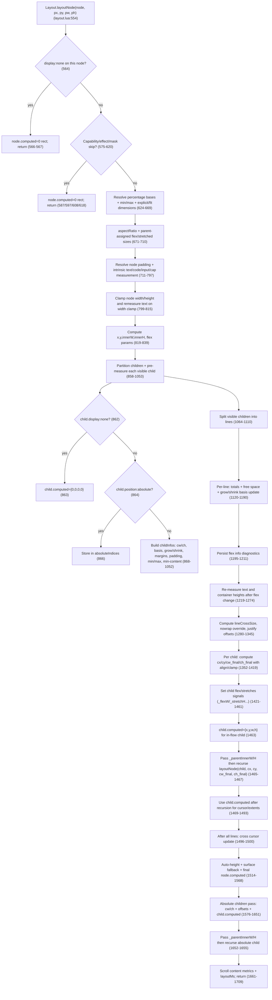

# Layout Trace: `Layout.layoutNode()` to `child.computed`

This document traces the exact execution path from `Layout.layoutNode(node, px, py, pw, ph)` to every place where a child gets `child.computed = { x, y, w, h }`, covering all decision branches and inputs to final geometry.

Primary source: [layout.lua](/home/siah/creative/reactjit/lua/layout.lua)  
Secondary source for text metrics: [measure.lua](/home/siah/creative/reactjit/lua/measure.lua)

## Complete Flowchart

## 1) Exact Path to Every `child.computed` Assignment

There are exactly three child assignment sites in `layout.lua`:

1. `child.computed = { x=0, y=0, w=0, h=0, ... }` for `display:none` children in the child scan loop ([layout.lua](/home/siah/creative/reactjit/lua/layout.lua):862-864).
2. `child.computed = { x = cx, y = cy, w = cw_final, h = ch_final }` for normal in-flow flex children during line positioning ([layout.lua](/home/siah/creative/reactjit/lua/layout.lua):1352-1463).
3. `child.computed = { x = cx, y = cy, w = cw, h = ch }` for `position:absolute` children after parent sizing is finalized ([layout.lua](/home/siah/creative/reactjit/lua/layout.lua):1576-1651).

### Parent gatekeeping before any child work

- `layoutNode` starts at [layout.lua:554](/home/siah/creative/reactjit/lua/layout.lua:554).
- Early returns can prevent child layout entirely:
  - Parent `display:none` ([layout.lua:564-567](/home/siah/creative/reactjit/lua/layout.lua:564)).
  - Parent non-visual capability ([layout.lua:579-589](/home/siah/creative/reactjit/lua/layout.lua:579)).
  - Parent own-surface capability not window root ([layout.lua:590-599](/home/siah/creative/reactjit/lua/layout.lua:590)).
  - Parent background effect ([layout.lua:607-610](/home/siah/creative/reactjit/lua/layout.lua:607)).
  - Parent mask node ([layout.lua:617-620](/home/siah/creative/reactjit/lua/layout.lua:617)).

If any of those branches fire, no child `child.computed` in this call.

### Child scan and classification

After node dimension/padding setup, children are scanned ([layout.lua:858-1053](/home/siah/creative/reactjit/lua/layout.lua:858)).

- `display:none` child:
  - Immediate assignment to zero computed rect ([layout.lua:862-864](/home/siah/creative/reactjit/lua/layout.lua:862)).
  - Child is not placed into flex lines; no recursive call.
- `position:absolute` child:
  - Collected in `absoluteIndices` only ([layout.lua:864-867](/home/siah/creative/reactjit/lua/layout.lua:864)).
  - Computed later in dedicated absolute pass.
- Normal visible in-flow child:
  - Collected in `visibleIndices` and gets a `childInfos[i]` struct used by line layout ([layout.lua:868-1052](/home/siah/creative/reactjit/lua/layout.lua:868)).

### In-flow child final placement path

For each line ([layout.lua:1120](/home/siah/creative/reactjit/lua/layout.lua:1120)) and each child in that line ([layout.lua:1352](/home/siah/creative/reactjit/lua/layout.lua:1352)):

- Final size used in assignment:
  - Row parent:
    - `cw_final = ci.basis` ([layout.lua:1368](/home/siah/creative/reactjit/lua/layout.lua:1368))
    - `ch_final = ci.h or lineCrossSize` ([layout.lua:1369](/home/siah/creative/reactjit/lua/layout.lua:1369))
  - Column parent:
    - `ch_final = ci.basis` ([layout.lua:1399](/home/siah/creative/reactjit/lua/layout.lua:1399))
    - `cw_final = ci.w or lineCrossSize` ([layout.lua:1400](/home/siah/creative/reactjit/lua/layout.lua:1400))
  - Both are clamped via min/max ([layout.lua:1371-1373,1402-1404](/home/siah/creative/reactjit/lua/layout.lua:1371)).
- Final position used in assignment:
  - Row parent:
    - `cx = x + padL + cursor` ([layout.lua:1367](/home/siah/creative/reactjit/lua/layout.lua:1367))
    - `cy` from `alignSelf/alignItems` start/center/end/stretch branches ([layout.lua:1378-1396](/home/siah/creative/reactjit/lua/layout.lua:1378)).
  - Column parent:
    - `cy = y + padT + cursor` ([layout.lua:1398](/home/siah/creative/reactjit/lua/layout.lua:1398))
    - `cx` from alignment branches ([layout.lua:1409-1418](/home/siah/creative/reactjit/lua/layout.lua:1409)).

Assignment occurs at [layout.lua:1463](/home/siah/creative/reactjit/lua/layout.lua:1463), then parent sets:

- `child._parentInnerW = innerW`
- `child._parentInnerH = innerH`
- recursive call: `Layout.layoutNode(child, cx, cy, cw_final, ch_final)`  
  ([layout.lua:1465-1467](/home/siah/creative/reactjit/lua/layout.lua:1465)).

### Absolute child final placement path

After parent node final size is known and `node.computed` is set ([layout.lua:1567](/home/siah/creative/reactjit/lua/layout.lua:1567)), absolute children are processed ([layout.lua:1576-1656](/home/siah/creative/reactjit/lua/layout.lua:1576)):

- `cw` source order: explicit width -> `left+right` derivation -> intrinsic estimate ([layout.lua:1597-1605](/home/siah/creative/reactjit/lua/layout.lua:1597)).
- `ch` source order: explicit height -> `top+bottom` derivation -> intrinsic estimate ([layout.lua:1607-1614](/home/siah/creative/reactjit/lua/layout.lua:1607)).
- Clamp `cw/ch` by min/max ([layout.lua:1618-1619](/home/siah/creative/reactjit/lua/layout.lua:1618)).
- Position:
  - Horizontal: `left`, else `right`, else align fallback ([layout.lua:1621-1637](/home/siah/creative/reactjit/lua/layout.lua:1621)).
  - Vertical: `top`, else `bottom`, else top padding fallback ([layout.lua:1639-1648](/home/siah/creative/reactjit/lua/layout.lua:1639)).

Assignment at [layout.lua:1651](/home/siah/creative/reactjit/lua/layout.lua:1651), then recursive call with parent inner size hints ([layout.lua:1652-1655](/home/siah/creative/reactjit/lua/layout.lua:1652)).

## 2) Width/Height Resolution for a Node (All Sources)

This section describes how any node (current `node` inside `layoutNode`) resolves `w`/`h`.

### Percentage and unit base

- Units are resolved with `Layout.resolveUnit(value, parentSize)` ([layout.lua:88-116](/home/siah/creative/reactjit/lua/layout.lua:88)):
  - number -> unchanged
  - `"fit-content"` -> `nil` (handled by caller)
  - `%` -> `(num/100) * parentSize`
  - `vw`/`vh` -> viewport-scaled
  - `calc(X% +/- Ypx)` supported
  - bare numeric string -> px number
- For node width/height/min/max, percentages use:
  - `pctW = node._parentInnerW or pw`
  - `pctH = node._parentInnerH or ph`
  ([layout.lua:624-631](/home/siah/creative/reactjit/lua/layout.lua:624)).

### Width (`w`) source chain

- Explicit `width` -> `w = explicitW` (`wSource="explicit"`) ([layout.lua:649-652](/home/siah/creative/reactjit/lua/layout.lua:649)).
- `width: "fit-content"` -> `w = estimateIntrinsicMain(node, true, pw, ph)` (`wSource="fit-content"`) ([layout.lua:652-655](/home/siah/creative/reactjit/lua/layout.lua:652)).
- Else if `pw` exists -> `w = pw` (`wSource="parent"`) ([layout.lua:655-657](/home/siah/creative/reactjit/lua/layout.lua:655)).
- Else -> content estimate (`wSource="content"`) ([layout.lua:659-661](/home/siah/creative/reactjit/lua/layout.lua:659)).
- Aspect ratio can replace width when `h` exists and explicit width absent (`wSource="aspect-ratio"`) ([layout.lua:671-680](/home/siah/creative/reactjit/lua/layout.lua:671)).
- Parent signal can override with flex/root-assigned width:
  - `node._flexW` -> `w = node._flexW`, `wSource="flex"` or `"root"` ([layout.lua:687-693](/home/siah/creative/reactjit/lua/layout.lua:687)).
- Text intrinsic measurement can set width if no explicit width and not parent-assigned:
  - `w = measuredTextWidth + padL + padR`, `wSource="text"` ([layout.lua:726-746](/home/siah/creative/reactjit/lua/layout.lua:726)).
- Width is clamped by `minWidth/maxWidth` ([layout.lua:799-802](/home/siah/creative/reactjit/lua/layout.lua:799)).

### Height (`h`) source chain

- Start from explicit `height` if set (`hSource="explicit"`) ([layout.lua:666-668](/home/siah/creative/reactjit/lua/layout.lua:666)).
- If `height: "fit-content"` only marks source initially (`hSource="fit-content"`) ([layout.lua:668-669](/home/siah/creative/reactjit/lua/layout.lua:668)).
- Aspect ratio can derive missing height from explicit width (`hSource="aspect-ratio"`) ([layout.lua:674-676](/home/siah/creative/reactjit/lua/layout.lua:674)).
- Parent stretch/flex/root signals can provide height:
  - `node._stretchH` and flags choose `hSource` among `"stretch"`, `"flex"`, `"root"` ([layout.lua:695-709](/home/siah/creative/reactjit/lua/layout.lua:695)).
- Intrinsic measurements can set height when not explicit:
  - Text -> measured text height + vertical padding (`hSource="text"`) ([layout.lua:726-750](/home/siah/creative/reactjit/lua/layout.lua:726))
  - CodeBlock measured height (`hSource="text"`) ([layout.lua:754-767](/home/siah/creative/reactjit/lua/layout.lua:754))
  - TextInput intrinsic font height + padding (`hSource="text"`) ([layout.lua:768-777](/home/siah/creative/reactjit/lua/layout.lua:768))
  - Visual capability `measure` result (`hSource="text"`) ([layout.lua:779-793](/home/siah/creative/reactjit/lua/layout.lua:779))
- Height clamp if present ([layout.lua:812-815](/home/siah/creative/reactjit/lua/layout.lua:812)).
- If still `nil`, post-children auto-height:
  - Explicit scroll container -> `h=0`, `hSource="scroll-default"` ([layout.lua:1515-1519](/home/siah/creative/reactjit/lua/layout.lua:1515))
  - Row container -> `h = crossCursor + padT + padB`, `hSource="content"` ([layout.lua:1520-1524](/home/siah/creative/reactjit/lua/layout.lua:1520))
  - Column container -> `h = contentMainEnd + padB`, `hSource="content"` ([layout.lua:1525-1530](/home/siah/creative/reactjit/lua/layout.lua:1525))
- Surface fallback for empty non-scroll surfaces:
  - `h = (ph or viewportH)/4`, `hSource="surface-fallback"` ([layout.lua:1541-1546](/home/siah/creative/reactjit/lua/layout.lua:1541))
- Final clamp always applied ([layout.lua:1550](/home/siah/creative/reactjit/lua/layout.lua:1550)).

## 3) How Children Are Measured Before Flex Distribution

All pre-flex measurement happens in [layout.lua:858-1053](/home/siah/creative/reactjit/lua/layout.lua:858) for each visible in-flow child:

1. Initial raw dimensions from style:
   - `cw = ru(cs.width, innerW)`, `ch = ru(cs.height, innerH)` ([layout.lua:870-871](/home/siah/creative/reactjit/lua/layout.lua:870)).
2. Capture flex factors:
   - `grow = cs.flexGrow or 0`
   - `shrink = cs.flexShrink` (defaults later during shrink math) ([layout.lua:872-874](/home/siah/creative/reactjit/lua/layout.lua:872)).
3. Save explicit flags (`explicitChildW/H`) before intrinsic estimation ([layout.lua:875-880](/home/siah/creative/reactjit/lua/layout.lua:875)).
4. Resolve child min/max ([layout.lua:882-886](/home/siah/creative/reactjit/lua/layout.lua:882)).
5. Resolve child padding ([layout.lua:888-894](/home/siah/creative/reactjit/lua/layout.lua:888)).
6. Text child intrinsic measurement if either dimension missing:
   - `fit-content` width path: measure unconstrained (`availW=nil`) ([layout.lua:898-906](/home/siah/creative/reactjit/lua/layout.lua:898)).
   - Otherwise constrained by `outerConstraint = cw or innerW`, optionally min with `cMaxW`, then `constrainW = outerConstraint - cpadL - cpadR` ([layout.lua:908-918](/home/siah/creative/reactjit/lua/layout.lua:908)).
   - Fill missing `cw/ch` from measured text + padding ([layout.lua:919-922](/home/siah/creative/reactjit/lua/layout.lua:919)).
7. Non-text child intrinsic estimation when dimensions missing:
   - `cw = estimateIntrinsicMain(child, true, estW, innerH)` unless skipped
   - `ch = estimateIntrinsicMain(child, false, innerW, innerH)` unless skipped
   - skipped if scroll container or main-axis flex-grow child ([layout.lua:934-949](/home/siah/creative/reactjit/lua/layout.lua:934)).
8. Apply child aspect ratio (explicit-first, then estimated fallback) ([layout.lua:952-972](/home/siah/creative/reactjit/lua/layout.lua:952)).
9. Clamp child width/height; width clamp can trigger text height remeasure ([layout.lua:974-992](/home/siah/creative/reactjit/lua/layout.lua:974)).
10. Resolve child margins and main-axis margins ([layout.lua:994-1009](/home/siah/creative/reactjit/lua/layout.lua:994)).
11. Compute `basis`:
    - `flexBasis` (except `"auto"`) has priority ([layout.lua:1011-1027](/home/siah/creative/reactjit/lua/layout.lua:1011)).
    - Otherwise basis from `cw` or `ch` according to parent axis ([layout.lua:1028-1031](/home/siah/creative/reactjit/lua/layout.lua:1028)).
12. Optional min-content floor for row items without explicit `minWidth`:
    - `minContent = computeMinContentW(child)` ([layout.lua:1033-1040](/home/siah/creative/reactjit/lua/layout.lua:1033)).
13. Persist all of this in `childInfos[i]` ([layout.lua:1042-1052](/home/siah/creative/reactjit/lua/layout.lua:1042)).

## 4) How Flex Grow/Shrink Produces Final Sizes

For each line ([layout.lua:1120-1211](/home/siah/creative/reactjit/lua/layout.lua:1120)):

1. Totals:
   - `lineTotalBasis = sum(ci.basis)`
   - `lineTotalFlex = sum(ci.grow for grow>0)`
   - `lineTotalMarginMain = sum(main margins)`
   - `lineGaps = (lineCount-1)*gap`
   - `lineAvail = mainSize - lineTotalBasis - lineGaps - lineTotalMarginMain`
   ([layout.lua:1126-1146](/home/siah/creative/reactjit/lua/layout.lua:1126)).
2. Grow path (`lineAvail > 0` and `lineTotalFlex > 0`):
   - `ci.basis += (ci.grow/lineTotalFlex) * lineAvail` ([layout.lua:1162-1168](/home/siah/creative/reactjit/lua/layout.lua:1162)).
3. Shrink path (`lineAvail < 0`):
   - `shrink` defaults to 1 if nil ([layout.lua:1176-1178](/home/siah/creative/reactjit/lua/layout.lua:1176)).
   - `totalShrinkScaled = sum(shrink * basis)` ([layout.lua:1173-1179](/home/siah/creative/reactjit/lua/layout.lua:1173)).
   - `overflow = -lineAvail`
   - `shrinkAmount = (sh * basis / totalShrinkScaled) * overflow`
   - `ci.basis -= shrinkAmount` ([layout.lua:1181-1188](/home/siah/creative/reactjit/lua/layout.lua:1181)).
4. Post-distribution remeasurement:
   - Text + grow + no explicit height: remeasure wrapped height for final width ([layout.lua:1219-1249](/home/siah/creative/reactjit/lua/layout.lua:1219)).
   - Row containers (non-text, no explicit height): re-estimate height for new width ([layout.lua:1258-1273](/home/siah/creative/reactjit/lua/layout.lua:1258)).
5. Final assignment inputs:
   - Row: width from `ci.basis`, height from `ci.h or lineCrossSize`.
   - Column: height from `ci.basis`, width from `ci.w or lineCrossSize`.
   ([layout.lua:1368-1404](/home/siah/creative/reactjit/lua/layout.lua:1368)).

## 5) Percentage Resolution at Each Level

### Core resolver behavior

- `Layout.resolveUnit` handles `%`, `vw`, `vh`, `calc(% +/- px)`, numeric strings ([layout.lua:88-116](/home/siah/creative/reactjit/lua/layout.lua:88)).

### Node-level percentage base

- Node uses `pctW/pctH` derived from `_parentInnerW/_parentInnerH` if present, else `pw/ph`; then clears those hints ([layout.lua:624-631](/home/siah/creative/reactjit/lua/layout.lua:624)).
- Min/max and explicit width/height are resolved against these bases ([layout.lua:633-641](/home/siah/creative/reactjit/lua/layout.lua:633)).

### Parent-to-child measurement phase

- Child initial `cw/ch` resolve against parent `innerW/innerH` ([layout.lua:870-871](/home/siah/creative/reactjit/lua/layout.lua:870)).
- Child min/max and padding/margins also resolve against `innerW/innerH` ([layout.lua:882-894,994-999](/home/siah/creative/reactjit/lua/layout.lua:882)).
- `flexBasis` percent uses main-axis parent size; in wrap+gap with plain `%`, a correction is applied:  
  `basis = p*mainParentSize - gap*(1-p)` ([layout.lua:1015-1025](/home/siah/creative/reactjit/lua/layout.lua:1015)).

### Recursive handoff

- Before recursion, parent sets child `_parentInnerW/_parentInnerH` to its own inner size ([layout.lua:1465-1466,1652-1654](/home/siah/creative/reactjit/lua/layout.lua:1465)).
- Child consumes these at entry for percentage resolution ([layout.lua:624-631](/home/siah/creative/reactjit/lua/layout.lua:624)).

### Absolute children

- Absolute explicit sizes, offsets, and margins use parent `w/h` bases ([layout.lua:1581-1595](/home/siah/creative/reactjit/lua/layout.lua:1581)).
- Left+right or top+bottom derivation computes size within parent padding box ([layout.lua:1600,1610](/home/siah/creative/reactjit/lua/layout.lua:1600)).

## 6) Text Measurement Constraint Flow (Parent -> Child)

### Local helper path

- `measureTextNode(node, availW)`:
  - resolves text content + inherited text styles (`fontSize`, `fontFamily`, `fontWeight`, `lineHeight`, `letterSpacing`, `numberOfLines`)
  - applies text scale
  - calls `Measure.measureText(..., availW, ...)`
  ([layout.lua:271-285](/home/siah/creative/reactjit/lua/layout.lua:271)).

### Constraint generation in `layoutNode`

1. For the current text node (self sizing):
   - `outerConstraint = explicitW or pw or 0`
   - if no explicit width and `maxW`, clamp outer constraint
   - `constrainW = outerConstraint - padL - padR` (floored at 0)
   - measure text with that width
   ([layout.lua:726-740](/home/siah/creative/reactjit/lua/layout.lua:726)).
2. If width clamp changes text width and no explicit height:
   - remeasure height with new inner width (`w - padL - padR`)
   ([layout.lua:803-809](/home/siah/creative/reactjit/lua/layout.lua:803)).
3. During child pre-measure:
   - text child gets `constrainW = (cw or innerW, maybe cMaxW-clamped) - cpadL - cpadR`
   - `fit-content` width uses unconstrained measurement (`availW=nil`)
   ([layout.lua:898-923](/home/siah/creative/reactjit/lua/layout.lua:898)).
4. After flex growth:
   - text child with grow and auto height remeasured using post-flex `finalW - padL - padR`
   ([layout.lua:1219-1243](/home/siah/creative/reactjit/lua/layout.lua:1219)).
5. For intrinsic container estimation:
   - `estimateIntrinsicMain(..., isRow=false)` computes wrap width from parent width minus horizontal padding, then measures text with that wrap width
   ([layout.lua:439-452](/home/siah/creative/reactjit/lua/layout.lua:439)).

## 7) `estimateIntrinsicMain()` Behavior

`estimateIntrinsicMain(node, isRow, pw, ph)` is the recursive content-size estimator ([layout.lua:413-544](/home/siah/creative/reactjit/lua/layout.lua:413)).

1. Resolve axis padding and `padMain` ([layout.lua:417-424](/home/siah/creative/reactjit/lua/layout.lua:417)).
2. Text nodes:
   - resolve text/style inheritance
   - if measuring height (`isRow=false`) and `pw` exists, derive `wrapWidth = pw - hPadL - hPadR`
   - return measured width or height + `padMain`
   ([layout.lua:425-455](/home/siah/creative/reactjit/lua/layout.lua:425)).
3. TextInput nodes:
   - height from font metrics + `padMain`, width returns `padMain`
   ([layout.lua:457-466](/home/siah/creative/reactjit/lua/layout.lua:457)).
4. Empty non-text container:
   - return `padMain` ([layout.lua:469-472](/home/siah/creative/reactjit/lua/layout.lua:469)).
5. Non-empty container:
   - determine `gap`, `direction`, `containerIsRow` ([layout.lua:474-477](/home/siah/creative/reactjit/lua/layout.lua:474))
   - for height estimation with known `pw`, compute `childPw = pw - horizontal padding` to keep child wrapping realistic ([layout.lua:478-487](/home/siah/creative/reactjit/lua/layout.lua:478))
   - if measuring container's main axis, sum child explicit main size or recursive estimate + margins + inter-item gaps ([layout.lua:492-517](/home/siah/creative/reactjit/lua/layout.lua:492))
   - if measuring cross axis, take max child explicit cross size or recursive estimate + margins ([layout.lua:518-544](/home/siah/creative/reactjit/lua/layout.lua:518)).

## 8) Recursive Child Call Details (What Gets Passed)

### In-flow child recursion

- Immediately after in-flow assignment ([layout.lua:1463](/home/siah/creative/reactjit/lua/layout.lua:1463)):
  - `child._parentInnerW = innerW`
  - `child._parentInnerH = innerH`
  - call `Layout.layoutNode(child, cx, cy, cw_final, ch_final)`
  ([layout.lua:1465-1467](/home/siah/creative/reactjit/lua/layout.lua:1465)).

Inside child call:

- child resolves percentages from `_parentInnerW/H` first ([layout.lua:624-631](/home/siah/creative/reactjit/lua/layout.lua:624)).
- child may override incoming `pw/ph` with own explicit sizes, intrinsic sizes, flex signals, margins, etc., then writes its own `node.computed` ([layout.lua:649-1568](/home/siah/creative/reactjit/lua/layout.lua:649)).

### Absolute child recursion

- After absolute assignment ([layout.lua:1651](/home/siah/creative/reactjit/lua/layout.lua:1651)):
  - same `_parentInnerW/H` handoff
  - call `Layout.layoutNode(child, cx, cy, cw, ch)`
  ([layout.lua:1652-1655](/home/siah/creative/reactjit/lua/layout.lua:1652)).

## 9) Notable/Unexpected but Intentional-Looking Behaviors

These are behavior notes, not bug claims:

1. `measureTextNode` can receive `availW=0` when constraints go negative and are floored to 0 ([layout.lua:737,805,916,980,1236](/home/siah/creative/reactjit/lua/layout.lua:737)); `Measure.measureText` only treats width as constrained when `maxWidth > 0` ([measure.lua](/home/siah/creative/reactjit/lua/measure.lua):249), so `0` behaves like unconstrained single-line measurement.
2. Parent assigns `child.computed` before recursion ([layout.lua:1463,1651](/home/siah/creative/reactjit/lua/layout.lua:1463)); child then computes its own final `node.computed` during its call ([layout.lua:1567](/home/siah/creative/reactjit/lua/layout.lua:1567)). Parent cursor updates intentionally use child post-recursion size ([layout.lua:1469-1493](/home/siah/creative/reactjit/lua/layout.lua:1469)).
3. In nowrap, line cross size is forced to full available cross size when definite ([layout.lua:1294-1310](/home/siah/creative/reactjit/lua/layout.lua:1294)), making align/stretch operate against container cross-space rather than tallest child.
4. `justifyContent` is guarded by `hasDefiniteMainAxis` ([layout.lua:1329-1345](/home/siah/creative/reactjit/lua/layout.lua:1329)) to avoid huge offsets from auto-height fallback cases.
5. Explicit `overflow: "scroll"` with no explicit height resolves to `h=0` until constrained by explicit/flex sizing ([layout.lua:1515-1519](/home/siah/creative/reactjit/lua/layout.lua:1515)).
6. Percentage `flexBasis` gap correction in wrap mode only applies for plain percent strings, wrap enabled, and `gap > 0` ([layout.lua:1021-1025](/home/siah/creative/reactjit/lua/layout.lua:1021)).
7. `Scene3D` and `Emulator` parents are treated as opaque leaves (`allChildren = {}`), so their children are intentionally not flex-laid-out in this pass ([layout.lua:850-854](/home/siah/creative/reactjit/lua/layout.lua:850)).
8. Direction handling is mixed by helper: `estimateIntrinsicMain` and `computeMinContentW` treat `"row-reverse"` as row-like in specific checks ([layout.lua:346,475-477](/home/siah/creative/reactjit/lua/layout.lua:346)), while the main placement flag is `isRow = (flexDirection == "row")` ([layout.lua:832](/home/siah/creative/reactjit/lua/layout.lua:832)).
