# ReactJIT Layout Engine Investigation

## Layout Path Flowchart

```mermaid
flowchart TD
    Start([layoutNode entry]) --> Context[Resolve min/max & pct contexts<br>Determine pctW/pctH]
    Context --> ResolveSelf[Resolve Node's explicit w/h<br>fallback to estimateIntrinsicMain if auto-sized]
    ResolveSelf --> FlexAssignments[Consume _flexW / _stretchH<br>Set parentAssignedW]
    FlexAssignments --> OuterTextCheck{Is Text Node?}
    OuterTextCheck -- Yes --> ReMeasureText[Measure text based on available w/h constraint<br>Assign wrap dimensions]
    OuterTextCheck -- No --> ClampMain[Clamp w to min/max boundaries]
    ReMeasureText --> ClampMain
    ClampMain --> InnerSize[Compute innerW / innerH<br>Subtract padding]
    
    InnerSize --> ChildIterate[Iterate visible/absolute children]
    ChildIterate --> MeasureChild[Resolve explicit specs per child<br>estimateIntrinsicMain if dimensions missing]
    MeasureChild --> Basis[Compute initial child flex basis]
    Basis --> WrapLines[Split children into flex WRAP lines<br>Determine wrap logic based on main size constraints]
    
    WrapLines --> FlexGrowth[Flex distribution phase:<br>Allocate free space to flexGrow<br>Retract negative space via flexShrink]
    FlexGrowth --> ReMeasureChildText[Re-measure Text node wrappers if basis changed]
    ReMeasureChildText --> Justify[Justify content & compute spacing Offsets]
    Justify --> CrossAxis[Compute flex cross constraint max sizes]
    
    CrossAxis --> ChildLayoutLoop[Iterate lines for alignment positioning]
    ChildLayoutLoop --> PushSignals[Signal _flexW & _stretchH child tags to pass constraints down]
    PushSignals --> Recurse[Call layoutNode bounds on Child recursively]
    Recurse --> Advance[Advance bounding cursor<br>Track maximum extent box areas]
    
    Advance --> AutoHeight[Container Auto-Height fallback bounds shrink wrapping]
    AutoHeight --> SetBounds[\Apply final child.computed x, y, w, h\]
```



## Thesis: Why `flexGrow: 1` Produces `w: 0`

The bug originates directly inside the `flex-adjusted main-axis` signaling path designed to transmit modified flex sizes down into the child (`lua/layout.lua`).

1. **Signaling Failure**: At **line 1424** `layoutNode()`, the engine attempts to notify row children of their newly calculated flex-width with `child._flexW = cw_final`:
   ```lua
   local explicitChildW = ru(cs.width, innerW)
   if explicitChildW and cw_final ~= explicitChildW then
     child._flexW = cw_final
   ```
   If a child has `flexGrow: 1` but no explicitly declared physical `width` property, `ru(cs.width)` safely evaluates to `nil`. Because the `if explicitChildW` logic block demands a truthy value to enter, it bypasses the signal completely. The flex-distribution algorithm correctly determines `cw_final`, but completely fails to write it to `child._flexW`.

2. **Re-Shrink Collapse**: Because `child._flexW` is not assigned, when the child itself recursively runs its own `layoutNode()`, its internal `parentAssignedW` flag evaluates to `false` (**line 687**). 
   - For `<Text>` nodes: at **line 743**, since `parentAssignedW` is false, the text unconditionally abandons whatever parent layout boundary was passed to it, snapping its physical width exactly back down to its raw character text-width evaluation (`mw`).
   - If the text is short, it visually collapses tightly around the font, ignoring the flex container's attempt to distribute width proportional to the sibling cells.
   - For `<View>` elements: If the parent dynamically auto-sized (`fit-content` block) into a container, missing explicit width causes recursive zero evaluations returning back up the chain.

## Thesis: Why Percentage Widths cause Text to Overflow its Container

The bug arises because `estimateIntrinsicMain()` incorrectly strips child-specific style constraints out of layout calculation when estimating bounding vertical dimensions. 

1. **Upper Bound Leakage**: When the layout engine runs height evaluations (`estimateIntrinsicMain()` across `isRow = false` loops on generic containers), it must iteratively execute `Measure.measureText()` algorithms to properly know how tall multi-line wrapped text blocks will be.
2. **Ignored Style Constraints**: At **line 442** of `layout.lua`:
   ```lua
   if not isRow and pw then
     -- hPad logic...
     wrapWidth = pw - hPadL - hPadR
   ```
   This code builds `wrapWidth` directly from the parent container width limits natively passing `pw`. Crucially, it never checks if the Text Node itself natively possesses limits via `s.width`. If the parent container is `1000px` horizontal width, and the Text node specifies `width: '25%'`, the text is blindly unconstrained up to the `1000px` parent line limit.
3. **Container Mismatch**: The Text evaluates correctly for 1 line of vertical height against a 1000px wrap. The measurement bubbles up, setting the `<Row>` or `<View>` height explicitly tight to `14px`. 
4. **Physical Rendering Misalignment**: Later, when the Text node definitively enters its finalized individual layout iteration (`layoutNode()`), it correctly identifies its `250px` width constraint (25%). Re-measuring against `250px`, the text flows correctly into 4 lines of wraps requiring `56px` height. Because its parent container layout was already baked permanently to the 1 line (`14px`) calculation derived earlier, the Text layout naturally expands vertically 400% past the physical parent bounds.

*Secondary note for full natural widths: On **line 945**, whenever an element dictates `"fit-content"`, the `estW` limits passed downwards are forcefully set to `nil`. Recursive children completely lose the numerical baseline anchor they require to run generic percentage `ru("25%", nil)` calculations, generating `nil` text wraps returning extreme bounds matching text natural length perfectly in one sentence line.*
