# ReactJIT Layout Engine Analysis

This document traces the exact path a node follows during a layout pass, from the moment `Layout.layoutNode()` is called to the moment `child.computed = {x, y, w, h}` is resolved and finalized.

## 1. Flowchart of the Complete Layout Path

```mermaid
flowchart TD
    Start[Layout.layoutNode] --> CheckDisplay{Display/Render? <br/> Lines 564-620}
    CheckDisplay -- display:none, <br/> non-visual, or mask --> FinishSkip[Return computed = 0x0]
    
    CheckDisplay -- Valid Node --> Context[Resolve Percentage Constraints <br/> pctW/pctH via _parentInnerW/H]
    Context --> DimSources[Resolve Width & Initial Height <br/> Explicit, aspect-ratio, fit-content, or estimateIntrinsicMain]
    DimSources --> FlexOverrides[Override Dimensions using Parent Signals <br/> _flexW and _stretchH]
    FlexOverrides --> Padding[Resolve Node Padding <br/> Uses own allocated 'w' / 'h']
    
    Padding --> TextMeasure[Intrinsic Measurement <br/> Measure Text / CodeBlock with inner constrainW]
    TextMeasure --> ClampSelf[Constrain Node Dimensions using <br/> minWidth/maxWidth/minHeight/maxHeight]
    
    ClampSelf --> BoxModel[Set Margin & Base Coordinates x, y <br/> Determine innerW and innerH]
    BoxModel --> ChildPre[Child Pre-measurement Loop <br/> Map over visible children]
    
    ChildPre --> ChildDims[Resolve Explicit Child constraints <br/> padding, min/max]
    ChildDims --> ChildIntrinsic[Child Intrinsic Sizing <br/> measureTextNode or estimateIntrinsicMain <br/> *Skipped for flexGrow items*]
    ChildIntrinsic --> ChildBasis[Compute flexBasis & minContent]
    ChildBasis --> Wrap[Wrap Evaluation <br/> Split children into Flex Lines]
    
    Wrap --> LineLoop[Loop over Flex Lines]
    LineLoop --> DistFlex[Distribute Flex Grow / Shrink <br/> Adjusts each child's basis]
    DistFlex --> RemeasureText[Re-measure text if width changed via flex]
    RemeasureText --> ReEst[Re-estimate container height if row width changed]
    ReEst --> CrossAxis[Determine lineCrossSize]
    CrossAxis --> Justify[Justify Content Main-Axis Offsets]
    Justify --> Position[Child Positioning Loop]
    
    Position --> AlignElements[cx/cy Assignment via AlignItems/Self <br/> Assigns final cw_final and ch_final]
    AlignElements --> Signals[Set Signal Overrides <br/> child._flexW, _stretchH, _parentInnerW/H]
    Signals --> Recurse[Recursive Call: layoutNode child]
    Recurse --> Advance[Advance Main & Cross Cursors]
    Advance --> Position
    Position --> LineLoop
    
    LineLoop --> AutoHeight[Resolve deferred Auto Height <br/> using crossCursor / farthest child bounds]
    AutoHeight --> SurfaceFallback[Proportional Surface Fallback <br/> if h < 1 and empty]
    SurfaceFallback --> FinalClamp[Clamp final h against minH/maxH]
    FinalClamp --> SetComputed[Finalize node.computed = x, y, w, h]
    
    SetComputed --> Absolute[Lay out position:absolute children <br/> Recursion over Absolute items]
    Absolute --> Scroll[Evaluate scroll state content bounds]
    Scroll --> Finish[End layoutNode]
```

## 2. Walkthrough of the Execution Path

Here is the step-by-step breakdown of how dimensions are resolved in `layout.lua`.

**1. Early Exits (Lines 564-620)**  
The node immediately returns `{ x=px, y=py, w=0, h=0 }` if `display == "none"`, if it's a non-visual capability, a separate window root, a background effect, or a mask node.

**2. Context & Dim Initialization (Lines 624-645)**  
Percentage unit resolution heavily relies on parent context. The script pops `node._parentInnerW` and `node._parentInnerH` (set by the parent in a previous frame) into `pctW` and `pctH` (lines 628-629), then clears the node flags so they don't persist automatically. It resolves `min/max` dimensions and explicit styles against these dimensions.

**3. Initial Width Resolution (Lines 648-662)**  
A node's width `w` originates from one of four defined logic paths:
- Explicit style (`explicitW`)
- Fit-content flag triggering `estimateIntrinsicMain(node, true)`
- The parent width `pw` itself if explicitly passed to layoutNode
- Content-based estimation `estimateIntrinsicMain` (if all earlier fallbacks fail)

**4. Deferred Auto-Height & Aspect Ratio (Lines 666-681)**  
Height initialization attempts explicit sources, but defers content-based calculation. Aspect ratios fill missing dimensions from provided coordinates if configured here.

**5. Parent Overrides / Flex Signals (Lines 686-710)**  
Parent flex layouts modify size signals before a recursive call. The node reads `node._flexW` and `node._stretchH` and overwrites `w` or `h` with them, adopting the parent's flex distribution choices. 

**6. Padding Resolution & Leaf Size (Lines 712-797)**  
Padding variables (`padL`, `padT`, etc.) are resolved using percentages against the *current node's initialized width or height* (`ru(s.padding, w)` on line 713). 
If the node is a Text leaf node, its outer width minus left/right padding forms an inner wrapping constraint (`constrainW`). `measureTextNode()` parses this text to set final inner constraints, appending padding back into `w` and `h` (`w = mw + padL + padR`). Generic opaque capability elements or CodeBlocks do similarly here.

**7. Clamping & Box Model Coordinate Binding (Lines 799-829)**  
`w` and `h` are pushed through `clampDim` to respect min/max limits. If a text node squishes its width here, the layout re-measures text to recalculate vertical height (line 803).
Finally, `x = px + marL` and `y = py + marT`. Inner capacities `innerW = w` and `innerH = (h or 9999)` are made. If `h` is unset/auto, it's patched to 9999 for passing layout logic. 

**8. Child Measurement & Flex Filtering (Lines 847-1056)**  
The parent ignores absolute elements or opaque graphical items, looping exclusively over standard styled flex items. For every visible `child`:
- Checks `explicitChildW/H`.
- Resolves child paddings using *the parent's `innerW` / `innerH`*.
- **Pre-Flex Base Intrinsic Pass**: Unless explicitly bounded or the target child has `flexGrow > 0` (preventing early structural basis inflation), it runs `estimateIntrinsicMain` to size container children.
- Aspect ratio derivations exist here for kids.
- Min and Max width clamps are done.
- `basis`, mirroring a CSS `flex-basis`, is calculated by resolving explicitly scaled CSS rules or defaulting to the explicitly identified `cw` & `ch`.

**9. Flex Tiling/Wrapping (Lines 1058-1110)**  
If `flexWrap == "wrap"`, children iteratively fill rows until accumulated basis + margins + gaps exceeds `mainSize`. It chunks them into lines. 

**10. Flex Distributing Lines (Lines 1112-1499)**  
For each line chunk:
- Available space (`lineAvail`) equals mainSize minus basis, margin, and gaps.
- If positive space, inflates `basis` of children bearing `flexGrow > 0` proportional to their ratio of total line grow force (Line 1167).
- If negative space, shrinks `basis` identically using `flexShrink` multipliers (Line 1186).
- **Remeasurement Effect:** (Line 1213) Because flex distribution physically altered the width, `isText` elements are passed into `measureTextNode` *again*. Their heights reflow.
- Line Cross-size evaluates to highest `ch` boundary in that flex row string. If no wrapping occurs, `lineCrossSize` matches container full bounds.
- Based on `justifyContent`, determines starting coordinates (`lineMainOff`) and spacing gaps (`lineExtraGap`).
- Aligns and tracks position cursor (`cx`/`cy`). Stretch cross alignment dynamically modifies child max ranges.
- Signals: Assigns `child._flexW`, `child._stretchH`, `child._parentInnerW`, and inner capacity variants.
- **Recursive Layout Trigger**: The parent calls `Layout.layoutNode(child, cx, cy, cw_final, ch_final)` executing the full pathway for the nested node (Line 1467).

**11. Auto-height & Finalizing Node Size (Lines 1503-1567)**  
Upon resolving all nested layout calls, if `h` was explicitly absent (deferred setup), it pulls total accumulation from `crossCursor` or bounds values `contentMainEnd` (Line 1528) + padding bottoms to lock exact element height.
*Proportional surface fallback*: An empty node sizing down to <1 pixel scales up dynamically utilizing a 1/4th frame view multiplier to ensure placeholder geometries retain visibility (Lines 1534-1547).  
The final dimensions populate the object mapping: `node.computed = {x, y, w, h}`.

**12. Absolute Positioning & Scroll Bounds (Lines 1569-1710)**  
Iteratively lays out explicit `absolute` tagged elements using parent bounding maps. Scroll dimensions evaluate absolute width values resolving final layout logic.

## 3. Coverage Analysis Questions

**1. How width and height are resolved for a node**  
Dimensions pass through a series of prioritized overrides. For width: `explicitW` overrides everything -> `node._flexW` modifies basis from generic parent assignments -> `fit-content` relies on content measurements -> fallbacks drop down to `estimateIntrinsicMain()`. Height replicates this structure via `explicitH`, `node._stretchH`, and falls back to an end pipeline deferral gathering total row contents if missing. Both are heavily strictly limited down by min/max constraints at layout resolution points. 

**2. How children are measured before flex distribution**  
Nested nodes are sized prior to flex-expansion using their explicit traits scaling to `pctW`. Nodes flagged with `flexGrow > 0` or bearing `overflow: scroll` purposefully bypass `estimateIntrinsicMain` auto-calculators on explicit axis variables (Line 941). Elements lacking dimension rely bottom-up text content metrics. 

**3. How flex distribution calculates final sizes**  
The line accumulator totals bases `lineTotalBasis`. Remaining space represents `lineAvail = mainSize - lineTotalBasis - lineGaps...`. 
Positive flex distributes leftover fractions per-child using math: `basis = basis + (grow / lineTotalFlex) * lineAvail` (Lines 1162-1169).
Negative spacing performs reduction proportional to normalized ratios bounded implicitly by `1` values or specified integers mapping across elements.

**4. How percentage values resolve at each level**  
Parents manually provide internal rendering bounds through variables `_parentInnerW` and `_parentInnerH` (Line 1465). The recursive node intercepts these bounds overriding `pctW / pctH` and utilizes `Layout.resolveUnit(value, parentSize)` to render percentage scales properly decoupled from padding layouts. 

**5. How text measurement constraints flow**  
Constraint limits utilize `explicitW`, bounds mappings, or parent width `pw`. Nodes factor out current internal padding arrays `padL`/`padR` and inject an `outerConstraint - padding` as `constrainW` in Line 736 to prevent wrapping overlaps. After Flex Grow expansions, text strings iteratively force-reflow via `measureTextNode` to establish dynamic layouts. 

**6. How estimateIntrinsicMain() works**  
Calculates dimensional needs bottom-up mapping across nested children arrays prior to structural placements. For visual objects, reads explicit metrics. For row strings, computes visible nodes ignoring `display="none"` items. Adds up sizes and gap constraints along the main axis, and captures the absolute max height dimensions across cross layouts. Text inputs pull directly from implicit font-engine bounds. 

**7. How recursive layoutNode runs**  
After determining spatial capacity coordinates `cx, cv`, exact flex bounded scales `cw_final`, flex instructions `_flexW`, `_stretchH`, and inner dimensions via `_parentInnerW`, children receive a deep traversal invocation (Line 1467). While parent elements technically append a default initial `node.computed` prior to invocation, the nested node explicitly overwrites sizing data across its own clamping cycle calculations.

## 4. Problematic, Ambiguous & Surprising Code Behavior

- **9999px Auto-Height Percentages**: Line 829 forces `innerH = (h or 9999) - padT - padB`. If a parent node defers height calculation (`h` is implicitly auto-computed at layout completion phase), nested child percent styles explicitly scale utilizing `9999` constraints logic context rather than scaling correctly against dynamically computed height boundaries. For instance, a box holding `height: "50%"` housed in an unsized auto-column layout becomes almost 5000px high unexpectedly!
- **Flex Grow Size Cancellation (`nil` width generation)**: On lines 941-945, `skipIntrinsicW` explicitly forces children with `flexGrow > 0` to skip their estimation logic returning `nil` width boundaries. When percentage widths pair with `flexGrow` tags simultaneously, structural parsing lacks initialization content causing basis variables to crash or collapse dynamically resulting in explicit zero width behaviors in auto contexts. 
- **Missing row-reverse logic in layout pass**: While `computeMinContentW` evaluates logic explicitly for `row-reverse` styles, layout generation maps solely checks boolean states utilizing `isRow = s.flexDirection == "row"`. Nodes styled utilizing reverse configurations explicitly fail processing as horizontal strings and map incorrectly mapping logic across layout pipelines dynamically formatting bounds.
- **Node Self-Padding Discrepancies**: Line 713 executes padding configurations mapping dimensions `ru(s.padding, w)` directly against their *own layout constraints* whereas child preparation structures utilizing `cpad = ru(cs.padding, innerW)` scales paddings using parent nested states directly. 
- **Falsy Lua 0 Bounds Calculations (Aspect Ratio)**: Line 964 checks condition logic checking `(cw or 0) > 0 and (ch or 0) <= 0`. Depending on estimation factors explicitly yielding `0` constraints in intrinsic pipelines, Lua logic mapping fails to distinguish false conditionals vs mapped numbers rendering fallback behaviors inconsistent explicitly skipping bounds scaling. 
