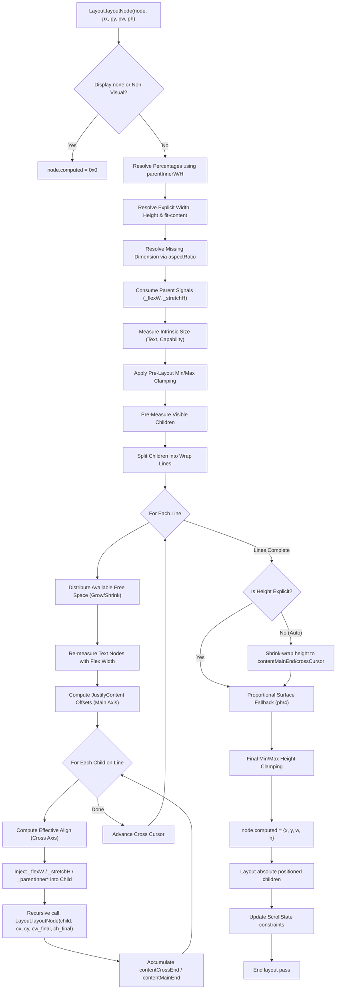

# ReactJIT Layout Engine: Node Layout Path

This document traces the exact execution path a single node takes through the ReactJIT flexbox layout engine, starting from the invocation of `Layout.layoutNode(node, px, py, pw, ph)` and culminating in the final assignment of `child.computed = {x, y, w, h}`.

## 1. Flowchart of the Layout Path

---

## 2. Prose Explanation by Execution Step

### Step 1: Early Exits & Bailing
*(Lines 564-620)*
The layout engine first checks if the node should be skipped entirely. If `style.display == "none"`, or if the node is a background effect, mask, or a non-visual capability (like Audio), it is instantly assigned a 0x0 computed bounding box and returns early. The descendants of these nodes are not laid out.

### Step 2: Percentage Dimension Resolution Setup
*(Lines 624-637)*
To resolve percentages correctly, `layoutNode` cannot use its own bounding box (`pw`, `ph`). It reads `node._parentInnerW` and `node._parentInnerH`, which were cleanly calculated by the parent (stripping padding). If `node._parentInnerW` is nil (which happens at the root), it falls back to `pw`. `minWidth`/`maxWidth`/`minHeight`/`maxHeight` are then resolved against this correct width.

### Step 3: Width and Height Resolution (Every Source)
*(Lines 639-710)*
Dimensions are resolved from a cascading hierarchy of sources:
1. **Explicit Setting**: Checks for literal values in `s.width` and `s.height` (lines 640-641).
2. **`fit-content` Sizing**: If `width == "fit-content"`, it invokes `estimateIntrinsicMain(node, true)` (lines 652-654).
3. **Parent Fallbacks (pw)**: If no width is specified, the node attempts to span the full available width assigned by the parent (`pw`) (lines 655-657).
4. **Content Auto-Sizing**: If `pw` is also absent, it attempts to estimate width intrinsically (lines 659-661). 
5. **Auto-Height**: Most container heights are intentionally left as `nil` at this stage because true heights are only known after wrapping children.
6. **Aspect Ratio Substitution**: If one dimension is present but not the other, `s.aspectRatio` takes over (lines 671-681).
7. **Parent Flex Overrides**: This is a critical pattern! Before calling `layoutNode`, the parent assigns ephemeral fields to the child (`node._flexW` or `node._stretchH`) indicating the outcome of a flex row distribution or stretch alignment (lines 683-709). These overrides take ultimate priority.

### Step 4: Intrinsic Self-Measurement (Text/CodeBlock/Leaf)
*(Lines 719-797)*
Leaf nodes that dictate their own sizes from their inner content (like `Text`, `TextInput`, and `CodeBlock`) take over next. If it's a Text node:
- It computes its inner constraint (`constrainW = outerConstraint - padL - padR`).
- Calls `measureTextNode` with this wrap constraint.
- The returned raw `mw`/`mh` values are supplemented with padding and assigned to `w`/`h`.

### Step 5: Pre-Layout Min/Max Clamping
*(Lines 799-815)*
The tentative `w` and `h` are clamped against bounds. 
**Surprise Logic:** If clamping changes a `Text` node's width (e.g., forcing a paragraph to be incredibly narrow), the engine instantly reruns `measureTextNode()` (lines 803-810) with the clamped inner constraint to recalculate wrapped line-heights!

### Step 6: Margin Initialization & Prep
*(Lines 819-845)*
Calculates the starting drawing origin (`x`, `y`) by adding margin bounds. Computes inner variables `innerW` and `innerH` used as the container bounding box for children. 

### Step 7: Measuring Children Before Flex Distribution (Pre-Measure)
*(Lines 848-1057)*
It splits children into `absoluteIndices` (deferred for later) and `visibleIndices`. For each visible child:
1. Retrieves padding and min/max clamps.
2. If it's a Text node without explicit sizes, it pre-measures itself (`measureTextNode`).
3. If it's an unsized container, it aggressively pre-measures the container's content recursively via `estimateIntrinsicMain(child)`. **Surprise Logic:** It intentionally skips this intrinsic estimate for children with `flexGrow > 0` along the main axis (line 941). Auto-sizing flex-grown content inflates the flex-basis and usually causes layout breakages.
4. It sets the `basis` (line 1011-1031). It falls back from `flexBasis` -> explicitly defined size -> intrinsically measured size. **Surprise Logic:** If the parent is a wrapping row with gaps, pure string percentages in `flexBasis` (e.g., "50%") get corrected using `basis = p * mainParentSize - gap * (1 - p)` to ensure elements don't wrap unintentionally from gap interference.
5. Saves all data into an optimized `childInfos` struct cache (line 1042-1052).

### Step 8: Splitting Lines (`flexWrap`)
*(Lines 1058-1110)*
If `flexWrap == "nowrap"` (default), all elements are pushed to a single line array. If `"wrap"`, it iteratively tracks Main Axis accumulation: `itemMain = math.max(floor, ci.basis) + margins`. If `itemMain + currentLineSize + gap > mainSize`, it partitions the elements arrays into new sub-arrays.

### Step 9: Flex Distribution Calculations (Grow/Shrink)
*(Lines 1111-1191)*
For each line:
- The total explicit length consumed by items, padding, margins, and gaps is summed. 
- Leftover space = `lineAvail`. 
- **Flex Grow:** If positive free space exists and `lineTotalFlex > 0`, `lineAvail` is portioned out to each node linearly (`grow / lineTotalFlex`).
- **Flex Shrink:** If free space is negative (`lineAvail < 0`), things get shrunken proportionally to their `basis * shrink` metric relative to `totalShrinkScaled`.

### Step 10: Re-Measuring Responsive Elements
*(Lines 1213-1274)*
Because `w` values have now permanently shifted due to grow/shrink:
- **Text Recalibration:** Text items are put through `measureTextNode` for a *third* time with their final `cw_final` width, so their heights are finalized properly for wrapping bounds.
- **Row Container Re-Estimation:** If the container grew/shrunk, any nested content bounding boxes could change dynamically. Re-evaluates container heights to find the final line cross block (lines 1258-1274).

### Step 11: JustifyContent & The Cross-Axis 
*(Lines 1276-1345)*
- The engine calculates the line's highest entity (`lineCrossSize`).
- Based on `justifyContent` (e.g., `center`, `space-between`), it finds the `lineMainOff` offset value, along with extra spacing distances (`lineExtraGap`).

### Step 12: Positioning Children + Injecting State + Recursiveness
*(Lines 1347-1501)*
The engine steps through children in each flex line. 
- It uses `effectiveAlign` (falling back to parent `alignItems`) to compute individual offsets `cx` and `cy`.
- **Signaling Data Injection:** This is deeply structural to the JIT engine. Before the child triggers `Layout.layoutNode()`, the JIT sets state keys directly to the child's class/struct (lines 1421-1466): 
    - `child._flexW = cw_final`
    - `child._stretchH = ch_final`
    - `child._parentInnerW = innerW`
- Finally, it calls **`Layout.layoutNode(child, cx, cy, cw_final, ch_final)`** allowing the recursive cascade. 

### Step 13: Auto-Height Resolution (Shrink-Wrap)
*(Lines 1503-1550)*
If the node began with `h == nil` (the common path for layout boxes):
- For rows: `h = crossCursor + padT + padB`.
- For columns: `h = contentMainEnd + padB`. 
**Surprise Logic:** If the container ended up with `h < 1` and happens to be a graphical `Surface` node type (Views, VideoPlayer, Scene3D), the UI imposes a hard limit: `h = ph / 4` (lines 1534-1547). This aggressively guarantees all root scenes scale cleanly to 25% sizes down the DOM tree rather than flat-lining.

### Step 14: Absolute Child Computation & Scroll State Updates
*(Lines 1551-1704)*
`node.computed = {x,y,w,h}` is formally set (line 1567). 
Following this, the engine goes over any deferred `absoluteIndices`. Absolute items have their layouts solved via Top/Right/Left/Bottom offsets, relative directly to the parent's padding box variables (`w`, `h`). Intrinsic fallbacks are supplied when offsets are incomplete. Finally, maximum scroll offsets are calculated and safely stored.

---

## 3. Deep Dive into `estimateIntrinsicMain()`

*(Lines 404-544)*
`estimateIntrinsicMain` provides bottom-up (reverse) layout calculation. If a node is missing sizes, this method attempts to simulate how large the layout DOM inside of it naturally is.
It is a recursive algorithm that traverses descendants checking for widths vs heights:
1. First adds Padding lengths to bounding boxes.
2. Leaf Text checks trigger unconstrained (or padding-constrained) text measurements. TextInput resolves exact height via standard fonts.
3. For container trees, children are aggressively mapped.
    - If calculating the **Main Layout Extent** (`isRow and isContainerRow`), it sums dimensions linearly with `gap`.
    - If calculating the **Cross-axis Maximum**, it measures individual sizes and grabs the max.
**Ambiguous Logic Point:** (Line 443) When measuring heights for Text word-wrapping (`isRow == false`), `pw` represents the wrap constraint. If the parent column has no width specified (`pw == nil`), `pw` becomes `nil`. Therefore, nested inner text blocks will default to a mathematically infinite string array and map exclusively as single-lines causing layout overflows.

---

## Notes on Ambiguous and Surprising Mechanics

1. **Deferring via Meta-Programming**: Data signals like `_flexW` and `_stretchH` are actively meta-injected onto the element class tables rather than passed through pure function arguments. This makes tracing data dependencies exceptionally difficult.
2. **Double Clamping Pattern**: The layout enforces clamping (`clampDim`) both *before* pre-layout measuring and *after* main-axis placement ensuring no items artificially wrap around memory buffers. However, to keep it structurally perfect, Text boxes actually call Love2D Font calculation APIs up to **three** exact times per node in standard column views.
3. **Explicit Scroll Height Defeats**: (Line 1515) Explicit scroll-marked items without explicit height skip Auto Main Heights dynamically and return size `0`. The framework actively punishes undeclared `overflow == "scroll"` containers since shrink-wrapping scrolling structures inherently crashes flex-box designs.
4. **Gap-Percentage Correction**: Percentage sizing logic (line 1021) overrides user CSS literal intents. `50%` flex boxes mathematically transform to fractional offsets proportional to total gaps so they snap-fit to the flex matrix without rolling over to new lines.
