# Layout Engine Full Trace — Agent 1

## Complete Layout Path: Mermaid Flowchart

```mermaid
flowchart TD
    Entry["Layout.layout(node, x, y, w, h)<br/>Line 1722"]
    Entry --> Viewport["Store _viewportW, _viewportH<br/>Line 1733-1734"]
    Viewport --> RootAutoFill["Root auto-fill:<br/>if no s.width → node._flexW = w<br/>if no s.height → node._stretchH = h<br/>Lines 1740-1741"]
    RootAutoFill --> LN["Layout.layoutNode(node, px, py, pw, ph)<br/>Line 554"]

    LN --> DispNone{"display:none?<br/>Line 564"}
    DispNone -->|yes| Zero1["computed = {x,y,w:0,h:0}<br/>RETURN"]
    DispNone -->|no| CapCheck{"Non-visual/ownSurface<br/>capability?<br/>Lines 575-599"}
    CapCheck -->|skip| Zero2["computed = {x,y,w:0,h:0}<br/>RETURN"]
    CapCheck -->|no| EffectCheck{"Background effect?<br/>Lines 602-610"}
    EffectCheck -->|skip| Zero3["RETURN"]
    EffectCheck -->|no| MaskCheck{"Mask node?<br/>Lines 612-620"}
    MaskCheck -->|skip| Zero4["RETURN"]

    MaskCheck -->|no| ResolvePctWH["Resolve pctW, pctH<br/>pctW = node._parentInnerW or pw<br/>pctH = node._parentInnerH or ph<br/>Lines 628-631"]

    ResolvePctWH --> ResolveMinMax["Resolve minW, maxW, minH, maxH<br/>against pctW, pctH<br/>Lines 634-637"]
    ResolveMinMax --> ResolveExplicit["explicitW = ru(s.width, pctW)<br/>explicitH = ru(s.height, pctH)<br/>Lines 640-643"]

    ResolveExplicit --> WidthResolve{"Width resolution<br/>Lines 649-662"}
    WidthResolve -->|explicitW| W_Explicit["w = explicitW<br/>wSource='explicit'"]
    WidthResolve -->|fit-content| W_Fit["w = estimateIntrinsicMain(node,true,pw,ph)<br/>wSource='fit-content'"]
    WidthResolve -->|pw exists| W_Parent["w = pw<br/>wSource='parent'"]
    WidthResolve -->|no pw| W_Content["w = estimateIntrinsicMain(node,true,pw,ph)<br/>wSource='content'"]

    W_Explicit --> HeightResolve
    W_Fit --> HeightResolve
    W_Parent --> HeightResolve
    W_Content --> HeightResolve

    HeightResolve["h = explicitH (or nil for auto)<br/>Lines 666-669"]
    HeightResolve --> AspectRatio["aspectRatio check<br/>Lines 672-681"]

    AspectRatio --> FlexW{"node._flexW set?<br/>Lines 687-693"}
    FlexW -->|yes| UseFlexW["w = node._flexW<br/>wSource='flex'<br/>parentAssignedW = true"]
    FlexW -->|no| SkipFlexW[" "]

    UseFlexW --> StretchH
    SkipFlexW --> StretchH

    StretchH{"node._stretchH set?<br/>Lines 697-709"}
    StretchH -->|yes| UseStretchH["h = node._stretchH<br/>hSource='stretch'/'flex'"]
    StretchH -->|no| SkipStretchH[" "]

    UseStretchH --> Padding
    SkipStretchH --> Padding

    Padding["Resolve padding: padL, padR, padT, padB<br/>Lines 713-717"]

    Padding --> TextMeasure{"Is Text node?<br/>Lines 726-753"}
    TextMeasure -->|yes| MeasureText["outerConstraint = explicitW or pw or 0<br/>constrainW = outerConstraint - padL - padR<br/>measureTextNode(node, constrainW)<br/>w = mw + padL + padR (unless parentAssignedW)<br/>h = mh + padT + padB (unless explicitH)"]
    TextMeasure -->|no| OtherMeasure["CodeBlock / TextInput / Capability<br/>measure paths<br/>Lines 754-797"]

    MeasureText --> Clamp
    OtherMeasure --> Clamp

    Clamp["Apply min/max clamping<br/>Re-measure text if width changed<br/>Lines 799-815"]

    Clamp --> ComputeInner["innerW = w - padL - padR<br/>innerH = (h or 9999) - padT - padB<br/>mainSize = isRow ? innerW : innerH<br/>Lines 828-838"]

    ComputeInner --> FilterChildren["Filter children into:<br/>visibleIndices, absoluteIndices<br/>Lines 858-1054"]

    FilterChildren --> ChildMeasure["For each visible child:<br/>1. Resolve cw = ru(cs.width, innerW)<br/>   ch = ru(cs.height, innerH)<br/>2. Text children: measureTextNode<br/>3. Container children: estimateIntrinsicMain<br/>   EXCEPT: skip intrinsic W if isRow && grow>0<br/>   EXCEPT: skip intrinsic H if !isRow && grow>0<br/>4. Apply aspectRatio, min/max<br/>5. Compute basis = flexBasis or (isRow?cw:ch) or 0<br/>Lines 870-1053"]

    ChildMeasure --> SplitLines["Split into flex lines<br/>(wrap or single-line)<br/>Lines 1064-1110"]

    SplitLines --> FlexDistrib["PER LINE:<br/>lineAvail = mainSize - totalBasis - gaps - margins<br/>If avail>0 & totalFlex>0:<br/>  basis += (grow/totalFlex) * avail<br/>If avail<0:<br/>  shrink proportional to shrink*basis<br/>Lines 1120-1190"]

    FlexDistrib --> ReRemeasure["Re-measure text nodes after flex<br/>(new width → new wrapped height)<br/>Lines 1219-1274"]

    ReRemeasure --> LineCross["Compute lineCrossSize<br/>(max child cross dimension)<br/>Lines 1280-1310"]

    LineCross --> Justify["justifyContent offset + extra gap<br/>Lines 1315-1345"]

    Justify --> Position["Position each child:<br/>cx, cy from cursor + alignment<br/>cw_final = basis (if isRow)<br/>ch_final = basis (if column)<br/>Lines 1352-1467"]

    Position --> Signal["Signal _flexW, _stretchH to child<br/>Lines 1424-1461"]

    Signal --> ChildComputed["child.computed = {x,y,w,h}<br/>child._parentInnerW = innerW<br/>child._parentInnerH = innerH<br/>Line 1463-1466"]

    ChildComputed --> Recurse["Layout.layoutNode(child, cx, cy, cw_final, ch_final)<br/>Line 1467"]

    Recurse --> Cursor["Advance cursor by<br/>margins + actualMainSize + gap<br/>Line 1479"]

    Cursor --> AutoHeight{"h == nil after children?<br/>Lines 1514-1532"}
    AutoHeight -->|column| AutoH_Col["h = contentMainEnd + padB"]
    AutoHeight -->|row| AutoH_Row["h = crossCursor + padT + padB"]
    AutoHeight -->|explicit scroll| AutoH_Scroll["h = 0"]

    AutoH_Col --> SurfaceFallback
    AutoH_Row --> SurfaceFallback
    AutoH_Scroll --> SurfaceFallback

    SurfaceFallback["Surface fallback:<br/>if isSurface && h<1 && no flexGrow && no explicitH<br/>→ h = ph / 4<br/>Lines 1541-1547"]

    SurfaceFallback --> FinalClamp["Final min/max height clamp<br/>Line 1550"]
    FinalClamp --> FinalComputed["node.computed = {x, y, w, h, wSource, hSource}<br/>Line 1567"]
    FinalComputed --> AbsoluteKids["Position absolute children<br/>Lines 1576-1656"]
    AbsoluteKids --> ScrollState["Update scrollState<br/>Lines 1661-1705"]
```



---

## Question 1: How does `Layout.layoutNode()` resolve a node's width and height?

### Width Resolution (Lines 649-662, then 687-693)

The width resolves through this priority chain:

1. **`node._flexW`** (lines 687-693): If the parent's flex algorithm assigned a width via `child._flexW`, that wins over everything. Sets `wSource = "flex"` and `parentAssignedW = true`.

2. **`explicitW`** (line 649): `ru(s.width, pctW)` — explicit style width resolved against `pctW` (which is `node._parentInnerW or pw`). Sets `wSource = "explicit"`.

3. **`fit-content`** (line 652): Calls `estimateIntrinsicMain(node, true, pw, ph)` for content-based width. Sets `wSource = "fit-content"`.

4. **`pw` fallback** (line 655-656): If the parent provides available width, the node takes it all: `w = pw`. Sets `wSource = "parent"`. **This is the default for non-text, non-leaf nodes.**

5. **Content auto-size** (line 660): No pw available, estimate from children. Sets `wSource = "content"`.

After initial resolution, text nodes may override `w` with measured text width (line 744), but only if `!parentAssignedW` (line 742).

### Height Resolution (Lines 666-669, then 697-709, then 1514-1532)

1. **`explicitH`** (line 666): Direct style height.
2. **`node._stretchH`** (lines 697-706): Parent assigned cross-axis stretch height.
3. **Text measurement** (line 749): `h = mh + padT + padB`.
4. **Auto-height** (lines 1514-1532): After laying out children, h is computed from content extents.
5. **Surface fallback** (lines 1541-1547): Empty surface nodes get `ph / 4`.

### Critical observation: `pctW` vs `pw`

- **`pctW`** (line 628): `node._parentInnerW or pw`. This is used to resolve **percentage dimensions** (`s.width`, `s.minWidth`, etc.). It represents the parent's inner content area (after the parent's own padding).
- **`pw`** (parameter): The "available width" passed by the parent — this IS `cw_final` from the parent's child positioning code (line 1467), which is the outer box of the child.

When a parent calls `Layout.layoutNode(child, cx, cy, cw_final, ch_final)`:
- `pw = cw_final` — this is the child's own outer box width (from flex basis or explicit sizing)
- `child._parentInnerW = innerW` — the parent's inner width (parent.w - parent.padL - parent.padR)

So percentages on children resolve against the parent's inner width (`pctW = _parentInnerW`), while `pw` is the child's allocated outer box.

---

## Question 2: How does `estimateIntrinsicMain()` work and when is it called?

### Definition (Lines 413-545)

`estimateIntrinsicMain(node, isRow, pw, ph)` estimates a node's content-based size along one axis:
- `isRow = true` → estimate width
- `isRow = false` → estimate height

### Algorithm:

1. **Padding** (lines 418-423): Resolves padding along the measurement axis.

2. **Text nodes** (lines 427-455): Calls `Measure.measureText()`. When measuring **height** (`isRow=false`), it uses `pw` as the wrap constraint (after subtracting horizontal padding). When measuring **width** (`isRow=true`), no wrap constraint → returns natural single-line width.

3. **TextInput** (lines 458-466): Returns font line-height + padding for height; padding-only for width.

4. **Container nodes** (lines 469-544):
   - Determines if the container's flex direction aligns with the measurement axis.
   - **Same axis** (e.g., measuring width of a row container): **sums** children's sizes + gaps.
   - **Cross axis** (e.g., measuring width of a column container): takes **max** of children's sizes.
   - For each child, checks for explicit dimensions first, then recurses.

### When called:

1. **`layoutNode` width resolution** (lines 653, 660): When `w` needs content-based sizing (`fit-content` or no `pw`).

2. **Child measurement loop** (lines 943-949): For non-text container children without explicit dimensions and without `flexGrow > 0` on the main axis.

3. **Post-flex height re-estimation** (line 1267): After flex distribution changes a row child's width, re-estimate its height from content.

4. **Absolute positioning** (lines 1603, 1613): For absolutely-positioned children without explicit dimensions.

### Critical: The `skipIntrinsicW` guard (lines 941-942)

```lua
local skipIntrinsicW = (isRow and grow > 0) or childIsScroll
local skipIntrinsicH = (not isRow and grow > 0) or childIsScroll
```

When a child has `flexGrow > 0` in a row layout, its intrinsic width estimation is **skipped**. This means `cw` remains `nil`, and at line 1030:

```lua
basis = isRow and (cw or 0) or (ch or 0)
```

**The basis becomes 0.** This is intentional — a grow child should start from basis 0 and receive all remaining space. But it depends on `lineAvail` being positive (i.e., other siblings don't consume the entire `mainSize`).

---

## Question 3: How does flex grow/shrink distribution work?

### Lines 1126-1190

**Phase 1: Accumulate totals** (lines 1126-1142)
```lua
lineTotalBasis = sum of all ci.basis
lineTotalFlex  = sum of all ci.grow (only positive values)
lineTotalMarginMain = sum of all main-axis margins
```

**Phase 2: Compute available space** (line 1145)
```lua
lineAvail = mainSize - lineTotalBasis - lineGaps - lineTotalMarginMain
```

Where `mainSize` comes from line 838:
```lua
mainSize = isRow and innerW or innerH
```

And `innerW = w - padL - padR` (line 828).

**Phase 3: Distribute** (lines 1162-1190)

If `lineAvail > 0 && lineTotalFlex > 0`:
```lua
ci.basis = ci.basis + (ci.grow / lineTotalFlex) * lineAvail
```

If `lineAvail < 0`: shrink proportional to `shrink * basis`.

**Phase 4: Assign to children** (lines 1366-1368 for row)
```lua
cw_final = ci.basis  -- The flex-distributed basis becomes the child's width
```

### The remaining-space formula in detail:

For a row parent with `w = 800`, `padL = 10`, `padR = 10`:
- `innerW = 780`
- `mainSize = 780`
- If child A has `basis = 100` (explicit width) and child B has `grow = 1, basis = 0`:
- `lineAvail = 780 - 100 - 0 - 0 - 0 = 680`
- Child B's basis: `0 + (1/1) * 680 = 680`

---

## Question 4: How do percentage widths resolve?

### The resolution chain:

1. **Parent sets `_parentInnerW`** (line 1465):
   ```lua
   child._parentInnerW = innerW
   ```
   Where `innerW = parent.w - parent.padL - parent.padR`.

2. **Child reads `pctW`** (line 628):
   ```lua
   local pctW = node._parentInnerW or pw
   ```

3. **Percentage width resolves** (line 640):
   ```lua
   local explicitW = ru(s.width, pctW)
   ```
   Where `ru("25%", pctW)` → `0.25 * pctW`.

4. **But then** (lines 649-656): If `explicitW` is set, `w = explicitW`. Otherwise, `w = pw`.

### `pctW` vs `pw` vs `innerW`:

| Variable | Meaning | Set by |
|----------|---------|--------|
| `pw` | Available width passed to layoutNode (= parent's `cw_final`) | Parent's `Layout.layoutNode(child, cx, cy, cw_final, ch_final)` at line 1467 |
| `pctW` | Percentage resolution base (= parent's inner width) | `node._parentInnerW` set at line 1465 |
| `innerW` | This node's own inner width (after own padding) | `w - padL - padR` at line 828 |

**Example:** Parent box has `w=400, padding=20`. Its `innerW = 360`.
- Child with `width: '25%'`: `pctW = 360`, so `explicitW = 90`.
- Child's `w = 90`, child's `pw` in layoutNode call = `90`.
- Grandchild text sees `pw = 90`.

---

## Question 5: How do text nodes get their measurement constraint?

### At the child measurement phase (Lines 896-924):

For a text child inside a parent's flex layout:

```lua
local outerConstraint = cw or innerW     -- line 908
local constrainW = outerConstraint - cpadL - cpadR  -- line 915
local mw, mh = measureTextNode(child, constrainW)   -- line 918
```

Where:
- `cw = ru(cs.width, innerW)` — the text child's explicit width (line 870). If the child has `width: '25%'`, then `cw = 0.25 * innerW`.
- `innerW` — the parent's inner width.
- `cpadL, cpadR` — the text child's own padding.

So the text wrapping constraint is either the text node's own explicit width, or the parent's inner width, minus the text's own padding.

### At the node-level text measurement (Lines 726-753):

When `layoutNode` processes the text node itself:

```lua
local outerConstraint = explicitW or pw or 0    -- line 729
local constrainW = outerConstraint - padL - padR  -- line 736
local mw, mh = measureTextNode(node, constrainW) -- line 739
```

Here `pw` is what the parent passed as `cw_final` — the child's allocated outer box.

---

## Question 6: How does a parent's resolved width flow down to children?

### The flow:

1. Parent resolves its own `w` (lines 649-662, or from `_flexW`).
2. Parent computes `innerW = w - padL - padR` (line 828).
3. When measuring children, `innerW` is used as the available space for percentage resolution and as the fallback measurement constraint.
4. Children's explicit dimensions resolve against `innerW`:
   ```lua
   local cw = ru(cs.width, innerW)   -- line 870
   local ch = ru(cs.height, innerH)  -- line 871
   ```
5. After flex distribution, child is positioned and called:
   ```lua
   child._parentInnerW = innerW      -- line 1465
   Layout.layoutNode(child, cx, cy, cw_final, ch_final)  -- line 1467
   ```
6. In the child's `layoutNode`, `pw = cw_final` and `pctW = innerW`.

### Critical distinction: `pw` vs `_parentInnerW`

- `pw` (the parameter) = `cw_final` from parent = the child's own outer box size
- `_parentInnerW` = parent's inner content area = used for percentage resolution

This means when a child with `width: '25%'` enters `layoutNode`:
- `pctW = parent's innerW` (correct for percentage resolution)
- `pw = cw_final` (which is the result of the percentage calculation, e.g., 25% of parent inner width)

---

## BUG THESIS 1: `flexGrow: 1` on a child in a row produces `w: 0`

### Root cause: `mainSize` depends on `innerW`, which depends on `w`, which may be wrong

The critical path:

1. **Parent's width resolution** (lines 649-662):
   - If the parent has no explicit width and `pw` exists, then `w = pw` (line 656).
   - `pw` comes from the grandparent's `cw_final`.

2. **Parent's innerW** (line 828):
   ```lua
   local innerW = w - padL - padR
   ```

3. **mainSize** for a row parent (line 838):
   ```lua
   local mainSize = isRow and innerW or innerH
   ```

4. **The grow child's basis** (line 1030):
   ```lua
   basis = isRow and (cw or 0) or (ch or 0)
   ```
   Because `cw` is nil (skipped by `skipIntrinsicW` at line 941), basis = 0.

5. **lineAvail** (line 1145):
   ```lua
   lineAvail = mainSize - lineTotalBasis - lineGaps - lineTotalMarginMain
   ```

6. **Distribution** (line 1167):
   ```lua
   ci.basis = ci.basis + (ci.grow / lineTotalFlex) * lineAvail
   ```

**The bug occurs when `mainSize` is 0 or wrong.** If the row parent itself doesn't have a definite width — for example, if it's inside an auto-sizing column ancestor that hasn't resolved its width yet, or if the parent's `w` resolved to `pw` but `pw` was passed as 0 — then `innerW = 0`, `mainSize = 0`, `lineAvail = 0 - 0 - 0 - 0 = 0`, and the grow child gets `basis = 0 + 0 = 0`.

### Specific scenario where this fails:

**A row container that is itself a flex-grow child in a column.**

Consider:
```jsx
<Box style={{ flexDirection: 'column', width: '100%', height: '100%' }}>
  <Box style={{ flexDirection: 'row', flexGrow: 1 }}>  {/* Row A */}
    <Box style={{ width: 100 }} />                      {/* Fixed child */}
    <Box style={{ flexGrow: 1 }} />                     {/* Grow child */}
  </Box>
</Box>
```

When the column parent measures Row A:
- Row A has `grow > 0` on the main axis (column = vertical), so `skipIntrinsicH = true` (line 942).
- Row A has no explicit width, and it's NOT a flex-grow on the row axis, so `skipIntrinsicW = false`.
- So `cw = estimateIntrinsicMain(Row A, true, innerW, innerH)` (line 945).
- **This estimates Row A's intrinsic width.** Since Row A's children include a grow child, `estimateIntrinsicMain` will sum their explicit sizes (100) + the grow child's intrinsic width (0, since it has no content). So `cw = 100`.

Wait — that's actually not the full story. Let me re-examine.

Actually, `estimateIntrinsicMain` at line 507:
```lua
local explicitMain = isRow and ru(cs.width, pw) or ru(cs.height, ph)
if explicitMain then
  sum = sum + explicitMain + marStart + marEnd
else
  sum = sum + estimateIntrinsicMain(child, isRow, childPw, ph) + marStart + marEnd
end
```

For the grow child with no explicit width and no children: `estimateIntrinsicMain` returns `padMain` (line 471, empty container = 0). So the row's intrinsic width = 100 + 0 = 100.

Then in the column's flex distribution, Row A gets `basis = 100` (its estimated width, but we're in a column, so... wait).

Actually, in the column parent:
- `isRow = false` (column)
- For Row A: `basis = isRow and (cw or 0) or (ch or 0)` → `basis = ch or 0`
- `ch` is skipped because `skipIntrinsicH = true` (grow > 0 in column)
- So `basis = 0`

But `cw` was estimated as 100. The column parent then:
- Positions Row A with `cw_final = ci.w or lineCrossSize` (line 1400 for column layout)
- `ci.w = 100` (from the intrinsic estimate)
- Or `lineCrossSize = innerW` (line 1305, for nowrap column, cross = width = innerW)

**Here's the key:** Line 1400: `cw_final = ci.w or lineCrossSize`
- If `ci.w = 100`, then `cw_final = 100` — this is wrong! The row should get the full `innerW`, not its intrinsic width.

**BUT WAIT** — there's a stretch override. Line 1413-1415:
```lua
elseif childAlign == "stretch" then
  cx = x + padL + crossCursor + ci.marL
  cw_final = clampDim(crossAvail, ci.minW, ci.maxW)
```

Default `alignItems` is `"stretch"` (line 835). So if stretch is active, `cw_final = crossAvail = lineCrossSize - margins`. And `lineCrossSize = innerW` (from line 1305). So `cw_final = innerW`.

Then the column signals stretch to Row A (line 1444-1446):
```lua
if childAlign == "stretch" and not ru(cs.width, innerW) then
  child._flexW = cw_final
end
```

So Row A receives `_flexW = innerW`. Good — Row A's width IS correct.

**So where does the grow child fail?** Let me trace further.

Row A enters `layoutNode` with `pw = cw_final` (the full stretched width). Then:
- `_flexW` is set → `w = node._flexW`, `parentAssignedW = true` (line 688-692)
- `innerW = w - padL - padR`
- `mainSize = innerW` (it's a row)

Now for Row A's children:
- Fixed child: `cw = 100`, `basis = 100`
- Grow child: `grow = 1`, `skipIntrinsicW = true`, `cw = nil`, `basis = cw or 0 = 0`

`lineAvail = mainSize - 100 - 0 - 0 = mainSize - 100`

If `mainSize > 100`, then `lineAvail > 0`, and grow child gets `basis = 0 + lineAvail = mainSize - 100`. This should work!

### So when DOES flexGrow produce 0?

**The bug must be in a different scenario.** Let me think about cases where `mainSize` could be 0:

**Case: Row parent with `width: '100%'` inside an auto-sizing ancestor.**

If the row parent has `width: '100%'`:
- `explicitW = ru('100%', pctW)` — depends on `pctW`.
- `pctW = node._parentInnerW or pw`.

If the grandparent didn't set `_parentInnerW` (e.g., it's the root), then `pctW = pw`. If `pw` was passed correctly from the grandparent, this should work.

**Case: Row parent where `pw` is 0.**

This can happen if the row parent is inside a container that used `estimateIntrinsicMain` to size itself, and that estimation returned 0 for width. This cascading zero is the classic bug.

**Case: Row parent that is itself a row-flex-grow child.**

```jsx
<Box style={{ flexDirection: 'row' }}>
  <Box style={{ flexGrow: 1, flexDirection: 'row' }}>  {/* Outer grow */}
    <Box style={{ flexGrow: 1 }} />                     {/* Inner grow */}
  </Box>
</Box>
```

The outer row measures the outer-grow child:
- `skipIntrinsicW = true` (isRow && grow > 0)
- `cw = nil`, `basis = 0`
- After flex distribution, `cw_final = basis = lineAvail` — should be correct.

Then outer-grow child enters `layoutNode` with `pw = cw_final`:
- At line 655-656: `w = pw` (wSource = "parent")

**WAIT — there's a problem here.** The outer-grow child's width came from flex distribution, assigned as `cw_final = ci.basis`. The parent positioned it and called `Layout.layoutNode(child, cx, cy, cw_final, ch_final)` (line 1467). So `pw = cw_final` which is the flex-distributed width.

But does the parent also set `child._flexW`? Let's check lines 1424-1436:

```lua
if isRow then
  local explicitChildW = ru(cs.width, innerW)
  if explicitChildW and cw_final ~= explicitChildW then
    child._flexW = cw_final
  elseif not explicitChildW and cs.aspectRatio ...
```

The outer-grow child has **no explicit width** (`explicitChildW = nil`), and no aspectRatio. So `_flexW` is NOT set. The child enters layoutNode with `pw = cw_final` but no `_flexW`.

In layoutNode, at line 655-656:
```lua
elseif pw then
  w = pw  -- Use parent's available width
  wSource = "parent"
```

So `w = pw = cw_final`. This should be correct. `innerW = w - padL - padR`. `mainSize = innerW`. The inner-grow child should get the full remaining space.

### Revised hypothesis: The bug is in `_parentInnerW` propagation

Look at line 1465: `child._parentInnerW = innerW`

This is set BEFORE the recursive `layoutNode` call at line 1467. But `_parentInnerW` is consumed at line 628-631 in the CHILD's layoutNode:

```lua
local pctW = node._parentInnerW or pw
node._parentInnerW = nil  -- consumed
```

This is used for **percentage resolution only** (line 640: `explicitW = ru(s.width, pctW)`). For non-percentage children, `pctW` doesn't affect `w` directly.

### NEW HYPOTHESIS: The bug is when the row parent has no definite width

Consider a row parent inside a column, where the column doesn't provide `_flexW` or stretch:

```jsx
<Box style={{ flexDirection: 'column' }}>
  <Box style={{ flexDirection: 'row' }}>
    <Text>Label</Text>
    <Box style={{ flexGrow: 1 }} />
  </Box>
</Box>
```

The column parent measures the row child:
- No explicit width → `cw = estimateIntrinsicMain(row, true, innerW, innerH)` (line 945)
- This sums children: Text's natural width + grow child's intrinsic width (0)
- So `cw = textWidth + 0`
- `basis = ch or 0` (column, so basis = height)

Column positions the row. But what `cw_final` does the row get?

Line 1400: `cw_final = ci.w or lineCrossSize`
- `ci.w = textWidth` (from line 945)
- BUT if `childAlign == "stretch"` (default), line 1415: `cw_final = crossAvail`
- `crossAvail = lineCrossSize - margins`
- `lineCrossSize = innerW` (line 1305 for nowrap column)

So stretch gives the row `cw_final = innerW`. Good.

And line 1444-1446 signals: `child._flexW = cw_final` (since row has no explicit width and stretch is active).

So the row enters layoutNode with `pw = cw_final = innerW` and `_flexW = cw_final`.

**This should work.** The bug must be in a more specific scenario.

### MOST LIKELY SCENARIO: Missing `_flexW` signal when parent is a row

Look at lines 1424-1436 again. The `_flexW` signal is ONLY set in these cases for a row parent:

```lua
if isRow then
  local explicitChildW = ru(cs.width, innerW)
  if explicitChildW and cw_final ~= explicitChildW then
    child._flexW = cw_final
  elseif not explicitChildW and cs.aspectRatio ...
```

**If `explicitChildW == nil` and no `aspectRatio`, `_flexW` is NOT set.**

For a row parent, the child enters `layoutNode` with `pw = cw_final` (line 1467). Without `_flexW`, at line 655-656:
```lua
elseif pw then
  w = pw
```

So `w = pw = cw_final`. This IS correct — `pw` carries the flex-distributed width.

### ACTUAL BUG FOUND: When `cw_final = ci.basis` and basis = 0

Wait. Let me re-read lines 1366-1368:

```lua
if isRow then
  cx = x + padL + cursor
  cw_final = ci.basis       -- ← HERE
```

After flex distribution, `ci.basis` should have been updated. But is it?

Line 1167: `ci.basis = ci.basis + (ci.grow / lineTotalFlex) * lineAvail`

This only runs when `lineAvail > 0 and lineTotalFlex > 0` (line 1162). If `lineAvail <= 0`, the grow child's basis stays at 0.

**When is `lineAvail <= 0`?**

`lineAvail = mainSize - lineTotalBasis - lineGaps - lineTotalMarginMain` (line 1145)

If `mainSize` is small or zero, `lineAvail` is zero or negative.

**When is `mainSize` zero for a row?**

`mainSize = innerW = w - padL - padR` (lines 828, 838)

If `w = 0`, then `innerW = 0`, `mainSize = 0`.

**When is `w = 0`?**

Looking at the width resolution (lines 649-662):
- No `explicitW`, no `fit-content`, no `pw` → `w = estimateIntrinsicMain(node, true, pw, ph)`
- If the node has only grow children, `estimateIntrinsicMain` returns 0 (since grow children have no intrinsic width).

But this only happens when `pw` is nil/0. In practice, `pw` is usually passed from the parent.

### THE REAL BUG: `_parentInnerW` vs `pw` for percentage children that are row parents

Consider:
```jsx
<Box style={{ width: '100%', flexDirection: 'row' }}>
  <Box style={{ flexGrow: 1 }}>...</Box>
</Box>
```

Inside a column parent. The column measures this row child:
- `cw = ru(cs.width, innerW)` at line 870: `cw = ru('100%', innerW) = innerW`
- Good, `cw` is set.

But consider when this is deeper:
```jsx
<Box style={{ flexDirection: 'column', width: '100%', height: '100%' }}>
  <Box style={{ flexDirection: 'row' }}>  {/* No explicit width */}
    <Box style={{ width: 100 }} />
    <Box style={{ flexGrow: 1 }} />
  </Box>
</Box>
```

The column parent measures the row:
- No explicit width → `cw = estimateIntrinsicMain(row, true, innerW, innerH)` (line 945)
- `estimateIntrinsicMain` sums: fixed child (100) + grow child (0) = 100
- `ci.w = 100`
- But stretch overrides: `cw_final = crossAvail = innerW`
- `child._flexW = innerW` (line 1445, stretch active)

Row enters layoutNode: `w = _flexW = innerW`. `mainSize = innerW - padding`. This works.

### FINAL THESIS on flexGrow = 0 width:

**The most likely cause is when `alignItems` is NOT `"stretch"` on the parent column, OR when the row has an explicit width that is too small.**

If the column parent has `alignItems: "start"` instead of the default `"stretch"`:
- Line 1416-1418 runs instead: `cx = x + padL + crossCursor + ci.marL`
- `cw_final = ci.w or lineCrossSize` (line 1400)
- `ci.w = 100` (from intrinsic estimate)
- No stretch → no `_flexW` signal
- Row enters layoutNode with `pw = cw_final = 100`
- `w = pw = 100`, `innerW = 100 - padding`
- `mainSize = 100 - padding`
- `lineAvail = mainSize - 100 = 0 - padding` → NEGATIVE
- Grow child gets basis = 0 (no positive free space)
- **`cw_final = 0`**

That's one scenario. But with default `alignItems: "stretch"`, this shouldn't happen.

**Another scenario: The row parent IS a flex-grow child in another row:**

```jsx
<Box style={{ flexDirection: 'row', width: 500 }}>
  <Box style={{ flexGrow: 1, flexDirection: 'row' }}>
    <Box style={{ width: 100 }} />
    <Box style={{ flexGrow: 1 }} />
  </Box>
</Box>
```

Outer row measures inner row:
- `skipIntrinsicW = true` (isRow && grow > 0) at line 941
- `cw = nil`, `basis = cw or 0 = 0`
- After flex: `basis = 0 + lineAvail = 500 - 0 = 500`
- `cw_final = ci.basis = 500`

Inner row enters layoutNode with `pw = 500`:
- No `_flexW` (see lines 1424-1436 — no explicit width, no aspectRatio)
- `w = pw = 500` ← CORRECT
- `innerW = 500`, `mainSize = 500`
- Inner grow child: `lineAvail = 500 - 100 = 400`
- Inner grow child gets `basis = 400` ← CORRECT

This works too. So the bug may be more nuanced — possibly involving percentage widths or nested percentage containers.

### ALTERNATIVE THESIS: The bug involves `pctW` confusion

When a child has `width: '25%'`:
- `explicitW = ru('25%', pctW)` where `pctW = node._parentInnerW or pw`
- If `_parentInnerW` is correctly set to the parent's inner width, this resolves to 25% of the parent's inner width.
- Then `w = explicitW`.

But `pw` passed to `layoutNode` is `cw_final`, which equals `explicitW` (the 25% resolved value). So:
- `pw = 0.25 * parentInnerW`
- `pctW = parentInnerW` (from `_parentInnerW`)

The node's children see `pw = 0.25 * parentInnerW` but `_parentInnerW = parentInnerW` is NOT propagated further — because line 1465 sets children's `_parentInnerW = innerW` where `innerW` is THIS node's inner width (which is 25% - padding). That's correct.

I don't see an obvious percentage width bug from this path alone.

---

## BUG THESIS 2: Percentage widths don't constrain text

### The specific scenario:

```jsx
<Box style={{ width: '25%' }}>
  <Text>Long text that should wrap at 25% of parent width</Text>
</Box>
```

### Trace:

1. The Box with `width: '25%'` enters `layoutNode`.
   - `pctW = _parentInnerW` (parent's inner width, e.g., 760 for 800px parent with 20px padding)
   - `explicitW = ru('25%', 760) = 190`
   - `w = 190`, `wSource = "explicit"`

2. Padding resolution: `padL, padR` from Box's style.
   - `innerW = 190 - padL - padR` (e.g., 190 if no padding)

3. Box processes children. The Text child enters the child measurement loop (line 870):
   ```lua
   local cw = ru(cs.width, innerW)   -- Text has no explicit width → nil
   local ch = ru(cs.height, innerH)  -- Text has no explicit height → nil
   ```

4. Text child has no explicit dimensions. Lines 897-923:
   ```lua
   if childIsText and (not cw or not ch) then
     local outerConstraint = cw or innerW        -- innerW = 190
     local constrainW = outerConstraint - cpadL - cpadR  -- 190 - 0 - 0 = 190
     local mw, mh = measureTextNode(child, constrainW)   -- Measure with 190px wrap
     if not cw then cw = mw + cpadL + cpadR end           -- cw = text natural width (capped at 190)
     if not ch then ch = mh + cpadT + cpadB end
   ```

5. The text is measured with `constrainW = 190`. So it should wrap at 190px. The measured `mw` should be <= 190.

6. Then `ci.w = cw` (which is <= 190), `ci.basis = cw` (in a column parent, it would be ch).

7. But wait — what about when the BOX is a row? If the Box is a column (default), basis = ch, and the text is positioned with:
   ```lua
   cw_final = ci.w or lineCrossSize    -- line 1400
   ```
   And if stretch is active: `cw_final = crossAvail = lineCrossSize = innerW = 190`. Good.

8. The Text child then enters its own `layoutNode` with `pw = cw_final = 190` and `_parentInnerW = 190`.
   - At line 729: `outerConstraint = explicitW or pw or 0 = nil or 190 or 0 = 190`
   - `constrainW = 190 - padL - padR`
   - Text measured with 190px constraint → wraps correctly.

**This should work.** But what if it doesn't?

### POSSIBLE BUG: Text measured BEFORE parent's width is resolved

The text child measurement happens in the **parent's** child measurement loop (lines 870-924), not in the text's own `layoutNode`. The parent uses `innerW` as the constraint (line 908):

```lua
local outerConstraint = cw or innerW
```

At this point, `innerW = w - padL - padR` where `w` is the PARENT's resolved width. If the parent is the 25% Box, then `innerW = 190 - padding = 190`. Correct.

But what if the parent's `w` hasn't been correctly resolved yet? That shouldn't happen — `w` is resolved at lines 649-662, before the child loop at line 858.

### POSSIBLE BUG: `constrainW` passed to `measureTextNode` vs `pw` passed to child's `layoutNode`

There are TWO measurement points for text:

1. **Parent's child loop** (line 918): `measureTextNode(child, constrainW)` where `constrainW = innerW - childPadding`. This sets `ci.w` and `ci.h`.

2. **Child's own layoutNode** (line 739): `measureTextNode(node, constrainW)` where `constrainW = (explicitW or pw) - padL - padR`.

If these two measurements use **different constraints**, the text will be measured at one width for sizing but rendered at another.

**Scenario where they differ:**

Parent is a row with `width: '25%'`:
- `innerW = 190`
- In child loop: text gets `constrainW = 190 - textPadding`
- `ci.w = measuredWidth + textPadding` (say, 185 for wrapped text)
- `ci.basis = 185` (row parent, isRow=true)

After flex distribution (no grow/shrink): `cw_final = ci.basis = 185`.

Text enters its own `layoutNode` with `pw = 185`:
- `explicitW = nil` (text has no explicit width)
- No `_flexW` set (the row parent doesn't set it — line 1425: `explicitChildW = nil`, and no aspectRatio)
- `w = pw = 185` (line 656)

**WAIT — does `parentAssignedW` matter?** At line 742:
```lua
if not explicitW and not parentAssignedW then
  w = mw + padL + padR
  wSource = "text"
end
```

`parentAssignedW` is only true when `_flexW` is set (line 692). Since no `_flexW` is set for this text child, `parentAssignedW = false`.

So the text re-measures itself in its own `layoutNode`:
- `outerConstraint = explicitW or pw = nil or 185 = 185`
- `constrainW = 185 - padL - padR`
- Measures text at 185px constraint
- `w = mw + padL + padR` ← this could be LESS than 185 if text is short

But if text is long:
- `mw` = min(naturalWidth, 185) ← capped by the constraint
- `w = mw + padding` ← which is <= 185

**This should still work.** The text width won't exceed the constraint.

### THE ACTUAL PERCENTAGE-TEXT BUG:

I believe the bug is in **how the text constraint is computed when the text's parent has a percentage width that resolves via `_parentInnerW` but the text's layoutNode receives `pw` = `cw_final` which was computed differently.**

Actually, let me look at this more carefully. The critical issue may be:

**Line 729: `local outerConstraint = explicitW or pw or 0`**

If the text node has no explicit width, `outerConstraint = pw`. And `pw` is what the parent passed as `cw_final`.

But `cw_final` for a text node in a column parent is (line 1400):
```lua
cw_final = ci.w or lineCrossSize
```

And `ci.w` was set by the child measurement at line 920:
```lua
if not cw then cw = mw + cpadL + cpadR end
```

Where `mw` is the measured text width. For text that is shorter than the constraint, `mw < constrainW`, so `ci.w = mw + padding < innerW`.

Then `cw_final = ci.w = mw + padding` (if stretch is not active or text is shorter).

**BUT if stretch IS active** (default), line 1415: `cw_final = crossAvail = lineCrossSize = innerW`.

So with default stretch: `cw_final = innerW = 190`. Text enters layoutNode with `pw = 190`. `outerConstraint = 190`. Correct.

Without stretch (e.g., `alignItems: 'start'`): `cw_final = ci.w = mw + padding`. This is the natural text width — text won't overflow because it's sized to content.

**I cannot reproduce a scenario where text overflows with percentage widths based on the code alone.** The bug may be in a specific combination that I'm not envisioning, or it may involve `_parentInnerW` being lost/not-set in certain nesting patterns.

### ALTERNATIVE PERCENTAGE-TEXT BUG HYPOTHESIS:

**The bug is in `estimateIntrinsicMain` for text height estimation.**

When a column parent auto-sizes its height, it calls `estimateIntrinsicMain(child, false, innerW, innerH)` for the text child's height (line 948). Inside `estimateIntrinsicMain` at line 442-449:

```lua
local wrapWidth = nil
if not isRow and pw then
  local hPad = ru(s.padding, pw) or 0
  local hPadL = ru(s.paddingLeft, pw) or hPad
  local hPadR = ru(s.paddingRight, pw) or hPad
  wrapWidth = pw - hPadL - hPadR
end
```

Here `pw` is `innerW` from the parent — the **parent's** inner width (190). But the text wraps at this width. If the text node itself has padding, it's subtracted here. This seems correct.

But the measured width from `measureTextNode` at line 284:
```lua
local result = Measure.measureText(text, fontSize, availW, ...)
```

In `Measure.measureText`, when `maxWidth` is provided (line 249-289):
```lua
local wrapWidth, lines = font:getWrap(text, wrapConstraint)
result = { width = math.min(actualWidth, maxWidth), height = numLines * effectiveLineH }
```

The returned `width` is capped at `maxWidth`. So `mw <= constrainW <= innerW`. The text node's width = `mw + padding <= innerW + textPadding`. If textPadding > 0, the text node's outer width could exceed `innerW`. But that's just padding — the text content itself stays within bounds.

**The visual overflow** could happen if the painter draws text at its natural width instead of the constrained width. But that's a painter issue, not a layout issue.

### POSSIBLE ROOT CAUSE FOR VISUAL OVERFLOW:

When `layoutNode` processes the text node itself (line 729):
```lua
local outerConstraint = explicitW or pw or 0
```

If `pw = 0` (the parent passed 0 as width), then `outerConstraint = 0`, `constrainW = 0 - padding < 0 → 0`, and `measureTextNode(node, 0)` measures with `maxWidth = 0`. In `Measure.measureText`, `maxWidth = 0` triggers the width-constrained path, but `font:getWrap(text, 0)` would wrap every word onto its own line, and the returned width would be the widest word. **The text would still be measured at its natural word width, not 0.**

So `w = mw + padding` where `mw` is the widest word. If the parent allocated 0 width, the text visually overflows because its measured width > 0.

This connects to Bug Thesis 1: if a flex-grow parent gets 0 width, its text children will overflow.

---

## Summary of Suspicious Code Paths

### LINE 941-942: `skipIntrinsicW` guard
```lua
local skipIntrinsicW = (isRow and grow > 0) or childIsScroll
```
This causes `cw = nil` for grow children in rows, making `basis = 0`. This is correct IF `mainSize` is positive and `lineAvail` is distributed. But if `mainSize = 0` (parent has no width), the child gets nothing.

### LINE 1030: Basis fallback to 0
```lua
basis = isRow and (cw or 0) or (ch or 0)
```
When `cw = nil` (skipped by `skipIntrinsicW`), basis = 0. This is the flex-grow starting point.

### LINE 1145: lineAvail calculation
```lua
lineAvail = mainSize - lineTotalBasis - lineGaps - lineTotalMarginMain
```
If `mainSize = 0`, `lineAvail = -totalBasis - gaps - margins`. If all basis = 0, `lineAvail = 0`. Zero free space means zero growth.

### LINE 1424-1436: Missing `_flexW` signal
```lua
if isRow then
  local explicitChildW = ru(cs.width, innerW)
  if explicitChildW and cw_final ~= explicitChildW then
    child._flexW = cw_final
  elseif not explicitChildW and cs.aspectRatio ...
```
For a row child without explicit width and without aspectRatio, `_flexW` is NEVER set. The child relies on `pw` being correct. This is fine as long as `pw = cw_final` is passed correctly (which it is at line 1467).

### LINE 655-656: Width fallback to `pw`
```lua
elseif pw then
  w = pw
  wSource = "parent"
```
This is the default for non-text, non-leaf nodes. If `pw` was passed correctly from the parent's flex distribution, this works. But if the parent is auto-sizing and `pw` is the parent's OWN width (not the child's allocated width), there could be confusion. However, line 1467 passes `cw_final` (the child's allocation), not `pw`, so this should be safe.

### LINE 729: Text outerConstraint fallback
```lua
local outerConstraint = explicitW or pw or 0
```
If `pw = 0`, text gets unconstrained measurement (effectively), producing natural-width text that overflows its 0-width parent. This is downstream of the flexGrow=0-width bug.

### LINES 870-871: Child dimension resolution against `innerW`/`innerH`
```lua
local cw = ru(cs.width, innerW)
local ch = ru(cs.height, innerH)
```
Percentage widths on children resolve against the parent's `innerW`. If `innerW` is correct, percentages resolve correctly. The text constraint also uses `innerW` (line 908). The chain is consistent.

---

## Conclusion

The `flexGrow: 1` producing `w: 0` bug is most likely caused by the **parent row having `mainSize = 0`**, which happens when:

1. The row parent itself has no definite width (no explicit width, and `pw = 0` from its own parent)
2. The row parent is nested inside an auto-sizing container that hasn't propagated width correctly
3. The row parent is a flex-grow child in another row, and the grandparent had `mainSize = 0` (cascading zero)

The percentage-width text overflow is a **downstream symptom**: when a percentage-width container resolves to the correct width but its text child enters `layoutNode` with `pw = 0` (from a parent that got zero width from flex distribution), the text measures at its natural width instead of the constrained width.

Both bugs share the same root: **zero-width propagation through flex-grow chains where `mainSize` is 0 because the ancestor's width was never definitively established.**
