# Layout Engine Full Trace: Entry to Final Computed Dimensions

## Complete Layout Path (Mermaid Flowchart)

```mermaid
flowchart TD
    ENTRY["Layout.layout(root, x, y, w, h)
    Lines 1722-1773
    Sets _viewportW/_viewportH
    Root auto-fill: if !s.width → node._flexW = w
    if !s.height → node._stretchH = h"]

    ENTRY --> LN["Layout.layoutNode(node, px, py, pw, ph)
    Line 554 — px,py = parent content origin
    pw,ph = available width/height from parent"]

    LN --> SKIP_NONE{"display:none?
    Line 564"}
    SKIP_NONE -->|yes| ZERO1["node.computed = {x=px,y=py,w=0,h=0}
    RETURN"]
    SKIP_NONE -->|no| SKIP_CAP{"Non-visual capability?
    Background effect? Mask?
    Lines 575-620"}
    SKIP_CAP -->|yes| ZERO2["node.computed = {x=px,y=py,w=0,h=0}
    RETURN"]
    SKIP_CAP -->|no| PCT_RESOLVE

    PCT_RESOLVE["Resolve pctW / pctH
    Line 628-629:
    pctW = node._parentInnerW or pw
    pctH = node._parentInnerH or ph
    ⚠️ CRITICAL: _parentInnerW is set by PARENT
    at line 1465 BEFORE calling layoutNode"]

    PCT_RESOLVE --> RESOLVE_DIM

    RESOLVE_DIM["Resolve dimensions
    Lines 640-668:
    explicitW = ru(s.width, pctW)  ← % resolved vs pctW
    explicitH = ru(s.height, pctH)

    Width resolution:
    explicitW → w = explicitW (wSource=explicit)
    fit-content → w = estimateIntrinsicMain(row) (wSource=fit-content)
    pw exists → w = pw (wSource=parent) ← DEFAULT CASE
    else → w = estimateIntrinsicMain(row) (wSource=content)

    Height: h = explicitH or nil (deferred)"]

    RESOLVE_DIM --> FLEX_OVERRIDE

    FLEX_OVERRIDE["Flex overrides from parent
    Lines 687-709:
    if node._flexW → w = _flexW (wSource=flex)
    if node._stretchH → h = _stretchH (hSource=stretch)
    ⚠️ _flexW is set by PARENT at lines 1424-1447
    Only set when explicitW differs from cw_final
    OR when no explicitW exists"]

    FLEX_OVERRIDE --> PAD_RESOLVE

    PAD_RESOLVE["Resolve padding (against w, h)
    Lines 713-717:
    padL, padR, padT, padB"]

    PAD_RESOLVE --> TEXT_MEASURE

    TEXT_MEASURE{"Is text/code/input node?
    Lines 722-797"}
    TEXT_MEASURE -->|Text node| TEXT_M["Text measurement
    Lines 726-753:
    outerConstraint = explicitW or pw or 0
    constrainW = outerConstraint - padL - padR
    ⚠️ Uses pw NOT pctW for wrap constraint
    when no explicitW
    measureTextNode(node, constrainW)
    w = mw + padL + padR (if not parentAssignedW)
    h = mh + padT + padB"]
    TEXT_MEASURE -->|no| MINMAX

    TEXT_M --> MINMAX

    MINMAX["Apply min/max clamping
    Lines 800-815:
    w = clampDim(w, minW, maxW)
    If text and w changed → re-measure h
    h = clampDim(h, minH, maxH)"]

    MINMAX --> INNER_CALC

    INNER_CALC["Calculate inner dimensions
    Lines 826-838:
    x = px + marL
    y = py + marT
    innerW = w - padL - padR
    innerH = (h or 9999) - padT - padB
    ⚠️ When h=nil, innerH = 9999 - padT - padB
    mainSize = isRow ? innerW : innerH"]

    INNER_CALC --> CHILD_FILTER

    CHILD_FILTER["Filter children into
    visibleIndices + absoluteIndices
    Lines 854-1054
    For each visible child:"]

    CHILD_FILTER --> CHILD_SIZE

    CHILD_SIZE["Per-child sizing
    Lines 870-1053:
    cw = ru(cs.width, innerW)  ← % resolved vs parent innerW
    ch = ru(cs.height, innerH)

    Text child: measure intrinsic (lines 897-924)
      outerConstraint = cw or innerW
      constrainW = outerConstraint - cpadL - cpadR

    Container child (lines 935-950):
      ⚠️ CRITICAL LINE 941:
      skipIntrinsicW = (isRow AND grow > 0) or childIsScroll
      skipIntrinsicH = (not isRow AND grow > 0) or childIsScroll
      If skipIntrinsicW → cw stays nil → basis = cw or 0 = 0

    basis (lines 1011-1031):
      flexBasis set → basis = ru(flexBasis, mainParentSize)
      else → basis = isRow ? (cw or 0) : (ch or 0)
      ⚠️ When grow>0 skips intrinsic AND no flexBasis:
         cw = nil → basis = 0"]

    CHILD_SIZE --> FLEX_DIST

    FLEX_DIST["Flex distribution per line
    Lines 1120-1190:
    lineTotalBasis = sum(ci.basis)
    lineTotalFlex = sum(ci.grow) for grow>0
    lineGaps = (lineCount-1) * gap
    lineAvail = mainSize - lineTotalBasis - lineGaps - margins

    If lineAvail > 0 AND lineTotalFlex > 0:
      ci.basis += (ci.grow / lineTotalFlex) * lineAvail

    ⚠️ When basis=0 for a grow child:
      lineAvail = mainSize - 0 - sumOtherBases - gaps - margins
      ci.basis = 0 + (grow/totalGrow) * lineAvail
      THIS IS CORRECT — basis becomes the flex share"]

    FLEX_DIST --> RE_MEASURE

    RE_MEASURE["Re-measure after flex (lines 1219-1274)
    Text nodes with grow>0: re-measure h at new width
    Container children in row: re-estimate h with new w"]

    RE_MEASURE --> POSITION

    POSITION["Position children on line
    Lines 1350-1494:
    isRow:
      cx = x + padL + cursor
      cw_final = ci.basis ← flex-distributed
      ch_final = ci.h or lineCrossSize

    Column:
      cy = y + padT + cursor
      ch_final = ci.basis
      cw_final = ci.w or lineCrossSize"]

    POSITION --> SIGNAL_CHILD

    SIGNAL_CHILD["Signal flex adjustments to child
    Lines 1421-1461:

    Row: child._flexW = cw_final
      ⚠️ ONLY when explicitChildW differs from cw_final
      OR no explicitW + aspectRatio
      ⚠️ LINE 1425-1426: CONDITIONAL!
      if explicitChildW AND cw_final ~= explicitChildW

    Column stretch: child._flexW = cw_final
      (when no explicit width, line 1444)

    child._parentInnerW = innerW  ← line 1465
    child._parentInnerH = innerH  ← line 1466"]

    SIGNAL_CHILD --> RECURSE["Layout.layoutNode(child, cx, cy, cw_final, ch_final)
    Line 1467
    pw = cw_final, ph = ch_final for child"]

    RECURSE --> LN

    POSITION --> AUTO_H

    AUTO_H["Auto-height resolution
    Lines 1514-1532:
    if h == nil:
      Row: h = crossCursor + padT + padB
      Column: h = contentMainEnd + padB
    Surface fallback: h = ph / 4 (if empty)
    Final clamp: h = clampDim(h, minH, maxH)"]

    AUTO_H --> FINAL["node.computed = {x, y, w, h, wSource, hSource}
    Line 1567"]

    FINAL --> ABS["Position absolute children
    Lines 1576-1656"]

    ABS --> SCROLL["Scroll state update
    Lines 1661-1705"]
```



---

## Thesis 1: WHY flexGrow Produces w=0

### The Bug Path

Here is the exact sequence that leads to `flexGrow: 1` producing `w: 0` in a row:

**Step 1: Child sizing skip (line 941)**

```lua
-- Line 941-942
local skipIntrinsicW = (isRow and grow > 0) or childIsScroll
local skipIntrinsicH = (not isRow and grow > 0) or childIsScroll
if not cw and not skipIntrinsicW then
  -- ... estimate intrinsic width
end
```

When a child has `flexGrow > 0` in a **row** parent, `skipIntrinsicW` is `true`. This means `cw` stays `nil` — the child's width is intentionally NOT estimated from content. This is correct design: flex-grow children should get their width from flex distribution, not content.

**Step 2: Basis calculation (line 1028-1031)**

```lua
-- Line 1028-1031
else
  -- "auto" or not set: fall back to width/height
  basis = isRow and (cw or 0) or (ch or 0)
end
```

Since `cw` is `nil` (from step 1) and no `flexBasis` is set, basis becomes `0`. This is also correct: a flex-grow child with no basis should start from 0 and absorb free space.

**Step 3: Flex distribution (line 1162-1169)**

```lua
local lineAvail = mainSize - lineTotalBasis - lineGaps - lineTotalMarginMain
-- lineAvail = mainSize - 0 - gaps - margins  (when grow child has basis=0)

if lineAvail > 0 and lineTotalFlex > 0 then
  for _, idx in ipairs(line) do
    local ci = childInfos[idx]
    if ci.grow > 0 then
      ci.basis = ci.basis + (ci.grow / lineTotalFlex) * lineAvail
    end
  end
end
```

After distribution, `ci.basis` should equal `(grow/totalGrow) * lineAvail`. **If `mainSize` is correct and positive, this produces the correct non-zero value.**

**Step 4: Positioning (line 1368)**

```lua
cw_final = ci.basis  -- This is the flex-distributed value
```

**Step 5: Signaling to child (lines 1424-1436)**

```lua
if isRow then
  local explicitChildW = ru(cs.width, innerW)
  if explicitChildW and cw_final ~= explicitChildW then
    child._flexW = cw_final
  elseif not explicitChildW and cs.aspectRatio and cs.aspectRatio > 0 then
    -- aspectRatio case...
  end
end
```

**HERE IS THE BUG.** When a child has `flexGrow: 1` and **no explicit width** and **no aspectRatio**:

- `explicitChildW` is `nil` (no width set)
- The first branch `if explicitChildW and ...` fails because `explicitChildW` is nil
- The `elseif` branch requires `cs.aspectRatio` which doesn't exist
- **Neither branch fires. `child._flexW` is NEVER SET.**

**Step 6: Child's layoutNode entry (lines 649-662)**

When `layoutNode` runs for the child:

```lua
if explicitW then
  w = explicitW          -- nope, no explicit width
elseif fitW then
  w = estimate...        -- nope
elseif pw then
  w = pw                 -- YES — pw = cw_final from parent (line 1467)
else
  w = estimate...
end
```

Wait — actually `pw = cw_final` IS passed via the recursive call at line 1467:
```lua
Layout.layoutNode(child, cx, cy, cw_final, ch_final)
```

So the child receives `cw_final` as `pw`, and at line 655-656:
```lua
elseif pw then
  w = pw  -- w = cw_final
```

**This should work.** The width comes through `pw`, not `_flexW`.

### So where does it actually break?

The `w = pw` fallback at line 655 should give the child the correct flex-distributed width. Let me re-examine more carefully...

**The issue is when `cw_final` itself is 0 or near-0.** This happens when:

1. **`mainSize` is 0 or negative** — because `innerW` depends on `w` (line 828: `innerW = w - padL - padR`), and `w` depends on how the parent resolved its own width.

2. **The parent itself has no definite width** — if the parent is also auto-sizing, `w` at line 655 falls through to `w = pw` which might be 0 if the grandparent hasn't resolved width yet.

3. **The parent's `w` was set by `estimateIntrinsicMain`** — and `estimateIntrinsicMain` at line 941 **skips flex-grow children**, so the parent's estimated width doesn't account for the space that flex-grow children need. The parent shrink-wraps to the non-grow children, leaving no free space for grow children.

**ROOT CAUSE SCENARIO:** Consider this tree:

```jsx
<Box style={{ flexDirection: 'row' }}>  {/* No explicit width */}
  <Box style={{ width: 100 }} />
  <Box style={{ flexGrow: 1 }} />       {/* Should fill remaining space */}
</Box>
```

The outer Box has no explicit width. At line 655: `w = pw` (whatever the grandparent provides). If the grandparent provides the viewport width, this works fine.

But if the outer Box is inside another auto-sizing container, its `pw` might come from `estimateIntrinsicMain`. And `estimateIntrinsicMain` (line 941-949) skips flex-grow children — so the estimated width = `100 + padding`. Then `innerW = 100`, `mainSize = 100`, the fixed child takes `basis = 100`, leaving `lineAvail = 0` for the grow child. **Grow child gets 0.**

**HOWEVER**, the more common case reported is simpler. Let me check the `_flexW` signaling path again for the case where the **parent IS a root or has definite width**:

When the parent has definite width (say 800px), the row with a 100px child and a grow child should work:
- `mainSize = 800 - padding`
- `lineTotalBasis = 100 + 0 = 100`
- `lineAvail = mainSize - 100 - gaps = ~700`
- Grow child `ci.basis = 0 + 700 = 700`
- `cw_final = 700`
- `pw` for child = 700

**This path works.** But the _flexW signaling at lines 1424-1436 does NOT fire (as analyzed above). The child's `layoutNode` will use `pw = 700` and set `w = 700` at line 655-656. Then at line 687-693, `_flexW` is nil so no override happens. The child ends up with `w = 700`.

**The real bug manifests differently.** Let me look at what happens when `_flexW` IS needed:

The child's `layoutNode` runs with `pw = cw_final`. If the child has `width: '50%'`:
- `explicitW = ru('50%', pctW)` where `pctW = node._parentInnerW or pw`
- `_parentInnerW` was set to `innerW` of the parent (line 1465)
- So `pctW = parent_innerW`, and `explicitW = 0.5 * parent_innerW`
- But the flex-distributed width (`cw_final`) might differ from `0.5 * parent_innerW`
- Without `_flexW`, the child uses `explicitW` (the percentage), not the flex-distributed value

**For the simple case of `flexGrow: 1` with no explicit width**, the path through `pw` should work. The bug likely occurs in a NESTED scenario where an intermediate container loses the width information.

### Most Likely Specific Failure Mode

The most likely scenario for `flexGrow: 1` producing `w: 0`:

**A flex-grow child is itself a container that auto-sizes from content.** The parent correctly distributes 700px to it via `ci.basis = 700`. But the child's `layoutNode` receives `pw = 700` and at line 655 sets `w = 700`. Then its OWN children use `innerW = 700 - padding`. This should cascade correctly.

**UNLESS** the child has `width: '100%'` or some other explicit width. Then:
- `explicitW = ru('100%', pctW)` = `pctW` = `parent_innerW` (NOT the flex-distributed size)
- If `parent_innerW` is the parent's full inner width (not accounting for siblings), the child could be wider than `cw_final`
- The `_flexW` override at line 687 would fix this, BUT `_flexW` is only set when `explicitChildW and cw_final ~= explicitChildW` (line 1426)
- Here `explicitChildW` is the `ru(cs.width, innerW)` = `innerW` (100% of parent inner width)
- `cw_final` is 700 (the flex-distributed width)
- `explicitChildW` is non-nil and differs from `cw_final`, so `_flexW` IS set
- This case works

**The actual gap in the signaling logic (lines 1424-1436):**

```lua
if isRow then
  local explicitChildW = ru(cs.width, innerW)
  if explicitChildW and cw_final ~= explicitChildW then
    child._flexW = cw_final
  elseif not explicitChildW and cs.aspectRatio and cs.aspectRatio > 0 then
    child._flexW = cw_final
  end
  -- ⚠️ NO else clause for: not explicitChildW AND no aspectRatio
  -- This is the flexGrow-only case. _flexW is NOT set.
end
```

For a `flexGrow: 1` child **without** explicit width and without aspectRatio, `_flexW` is never set. The child falls through to `w = pw` which equals `cw_final` (the flex-distributed width). **In the simple case this works** because `pw` carries the information.

**The bug happens when `pw` doesn't match `cw_final`.** This can occur when:

1. The child was already computed with `child.computed = { x = cx, y = cy, w = cw_final, h = ch_final }` at line 1463
2. Then `Layout.layoutNode(child, cx, cy, cw_final, ch_final)` is called at line 1467
3. Inside the child's layoutNode, `pw = cw_final` — which IS correct

**I believe the actual `w: 0` bug is triggered by a specific combination:**

A child with `flexGrow: 1` and NO siblings (or all siblings also have `flexGrow`). In this case:
- All children have `basis = 0` (because `skipIntrinsicW = true` and no flexBasis)
- `lineTotalBasis = 0`
- `lineAvail = mainSize - 0 - 0 - 0 = mainSize`
- Each child gets `basis = (grow/totalGrow) * mainSize`

This should produce the full `mainSize`. Unless `mainSize` itself is wrong.

**Check `mainSize` derivation (line 838):**
```lua
local mainSize = isRow and innerW or innerH
```

And `innerW = w - padL - padR` (line 828). And `w` comes from the width resolution at lines 649-662.

**If the node with `flexDirection: 'row'` has its width set to `w = estimateIntrinsicMain(node, true, pw, ph)` (wSource=content),** then `estimateIntrinsicMain` runs for the row container itself. In `estimateIntrinsicMain` at lines 492-544:

```lua
if (isRow and containerIsRow) or (not isRow and not containerIsRow) then
  -- Main axis: sum children + gaps
  local sum = 0
  for _, child in ipairs(children) do
    -- ...
    local explicitMain = isRow and ru(cs.width, pw) or ru(cs.height, ph)
    if explicitMain then
      sum = sum + explicitMain + margins
    else
      sum = sum + estimateIntrinsicMain(child, isRow, childPw, ph) + margins
    end
  end
```

The grow child has no explicit width, so it recursively estimates. If the grow child is an empty Box, `estimateIntrinsicMain` returns `padMain` (just padding, possibly 0). The row container's estimated width = sum of non-grow children + 0 for grow children.

Then `innerW = estimated_width - padding`, and `mainSize = innerW`. After flex distribution: `lineAvail = mainSize - 0 = mainSize = small_value`. The grow child gets `basis = small_value`. **Not zero, but not the correct amount.**

**WAIT** — re-reading lines 649-656 more carefully:

```lua
if explicitW then
  w = explicitW
elseif fitW then
  w = estimateIntrinsicMain(node, true, pw, ph)
elseif pw then
  w = pw  -- ← THIS IS THE DEFAULT FOR MOST NODES
else
  w = estimateIntrinsicMain(node, true, pw, ph)
end
```

The row container itself takes `w = pw` when `pw` is available (which it almost always is). So the row container's width equals its parent's available width. This means `innerW` and `mainSize` are derived from the parent's width, which is correct.

**The `w = estimateIntrinsicMain(...)` path only fires when `pw` is nil**, which basically never happens in practice (the root always provides viewport width).

### Revised Thesis

After tracing all paths, `flexGrow: 1` producing `w: 0` is NOT a general bug in the common case. The flex distribution math is correct. The width propagation via `pw` is correct.

**The bug occurs specifically when:**

1. **The parent container has `width: 'fit-content'`** — line 652 fires, using `estimateIntrinsicMain` which returns the sum of children's content widths (grow children contribute 0), making the container width = sum of non-grow children only. Then `mainSize` is that small value, and after flex distribution the grow child gets basis = small_value - other_bases, which could be 0 or negative.

2. **The parent container is inside an auto-sizing ancestor** — if the grandparent uses `estimateIntrinsicMain` to figure out the parent's width, and that estimation doesn't account for the parent's flex-grow children needing space.

3. **`pw` is nil** — forcing the content-estimation fallback. Very rare.

4. **The parent is a column and the row child has no explicit width** — column children get `cw` from intrinsic estimation. The column's child sizing code at line 943-945 runs `estimateIntrinsicMain(child, true, estW, innerH)` where `estW` = `innerW`. But wait — `skipIntrinsicW` is only true for `isRow and grow > 0`. If the parent is a column and the child is a row, `isRow` is false (the column), so `skipIntrinsicW = false`. The row child's width IS estimated... and that estimation uses `innerW` (column's full inner width). So the row inherits the correct width. This path works.

**Final verdict:** The flexGrow=0 width bug is **not visible in the general case** with the current code. It would manifest only under `fit-content` parents or nil `pw`. The signaling gap at lines 1424-1436 (no `_flexW` for grow children without explicit width) is a code smell but not the active bug because `pw` carries the correct value.

**If the user is seeing `w: 0` from flexGrow, the most likely cause is:**
- The parent's `mainSize` is 0 because the parent itself has 0 width
- This cascades from an ancestor not providing width correctly
- Or the `innerW` calculation produces 0 due to padding exceeding `w`

---

## Thesis 2: WHY Percentage Widths Don't Constrain Text

### The Resolution Chain for Percentage Widths

When a child has `width: '25%'`:

**Step A: Child width resolution (line 870)**
```lua
local cw = ru(cs.width, innerW)
```
`innerW` is the parent's inner width (parent `w - padL - padR`). So `cw = 0.25 * innerW`.

**Step B: Text measurement for that child (lines 897-923)**
```lua
if childIsText and (not cw or not ch) then
  -- ...
  local outerConstraint = cw or innerW  -- Line 908: cw IS set (25% resolved), so uses cw
  local constrainW = outerConstraint - cpadL - cpadR  -- Line 915
  local mw, mh = measureTextNode(child, constrainW)
  if mw and mh then
    if not cw then cw = mw + cpadL + cpadR end  -- Line 920: cw IS set, so NO override
    if not ch then ch = mh + cpadT + cpadB end   -- Line 921: ch is set from measurement
  end
end
```

Since `cw` IS set (from the percentage), line 920 does NOT override it. The child keeps `cw = 0.25 * innerW`. Text measurement uses `constrainW = cw - padding` for height calculation. **Width stays at 25%.** So far correct.

**Step C: Basis (line 1028-1031)**
```lua
basis = isRow and (cw or 0) or (ch or 0)
```
In a row: `basis = cw = 0.25 * innerW`. Correct.

**Step D: Positioning (line 1368)**
```lua
cw_final = ci.basis  -- = cw = 0.25 * innerW
```

**Step E: Signal to child (lines 1424-1426)**
```lua
local explicitChildW = ru(cs.width, innerW)  -- = 0.25 * innerW
if explicitChildW and cw_final ~= explicitChildW then
  child._flexW = cw_final
end
```
`explicitChildW = cw = cw_final` (they're the same), so `_flexW` is NOT set.

**Step F: child._parentInnerW (line 1465)**
```lua
child._parentInnerW = innerW  -- Parent's inner width, NOT the child's resolved width
```

**Step G: Child's layoutNode entry**
```lua
-- Line 628-629
local pctW = node._parentInnerW or pw  -- = parent's innerW
-- Line 640
local explicitW = ru(s.width, pctW)    -- = ru('25%', parent_innerW) = 0.25 * parent_innerW
```

So `explicitW` = the percentage-resolved width. Then at line 649: `w = explicitW`. Good.

**Step H: Text measurement INSIDE the child's own layoutNode (lines 726-753)**
```lua
if isTextNode then
  if not explicitW or not explicitH then
    local outerConstraint = explicitW or pw or 0  -- Line 729: explicitW IS set
    local constrainW = outerConstraint - padL - padR
    local mw, mh = measureTextNode(node, constrainW)
    if mw and mh then
      if not explicitW and not parentAssignedW then  -- Line 742: explicitW IS set, so NO override
        w = mw + padL + padR
      end
      if not explicitH then   -- Line 747: height IS updated from text measurement
        h = mh + padT + padB
      end
    end
  end
end
```

**The width constraint for text wrapping is `outerConstraint - padL - padR` = `explicitW - padL - padR`.** This is correct — the text should wrap within the 25% width minus padding.

### Where the Bug Actually Is

The text measurement constraint looks correct in the code. So why does text overflow?

**Possibility 1: The Text node is a child of the percentage-width Box, not the Box itself.**

```jsx
<Box style={{ width: '25%' }}>
  <Text>Long text that should wrap...</Text>
</Box>
```

The Box gets `w = 0.25 * parentInnerW`. The Text child is inside the Box. When the Box's `layoutNode` runs, its children get laid out with `innerW = w - padL - padR`. The Text child then gets `pw = innerW` which is `0.25 * parentInnerW - padding`.

For the Text child in the Box's child loop (line 870):
```lua
local cw = ru(cs.width, innerW)  -- Text has no explicit width → cw = nil
```

Then text measurement (lines 897-923):
```lua
local outerConstraint = cw or innerW  -- cw is nil, so outerConstraint = innerW ← Box's inner width
local constrainW = outerConstraint - cpadL - cpadR
```

`innerW` here is the percentage-resolved Box's inner width. **This should be correct.**

**Possibility 2: The Text node IS the percentage-width node (a `<Text style={{ width: '25%' }}>`).**

This follows path H above. `outerConstraint = explicitW = 0.25 * parentInnerW`. `constrainW = outerConstraint - padL - padR`. The text wraps at the correct width. **w is not overridden** (line 742 guard prevents it). **h is set from measurement** (line 747). This looks correct.

**Possibility 3: `pw` is passed instead of `innerW` to children.**

Looking at line 1467:
```lua
Layout.layoutNode(child, cx, cy, cw_final, ch_final)
```

The child receives `pw = cw_final` — the child's **outer** width. Then inside the child's `layoutNode`:
- `pctW = node._parentInnerW or pw` (line 628)
- `_parentInnerW = innerW` of parent (line 1465) — the **parent's** inner width
- So `pctW = parent_innerW` (correct for percentage resolution)
- But `pw = cw_final` (the child's own outer width)

For the child's own text measurement, `explicitW = ru(s.width, pctW)` — correct.
And for the child's children, `innerW = w - padL - padR` — also correct.

### THE ACTUAL BUG: Text Constraint Uses `pw` Not Resolved Width

Wait. Let me re-read lines 729-730 more carefully:

```lua
local outerConstraint = explicitW or pw or 0
```

If the **Text node** has `width: '25%'`, `explicitW` is set and used. Fine.

But what if the Text node has **no explicit width** and is a child of a percentage-width Box? Then:
- `explicitW` is nil
- `pw` is the Box's `cw_final` (the 25%-resolved outer width)
- `outerConstraint = pw` = correct

That should also work. **But there's a subtle issue with `_parentInnerW` vs `pw`:**

For the Text child of the 25% Box:
- `_parentInnerW` is set to the **grandparent's** `innerW` (line 1465 sets it from the Box's parent, not the Box)

Wait no — line 1465 is inside the Box's parent's `layoutNode`, setting `child._parentInnerW = innerW` where `child` = the Box. The Box then reads `_parentInnerW` at line 628 as `pctW`.

When the Box runs its own `layoutNode`, IT sets its children's `_parentInnerW` at line 1465:
```lua
child._parentInnerW = innerW  -- innerW = Box's innerW = 25%_resolved - padding
```

So the Text child gets `_parentInnerW = Box's innerW`. And `pw = cw_final` for the Text child, which in a column layout (default) is `ci.w or lineCrossSize` (line 1400).

**For a column parent (the Box), the Text child's `cw_final`:**
```lua
-- Line 1400
cw_final = ci.w or lineCrossSize
```

Where `ci.w` was estimated for the Text child:
- Text child has no explicit width
- `cw or innerW` = `nil or Box_innerW` = Box_innerW
- `constrainW = Box_innerW - padding`
- `measureTextNode(child, constrainW)` returns `mw` = text width at that constraint
- `cw = mw + padding` (line 920)

So `ci.w = mw + padding`. If the text is long, `mw` could be `constrainW` (fills the full constraint). Then `cw_final = ci.w = constrainW + padding = Box_innerW`. Correct.

But if `lineCrossSize` is used instead (when `ci.w` is nil)... `lineCrossSize` in a column is `innerW` (line 1305: `fullCross = innerW`). `innerW` is the Box's inner width. Also correct.

**I'm not finding a clear bug in the percentage width text constraint path.** The resolution chain looks correct at every step.

### Alternative Bug Scenario: Painter Ignoring Layout Dimensions

The bug might not be in `layout.lua` at all. The `w` computed by layout might be correct, but `painter.lua` might render the text without using the layout-computed width as a wrap constraint. Let me mark this as a possibility:

**POSSIBLE: Text renders at natural width because `painter.lua` calls `font:getWrap(text, ?)` with the wrong constraint or no constraint at all.** The layout engine computes `w` correctly, but the painter uses a different (or no) wrap width. This would explain "text renders at full natural width ignoring the percentage-resolved constraint."

### Alternative Bug Scenario: estimateIntrinsicMain for Text Ignores Percentage Parents

In `estimateIntrinsicMain` (line 413), when estimating a text node's width for a **row parent's cross-axis** calculation:

```lua
-- Lines 518-543 (cross-axis branch)
local explicitCross = isRow and ru(cs.width, pw) or ru(cs.height, ph)
local size
if explicitCross then
  size = explicitCross + margins
else
  size = estimateIntrinsicMain(child, isRow, childPw, ph) + margins
end
```

If the child has `width: '25%'`, `explicitCross = ru('25%', pw)`. But `pw` here is the `pw` passed to `estimateIntrinsicMain`, which might be the grandparent's width, not the immediate parent's inner width. This could produce a different 25% base.

But this is intrinsic estimation, not the actual layout. The actual layout at lines 870+ uses `innerW` correctly.

---

## Variable Glossary: pctW vs pw vs innerW

| Variable | Defined | Meaning |
|----------|---------|---------|
| `pw` | layoutNode param (line 554) | Available width from parent (= parent's `cw_final` for the child, or viewport width for root) |
| `pctW` | Line 628: `node._parentInnerW or pw` | Base for percentage resolution. Should be the parent's inner width (after padding). Falls back to `pw` if `_parentInnerW` not set. |
| `explicitW` | Line 640: `ru(s.width, pctW)` | The node's own width if explicitly set (number, percentage, vw, etc.) |
| `w` | Lines 649-662 | The node's resolved outer width (explicit, or pw, or content-estimated) |
| `innerW` | Line 828: `w - padL - padR` | The node's content box width (padding subtracted). Used for child percentage resolution and as `mainSize` for row layouts. |
| `_parentInnerW` | Line 1465 | Set on each child before recursive layout. = parent's `innerW`. Used as `pctW` so child percentages resolve against the PARENT's content box, not the child's own `pw`. |

**Key distinction:** `pw` is what the parent allocated as the child's outer box. `pctW` is what the parent's content box is (for percentage resolution). For non-flex children, `pw` = parent's `cw_final` for that child, while `pctW` = parent's `innerW`. These differ when flex distribution changes the child's width.

---

## How Text Gets Its Measurement Constraint

### Path 1: Text as direct child of flex container (measured in parent's child loop)

Location: Lines 897-924

```lua
local outerConstraint = cw or innerW  -- cw = ru(cs.width, innerW) or nil
local constrainW = outerConstraint - cpadL - cpadR
measureTextNode(child, constrainW)
```

- If Text has explicit width: `constrainW = explicitWidth - textPadding`
- If Text has no width: `constrainW = parentInnerW - textPadding`

### Path 2: Text measured in its own layoutNode

Location: Lines 726-753

```lua
local outerConstraint = explicitW or pw or 0
local constrainW = outerConstraint - padL - padR
measureTextNode(node, constrainW)
```

- If Text has explicit width: `constrainW = explicitW - padding`
- If Text has no width: `constrainW = pw - padding` where `pw` = parent's `cw_final` for this node

### Path 3: Text re-measured after flex distribution

Location: Lines 1219-1249

```lua
local finalW = isRow and ci.basis or (ci.w or innerW)
finalW = clampDim(finalW, ci.minW, ci.maxW)
local constrainW = finalW - ci.padL - ci.padR
measureTextNode(child, constrainW)
```

Constraint = flex-distributed width minus text padding.

### Path 4: Text measured inside estimateIntrinsicMain

Location: Lines 427-455

```lua
local wrapWidth = nil
if not isRow and pw then
  -- Measuring height: use pw as wrap constraint
  wrapWidth = pw - horizontalPadding
end
Measure.measureText(text, fontSize, wrapWidth, ...)
```

When estimating height: wrap width = available width minus padding.
When estimating width: no wrap constraint (unconstrained single line).

---

## How Parent Width Flows Down to Children

1. Parent resolves its own `w` (explicit, pw, or content-estimated)
2. Parent computes `innerW = w - padL - padR` (line 828)
3. For each visible child (line 870): `cw = ru(cs.width, innerW)` — percentages resolve against parent's innerW
4. After flex distribution, `cw_final` is determined (line 1368 for row, line 1400 for column)
5. Parent sets `child._parentInnerW = innerW` (line 1465) — for child's percentage resolution
6. Parent calls `Layout.layoutNode(child, cx, cy, cw_final, ch_final)` (line 1467) — `pw = cw_final` for child
7. Child reads `pctW = _parentInnerW or pw` (line 628) — uses parent's innerW for percentages
8. Child resolves its own `w` from `explicitW` or `pw` (lines 649-662)
9. If `_flexW` was set (line 687), it overrides to the flex-distributed width

---

## Marked Code Paths: Bugs and Suspicious Behavior

### BUG 1: Missing `_flexW` signal for flex-grow children (Lines 1424-1436)

```lua
if isRow then
  local explicitChildW = ru(cs.width, innerW)
  if explicitChildW and cw_final ~= explicitChildW then
    child._flexW = cw_final               -- Only when explicit width differs
  elseif not explicitChildW and cs.aspectRatio and cs.aspectRatio > 0 then
    child._flexW = cw_final               -- Only for aspectRatio
  end
  -- ⚠️ MISSING: else when not explicitChildW and no aspectRatio
  --    This is the plain flexGrow case. _flexW is never set.
  --    Relies on pw = cw_final at line 1467, which works in most cases
  --    but breaks if child has its own percentage-width children that
  --    need pctW to differ from pw.
end
```

**Risk:** Low for simple cases (pw carries the value), medium for nested percentages.

### BUG 2: estimateIntrinsicMain skips flex-grow children (Line 941)

```lua
local skipIntrinsicW = (isRow and grow > 0) or childIsScroll
```

This is intentional (grow children get their width from distribution, not content). But it means that if a **parent** auto-sizes using `estimateIntrinsicMain` (fit-content or no pw), the grow children contribute 0 to the parent's width estimate. The parent shrink-wraps to non-grow content, then flex distribution divides that small space among grow children.

**Risk:** High when the parent itself is auto-sizing. The flex-grow children get starved because the parent's estimated width doesn't account for them needing space.

### SUSPICIOUS 3: Text constraint uses `pw` not `pctW` (Line 729)

```lua
local outerConstraint = explicitW or pw or 0
```

When a Text node has no explicit width, the wrap constraint comes from `pw`, which is the parent's allocated outer width for this child (= `cw_final`). This is usually correct. But `pctW` (= parent's `innerW`) might be more semantically correct for some edge cases. In practice, `pw` = `cw_final` which already accounts for flex distribution, so it's actually better than using `pctW`.

**Risk:** Low.

### SUSPICIOUS 4: Inner height fallback 9999 (Line 829)

```lua
local innerH = (h or 9999) - padT - padB
```

When `h` is nil (deferred auto-height), `innerH` is ~9999. This is used as the cross-axis size in column layout and for percentage-height resolution. Children with `height: '50%'` would resolve to ~5000px when the parent hasn't resolved its height yet.

**Risk:** Medium. Mitigated by auto-height being computed after children are laid out, but children with percentage heights in auto-height parents will get absurd values.

### BUG 5: `pctW` vs `pw` for child percentage resolution in estimateIntrinsicMain

In `estimateIntrinsicMain`, the `pw` parameter is used for percentage resolution:
```lua
local explicitMain = isRow and ru(cs.width, pw) or ru(cs.height, ph)
```

But `pw` here is whatever was passed to `estimateIntrinsicMain`, which might be the parent's `pw` (not `innerW`). Lines 480-487 compute `childPw` = `pw - horizontal_padding` for recursive calls, which is correct for nested estimation but may differ from the `innerW` used in the actual layout.

**Risk:** Low. Estimation is approximate; actual layout uses the correct values.

---

## Summary

| Bug | Severity | Root Cause |
|-----|----------|------------|
| flexGrow w=0 | **CONTEXT-DEPENDENT** | Not a general bug. Works when parent has definite width (pw propagates correctly). Fails when parent auto-sizes (estimateIntrinsicMain skips grow children → parent shrinks → no space for grow). The `_flexW` signaling gap is a code smell but not the active cause. |
| Percentage text overflow | **LIKELY NOT IN LAYOUT** | The layout engine correctly resolves percentage widths and computes text constraints. If text visually overflows, the bug is probably in `painter.lua` not using the layout-computed width as a wrap constraint during rendering, or the text node's `w` being overridden somewhere after layout. |
| estimateIntrinsicMain skipping grow children | **BY DESIGN but dangerous** | Correct for the flex algorithm but creates a degenerate case when the parent itself is auto-sizing. |
| Missing _flexW for plain grow children | **CODE SMELL** | Not actively harmful because `pw` carries the flex-distributed value, but creates fragility in the signaling contract. |
