# Layout Engine Trace — Agent 3

Complete path trace of `layout.lua` (1776 lines) and `measure.lua` (341 lines).
Line numbers reference `/home/siah/creative/reactjit/lua/layout.lua` unless stated otherwise.

---

## 1. Complete Layout Flowchart

```mermaid
flowchart TD
    A["Layout.layout(node, x, y, w, h)
    L1722: sets viewport, root auto-fill signals"] --> B

    B["Layout.layoutNode(node, px, py, pw, ph)
    L554: entry point for every node"]

    B --> C{"display: none?
    L564"}
    C -->|yes| C1["node.computed = {0,0,0,0}
    return"]
    C -->|no| D

    D["Resolve pctW, pctH
    L628-629:
    pctW = node._parentInnerW or pw
    pctH = node._parentInnerH or ph"]

    D --> E["Resolve own dimensions
    L640-641:
    explicitW = ru(s.width, pctW)
    explicitH = ru(s.height, pctH)"]

    E --> F{"Width resolution
    L649-662"}
    F -->|explicitW exists| F1["w = explicitW
    wSource = 'explicit'"]
    F -->|fit-content| F2["w = estimateIntrinsicMain(node, true, pw, ph)
    wSource = 'fit-content'"]
    F -->|pw exists| F3["w = pw
    wSource = 'parent'  ← THIS IS THE DEFAULT"]
    F -->|neither| F4["w = estimateIntrinsicMain(node, true, pw, ph)
    wSource = 'content'"]

    F1 --> G
    F2 --> G
    F3 --> G
    F4 --> G

    G["Height resolution
    L666-669:
    h = explicitH or nil (deferred)"]

    G --> G2{"node._flexW set?
    L687-693"}
    G2 -->|yes| G3["w = node._flexW
    wSource = 'flex'
    parentAssignedW = true"]
    G2 -->|no| G4["parentAssignedW = false"]
    G3 --> G5
    G4 --> G5

    G5{"node._stretchH set?
    L697-709"}
    G5 -->|yes| G6["h = node._stretchH"]
    G5 -->|no| G7[continue]
    G6 --> H
    G7 --> H

    H["Resolve padding
    L713-717:
    padL/R/T/B from s.padding*
    resolved against w (not pctW!)"]

    H --> I{"Is text node?
    L726"}
    I -->|yes| J["Text measurement
    L727-753"]
    I -->|no| K["Other node types
    L754-797"]

    J --> J1["outerConstraint = explicitW or pw or 0
    L729
    constrainW = outerConstraint - padL - padR
    L736"]
    J1 --> J2["measureTextNode(node, constrainW)
    L739 → measure.lua L229"]
    J2 --> J3{"parentAssignedW?
    L742"}
    J3 -->|no| J4["w = mw + padL + padR
    wSource = 'text'"]
    J3 -->|yes| J5["keep w from _flexW"]
    J4 --> L
    J5 --> L

    K --> L

    L["min/max clamping
    L802: w = clampDim(w, minW, maxW)
    L814: h = clampDim(h, minH, maxH)"]

    L --> M["Compute inner dimensions
    L828-829:
    innerW = w - padL - padR
    innerH = (h or 9999) - padT - padB"]

    M --> N["mainSize = isRow ? innerW : innerH
    L838"]

    N --> O["CHILD LOOP: measure each visible child
    L858-1054"]

    O --> O1["For each child:
    cw = ru(cs.width, innerW)  ← percentages resolve against innerW
    ch = ru(cs.height, innerH)
    L870-871"]

    O1 --> O2{"Is child text?
    L897"}
    O2 -->|yes| O3["constrainW = (cw or innerW) - cpadL - cpadR
    measureTextNode(child, constrainW)
    L908-923"]
    O2 -->|no| O4{"Is child container?
    L935"}

    O4 --> O5{"skipIntrinsicW?
    L941: isRow AND grow > 0"}
    O5 -->|yes| O6["cw stays nil → basis = 0
    L1030"]
    O5 -->|no| O7["cw = estimateIntrinsicMain(child, true, innerW, innerH)
    L945"]

    O3 --> P
    O6 --> P
    O7 --> P

    P["basis = flexBasis or (isRow ? cw : ch) or 0
    L1028-1031"]

    P --> Q["FLEX DISTRIBUTION
    L1126-1190"]

    Q --> Q1["lineTotalBasis = sum of all ci.basis
    lineGaps = (lineCount-1) * gap
    lineAvail = mainSize - lineTotalBasis - lineGaps - margins
    L1144-1145"]

    Q1 --> Q2{"lineAvail > 0 AND lineTotalFlex > 0?
    L1162"}
    Q2 -->|yes| Q3["ci.basis += (ci.grow / lineTotalFlex) * lineAvail
    L1167"]
    Q2 -->|no| Q4{"lineAvail < 0?"}
    Q4 -->|yes| Q5["flex-shrink distribution
    L1170-1190"]

    Q3 --> R
    Q5 --> R
    Q4 -->|no| R

    R["POSITION CHILDREN
    L1352-1494"]
    R --> R1["isRow:
    cw_final = ci.basis  ← FROM FLEX DISTRIBUTION
    ch_final = ci.h or lineCrossSize
    L1368-1369"]

    R1 --> R2["Signal _flexW to child
    L1424-1436:
    only if explicitChildW exists AND cw_final != explicitChildW"]

    R2 --> R3["child._parentInnerW = innerW
    L1465
    Layout.layoutNode(child, cx, cy, cw_final, ch_final)
    L1467"]

    R3 --> S["AUTO-HEIGHT
    L1514-1532:
    if h == nil: h = content extent"]

    S --> T["SURFACE FALLBACK
    L1541-1547:
    if isSurface AND h < 1: h = ph / 4"]

    T --> U["node.computed = {x, y, w, h}
    L1567"]
```



---

## 2. Key Variable Glossary

| Variable | Set at | Meaning |
|----------|--------|---------|
| `pw`, `ph` | L554 params | Available width/height from parent — what the parent passes as the child's bounding box |
| `pctW`, `pctH` | L628-629 | `node._parentInnerW or pw` — used ONLY for resolving percentage dimensions |
| `explicitW` | L640 | `ru(s.width, pctW)` — the node's own `width` style property resolved against parent inner |
| `w` | L649-662 | The node's outer width, resolved from explicit/parent/content |
| `innerW` | L828 | `w - padL - padR` — content box width, used as the percentage base for CHILDREN |
| `mainSize` | L838 | `isRow ? innerW : innerH` — the flex main-axis length |
| `_parentInnerW` | L1465 | Set on child before recursing — becomes child's `pctW` on next call |
| `_flexW` | L687-693 | Parent-assigned width from flex distribution — overrides all other width sources |

---

## 3. How `estimateIntrinsicMain()` Works (L413-545)

This is a **bottom-up recursive measurement** that estimates a node's natural size without actually laying out children. Called when a container has no explicit dimension.

**Parameters:** `(node, isRow, pw, ph)`
- `isRow = true` → measure width
- `isRow = false` → measure height
- `pw`, `ph` → parent dimensions for percentage resolution

**Algorithm:**
1. **Text nodes** (L427-455): call `Measure.measureText()`. For height measurement (`isRow=false`), uses `pw` as wrap constraint. For width measurement (`isRow=true`), measures unconstrained (no wrap width).
2. **Container nodes** (L468-544): recursively call `estimateIntrinsicMain()` on children.
   - If measuring **along the container's flex direction**: sum children + gaps (L492-516)
   - If measuring **across the container's flex direction**: take max of children (L517-544)

**When it's called:**
- L653/660: for fit-content or auto-sized nodes with no `pw`
- L945: for container children without explicit width (when `grow == 0`)
- L948: for container children without explicit height (when `grow == 0` in column)
- L1267: re-estimating container height after flex changes width (row only)
- L1603/1613: for absolute-positioned children without explicit dimensions

---

## 4. Flex Grow/Shrink Distribution (L1120-1190)

### How remaining space is calculated (L1126-1145):

```lua
lineTotalBasis = 0
lineTotalMarginMain = 0
for each child on line:
    lineTotalBasis += ci.basis
    lineTotalMarginMain += ci.mainMarginStart + ci.mainMarginEnd

lineGaps = max(0, lineCount - 1) * gap
lineAvail = mainSize - lineTotalBasis - lineGaps - lineTotalMarginMain
```

### How remaining space is distributed (L1162-1169):

```lua
if lineAvail > 0 and lineTotalFlex > 0 then
    for each child:
        if ci.grow > 0 then
            ci.basis = ci.basis + (ci.grow / lineTotalFlex) * lineAvail
        end
end
```

### How `ci.basis` is determined (L1011-1031):

```lua
if flexBasis is set and not "auto":
    basis = ru(flexBasis, mainParentSize)
else:
    -- "auto" or not set: fall back to width/height
    basis = isRow and (cw or 0) or (ch or 0)    -- LINE 1030
```

---

## 5. THESIS: Why `flexGrow: 1` Produces `w: 0` in a Row

### The causal chain:

**Line 941:**
```lua
local skipIntrinsicW = (isRow and grow > 0) or childIsScroll
```

When a child has `flexGrow > 0` in a **row** parent, `skipIntrinsicW` is `true`. This means:

**Line 943-945:**
```lua
if not cw and not skipIntrinsicW then
    cw = estimateIntrinsicMain(child, true, innerW, innerH)  -- SKIPPED!
end
```

So `cw` remains **nil** for a flex-grow child in a row.

**Line 1030:**
```lua
basis = isRow and (cw or 0) or (ch or 0)
```

Since `cw` is nil, `basis = 0`.

**This is correct by design** — a `flexGrow` child should start with basis=0 and absorb remaining space. The problem is **what `mainSize` is at that point**.

### The actual bug: `mainSize` can be 0 when the parent auto-sizes

Look at the width resolution for the **parent** node (L649-662):

```lua
if explicitW then
    w = explicitW
elseif fitW then
    w = estimateIntrinsicMain(node, true, pw, ph)
elseif pw then
    w = pw         -- L656: DEFAULT PATH
end
```

For most containers, `pw` is provided by the parent, so `w = pw`. Then:

```lua
innerW = w - padL - padR    -- L828
mainSize = isRow and innerW  -- L838
```

So `mainSize` should be the parent's inner width. The flex distribution then computes:

```lua
lineAvail = mainSize - lineTotalBasis(=0) - lineGaps - margins
```

If `mainSize > 0`, then `lineAvail > 0`, and:

```lua
ci.basis = 0 + (1 / 1) * lineAvail = lineAvail   -- child gets ALL remaining space
```

**So the real question: when does `mainSize` end up as 0 or negative?**

### Scenario that produces w=0:

1. **Parent has no explicit width and no `_flexW` signal.** If the parent node also has no `pw` (e.g., it's nested inside a fit-content or auto-sizing ancestor), then:
   - L660: `w = estimateIntrinsicMain(node, true, pw, ph)` where `pw` is nil
   - `estimateIntrinsicMain` recurses into children
   - For the flex-grow child, its width is 0 (because it's a grow child with no content)
   - So the parent estimates its own width as 0

2. **Parent is a flex-grow child of a COLUMN.** In a column, the parent's main axis is vertical, so the parent gets its width from the cross-axis. At L1400:
   ```lua
   cw_final = ci.w or lineCrossSize
   ```
   If `ci.w` was estimated via `estimateIntrinsicMain` and the content is all flex-grow children (all estimated at 0), then `ci.w = 0`. The `lineCrossSize` fallback should save it here (it's `innerW` of the grandparent per L1305), but only in **nowrap** mode.

3. **The `_flexW` signal is NOT sent when the parent has no explicit width.** Look at L1424-1436:
   ```lua
   if isRow then
       local explicitChildW = ru(cs.width, innerW)
       if explicitChildW and cw_final ~= explicitChildW then
           child._flexW = cw_final          -- ONLY IF explicitChildW EXISTS
       elseif not explicitChildW and cs.aspectRatio ...
           -- only for aspectRatio children
       end
   end
   ```

   **BUG SITE (L1425-1427):** `_flexW` is only set when the child has an **explicit width** that differs from the flex-distributed width, OR when the child has an `aspectRatio`. If the child has **no explicit width** and no `aspectRatio`, **`_flexW` is NEVER set**, even though flex distribution computed a non-zero `ci.basis`.

   When the child recurses into `Layout.layoutNode`:
   - L687: `node._flexW` is nil → no override
   - L655: `pw` is `cw_final` (passed as argument) → `w = pw = cw_final`

   Wait — `pw` IS `cw_final` at L1467: `Layout.layoutNode(child, cx, cy, cw_final, ch_final)`. So the child gets `pw = cw_final`, and at L655-656 it does `w = pw`.

   **So the child DOES get the flex-distributed width via `pw`.** The `_flexW` signal is only needed to override an explicit `width` property.

### Revised thesis — when does `cw_final` itself become 0?

At L1368:
```lua
cw_final = ci.basis    -- after flex distribution
```

After flex distribution (L1167):
```lua
ci.basis = ci.basis + (ci.grow / lineTotalFlex) * lineAvail
```

If `ci.basis` started at 0, and `lineAvail = mainSize - 0 - gaps - margins`:
- If `mainSize > 0`, then `ci.basis` after distribution = `lineAvail = mainSize - gaps - margins`
- **If `mainSize <= 0`, then `ci.basis` stays at 0**

**ROOT CAUSE CANDIDATE: `mainSize` is 0 or negative because the parent's `w` came from somewhere unexpected.**

Looking more carefully — the default width path at L655-656 is `w = pw`. For this to fail:
- `pw` must be 0 or undefined
- This happens when the parent's own flex-grow resulted in `cw_final = 0`
- Which is a cascading failure: if any ancestor in the chain has a broken width, all descendants break

### Most likely concrete scenario:

A row with `flexGrow: 1` is inside a column. The column computes the row's width at L1400:
```lua
cw_final = ci.w or lineCrossSize
```

`ci.w` for the row was computed at L870:
```lua
local cw = ru(cs.width, innerW)
```

If the row has no explicit `width`, `cw = nil`. Then at L943-945, since the row is NOT a flex-grow child of a row (it's a flex-grow child of a column), `skipIntrinsicW = false`, so:
```lua
cw = estimateIntrinsicMain(child, true, innerW, innerH)
```

This estimates the row's width from its children. If the row's children are all `flexGrow` items with no content, `estimateIntrinsicMain` returns 0.

But wait — L1400 has the fallback:
```lua
cw_final = ci.w or lineCrossSize
```

And for nowrap, `lineCrossSize = innerW` (L1305). So `cw_final = 0 or innerW = innerW` since `0` is falsy... **No! In Lua, `0` is truthy!** `0 or innerW` evaluates to `0`, not `innerW`.

### **THE BUG (LINE 1400):**

```lua
cw_final = ci.w or lineCrossSize
```

**In Lua, `0 or X` returns `0` because `0` is truthy.** When `ci.w = 0` (from `estimateIntrinsicMain` returning 0 for a row full of grow-only children), this line evaluates to `cw_final = 0`, NOT `cw_final = lineCrossSize`.

The `or` fallback was written as if `0` were falsy (JavaScript/Python semantics), but **Lua treats 0 as truthy**. This means the fallback to `lineCrossSize` NEVER fires when the intrinsic estimate is 0.

### **Cross-axis stretch should save it — does it?**

At L1413-1415 (column, stretch alignment):
```lua
elseif childAlign == "stretch" then
    cx = x + padL + crossCursor + ci.marL
    cw_final = clampDim(crossAvail, ci.minW, ci.maxW)
```

**YES — when `alignItems` is "stretch" (the default), `cw_final` gets overridden to `crossAvail`!** This should fix it. But:

1. If `alignSelf: 'start'` or `alignSelf: 'center'` is set on the child, stretch doesn't apply → `cw_final = 0`.
2. If the column itself has `alignItems: 'center'` or `'start'`, stretch doesn't apply → `cw_final = 0`.

**So the bug manifests when a row with flex-grow children is inside a column with non-stretch alignment.**

But even with stretch: after L1415, `cw_final` is correct. Then at L1467:
```lua
Layout.layoutNode(child, cx, cy, cw_final, ch_final)
```

The row gets `pw = cw_final` (now correct). Inside the row, `w = pw` (L656), `innerW = w - padL - padR`, `mainSize = innerW`. Then flex distribution works correctly.

### **So when does flexGrow produce w=0?**

It produces `w=0` specifically when:
1. A **row** container's width is estimated by `estimateIntrinsicMain` as 0 (because all its children have `flexGrow > 0` and their widths are skipped)
2. AND the row is in a **column** with **non-stretch** alignment
3. OR the row is nested in another auto-sizing context where `pw = 0`

In a **direct** scenario (row is the root or has a definite-width parent), `pw` is always positive, `mainSize` is always positive, and flex grow works correctly.

### **Additional _flexW signal gap (L1424-1436):**

```lua
if isRow then
    local explicitChildW = ru(cs.width, innerW)
    if explicitChildW and cw_final ~= explicitChildW then
        child._flexW = cw_final
    end
end
```

This only signals `_flexW` when the child has an **explicit width**. For a child with no explicit width but with `flexGrow`, the flex-distributed `cw_final` is passed via `pw` (the 3rd arg to `layoutNode`). Inside the child:
- L655-656: `w = pw` → correct, `w = cw_final`
- L640: `explicitW = nil` (no width style)
- L726-742: if the child is a text node, it uses `outerConstraint = explicitW or pw or 0` = `pw` = `cw_final` → correct

**So for direct children of a row with flexGrow, the `pw` pathway works.** The `_flexW` signal is only needed when `explicitW` would override `pw` (which only happens when the child has an explicit `width` style).

---

## 6. THESIS: Why Percentage Widths Don't Constrain Text

### The causal chain for percentage widths:

**Step 1: Child's percentage width resolves against `innerW` (L870):**
```lua
local cw = ru(cs.width, innerW)
```

If `cs.width = '25%'` and `innerW = 800`, then `cw = 200`. This is correct.

**Step 2: Text measurement uses `cw` as outer constraint (L908):**
```lua
local outerConstraint = cw or innerW
```

Since `cw = 200`, `outerConstraint = 200`. Then:
```lua
local constrainW = outerConstraint - cpadL - cpadR    -- L915
local mw, mh = measureTextNode(child, constrainW)     -- L918
```

This should constrain text to 200px minus padding. **The measurement should be correct.**

**Step 3: But then... (L919-922):**
```lua
if mw and mh then
    if not cw then cw = mw + cpadL + cpadR end    -- SKIPPED (cw is 200)
    if not ch then ch = mh + cpadT + cpadB end     -- height from wrapped measurement
end
```

Since `cw` is already set, it stays at 200. `ch` gets the wrapped height. **So far correct.**

**Step 4: Basis computation (L1028-1031):**
```lua
basis = isRow and (cw or 0) or (ch or 0)
```

In a row: `basis = 200`. In a column: `basis = ch`. **Correct.**

**Step 5: The child gets laid out (L1467):**
```lua
Layout.layoutNode(child, cx, cy, cw_final, ch_final)
```

Where `cw_final = ci.basis` (L1368 in a row) = 200. **Correct so far.**

### But what happens inside the child's `layoutNode`?

The child enters `layoutNode` with `pw = 200`.

**L628:**
```lua
local pctW = node._parentInnerW or pw
```

`node._parentInnerW` was set to the PARENT's `innerW` (L1465). So `pctW = parent's innerW`, NOT 200.

**L640:**
```lua
local explicitW = ru(s.width, pctW)
```

If `s.width = '25%'` and `pctW = parent's innerW = 800`, then `explicitW = 200`. **Correct — same value.**

**L649:**
```lua
if explicitW then
    w = explicitW    -- w = 200
```

**L728-729:**
```lua
local outerConstraint = explicitW or pw or 0    -- = 200
```

**L736:**
```lua
local constrainW = outerConstraint - padL - padR
```

**L739:**
```lua
local mw, mh = measureTextNode(node, constrainW)
```

**L742-744:**
```lua
if not explicitW and not parentAssignedW then
    w = mw + padL + padR    -- SKIPPED because explicitW is 200
end
```

So `w` stays at 200. **Text measurement uses 200 minus padding as constraint.** `Measure.measureText` wraps at that width.

### Where does the overflow happen then?

Let me re-examine `measureTextNode` (L271-286):

```lua
local function measureTextNode(node, availW)
    local text = resolveTextContent(node)
    ...
    local result = Measure.measureText(text, fontSize, availW, ...)
    return result.width, result.height
end
```

And in `measure.lua` L229-289:

```lua
function Measure.measureText(text, fontSize, maxWidth, ...)
    ...
    if maxWidth and maxWidth > 0 then
        local wrapWidth, lines = font:getWrap(text, wrapConstraint)
        ...
        result = {
            width  = math.min(actualWidth, maxWidth),
            height = numLines * effectiveLineH,
        }
    end
```

The measurement itself clamps `width` to `maxWidth`. So `mw <= constrainW`. And `w = explicitW = 200`. **The computed width IS 200.**

### So why does text render at full natural width?

**The problem might not be in layout.lua at all — it might be in painter.lua.** If the painter draws text at its natural width without clipping to `node.computed.w`, text would overflow visually even though layout computed the correct width.

But let me check one more thing. For `__TEXT__` children of a `Text` node with `width: '25%'`:

The `Text` node gets `w = 200`. Then it lays out its `__TEXT__` child:
- L870: `cw = ru(cs.width, innerW)` — `__TEXT__` has no `width` style, so `cw = nil`
- L897: `childIsText = true`, `cw = nil`, so enter text measurement
- L908: `outerConstraint = cw or innerW` = `innerW` = the Text node's inner width = `200 - padL - padR`

**This IS correct.** The `__TEXT__` child wraps at the Text node's inner width.

### Alternative bug: the `__TEXT__` node measured during the PARENT's child loop

When the parent (not the Text node itself, but the Text node's parent — e.g., a row) measures the Text child:

**L870:**
```lua
local cw = ru(cs.width, innerW)    -- cs is the Text node's style, innerW is the ROW's inner width
```

If the Text node has `width: '25%'`, `cw = 0.25 * row_innerW`. Good.

**L897:**
```lua
if childIsText and (not cw or not ch) then
```

`cw` is set (200), so `not cw` is false. But `ch` is nil, so we enter the block.

**L908:**
```lua
local outerConstraint = cw or innerW    -- = 200
```

**L915:**
```lua
local constrainW = outerConstraint - cpadL - cpadR
```

This is the Text node's padding subtracted from 200. **Correct.**

### My revised thesis on percentage text overflow:

**The layout engine computes correct widths for percentage-sized text containers.** The overflow is likely a **painter issue** — text is drawn with `love.graphics.printf` or `love.graphics.print` at its natural width, without being clipped to the node's computed width. The layout says "this node is 200px wide" but the painter draws text beyond that boundary.

OR: the issue is that `pctW` resolves percentages against the wrong parent in certain nesting scenarios. Specifically, at L628:

```lua
local pctW = node._parentInnerW or pw
```

`_parentInnerW` is set at L1465:
```lua
child._parentInnerW = innerW
```

Where `innerW` is the parent's `w - padL - padR`. But `pw` at L1467 is `cw_final`, which is the flex-distributed width. So:

- `pctW = innerW` (the parent's full inner width, e.g., 800)
- But the child's actual available space is `cw_final` (e.g., 200 if sibling takes 600)

If the child has `width: '100%'`, then:
- `explicitW = ru('100%', pctW) = ru('100%', 800) = 800`
- But the child's actual slot is only 200px!

**THIS IS A BUG (L628 + L1465):** Percentages resolve against the parent's full inner width, not the child's flex-allocated slot. A child with `width: '100%'` in a row of 4 equal items would compute `w = parent_innerW` instead of `w = parent_innerW / 4`.

Wait — this matches CSS behavior. In CSS, `width: 100%` on a flex item also resolves against the parent's content box width, not the flex-allocated width. Flex items are sized by `flex-basis`, `flex-grow`, and `flex-shrink`, not by `width` percentages. The CSS spec says `width` percentages on flex items resolve against the flex container's inner width.

**But** the issue reported is that `width: '25%'` causes text overflow. If `pctW` is the parent's inner width (800) and `width: '25%'`, then `explicitW = 200`. That IS 25% of the parent. Text should wrap at 200. Unless...

### The REAL bug with percentage text overflow:

When a percentage-width Text node is a child in a **column** (not a row):

At L1397-1400 (column positioning):
```lua
ch_final = ci.basis    -- basis = ch = wrapped text height
cw_final = ci.w or lineCrossSize
```

`ci.w` was set during measurement. For a text child with `width: '25%'`, `ci.w = cw = 200`.

But `0` is truthy in Lua. If for some reason `ci.w = 0`, then `cw_final = 0`, not `lineCrossSize`.

More importantly: in a column, the child gets `pw = cw_final` at L1467. If `cw_final = 200`, the child gets `pw = 200`. Inside the child's `layoutNode`:

- L628: `pctW = _parentInnerW or pw = parent_innerW or 200`

If `_parentInnerW` is set (L1465), it's the **column's** `innerW`, not 200. So:
- `explicitW = ru('25%', column_innerW)` = 200 (if column is 800 wide). Good.
- But `w = explicitW = 200`, and text wraps at 200. **Correct.**

### Where percentage widths ACTUALLY break — nested text resolution:

In `estimateIntrinsicMain` (L413-545), when estimating a text node's height:

**L443-448:**
```lua
if not isRow and pw then
    local hPad = ru(s.padding, pw) or 0
    local hPadL = ru(s.paddingLeft, pw) or hPad
    local hPadR = ru(s.paddingRight, pw) or hPad
    wrapWidth = pw - hPadL - hPadR
end
```

Here `pw` is whatever the caller passed. If the parent is estimating its own height and passes `innerW` as `pw`, but the text child has `width: '25%'`, `estimateIntrinsicMain` uses `pw = innerW` (the full parent width) as the wrap constraint, NOT `25% of innerW`. The text wraps at the full parent width, producing a shorter height. Then the actual layout wraps at 25% producing taller text that overflows the height estimate.

**BUG SITE (L443-448 in `estimateIntrinsicMain`):** The function does not account for the child's explicit percentage width when computing the wrap constraint. It always uses `pw` (the parent width), not `cw` (the child's resolved width).

Compare with the layout loop's handling (L908):
```lua
local outerConstraint = cw or innerW    -- uses cw if available
```

`estimateIntrinsicMain` has no equivalent — it doesn't resolve the child's `width` style. It blindly uses `pw`.

---

## 7. Summary of All Bug Sites

### Bug 1: Lua `0` is truthy — `ci.w or lineCrossSize` fails (L1400)

```lua
cw_final = ci.w or lineCrossSize
```

When `ci.w = 0` (estimated intrinsic width of a container full of grow children), this evaluates to `0`, not `lineCrossSize`. The `or` fallback never fires because `0` is truthy in Lua.

**Impact:** A row in a non-stretch-aligned column gets `cw_final = 0` → all its children get `pw = 0` → `mainSize = 0` → flex grow distributes 0 space → all children are width 0.

**Fix:** Use an explicit nil-or-zero check:
```lua
cw_final = (ci.w and ci.w > 0) and ci.w or lineCrossSize
```

Or set `ci.w = nil` instead of `0` when intrinsic estimation returns 0.

### Bug 2: `estimateIntrinsicMain` ignores child percentage widths (L443-448)

When estimating text height, it uses `pw` (the parent width) as the wrap constraint, regardless of whether the text node has a percentage `width` that resolves to something smaller.

**Impact:** Height estimate is too short → text overflows its allocated height.

**Fix:** In `estimateIntrinsicMain`, before measuring text height, resolve the child's explicit width against `pw` and use that as the wrap constraint if smaller:
```lua
local childExplicitW = ru(s.width, pw)
if childExplicitW then
    wrapWidth = childExplicitW - hPadL - hPadR
else
    wrapWidth = pw - hPadL - hPadR
end
```

### Bug 3 (Minor): `_flexW` signal gap for row children without explicit width (L1424-1427)

```lua
if explicitChildW and cw_final ~= explicitChildW then
    child._flexW = cw_final
```

Only fires when child has an explicit width. For children without explicit width, the flex-distributed size goes through `pw`. This works in most cases, but there's a subtle issue: inside the child's `layoutNode`, L655-656 sets `w = pw`, but `pw` is the outer width including the child's margins (margins are handled by the child at L826-827). However, looking at L1367:

```lua
cx = x + padL + cursor
```

And L1467:
```lua
Layout.layoutNode(child, cx, cy, cw_final, ch_final)
```

The child gets `pw = cw_final` and `px = cx`. Inside the child, L826: `x = px + marL`. So margins are applied on top of `cx`, which already accounts for the parent's padding. The child's `w = pw = cw_final`, which is `ci.basis` — the flex-distributed main-axis size, NOT including the child's margins.

Actually this seems fine — margins are handled by cursor advancement (L1479), not by reducing the child's width. The child's width IS `ci.basis`.

### Bug 4 (Minor): Text re-measurement after flex uses wrong constraint

At L1222-1249, text nodes with `flexGrow > 0` get re-measured after flex distribution:

```lua
if ci.isText and ci.grow > 0 and not ci.explicitH then
    local finalW
    if isRow then
        finalW = ci.basis    -- the flex-distributed width
    else
        finalW = ci.w or innerW
    end
```

For a column parent, `ci.w or innerW` — again, if `ci.w = 0`, this is `0`, not `innerW` (Lua truthiness bug).

---

## 8. How Text Nodes Get Their Measurement Constraint

### Path 1: During parent's child measurement loop (L896-924)

```
Parent measures Text child:
  cw = ru(cs.width, innerW)              -- child's explicit width
  outerConstraint = cw or innerW          -- L908
  constrainW = outerConstraint - cpadL - cpadR   -- L915
  measureTextNode(child, constrainW)      -- L918
```

### Path 2: Inside the Text node's own `layoutNode` (L726-753)

```
Text node's layoutNode:
  outerConstraint = explicitW or pw or 0  -- L729
  constrainW = outerConstraint - padL - padR  -- L736
  measureTextNode(node, constrainW)       -- L739
```

### Path 3: During `estimateIntrinsicMain` (L427-455)

```
Estimating text height:
  wrapWidth = pw - hPadL - hPadR          -- L447
  Measure.measureText(text, fontSize, wrapWidth, ...)  -- L450
```

Note: Path 3 does NOT account for the text node's own explicit width — it always uses the parent width `pw` as the constraint. This is the source of percentage text overflow.

### Path 4: Re-measurement after flex distribution (L1219-1250)

```
Text node re-measured after grow:
  finalW = ci.basis (row) or ci.w or innerW (column)  -- L1224-1227
  constrainW = finalW - ci.padL - ci.padR              -- L1235
  measureTextNode(child, constrainW)                    -- L1237
```

---

## 9. How Parent Width Flows Down to Children

```
Parent's layoutNode:
  w = resolved width (explicit / pw / content)    -- L649-662
  w = node._flexW if set                          -- L687-693
  innerW = w - padL - padR                        -- L828

  For each visible child:
    child percentage widths resolve against innerW     -- L870: ru(cs.width, innerW)
    child text wraps against innerW                    -- L908: outerConstraint = cw or innerW

    After flex distribution:
      cw_final = ci.basis (row main) or ci.w or lineCrossSize (column cross)  -- L1368/1400

    Before recursing:
      child._parentInnerW = innerW                     -- L1465
      Layout.layoutNode(child, cx, cy, cw_final, ch_final)  -- L1467
                                             ↑ pw = cw_final

  Inside child's layoutNode:
    pctW = _parentInnerW or pw                         -- L628
    explicitW = ru(s.width, pctW)                      -- L640
    w = explicitW or pw                                -- L649-656
    innerW = w - padL - padR                           -- L828

    → children of THIS child resolve percentages against THIS node's innerW
```

The key insight: `pctW` (for percentage resolution) uses `_parentInnerW` which is the PARENT's full inner width. But `pw` (for default width when no explicit width) is `cw_final` — the flex-allocated slot. So:

- `width: '50%'` resolves against the parent's full inner width (via `pctW`)
- Default width (no explicit `width`) uses the flex-allocated slot (via `pw`)

This matches CSS behavior where percentage dimensions on flex items resolve against the flex container's content box.

---

## 10. Complete Variable Flow Diagram

```
Layout.layout(root, 0, 0, viewportW, viewportH)
│
├─ root._flexW = viewportW (if no explicit width)     -- L1740
├─ root._stretchH = viewportH (if no explicit height)  -- L1741
│
└─ Layout.layoutNode(root, 0, 0, viewportW, viewportH)
   │
   ├─ pctW = root._parentInnerW or viewportW = viewportW   -- L628
   ├─ explicitW = ru(root.width, pctW)                      -- L640
   ├─ w = root._flexW = viewportW                           -- L687-689
   ├─ h = root._stretchH = viewportH                        -- L697-698
   ├─ innerW = viewportW - padL - padR                      -- L828
   ├─ innerH = viewportH - padT - padB                      -- L829
   │
   ├─ child1: {width: '25%', flexGrow: 0}
   │  ├─ cw = ru('25%', innerW) = 0.25 * innerW             -- L870
   │  ├─ basis = cw (in row)                                 -- L1030
   │  ├─ cw_final = ci.basis = cw                            -- L1368
   │  └─ layoutNode(child1, cx, cy, cw_final, ch_final)
   │     ├─ pctW = _parentInnerW = innerW (parent's)         -- L628
   │     ├─ explicitW = ru('25%', pctW) = 0.25 * innerW      -- L640
   │     └─ w = explicitW = 0.25 * innerW                    -- L649
   │
   ├─ child2: {flexGrow: 1}
   │  ├─ cw = nil (no explicit width)                        -- L870
   │  ├─ skipIntrinsicW = true (isRow && grow > 0)           -- L941
   │  ├─ cw = nil (skipped)                                  -- L943-945
   │  ├─ basis = cw or 0 = 0                                 -- L1030
   │  ├─ lineAvail = mainSize - 0.25*innerW - 0 - 0          -- L1145
   │  ├─ ci.basis = 0 + (1/1) * lineAvail = 0.75*innerW      -- L1167
   │  ├─ cw_final = ci.basis = 0.75*innerW                   -- L1368
   │  └─ layoutNode(child2, cx, cy, 0.75*innerW, ch_final)
   │     ├─ pctW = _parentInnerW = innerW (parent's)         -- L628
   │     ├─ explicitW = nil                                   -- L640
   │     ├─ _flexW = nil (not set — no explicit width)        -- L687
   │     ├─ w = pw = 0.75*innerW                              -- L656
   │     └─ innerW = 0.75*innerW - padL - padR                -- L828
```

This flow shows that for a **direct** row scenario, `flexGrow: 1` works correctly — the child gets `pw = 0.75*innerW` via the `layoutNode` call. The bug only manifests when `ci.w = 0` causes a wrong cross-axis fallback in column layout (Bug 1 above).
