# Layout Engine Trace: Agent 4 — Complete Path Analysis

This document traces the full lifecycle of a node through `layout.lua`, from
entry at `Layout.layoutNode()` to the final assignment of `child.computed = {x, y, w, h}`.
The two bugs under investigation:

1. **`flexGrow: 1` in a row produces `w: 0`** — the child absorbs no space.
2. **Percentage widths (`width: '25%'`) don't constrain text** — text renders at full
   natural width, overflowing its container.

Source files analyzed:
- `/home/siah/creative/reactjit/lua/layout.lua` (1775 lines)
- `/home/siah/creative/reactjit/lua/measure.lua` (341 lines)

---

## Mermaid Flowchart: Complete Layout Path

```mermaid
flowchart TD
    subgraph ENTRY ["Layout.layout() — L1722"]
        A1[/"Layout.layout(root, x, y, w, h)"/]
        A2["Set _viewportW, _viewportH (L1733-1734)"]
        A3{"Root has explicit width?"}
        A3 -->|No| A4["root._flexW = w, root._rootAutoW = true (L1740)"]
        A3 -->|Yes| A5["skip"]
        A6{"Root has explicit height?"}
        A6 -->|No| A7["root._stretchH = h, root._rootAutoH = true (L1741)"]
        A6 -->|Yes| A8["skip"]
        A1 --> A2 --> A3
        A4 --> A6
        A5 --> A6
        A7 --> A9["Layout.layoutNode(root, 0, 0, w, h) (L1772)"]
        A8 --> A9
    end

    subgraph RESOLVE ["layoutNode: Width/Height Resolution — L554-797"]
        B0["layoutNode(node, px, py, pw, ph) (L554)"]
        B1["pctW = node._parentInnerW or pw (L628)<br/>pctH = node._parentInnerH or ph (L629)"]
        B2["explicitW = resolveUnit(s.width, pctW) (L640)<br/>explicitH = resolveUnit(s.height, pctH) (L641)"]

        B3{"explicitW?"}
        B3 -->|Yes| B4["w = explicitW, wSource='explicit' (L649-651)"]
        B3 -->|No| B5{"fitW?"}
        B5 -->|Yes| B6["w = estimateIntrinsicMain(node,true,pw,ph) (L653)"]
        B5 -->|No| B7{"pw exists?"}
        B7 -->|Yes| B8["w = pw, wSource='parent' (L656)"]
        B7 -->|No| B9["w = estimateIntrinsicMain(node,true,pw,ph) (L660)"]

        B10["h = explicitH or nil (L666-669)"]
        B11{"node._flexW set by parent?"}
        B11 -->|Yes| B12["w = node._flexW, wSource='flex' (L688-692)<br/>parentAssignedW = true"]
        B11 -->|No| B13["parentAssignedW = false"]

        B14{"node._stretchH set by parent?"}
        B14 -->|Yes| B15["h = node._stretchH (L697-708)"]
        B14 -->|No| B16["h stays nil"]

        B0 --> B1 --> B2 --> B3
        B4 --> B10
        B8 --> B10
        B6 --> B10
        B9 --> B10
        B10 --> B11
        B12 --> B14
        B13 --> B14
        B15 --> PAD1
        B16 --> PAD1
    end

    subgraph PAD ["Padding + Text Measurement — L711-797"]
        PAD1["Resolve padding from w (L713-717)"]
        PAD2{"isTextNode?"}
        PAD2 -->|Yes| PAD3["outerConstraint = explicitW or pw or 0 (L729)<br/>constrainW = outerConstraint - padL - padR (L736)<br/>measure → set w, h from text (L741-752)"]
        PAD2 -->|No| PAD4["Other node type checks..."]
        PAD5["clampDim(w, minW, maxW) (L802)<br/>clampDim(h, minH, maxH) (L814)"]

        PAD1 --> PAD2
        PAD3 --> PAD5
        PAD4 --> PAD5
    end

    subgraph INNER ["Inner Dimensions + Child Measurement — L826-1054"]
        C0["innerW = w - padL - padR (L828)<br/>innerH = (h or 9999) - padT - padB (L829)"]
        C1["mainSize = isRow ? innerW : innerH (L838)"]
        C2["For each visible child (L858-1054):"]
        C3["cw = resolveUnit(cs.width, innerW) (L870)<br/>ch = resolveUnit(cs.height, innerH) (L871)<br/>grow = cs.flexGrow or 0 (L872)"]
        C4{"childIsText and missing dims?"}
        C4 -->|Yes| C5["constrainW = (cw or innerW) - cpadL - cpadR<br/>measure text → set cw, ch (L896-924)"]
        C4 -->|No| C6{"container and missing dims?"}
        C6 -->|Yes| C7{"isRow and grow > 0?"}
        C7 -->|Yes| C8["skipIntrinsicW = true (L941)<br/>cw stays nil → basis = 0"]
        C7 -->|No| C9["cw = estimateIntrinsicMain(child,true,...) (L945)"]
        C6 -->|No| C10["use explicit dims"]

        C11["basis = flexBasis or (isRow ? cw or 0 : ch or 0) (L1028-1031)"]

        C0 --> C1 --> C2 --> C3 --> C4
        C5 --> C11
        C8 --> C11
        C9 --> C11
        C10 --> C11
    end

    subgraph FLEX ["Flex Distribution — L1120-1190"]
        D0["lineTotalBasis = sum of ci.basis (L1138)"]
        D1["lineAvail = mainSize - lineTotalBasis - lineGaps - lineTotalMarginMain (L1145)"]
        D2{"lineAvail > 0 AND lineTotalFlex > 0?"}
        D2 -->|Yes| D3["ci.basis += (grow/totalFlex) * lineAvail (L1167)"]
        D2 -->|No| D4{"lineAvail < 0?"}
        D4 -->|Yes| D5["Shrink proportionally (L1170-1190)"]
        D4 -->|No| D6["No adjustment"]

        D0 --> D1 --> D2
    end

    subgraph POS ["Positioning + Recursive Layout — L1352-1501"]
        E0["cursor = lineMainOff (L1350)"]
        E1{"isRow?"}
        E1 -->|Yes| E2["cx = x + padL + cursor (L1367)<br/>cw_final = ci.basis (L1368)<br/>ch_final = ci.h or lineCrossSize (L1369)"]
        E1 -->|No| E3["cy = y + padT + cursor (L1398)<br/>ch_final = ci.basis (L1399)<br/>cw_final = ci.w or lineCrossSize (L1400)"]

        E4["Signal _flexW to child if needed (L1424-1447)"]
        E5["Signal _stretchH to child if needed (L1449-1461)"]
        E6["child.computed = {x=cx, y=cy, w=cw_final, h=ch_final} (L1463)"]
        E7["child._parentInnerW = innerW (L1465)<br/>child._parentInnerH = innerH (L1466)"]
        E8["Layout.layoutNode(child, cx, cy, cw_final, ch_final) (L1467)"]

        E0 --> E1
        E2 --> E4
        E3 --> E4
        E4 --> E5 --> E6 --> E7 --> E8
    end

    subgraph AUTO ["Auto-Height + Final — L1503-1567"]
        F0{"h == nil?"}
        F0 -->|Yes| F1{"isRow?"}
        F1 -->|Yes| F2["h = crossCursor + padT + padB (L1523)"]
        F1 -->|No| F3["h = contentMainEnd + padB (L1529)"]
        F0 -->|No| F4["keep h"]

        F5["Surface fallback if h < 1 (L1541-1547)"]
        F6["Final clamp h (L1550)"]
        F7["node.computed = {x, y, w, h, wSource, hSource} (L1567)"]

        F2 --> F5
        F3 --> F5
        F4 --> F5
        F5 --> F6 --> F7
    end

    A9 --> B0
    PAD5 --> C0
    C11 --> D0
    D3 --> E0
    D5 --> E0
    D6 --> E0
    E8 --> F0
```



---

## 1. How `Layout.layoutNode()` Resolves Width and Height

The function at **line 554** accepts `(node, px, py, pw, ph)` where `px/py` is the
parent's content origin and `pw/ph` is the available width/height from the parent.

### Width Resolution Order (L648-693)

```
1. explicitW = resolveUnit(s.width, pctW)          -- L640, percentage base = pctW
2. If explicitW → w = explicitW                     -- L649
3. Elif fit-content → w = estimateIntrinsicMain()   -- L653
4. Elif pw → w = pw (fill parent)                   -- L656
5. Else → w = estimateIntrinsicMain()               -- L660

6. OVERRIDE: if node._flexW set by parent's flex
   distribution → w = node._flexW                   -- L687-693
```

### Height Resolution Order (L666-709)

```
1. h = explicitH = resolveUnit(s.height, pctH)      -- L641, L666
2. If nil and node._stretchH set → h = _stretchH    -- L697-706
3. Otherwise h stays nil (deferred to auto-height)   -- resolved at L1514-1532
```

### Critical Variable Glossary

| Variable | Definition | Set at |
|----------|-----------|--------|
| `pw` | Available width passed by parent (the `cw_final` arg from parent's positioning) | L554 param, L1467 call |
| `ph` | Available height passed by parent | L554 param, L1467 call |
| `pctW` | Base for percentage width resolution = `node._parentInnerW or pw` | L628 |
| `pctH` | Base for percentage height resolution = `node._parentInnerH or ph` | L629 |
| `innerW` | Node's content area width = `w - padL - padR` | L828 |
| `innerH` | Node's content area height = `(h or 9999) - padT - padB` | L829 |
| `mainSize` | The flex main-axis available space = `isRow ? innerW : innerH` | L838 |

---

## 2. How `estimateIntrinsicMain()` Works (L413-545)

This function computes a node's content-derived size along one axis. It is called:

- **During `layoutNode` for the node itself** (L653, L660) when the node has no explicit
  width and no parent width.
- **During child measurement** (L945, L948) for container children without explicit
  dimensions and without flexGrow on the main axis.
- **For absolute children** (L1603, L1613) without explicit dimensions.

### Algorithm

```
estimateIntrinsicMain(node, isRow, pw, ph):
  1. Compute padding along the measurement axis (padStart + padEnd)
  2. If text node → measure with Measure.measureText()
     - If measuring height (!isRow) and pw exists, uses pw (minus horiz padding) as wrap constraint
     - If measuring width (isRow), measures unconstrained (no maxWidth)
     - Returns measured dimension + padding
  3. If TextInput → returns font:getHeight() + padding (height only)
  4. If container → recursively estimate from children:
     - If measuring along the container's flex direction → SUM children + gaps
     - If measuring across → MAX of children
     - For each child: check explicit dimension first, else recurse
     - childPw = pw minus horizontal padding (when measuring height)
```

### Key Detail: childPw Reduction

At **L480-487**, when measuring height (`!isRow`), the function reduces `pw` by the
container's horizontal padding to get `childPw`. This is how text wrap constraints
propagate downward: each nesting level subtracts its own horizontal padding from the
available width that children see.

---

## 3. Flex Grow/Shrink Distribution (L1120-1190)

### Remaining Space Calculation (L1126-1145)

```lua
lineTotalBasis = 0
for each child on line:
    lineTotalBasis += ci.basis
    lineTotalMarginMain += ci.mainMarginStart + ci.mainMarginEnd
    if ci.grow > 0: lineTotalFlex += ci.grow

lineGaps = max(0, lineCount - 1) * gap
lineAvail = mainSize - lineTotalBasis - lineGaps - lineTotalMarginMain
```

**`mainSize`** is `innerW` for rows, `innerH` for columns (L838).

### Distribution (L1162-1190)

```lua
if lineAvail > 0 and lineTotalFlex > 0:
    -- GROW: each child.basis += (child.grow / totalFlex) * lineAvail
elif lineAvail < 0:
    -- SHRINK: proportional to shrink * basis (CSS spec)
```

### How `basis` Is Determined (L1012-1031)

```lua
if flexBasis is set and not "auto":
    basis = resolveUnit(flexBasis, mainParentSize)
else:
    basis = isRow ? (cw or 0) : (ch or 0)    -- L1030
```

---

## 4. How Percentage Widths Resolve

### The `pctW` vs `pw` vs `innerW` Chain

**At the parent level (the node that owns children):**

1. Parent's `layoutNode` is called with `pw` (available width from grandparent)
2. Parent resolves its own `w` (explicit, or `w = pw`, or intrinsic)
3. Parent computes `innerW = w - padL - padR` (L828)
4. **Children's percentage base**: When parent calls child's `layoutNode` at L1467:
   - It passes `cw_final` as the child's `pw`
   - It also sets `child._parentInnerW = innerW` (L1465)
5. **In child's `layoutNode`**: `pctW = node._parentInnerW or pw` (L628)
   - So `pctW = parent's innerW` (the parent's content area, not the child's own width)
6. `explicitW = resolveUnit(s.width, pctW)` (L640) → percentage resolves against parent's innerW

### Example: `width: '25%'` in a 400px-innerW parent

```
pctW = 400 (parent's innerW, via _parentInnerW)
explicitW = resolveUnit('25%', 400) = 100
w = 100 (L649)
```

This part works correctly. The percentage resolves to 100px.

---

## 5. How Text Nodes Get Their Measurement Constraint

### Text node as a direct child measured during the parent's child-sizing loop (L896-924)

```lua
-- L908: outerConstraint for text child
local outerConstraint = cw or innerW
-- cw = resolveUnit(cs.width, innerW) from L870
-- If cw is explicit (e.g. from percentage), uses cw; else uses innerW

local constrainW = outerConstraint - cpadL - cpadR   -- L915
local mw, mh = measureTextNode(child, constrainW)    -- L918
if mw and mh then
    if not cw then cw = mw + cpadL + cpadR end       -- L920
    if not ch then ch = mh + cpadT + cpadB end        -- L921
end
```

### Text node in its own `layoutNode` call (L726-752)

```lua
-- L729: outerConstraint for text in its own layoutNode
local outerConstraint = explicitW or pw or 0

local constrainW = outerConstraint - padL - padR      -- L736
local mw, mh = measureTextNode(node, constrainW)      -- L739
if mw and mh then
    if not explicitW and not parentAssignedW then
        w = mw + padL + padR                           -- L744
        -- NOTE: w is set to text's NATURAL width + padding
    end
    if not explicitH then
        h = mh + padT + padB                           -- L749
    end
end
```

### The Flow: Parent Width → Child Constraint

```
Parent.innerW = 400
  └─ Child (width:'25%')
       └─ cw = resolveUnit('25%', 400) = 100    [in parent's child loop, L870]
       └─ child is text: outerConstraint = cw = 100  [L908]
       └─ constrainW = 100 - padL - padR         [L915]
       └─ measureTextNode(child, constrainW)      [L918: text wraps at 100-padding px]
       └─ cw stays 100 (already set)              [L920: "if not cw" → false, skip]
       └─ ch = measured wrapped height + padding   [L921]
       └─ basis = cw = 100                        [L1030]
       └─ child.computed.w = ci.basis = 100        [L1368]

       BUT THEN: Layout.layoutNode(child, cx, cy, 100, ch) is called (L1467)
       In child's layoutNode:
         pw = 100 (from parent call)
         pctW = node._parentInnerW = parent's innerW = 400  [L628, set at L1465]
         explicitW = resolveUnit('25%', pctW=400) = 100     [L640]
         w = 100                                             [L649]
         Text measurement at L729: outerConstraint = explicitW = 100
         constrainW = 100 - padL - padR
         Text is measured at correct width ✓
```

Wait — this actually looks correct for the percentage case when the child IS a text node
with an explicit percentage width. Let me trace the bug more carefully.

---

## 6. BUG ANALYSIS: `flexGrow: 1` in a Row Produces `w: 0`

### Thesis

The bug is at **lines 941 and 1028-1031**.

When a child in a row has `flexGrow > 0` and no explicit width, the layout engine
deliberately skips intrinsic width estimation:

```lua
-- L941
local skipIntrinsicW = (isRow and grow > 0) or childIsScroll
```

This means `cw` stays `nil` (never estimated). Then:

```lua
-- L1028-1031: basis calculation
if fbRaw ~= nil and fbRaw ~= "auto" then
    basis = resolveUnit(fbRaw, mainParentSize) or 0
else
    basis = isRow and (cw or 0) or (ch or 0)
    --                 ^^^^^^^^
    --                 cw is nil → basis = 0
end
```

**With `basis = 0`**, the flex grow distribution at L1162-1169 works:

```lua
lineAvail = mainSize - lineTotalBasis(=0) - lineGaps - margins
-- lineAvail is positive, so:
ci.basis = 0 + (grow / totalFlex) * lineAvail
-- = lineAvail (if only one grow child)
```

**This should give a non-zero basis after distribution!** So the bug must be upstream
of the flex distribution — `mainSize` must be 0 or the lineAvail calculation must
be wrong.

### Deeper Root Cause: `mainSize` is 0

Tracing `mainSize`:

```lua
-- L838
local mainSize = isRow and innerW or innerH
-- innerW = w - padL - padR   (L828)
-- w depends on how the PARENT resolved this node's width
```

**The critical question: what is the parent passing as `pw` to this row container?**

If the row container is itself inside a column parent and has no explicit width,
the column parent's child-sizing loop does:

```lua
-- L870 (in the column parent's loop)
local cw = ru(cs.width, innerW)    -- nil if no explicit width
```

Then, since it's not a text node and not row+grow (it's in a column), it hits:

```lua
-- L943-945
if not cw and not skipIntrinsicW then
    local estW = (cs.width == "fit-content") and nil or innerW
    cw = estimateIntrinsicMain(child, true, estW, innerH)
end
```

So `cw` for the row container = `estimateIntrinsicMain(rowContainer, true, parentInnerW, ...)`.

**Inside `estimateIntrinsicMain` for the row container (L413-545):**

The row's children are measured along the main axis (sum). For a child with `flexGrow > 0`
and no explicit width, `estimateIntrinsicMain` recurses into that child. But it does NOT
know about flexGrow — it just estimates content size. If the flexGrow child has no content
(e.g., it's an empty Box meant to fill space), its estimated width = 0.

**So the row container's estimated width = sum of non-grow children + 0 (for grow child).**

This estimated width becomes the row's `cw` in the parent's child info, which becomes the
row's `basis` in the parent's flex distribution, which eventually becomes the row's
`cw_final`, which is passed as `pw` to the row's `layoutNode`.

**In the row's `layoutNode`:**

```lua
-- L655-657
elseif pw then
    w = pw   -- w = the tiny estimated width (only non-grow children)
    wSource = "parent"
```

Then:

```lua
innerW = w - padL - padR    -- tiny
mainSize = innerW            -- tiny
```

And flex distribution:

```lua
lineAvail = mainSize(tiny) - lineTotalBasis(0) - gaps - margins
-- lineAvail is tiny, so grow child gets tiny basis
```

### BUT WAIT — The Column Parent's Stretch

In a column parent with `alignItems: stretch` (the default), the column's child
positioning code does:

```lua
-- L1413-1415 (column layout, alignItems stretch)
if childAlign == "stretch" then
    cx = x + padL + crossCursor + ci.marL
    cw_final = clampDim(crossAvail, ci.minW, ci.maxW)
end
```

And then:

```lua
-- L1444-1446
if childAlign == "stretch" and not ru(cs.width, innerW) then
    child._flexW = cw_final
end
```

**This signals `_flexW` to the row child**, which is `crossAvail` (the column's
innerW minus the row's cross-axis margins).

In the row's `layoutNode`:

```lua
-- L687-692
if node._flexW then
    w = node._flexW   -- This overrides the tiny estimated width!
    wSource = "flex"
    parentAssignedW = true
end
```

**So for a stretched row child in a column, the width is correct.**

### The Actual Bug Scenario

The `flexGrow: 1, w: 0` bug happens when the row container is NOT getting `_flexW`
from its parent. This occurs when:

1. **The row has an explicit width** (e.g., `width: '100%'`) — then L1444's
   `not ru(cs.width, innerW)` is false and `_flexW` is not set. But then the row has
   an explicit width... so `w` should be correct anyway.

2. **The parent is also a row** (nested rows) — then the parent positions children
   differently (L1366-1396) and the stretch logic for rows works differently.

3. **The row IS the root** — root auto-fill at L1740 sets `_flexW = w`. Should work.

4. **ACTUAL SCENARIO: The row is inside an auto-sized column that itself has no definite width.** The column's innerW comes from its own estimated width. If the column estimates its own width via `estimateIntrinsicMain`, and that estimation sees the row's `estimateIntrinsicMain` returning a small value (because grow children contribute 0), then the column shrinks, and even the `_flexW` stretch signal is based on the shrunken column width.

### Confirmed Root Cause for flexGrow: 0

**The most direct scenario for `w: 0`**: A `flexGrow` child in a row where `cw = nil`
and `skipIntrinsicW = true` (L941). Its `basis = 0` (L1030). If the parent row's
`mainSize` is also 0 (because the row itself wasn't given a definite width), then:

```lua
lineAvail = 0 - 0 - 0 - 0 = 0
```

No space to distribute. The child's `ci.basis` stays 0. At L1368: `cw_final = ci.basis = 0`.

**The fix should ensure the row gets a definite width from its parent.** The row needs
`width: '100%'` or `flexGrow: 1` on itself, AND its ancestors must have definite widths
all the way up. If any ancestor auto-sizes based on content, the grow child's 0 content
width propagates upward as a 0 available width.

### The Design Tension

Line 941's `skipIntrinsicW` is intentional — the comment says:

> Don't estimate intrinsic main-axis size for flex-grow children.
> Their main-axis size comes from flex distribution, not content.
> Without this, content width inflates the basis and the child
> overflows its parent.

This is correct for the case where the parent row has a definite width. But when the
parent row's width is itself derived from content (auto-sized), skipping the grow child's
content width means the row's available space is underestimated, creating a chicken-and-egg
problem: the grow child needs the row's width, but the row's width needs the grow child's
content.

**Line 941 is not the bug, but it exposes the bug.** The real issue is that any row
containing a `flexGrow` child MUST have a definite width from an external source
(explicit dimension, `_flexW` from parent stretch, or `pw` flow-through). If it doesn't,
the grow child gets 0.

---

## 7. BUG ANALYSIS: Percentage Widths Don't Constrain Text

### Thesis

The bug is in the **dual measurement path** — text is measured in TWO places, and the
second measurement (in the child's own `layoutNode`) can override the first.

### Trace: Text child with `width: '25%'` in a row

**Phase 1: Parent's child-sizing loop (L870-924)**

```lua
cw = ru(cs.width, innerW)                -- resolveUnit('25%', innerW) → correct px value
-- childIsText = true, cw is non-nil
-- L897: if childIsText and (not cw or not ch) then
--   cw is set, so we only enter if ch is nil
--   L908: outerConstraint = cw or innerW → uses cw (correct)
--   L915: constrainW = cw - cpadL - cpadR
--   L918: measureTextNode(child, constrainW)
--   L920: if not cw → FALSE (cw already set), skip
--   L921: if not ch → set ch = measured height
```

So far correct: `cw` = percentage-resolved width, `ch` = wrapped height at that width.

```lua
-- L1030: basis = isRow ? (cw or 0) = cw
-- L1368: cw_final = ci.basis = cw (after flex distribution, if no grow/shrink changes it)
```

`child.computed.w = cw_final` = correct value.

**Phase 2: Child's own `layoutNode` (L1467)**

```lua
Layout.layoutNode(child, cx, cy, cw_final, ch_final)
```

Inside the child's `layoutNode`:

```lua
pw = cw_final    -- the correct 25% resolved value
pctW = node._parentInnerW or pw
--     node._parentInnerW = parent's innerW (set at L1465)
--     This is the PARENT's innerW, NOT the child's resolved width!

explicitW = resolveUnit(s.width, pctW)
--         = resolveUnit('25%', parent's innerW)
--         = same value as before ✓
-- w = explicitW ✓
```

Then text measurement in the child's own `layoutNode`:

```lua
-- L726-752
if isTextNode then
    if not explicitW or not explicitH then
        -- explicitW IS set (25% resolved), so we enter only if explicitH is nil
        local outerConstraint = explicitW or pw or 0
        -- outerConstraint = explicitW = correct ✓
        local constrainW = outerConstraint - padL - padR
        local mw, mh = measureTextNode(node, constrainW)
        if mw and mh then
            if not explicitW and not parentAssignedW then
                -- explicitW IS set → this branch is SKIPPED ✓
                -- w stays at explicitW
            end
            if not explicitH then
                h = mh + padT + padB
            end
        end
    end
end
```

**This path looks correct for a text node with an explicit percentage width.**

### Where the Bug Actually Manifests

The bug occurs when the text node does NOT have an explicit width but is inside a
container that has a percentage width. For example:

```tsx
<Box style={{ width: '25%' }}>
  <Text>Long text that should wrap at 25% of parent</Text>
</Box>
```

Here the `<Text>` has no width. The `<Box>` has `width: '25%'`.

**In the Box's child-sizing loop for the Text child:**

```lua
cw = ru(cs.width, innerW)   -- Text has no width → nil
-- childIsText = true, cw is nil
-- L908: outerConstraint = cw or innerW
--       cw is nil, so outerConstraint = innerW
--       innerW = Box.w - padL - padR
--       Box.w = resolveUnit('25%', parent's innerW) = correct
-- So constrainW = Box.innerW = correct ✓
```

Then in the Text's own `layoutNode`:

```lua
pw = cw_final   -- what is cw_final for this Text child?
```

The Text child had no explicit width. In the parent Box's loop:

```lua
-- L870: cw = ru(cs.width, innerW) → nil (no width on Text)
-- L897-923: text measurement sets cw = mw + padding (NATURAL text width!)
```

Wait — **L920**: `if not cw then cw = mw + cpadL + cpadR end`. Since `cw` was nil,
this sets `cw` to the **measured text width** (natural width clamped to the constraint).

But `mw` comes from `measureTextNode(child, constrainW)` which calls
`Measure.measureText(text, fontSize, constrainW, ...)`. Looking at measure.lua L286-288:

```lua
result = {
    width  = math.min(actualWidth, maxWidth),  -- L287
    height = numLines * effectiveLineH,
}
```

So `mw` = min(actual widest line, constrainW). This is correct — `mw` is at most the
constraint width.

Then `cw = mw + cpadL + cpadR`. Since `mw <= constrainW = innerW - cpadL - cpadR`,
we get `cw <= innerW`. So `cw` is bounded. `basis = cw`. `cw_final = ci.basis = cw`.

**Then in the Text's `layoutNode`:**

```lua
pw = cw_final   -- = the measured width (bounded by parent's innerW)
explicitW = nil  -- Text has no width style

-- L655-657: w = pw (fill parent)
-- But pw = cw_final = measured width, not necessarily 25% of grandparent

-- Then text measurement at L729:
outerConstraint = explicitW or pw or 0
-- = pw = cw_final = correct bounded value ✓
```

Hmm, this also looks correct. **Let me look for where the constraint is LOST.**

### The Real Percentage Text Bug

The issue is likely with **how `pw` flows into the recursive `layoutNode` call**.

At L1467: `Layout.layoutNode(child, cx, cy, cw_final, ch_final)`

For a text child with no explicit width, `cw_final` in a row parent is `ci.basis` (L1368).
The basis was set from `cw` which was the measured text width. But in the child's
`layoutNode`, the text is re-measured:

```lua
-- L729: outerConstraint = explicitW or pw or 0
-- explicitW = nil (no width on Text)
-- pw = cw_final (from parent) = measured text width
```

**But here's the issue: `parentAssignedW` is false** (L692: `_flexW` was not set for
text children that don't need flex adjustment). And:

```lua
-- L742-745
if not explicitW and not parentAssignedW then
    w = mw + padL + padR   -- re-measured width
    wSource = "text"
end
```

**The child re-measures and sets `w` to `mw + padding`.** If the text fits in one line
at the constraint width, `mw` = natural text width. If `pw` was the parent's constraint
(say 100px) but the text's natural width is 300px, then the re-measurement with
`constrainW = pw - padL - padR` would wrap correctly and `mw <= constrainW`.

**Wait — BUT WHAT ABOUT THE `_flexW` SIGNAL?**

Looking at L1424-1446 (the parent's flex-signal logic for row layout):

```lua
-- L1425
local explicitChildW = ru(cs.width, innerW)
if explicitChildW and cw_final ~= explicitChildW then
    child._flexW = cw_final
```

The Text child has no explicit width, so `explicitChildW = nil`. The `if` is false.
The `_flexW` is NOT set. So in the child's `layoutNode`, `parentAssignedW = false`.

For the column case (L1442-1446):

```lua
if childAlign == "stretch" and not ru(cs.width, innerW) then
    child._flexW = cw_final
end
```

In a column with stretch, `_flexW` IS set. But **in a row, it's NOT set** unless the
child has an explicit width that differs from the final width.

### THE TEXT BUG MECHANISM

**For a Text child in a ROW with no explicit width:**

1. Parent measures text at correct constraint → gets `cw` bounded by innerW
2. Parent sets `cw_final = ci.basis` (includes text measurement width)
3. Parent does NOT set `child._flexW` (because `explicitChildW` is nil)
4. Parent calls `layoutNode(child, cx, cy, cw_final, ch_final)`
5. In child's `layoutNode`:
   - `pw = cw_final` (correct bounded value)
   - `w = pw` (L656, since no explicit width and pw exists)
   - Then text measurement at L726: `outerConstraint = explicitW or pw = pw`
   - `constrainW = pw - padL - padR` (correct)
   - Text re-measures → `mw` = wrapped width
   - L742: `not explicitW and not parentAssignedW` → TRUE
   - **`w = mw + padL + padR`** (overrides `w = pw` from L656!)

**If the text is short enough to fit on one line**, `mw` = natural text width, which
could be LESS than the constraint. This is actually fine — the text shrinks to fit.

**If the text is longer than the constraint**, `mw` = widest wrapped line width ≤ constraint.
This is also fine — `w` stays within bounds.

### So WHERE Does Text Overflow?

**The overflow happens when the text child's `w` is set in step 5 to `mw + padding`,
and this value is LARGER than the parent expected.** This can happen when:

1. The parent computed `innerW` incorrectly (too large).
2. The `pctW` used for percentage resolution is wrong.
3. The text's `pw` in `layoutNode` is wrong.

**Scenario: Nested percentage without `_parentInnerW`**

If `_parentInnerW` is not set (cleared at L630-631 after first read), and the child is
re-laid-out or measured in a context where `pw` is the OUTER width rather than the inner
width, the percentage resolves against a larger base than intended.

Actually, looking at L628-631 more carefully:

```lua
local pctW = node._parentInnerW or pw    -- L628
local pctH = node._parentInnerH or ph    -- L629
node._parentInnerW = nil                  -- L630: consumed!
node._parentInnerH = nil                  -- L631
```

`_parentInnerW` is set at L1465: `child._parentInnerW = innerW` (parent's content area).
But it's ONLY set for in-flow children at that specific line. If a child is processed
differently (absolute, etc.), it might not have `_parentInnerW`, and then `pctW = pw`.

For in-flow children: `pw` = `cw_final` from the parent's positioning code. And
`_parentInnerW` = parent's `innerW`. **These are different values!** `pw` is the child's
allocated outer width; `_parentInnerW` is the parent's content area width.

For percentage resolution: `pctW` = `_parentInnerW` = parent's `innerW`. This is correct
per CSS spec (percentages resolve against the containing block).

### THE ACTUAL PERCENTAGE BUG: `pctW` vs the text constraint

When a text node has `width: '25%'`:

```lua
-- In child's layoutNode:
pctW = parent's innerW (via _parentInnerW)    -- say 400
explicitW = resolveUnit('25%', 400) = 100     -- correct
w = 100

-- Text measurement:
outerConstraint = explicitW = 100
constrainW = 100 - padL - padR = maybe 84 (with 8px padding each side)
-- Text measures and wraps at 84px → mw ≤ 84
-- L742: not explicitW → FALSE (explicitW = 100)
-- w stays 100 ✓
```

This is correct. **The percentage width on the text node itself constrains properly.**

### Where Percentage Fails: Indirect Percentage Containment

```tsx
<Box style={{ width: '25%' }}>
  <Text>Long text...</Text>
</Box>
```

Box has `width: '25%'`. Text has no width. The Box correctly resolves to 100px (assuming
parent innerW = 400). Then the Box lays out its child Text.

In the Box's `layoutNode`, the Text child is in a column (default direction). Looking at
child sizing in the column:

```lua
-- L870: cw = ru(cs.width, innerW)
-- cs.width is nil (Text has no width), so cw = nil
-- L897: childIsText and not cw → true
-- L908: outerConstraint = cw or innerW
--       = nil or (Box's innerW)
--       = Box's innerW = 100 - padding = say 84
-- constrainW = 84 - textPadding
-- Text measures at correct constraint ✓
```

Then in the column positioning (L1397-1419):

```lua
-- L1400: cw_final = ci.w or lineCrossSize
-- ci.w was set to measured text width + padding (say 84 + padding = 100 or less)
-- lineCrossSize = innerW = 84 (for nowrap single line, L1305: fullCross = innerW)
-- So cw_final = ci.w or 84
```

With `childAlign == "stretch"` (default):

```lua
-- L1413-1415: cw_final = clampDim(crossAvail, ci.minW, ci.maxW)
-- crossAvail = lineCrossSize - ci.marL - ci.marR = ~84
-- cw_final = 84 (stretched to fill column width)
```

And:

```lua
-- L1444-1446:
if childAlign == "stretch" and not ru(cs.width, innerW) then
    child._flexW = cw_final  -- = 84
end
```

So `_flexW = 84` is set. In the Text's `layoutNode`:

```lua
-- L687-692: w = node._flexW = 84, parentAssignedW = true
-- Text measurement: outerConstraint = explicitW or pw
--   explicitW = nil, pw = cw_final from parent = 84 (or maybe the pre-stretch value)
-- Actually, outerConstraint = explicitW or pw, and explicitW = nil
-- pw = cw_final (passed as arg to layoutNode) = 84
-- BUT w was already overridden to _flexW = 84
-- constrainW = 84 - padL - padR
-- Text wraps correctly
-- L742: not explicitW and not parentAssignedW → FALSE (parentAssignedW = true)
-- w stays 84 ✓
```

**Hmm — this looks correct too.** The stretch signal + `_flexW` mechanism preserves the
constraint.

### The Scenario That Breaks

The bug must be in a case where `_flexW` is NOT set and `parentAssignedW` is false,
allowing the text to re-measure and override `w`.

**ROW parent, Text child with no explicit width, no stretch (row has alignItems: start or center):**

```lua
-- In row's child-sizing loop:
-- L870: cw = nil
-- L908: outerConstraint = nil or innerW = row's innerW
-- Text measures at row's innerW constraint → mw + padding
-- L920: cw = mw + padding (text's natural wrapped width)

-- L1368: cw_final = ci.basis = cw (text's measured width, bounded by innerW)

-- L1378-1396: alignItems != "stretch", so no _flexW signal
-- L1424-1436: explicitChildW = nil, so no _flexW signal

-- layoutNode(child, cx, cy, cw_final, ch_final)
-- pw = cw_final = text's wrapped width
-- In child:
--   w = pw (L656)
--   Text measurement: constrainW = pw - padding
--   re-measure → mw ≤ constrainW
--   L742: not explicitW and not parentAssignedW → TRUE
--   w = mw + padding (could be less than pw if text broke differently)
```

This is still bounded by `pw`. **The bug might not be a universal issue but rather
specific to certain nesting patterns.**

### My Best Hypothesis for the Text Overflow Bug

**The text overflow with percentages happens when `_parentInnerW` is not propagated
correctly, causing `pctW` to equal `pw` (the child's allocated width) instead of the
parent's innerW.**

Or more specifically: **when the text's container has a percentage width, and the
container is in a row with `flexGrow`, the container gets `_flexW` set but its
children's text nodes don't get the correct constraint because the container's
`innerW` is computed from `w` which was set to `_flexW` — but `_flexW` was based on
`ci.basis` which was the grow-distributed value.**

Actually, I think the real issue might be simpler than all of this.

### Simplest Bug Hypothesis: Text in an auto-width container inside a percentage-width Box

```tsx
<Box style={{ width: '25%', flexDirection: 'row' }}>
  <Box style={{ flexGrow: 1 }}>
    <Text>Long text</Text>
  </Box>
</Box>
```

1. Outer Box: `width: '25%'` → resolves to 100px. `innerW = ~84px`.
2. Inner Box: `flexGrow: 1`, no width. In parent's child-sizing:
   - `skipIntrinsicW = true` (row + grow > 0) → `cw = nil`
   - `basis = 0`
3. Flex distribution: `lineAvail = 84 - 0 - 0 = 84`. `basis = 0 + 84 = 84`.
4. `cw_final = 84`. `child._flexW = 84` (L1426 path? No — `explicitChildW = nil`,
   so L1426's `if explicitChildW` is false. L1428's aspectRatio check? No aspectRatio.)
   **`_flexW` is NOT set for the inner Box!**
5. `layoutNode(innerBox, cx, cy, 84, ch)` — `pw = 84`
6. In innerBox's `layoutNode`: `_flexW` is nil. `w = pw = 84`. Wait, actually:
   - L655: `elseif pw then w = pw` → `w = 84` ✓

Hmm, that's correct. The inner Box gets `w = 84` from `pw`.

**BUT** — let me check step 4 more carefully. At L1424-1436:

```lua
if isRow then
    local explicitChildW = ru(cs.width, innerW)    -- nil (no width on inner Box)
    if explicitChildW and cw_final ~= explicitChildW then
        child._flexW = cw_final
    elseif not explicitChildW and cs.aspectRatio and cs.aspectRatio > 0 then
        -- aspectRatio path, not relevant
    end
    -- NO ELSE CLAUSE — for a child with no explicit width and no aspectRatio
    -- in a ROW, _flexW is NEVER set!
end
```

**For a row child with no explicit width: `_flexW` is NOT set.**

So in the inner Box's `layoutNode`:
- `_flexW` is nil
- `explicitW = nil`
- `pw = cw_final = 84`
- L655-657: `w = pw = 84` ← **This is correct!**

Wait, actually it IS correct because `pw = cw_final` which is the correct 84px.
The child doesn't need `_flexW` because it receives the correct `pw` directly.

### When Does It Break?

**It breaks when `pw = cw_final` is WRONG.** Specifically, when `cw_final = ci.basis`
and `ci.basis` was computed from an incorrect `cw`.

For the `flexGrow: 1 → w: 0` bug, `ci.basis = 0` because `cw = nil` and `skipIntrinsicW = true`.
Then flex distribution makes `ci.basis = lineAvail`. Then `cw_final = ci.basis = lineAvail`.
If `lineAvail` is correct (parent has definite width), this works.

**The true `w: 0` bug:** `mainSize = 0` because the row has no definite width.

---

## Summary of Findings

### Bug 1: `flexGrow: 1` → `w: 0`

**Root cause:** The row container that holds the `flexGrow` child does not have a
definite width. This happens when:

- The row is inside an auto-sizing container (column with no explicit width)
- `estimateIntrinsicMain` for the row returns a small value because it sums children's
  content widths, and grow children contribute 0 (by design, L941)
- The row's `w` ends up being this small estimated value
- `mainSize = innerW = w - padding ≈ 0`
- `lineAvail = 0 - 0 = 0`, no space to distribute
- `ci.basis` stays 0, `cw_final = 0`

**Fix direction:** When a row contains `flexGrow` children, its intrinsic width estimate
should NOT collapse to the sum of non-grow children. It should either:
(a) Use the parent's available width (pw) as the row's width, or
(b) Flag that the row needs a definite width and propagate `pw` down.

Or alternatively: the `_flexW` signal from the parent's stretch (L1444-1446) should
fire for row children in a column, even when the child has no explicit width. Currently
it does fire for `childAlign == "stretch"` in a column. **If the parent column has
`alignItems: stretch` (default), the row WILL get `_flexW`.** The bug only manifests when
stretch is disabled or the parent is also a row.

**Key Lines:**
- L941: `skipIntrinsicW = (isRow and grow > 0)` — intentional skip, correct in isolation
- L1030: `basis = isRow and (cw or 0)` — `cw` is nil → 0
- L1145: `lineAvail = mainSize - ...` — if mainSize is 0, no space to distribute
- L1167: `ci.basis += (grow/totalFlex) * lineAvail` — 0 when lineAvail is 0
- L1368: `cw_final = ci.basis` — 0

### Bug 2: Percentage Widths Don't Constrain Text

**Root cause hypothesis:** This is most likely a rendering issue, not a layout issue.
The layout trace shows that:

1. Percentage widths resolve correctly via `pctW = _parentInnerW` (L628, L640)
2. Text measurement uses `outerConstraint = explicitW or pw` (L729), which is correct
   when `explicitW` is set from the percentage
3. The `constrainW` calculation correctly subtracts padding (L736)
4. `Measure.measureText` correctly wraps and returns `width ≤ maxWidth` (measure.lua L287)

**If the bug is real in layout**, it's in a specific nesting pattern where `_parentInnerW`
is not set or where the text's `pw` argument is the OUTER width (including padding) but
is used as if it were the inner width. This would cause the constraint to be wider than
intended by exactly `padL + padR`.

**Alternative hypothesis:** The painter renders text without respecting the computed `w`
constraint. The layout might compute the correct `w`, but `painter.lua` draws the text
at its natural width. This would need a separate investigation of the paint path.

**Key Lines:**
- L628: `pctW = node._parentInnerW or pw` — correct when `_parentInnerW` is set
- L640: `explicitW = ru(s.width, pctW)` — resolves percentage against parent's inner width
- L729: `outerConstraint = explicitW or pw or 0` — uses correct value
- L736: `constrainW = outerConstraint - padL - padR` — subtracts own padding
- L742-745: `w = mw + padL + padR` — only when no explicit width and no parent assignment
- measure.lua L287: `width = math.min(actualWidth, maxWidth)` — clamped correctly
