# Layout Engine Complete Trace (Agent 5)

Source files analyzed:
- `/home/siah/creative/reactjit/lua/layout.lua` (1775 lines)
- `/home/siah/creative/reactjit/lua/measure.lua` (341 lines)

---

## Mermaid Flowchart: Complete Layout Path

```mermaid
flowchart TD
    ENTRY["Layout.layout(node, x, y, w, h)<br/>Line 1722<br/>Sets _viewportW/_viewportH<br/>Root auto-fill: sets node._flexW=w, node._stretchH=h<br/>if no explicit width/height"]
    ENTRY --> LN

    LN["Layout.layoutNode(node, px, py, pw, ph)<br/>Line 554"]
    LN --> SKIP_NONE{"display:none?<br/>Line 564"}
    SKIP_NONE -->|yes| ZERO_COMPUTED["node.computed = {x=px, y=py, w=0, h=0}<br/>RETURN"]
    SKIP_NONE -->|no| SKIP_CAP{"Non-visual capability?<br/>Line 579-599"}
    SKIP_CAP -->|yes| ZERO_COMPUTED
    SKIP_CAP -->|no| SKIP_EFFECT{"Background effect?<br/>Line 607-610"}
    SKIP_EFFECT -->|yes| ZERO_COMPUTED
    SKIP_EFFECT -->|no| SKIP_MASK{"Mask node?<br/>Line 617-620"}
    SKIP_MASK -->|yes| ZERO_COMPUTED
    SKIP_MASK -->|no| RESOLVE_PCT

    RESOLVE_PCT["Resolve pctW, pctH<br/>Line 628-629<br/>pctW = node._parentInnerW or pw<br/>pctH = node._parentInnerH or ph<br/>Then nil out _parentInnerW/_parentInnerH"]
    RESOLVE_PCT --> RESOLVE_EXPLICIT

    RESOLVE_EXPLICIT["Resolve explicitW, explicitH<br/>Line 640-641<br/>explicitW = resolveUnit(s.width, pctW)<br/>explicitH = resolveUnit(s.height, pctH)"]
    RESOLVE_EXPLICIT --> WIDTH_RESOLVE

    WIDTH_RESOLVE{"Width resolution<br/>Lines 649-662"}
    WIDTH_RESOLVE -->|explicitW set| W_EXPLICIT["w = explicitW<br/>wSource = 'explicit'"]
    WIDTH_RESOLVE -->|fitW| W_FIT["w = estimateIntrinsicMain(node, true, pw, ph)<br/>wSource = 'fit-content'"]
    WIDTH_RESOLVE -->|pw exists| W_PARENT["w = pw<br/>wSource = 'parent'<br/>*** BUG SITE 1 ***"]
    WIDTH_RESOLVE -->|nothing| W_CONTENT["w = estimateIntrinsicMain(node, true, pw, ph)<br/>wSource = 'content'"]

    W_EXPLICIT --> HEIGHT_RESOLVE
    W_FIT --> HEIGHT_RESOLVE
    W_PARENT --> HEIGHT_RESOLVE
    W_CONTENT --> HEIGHT_RESOLVE

    HEIGHT_RESOLVE["Height resolution<br/>Lines 666-669<br/>h = explicitH or nil<br/>hSource = 'explicit' or nil"]
    HEIGHT_RESOLVE --> AR["aspectRatio check<br/>Lines 672-681"]
    AR --> FLEX_W

    FLEX_W{"node._flexW set?<br/>Lines 687-693<br/>*** CRITICAL PATH ***"}
    FLEX_W -->|yes| USE_FLEX_W["w = node._flexW<br/>wSource = 'flex'<br/>parentAssignedW = true"]
    FLEX_W -->|no| USE_PREV_W["keep w from earlier resolution"]

    USE_FLEX_W --> STRETCH_H
    USE_PREV_W --> STRETCH_H

    STRETCH_H{"node._stretchH set?<br/>Lines 697-709"}
    STRETCH_H -->|yes| USE_STRETCH_H["h = node._stretchH<br/>hSource = 'stretch'/'flex'/'root'"]
    STRETCH_H -->|no| KEEP_H["h stays nil or explicit"]

    USE_STRETCH_H --> RESOLVE_PAD
    KEEP_H --> RESOLVE_PAD

    RESOLVE_PAD["Resolve padding<br/>Lines 713-717<br/>pad/padL/padR/padT/padB<br/>resolved against w (outer width)"]
    RESOLVE_PAD --> TEXT_MEASURE

    TEXT_MEASURE{"Is text node?<br/>Line 726"}
    TEXT_MEASURE -->|yes| TEXT_PATH["Text measurement<br/>Lines 727-753<br/>outerConstraint = explicitW or pw or 0<br/>constrainW = outerConstraint - padL - padR<br/>measureTextNode(node, constrainW)<br/>w = mw + padL + padR (if !explicitW && !parentAssignedW)<br/>h = mh + padT + padB (if !explicitH)<br/>*** BUG SITE 2 ***"]
    TEXT_MEASURE -->|no| OTHER_MEASURE["CodeBlock / TextInput / Capability measure<br/>Lines 754-797"]

    TEXT_PATH --> CLAMP_W
    OTHER_MEASURE --> CLAMP_W

    CLAMP_W["Apply min/max width clamping<br/>Lines 801-810<br/>w = clampDim(w, minW, maxW)<br/>Re-measure text if w changed"]
    CLAMP_W --> CLAMP_H

    CLAMP_H["Apply min/max height clamping<br/>Lines 813-815"]
    CLAMP_H --> CALC_INNER

    CALC_INNER["Calculate innerW, innerH<br/>Lines 828-829<br/>innerW = w - padL - padR<br/>innerH = (h or 9999) - padT - padB"]
    CALC_INNER --> MAIN_SIZE

    MAIN_SIZE["mainSize = isRow ? innerW : innerH<br/>Line 838"]
    MAIN_SIZE --> FILTER_CHILDREN

    FILTER_CHILDREN["Filter children<br/>Lines 858-1054<br/>For each visible child:"]
    FILTER_CHILDREN --> CHILD_RESOLVE

    CHILD_RESOLVE["Resolve child dimensions<br/>Lines 870-871<br/>cw = resolveUnit(cs.width, innerW)<br/>ch = resolveUnit(cs.height, innerH)<br/>*** BUG SITE 3: pctW vs innerW ***"]
    CHILD_RESOLVE --> CHILD_TEXT

    CHILD_TEXT{"Child is text?<br/>Line 897"}
    CHILD_TEXT -->|yes| CHILD_TEXT_MEASURE["Measure child text<br/>Lines 897-924<br/>outerConstraint = cw or innerW<br/>constrainW = outerConstraint - cpadL - cpadR<br/>*** BUG SITE 4 ***"]
    CHILD_TEXT -->|no| CHILD_CONTAINER

    CHILD_CONTAINER{"Child is container?<br/>Lines 935-950"}
    CHILD_CONTAINER -->|yes| CHILD_INTRINSIC["estimateIntrinsicMain<br/>Lines 941-949<br/>SKIP if isRow && grow > 0<br/>*** BUG SITE 5: skipIntrinsicW ***"]
    CHILD_CONTAINER -->|no| CHILD_DONE

    CHILD_TEXT_MEASURE --> CHILD_ASPECT
    CHILD_INTRINSIC --> CHILD_ASPECT
    CHILD_DONE --> CHILD_ASPECT

    CHILD_ASPECT["aspectRatio, min/max clamp<br/>Lines 957-992"]
    CHILD_ASPECT --> CHILD_BASIS

    CHILD_BASIS["Compute basis<br/>Lines 1012-1031<br/>basis = flexBasis ? resolveUnit(flexBasis) : (isRow ? cw||0 : ch||0)<br/>*** BUG SITE 6: basis = 0 when cw is nil ***"]
    CHILD_BASIS --> CHILD_STORE

    CHILD_STORE["Store in childInfos[i]<br/>Lines 1042-1053"]
    CHILD_STORE --> FLEX_LINES

    FLEX_LINES["Split into flex lines<br/>Lines 1064-1110"]
    FLEX_LINES --> FLEX_DIST

    FLEX_DIST["Flex distribution per line<br/>Lines 1126-1190"]
    FLEX_DIST --> CALC_AVAIL

    CALC_AVAIL["lineAvail = mainSize - lineTotalBasis - lineGaps - lineTotalMarginMain<br/>Line 1145<br/>*** KEY EQUATION ***"]
    CALC_AVAIL --> GROW_CHECK

    GROW_CHECK{"lineAvail > 0 && lineTotalFlex > 0?<br/>Line 1162"}
    GROW_CHECK -->|yes| GROW_DIST["ci.basis += (ci.grow / lineTotalFlex) * lineAvail<br/>Line 1167"]
    GROW_CHECK -->|no| SHRINK_CHECK

    SHRINK_CHECK{"lineAvail < 0?<br/>Line 1170"}
    SHRINK_CHECK -->|yes| SHRINK_DIST["Shrink proportional to shrink * basis<br/>Lines 1173-1189"]
    SHRINK_CHECK -->|no| NO_FLEX["No flex adjustment"]

    GROW_DIST --> REMEASURE
    SHRINK_DIST --> REMEASURE
    NO_FLEX --> REMEASURE

    REMEASURE["Re-measure text after flex distribution<br/>Lines 1219-1274"]
    REMEASURE --> CROSS_SIZE

    CROSS_SIZE["Compute lineCrossSize<br/>Lines 1280-1310"]
    CROSS_SIZE --> JUSTIFY

    JUSTIFY["JustifyContent offset<br/>Lines 1315-1345"]
    JUSTIFY --> POSITION

    POSITION["Position children on line<br/>Lines 1350-1494<br/>For row: cw_final = ci.basis<br/>For col: ch_final = ci.basis<br/>Set child._flexW / child._stretchH<br/>Set child._parentInnerW = innerW<br/>child.computed = {x, y, w, h}<br/>RECURSE: Layout.layoutNode(child, ...)"]
    POSITION --> AUTO_H

    AUTO_H{"h still nil?<br/>Line 1514"}
    AUTO_H -->|yes| COMPUTE_AUTO_H["Auto-height from content<br/>Lines 1514-1532"]
    AUTO_H -->|no| SURFACE_FB

    COMPUTE_AUTO_H --> SURFACE_FB

    SURFACE_FB{"Empty surface with h < 1?<br/>Lines 1541-1547"}
    SURFACE_FB -->|yes| FALLBACK_H["h = (ph or vH) / 4"]
    SURFACE_FB -->|no| FINAL

    FALLBACK_H --> FINAL

    FINAL["node.computed = {x, y, w, h, wSource, hSource}<br/>Line 1567"]
```



---

## 1. How `Layout.layoutNode()` resolves a node's width and height

### Width Resolution (lines 649-693)

The width resolution follows a strict priority chain:

1. **`node._flexW`** (line 687-693) -- HIGHEST PRIORITY. If the parent's flex algorithm assigned a width, it overrides everything. Sets `parentAssignedW = true` and `wSource = "flex"`.

2. **`explicitW`** (line 649-651) -- `resolveUnit(s.width, pctW)`. If the node has an explicit width style, use it. Note: `pctW` is `node._parentInnerW or pw`. This means percentages resolve against the parent's inner width (padding subtracted) when `_parentInnerW` is set.

3. **`fit-content`** (line 652-654) -- Calls `estimateIntrinsicMain(node, true, pw, ph)` to get content-based width.

4. **`pw` available** (line 655-657) -- `w = pw`. The node takes the full parent-available width. This is the default for most nodes. `wSource = "parent"`.

5. **Fallback** (line 659-661) -- `estimateIntrinsicMain(node, true, pw, ph)` for content sizing.

After this, for text nodes (lines 726-753), if `!explicitW && !parentAssignedW`, the width is overwritten to `mw + padL + padR` (text-measured width + padding).

### Height Resolution (lines 666-669, 697-709, 1514-1547)

Height is deferred -- it starts as `nil` unless explicit, then gets resolved after children are laid out:

1. **`explicitH`** (line 666) -- If set, `h = explicitH`.
2. **`node._stretchH`** (line 697-709) -- Parent stretch/flex-grow assignment.
3. **Text measurement** (line 748-750) -- `h = mh + padT + padB`.
4. **Auto-height after children** (line 1514-1532) -- Sum of content extents.
5. **Surface fallback** (line 1541-1547) -- `h = (ph or vH) / 4` for empty surfaces.
6. **Final clamp** (line 1550) -- `clampDim(h, minH, maxH)`.

---

## 2. How `estimateIntrinsicMain()` works and when it is called

Defined at **line 413**. It estimates a node's content-based size along a given axis (`isRow=true` for width, `isRow=false` for height).

### Algorithm:

1. **Compute padding** along measurement axis (lines 418-423).
2. **Text nodes** (lines 426-455): Call `Measure.measureText()`. For height measurement (`!isRow`), uses `pw` as wrap constraint (line 443-448). Returns measured dimension + padding.
3. **TextInput nodes** (lines 458-466): Returns font line height + padding for height.
4. **Container nodes** (lines 468-545):
   - Determine child direction (`containerIsRow`).
   - When measuring height and `pw` is available, compute `childPw = pw - horizontalPadding` (lines 480-487).
   - If measurement axis == container axis (main-axis): **sum** all children's sizes + gaps (lines 492-516).
   - If measurement axis != container axis (cross-axis): **max** of all children (lines 518-544).
   - For each child, check `explicitMain` first; if nil, recurse into `estimateIntrinsicMain`.

### When called:

| Call site | Line | Purpose |
|-----------|------|---------|
| Self width: fit-content | 653 | Width = intrinsic when `width: "fit-content"` |
| Self width: no parent | 660 | Width = intrinsic when no `pw` available |
| Child container: width | 945 | Estimate child container width (unless `skipIntrinsicW`) |
| Child container: height | 948 | Estimate child container height (unless `skipIntrinsicH`) |
| Container height re-estimate | 1267 | After flex distribution changes row child width |
| Absolute child sizing | 1603, 1613 | Intrinsic sizing for absolutely-positioned children |

---

## 3. How flex grow/shrink distribution works

### Setup (lines 1126-1142):

For each line, accumulate:
- `lineTotalBasis` = sum of all children's `ci.basis`
- `lineTotalFlex` = sum of all children's `ci.grow` (only where grow > 0)
- `lineTotalMarginMain` = sum of all children's main-axis margins

### Available space (line 1145):

```lua
lineAvail = mainSize - lineTotalBasis - lineGaps - lineTotalMarginMain
```

Where `mainSize = isRow ? innerW : innerH` (line 838).

### Grow distribution (lines 1162-1169):

```lua
if lineAvail > 0 and lineTotalFlex > 0 then
    for each child with grow > 0:
        ci.basis = ci.basis + (ci.grow / lineTotalFlex) * lineAvail
```

This is additive -- the child's basis is **increased** by its share of free space.

### Shrink distribution (lines 1170-1189):

Uses weighted shrink: `shrinkAmount = (sh * ci.basis / totalShrinkScaled) * overflow`. Default `flexShrink = 1`.

### Final positioning (lines 1366-1368 for row):

```lua
cw_final = ci.basis  -- The post-distribution basis IS the final width
```

---

## 4. How percentage widths resolve: `pctW` vs `pw` vs `innerW`

### At the node level (lines 628-641):

- **`pctW`** = `node._parentInnerW or pw` (line 628). This is the **percentage resolution base** for the node's own `width: '50%'` style. It equals the parent's inner width (after parent's padding), set at line 1465.
- **`pw`** = the raw "available width" parameter passed to `layoutNode`. For the root this is the viewport width. For children it is `cw_final` (the child's outer allocated width from flex, line 1467).
- **`explicitW = resolveUnit(s.width, pctW)`** (line 640). A percentage width resolves against `pctW`.

### At the child measurement level (lines 870-871):

```lua
local cw = ru(cs.width, innerW)    -- line 870
local ch = ru(cs.height, innerH)   -- line 871
```

- **`innerW`** = `w - padL - padR` (line 828). This is the **current node's inner width** (content area after padding).
- Child percentage widths resolve against parent's `innerW`.

### The chain:

```
Parent's innerW (line 828)
  --> used as base for child's percentage width (line 870: ru(cs.width, innerW))
  --> also set as child._parentInnerW (line 1465)
  --> child reads it as pctW (line 628)
  --> child resolves its own s.width against pctW (line 640)
```

**KEY INSIGHT**: There is a double-resolution. The child's width is resolved **twice**:
1. First at line 870 in the parent's loop: `cw = ru(cs.width, innerW)` -- used for basis calculation.
2. Then at line 640 in the child's own `layoutNode`: `explicitW = ru(s.width, pctW)` where `pctW = node._parentInnerW` = parent's `innerW`.

Both use the same base (`innerW`), so they produce the same number. This is consistent.

---

## 5. How text nodes get their measurement constraint

### At the node level (text is the node itself, lines 726-753):

```lua
local outerConstraint = explicitW or pw or 0       -- line 729
local constrainW = outerConstraint - padL - padR    -- line 736
measureTextNode(node, constrainW)                   -- line 739
```

The wrap constraint for text is:
- If the text node has an explicit width: use it minus padding.
- Otherwise: use `pw` (the available width from parent) minus padding.

**BUG SITE 2**: When a text node has `width: '25%'`, `explicitW` is resolved at line 640 against `pctW`. Then at line 729, `outerConstraint = explicitW`. So `constrainW = explicitW - padL - padR`. This seems correct.

BUT: look at what happens when a text node is a **child** being measured in the parent's loop (lines 897-924):

```lua
local outerConstraint = cw or innerW    -- line 908
local constrainW = outerConstraint - cpadL - cpadR  -- line 915
```

Here `cw = ru(cs.width, innerW)` (from line 870). If the child text has `width: '25%'`, `cw` is 25% of `innerW`. The constraint is `cw - padding`. This produces the correct narrow constraint.

Then when the child's own `layoutNode` runs, at line 726-753:
- `explicitW = ru(s.width, pctW)` (line 640) = same 25%-resolved value
- `outerConstraint = explicitW` (line 729)
- Text is re-measured with this constraint

This SHOULD work. But there's a subtlety. Look at line 742:

```lua
if not explicitW and not parentAssignedW then
    w = mw + padL + padR    -- line 744
```

When `explicitW` IS set (as with `width: '25%'`), this branch is SKIPPED. So `w` stays as whatever it was set to. For a percentage width, `w` was set at line 649-651 to `explicitW`. So `w = explicitW`. Good.

But then the text was measured with `constrainW = explicitW - padL - padR` at line 736. The measured width `mw` could be SMALLER than `constrainW` (if the text doesn't fill the line). In that case `w` is still the full `explicitW`, which is correct for a box model.

**So where's the percentage text overflow bug?** The answer is in the **parent's measurement loop** vs the **child's own layoutNode**.

### The critical flow for a text child with `width: '25%'`:

1. **Parent loop** (line 870): `cw = ru(cs.width, innerW)` -- resolves to 25% of innerW. Good.
2. **Parent loop** (line 897): `childIsText and (not cw or not ch)` -- `cw` IS set, `ch` is nil. Enters the block.
3. **Parent loop** (line 908): `outerConstraint = cw` -- uses the 25% width. Good.
4. **Parent loop** (line 918): Text is measured with correct narrow constraint. `mw` and `mh` are set correctly.
5. **Parent loop** (line 920): `if not cw then cw = mw + cpadL + cpadR end` -- `cw` IS already set, so this is SKIPPED. `cw` stays at 25%.
6. **Basis** (line 1030): `basis = isRow and (cw or 0)` -- `basis = cw` = 25% of innerW. Good.
7. **Position** (line 1368): `cw_final = ci.basis` -- the flex-adjusted basis. Good.
8. **Signal** (line 1425-1427): If `explicitChildW and cw_final ~= explicitChildW`, set `child._flexW = cw_final`. Since `cw_final == explicitChildW` (no flex adjustment), `_flexW` is NOT set.
9. **Child layoutNode**: `explicitW = ru(s.width, pctW)` = 25% of parent's innerW. Same value.
10. **Child layoutNode** (line 649): `w = explicitW`. Good.
11. **Child layoutNode** (line 729): `outerConstraint = explicitW`. Good. Text is measured with the right constraint.

**This path appears correct for percentage widths on text nodes.** The bug must be elsewhere -- likely in how the painter/renderer uses the computed dimensions, or in a specific scenario I need to see reproduced.

### At the child measurement level (text child of a container, lines 897-924):

```lua
local outerConstraint = cw or innerW                -- line 908
local constrainW = outerConstraint - cpadL - cpadR  -- line 915
measureTextNode(child, constrainW)                  -- line 918
```

The constraint is the child's explicit width (or parent's innerW) minus child's padding.

---

## 6. How a parent's resolved width flows down to children as a constraint

### The handoff chain:

1. Parent resolves `w` (lines 649-662, potentially overridden by `_flexW` at 687-693).
2. Parent computes `innerW = w - padL - padR` (line 828).
3. Child's percentage dimensions resolve against `innerW` (line 870).
4. Child's text measurement uses `innerW` as fallback constraint (line 908).
5. Parent sets `child._parentInnerW = innerW` (line 1465).
6. Parent calls `Layout.layoutNode(child, cx, cy, cw_final, ch_final)` (line 1467).
7. In the child's `layoutNode`:
   - `pctW = node._parentInnerW or pw` (line 628) = parent's `innerW`
   - `pw` = `cw_final` = the child's outer allocated width
   - `explicitW = ru(s.width, pctW)` resolves against parent's `innerW`
   - If no explicit width and `pw` exists: `w = pw` = `cw_final` (line 655-657)

---

## THESIS 1: Why `flexGrow: 1` on a child in a row produces `w: 0`

### The mechanism:

Look at lines 935-950 (child container intrinsic estimation):

```lua
local skipIntrinsicW = (isRow and grow > 0) or childIsScroll   -- line 941
local skipIntrinsicH = (not isRow and grow > 0) or childIsScroll  -- line 942
if not cw and not skipIntrinsicW then                           -- line 943
    cw = estimateIntrinsicMain(child, true, innerW, innerH)     -- line 945
end
```

**When `isRow` is true and `grow > 0`, `skipIntrinsicW` is true.** This means `cw` stays `nil` for a flex-grow child in a row. This is intentional -- the comment says "Their main-axis size comes from flex distribution, not content."

Then at line 1030:

```lua
basis = isRow and (cw or 0) or (ch or 0)
```

**`cw` is nil, so `basis = 0`.** This is by design -- flex-grow children start with basis 0 so all free space is distributed.

Then at line 1145:

```lua
lineAvail = mainSize - lineTotalBasis - lineGaps - lineTotalMarginMain
```

If `lineTotalBasis` is small (because the grow child contributed 0), `lineAvail` should be large, and the grow distribution at line 1167 should give the child a large basis:

```lua
ci.basis = ci.basis + (ci.grow / lineTotalFlex) * lineAvail
-- ci.basis = 0 + (1 / 1) * lineAvail = lineAvail
```

**So the flex-grow distribution SHOULD work.** The child gets `basis = lineAvail` after distribution.

### But here's the bug scenario:

**What if `mainSize` itself is 0 or very small?**

`mainSize = isRow and innerW or innerH` (line 838).

`innerW = w - padL - padR` (line 828).

If `w` is wrong (too small), then `innerW` is wrong, then `mainSize` is wrong, then `lineAvail` is wrong.

**When does `w` become wrong for a row parent?**

If the row parent has no explicit width and `pw` is available (line 655-657):
```lua
w = pw
```

This should be correct -- `pw` is the available width from the grandparent.

**BUT**: if the row parent itself is a flex-grow child in an outer row, the exact same mechanism applies one level up. The outer row skips intrinsic width estimation for the inner row (because it has `grow > 0`), gives it `cw = nil`, then `basis = 0`. The inner row's width comes from flex distribution. When the inner row's `layoutNode` is called at line 1467, `pw = cw_final` which should equal the distributed basis.

**The real question is: what value does `pw` have when `layoutNode` is called for the row parent?**

At line 1467: `Layout.layoutNode(child, cx, cy, cw_final, ch_final)`

`cw_final = ci.basis` (line 1368 for row).

After flex distribution, `ci.basis` should be `lineAvail` if it's the only grow child. But if `lineAvail` itself computed wrong...

### Root cause hypothesis for `flexGrow: 1` producing `w: 0`:

The issue is likely in a **column parent containing a row child with flexGrow: 1**, or vice versa. Specifically:

**Scenario: Column parent, Row child with flexGrow:1**

In a column layout (`isRow = false`), the main axis is height. The child's basis at line 1030:
```lua
basis = isRow and (cw or 0) or (ch or 0)
-- isRow is false (parent is column), so basis = ch or 0
```

For a row child with `flexGrow: 1` in a column: `skipIntrinsicH = (not isRow and grow > 0)` = true. So `ch` stays nil. `basis = 0`. The flex distribution gives it height. **But width is on the cross axis** in a column layout.

At line 1400: `cw_final = ci.w or lineCrossSize`

`ci.w` comes from line 870: `cw = ru(cs.width, innerW)`. If the row child has no explicit width, `cw = nil`. Then at line 943: `skipIntrinsicW = (isRow and grow > 0)` -- but `isRow` here is the **parent's** direction (column), so `skipIntrinsicW = false`. The intrinsic width IS estimated. So `ci.w` should have a value.

**Actually wait -- re-reading line 941**: `isRow` here refers to the **parent's** `isRow` (defined at line 832 from the **parent** node's `s.flexDirection`). So in a column parent, `isRow = false`, and `skipIntrinsicW = (false and grow > 0) = false`. Good -- width estimation is not skipped.

**Scenario: Row parent, child with flexGrow: 1 and NO other children**

If there's only one child with `flexGrow: 1`:
- `lineTotalBasis = 0` (the grow child has basis 0)
- `lineGaps = 0` (one child, no gaps)
- `lineTotalMarginMain = child margins`
- `lineAvail = mainSize - 0 - 0 - margins = mainSize - margins`
- `ci.basis = 0 + (1/1) * lineAvail = mainSize - margins`

This should produce the correct width. **Unless `mainSize` is the problem.**

### The actual `w: 0` scenario:

**I believe the bug occurs when the ROW ITSELF is inside an auto-sizing context.** Consider:

```jsx
<Box style={{ flexDirection: 'column' }}>
  <Box style={{ flexDirection: 'row' }}>
    <Box style={{ flexGrow: 1 }}>...</Box>
  </Box>
</Box>
```

The outer column auto-sizes. When it estimates the inner row's intrinsic width via `estimateIntrinsicMain(child, true, ...)`:

At line 507-513 in `estimateIntrinsicMain`:
```lua
local explicitMain = isRow and ru(cs.width, pw) or ru(cs.height, ph)
if explicitMain then
    sum = sum + explicitMain + marStart + marEnd
else
    sum = sum + estimateIntrinsicMain(child, isRow, childPw, ph) + marStart + marEnd
end
```

The grow-child has no explicit width, so it recurses. If the grow-child is an empty Box, `estimateIntrinsicMain` returns `padMain` (padding only, line 471-472). **The estimation does NOT account for `flexGrow`** -- it just sums content. So the row's estimated width = content of grow-child = 0 + padding.

But this is the estimation phase -- the actual layout pass should still get the correct `pw` from higher up. The estimation is only used when a parent needs to know the row's intrinsic size, not for the row's own layout pass.

**REAL ROOT CAUSE: The `_flexW` signal from parent to child is conditional (line 1425-1427):**

```lua
if isRow then
    local explicitChildW = ru(cs.width, innerW)
    if explicitChildW and cw_final ~= explicitChildW then
        child._flexW = cw_final
    elseif not explicitChildW and cs.aspectRatio ...
```

**`_flexW` is ONLY set when `explicitChildW` exists AND differs from `cw_final`, OR when there's an aspectRatio situation.** For a grow child with NO explicit width (the common case!), neither branch fires. `_flexW` is NOT set.

So the grow child enters `layoutNode` with:
- `node._flexW = nil` (not set by parent)
- `pw = cw_final` (the flex-distributed basis, which IS correct)

In its own `layoutNode`:
- Line 628: `pctW = node._parentInnerW or pw` = parent's innerW or `cw_final`
- Line 640: `explicitW = ru(s.width, pctW)` = nil (no explicit width)
- Line 655-657: `w = pw` = `cw_final` (the flex-distributed value)

**This IS correct.** `pw = cw_final` carries the flex-distributed width through.

### So what actually causes `w: 0`?

Let me look more carefully at position assignment for row. Line 1368:

```lua
cw_final = ci.basis
```

After flex distribution, `ci.basis` should be correct. But what if the distribution at line 1167 produced a negative or zero result?

```lua
ci.basis = ci.basis + (ci.grow / lineTotalFlex) * lineAvail
-- ci.basis = 0 + 1 * lineAvail
```

`lineAvail = mainSize - lineTotalBasis - lineGaps - lineTotalMarginMain`

If `mainSize = innerW = 0` (because the parent has `w = 0`), then `lineAvail = 0`. And `ci.basis = 0`.

**`mainSize` being 0 propagates `w: 0` to all grow children.**

This happens when the ROW PARENT itself has `w = 0`. When does a row parent get `w = 0`?

- If the row is a flex-grow child in a column and the column's `innerW = 0`
- If the row's `pw = 0` (no available width from grandparent)
- If the row has `width: 0` explicitly

**DEFINITIVE ANSWER**: `flexGrow: 1` produces `w: 0` when `mainSize` (= `innerW` of the row parent) is 0. This happens when the row parent's own width resolution produced 0. The most common cause is a chain of auto-sizing where no definite width propagates from the root. The root's `Layout.layout` sets `_flexW = w` (viewport width) on the root node (line 1740), so the root always has a definite width. The bug is likely in an intermediate node that fails to pass its width down.

**STRONGEST HYPOTHESIS**: The issue is at line 655-657:

```lua
elseif pw then
    w = pw  -- Use parent's available width
```

When `pw = cw_final` from the parent's flex distribution, and `cw_final = ci.basis`, and the parent correctly distributed flex space, `pw` should be correct. But if there's a mismatch between what the parent computed for `cw_final` vs what gets passed as `pw`, the chain breaks.

Look at line 1467: `Layout.layoutNode(child, cx, cy, cw_final, ch_final)`

`cw_final` for a row child IS `ci.basis` (line 1368). After grow distribution, this should be the full `lineAvail`. The `pw` parameter of the recursive call is `cw_final`. So the grow child gets `pw = lineAvail`.

**UNLESS** `cw_final` gets clamped by min/max (line 1372): `cw_final = clampDim(cw_final, ci.minW, ci.maxW)`. If `ci.maxW` is 0 or small, this clamps the distributed size. But that would be an explicit constraint, not a bug.

### My strongest remaining hypothesis:

**The `w: 0` bug for `flexGrow: 1` in a row likely occurs when the ROW NODE ITSELF is receiving `pw = 0` from ITS parent.** This would happen if:

1. The row is inside an auto-sizing column with no definite width ancestor, OR
2. The row is getting `cw_final = 0` from its parent's flex distribution because the parent's own `mainSize` is wrong, OR
3. There is a specific interaction with `_parentInnerW` where the parent sets it but the child doesn't use it correctly.

Looking at the interaction between `_parentInnerW` and `pw`:
- Parent sets `child._parentInnerW = innerW` (line 1465)
- Child reads: `pctW = node._parentInnerW or pw` (line 628)
- `pctW` is used for percentage resolution only (line 640)
- `pw` is used for the width fallback (line 656): `w = pw`

So `pw` (= `cw_final` from parent) is the critical value. If the parent set `cw_final` correctly, `pw` is correct, and the child's `w` is correct.

**I cannot reproduce the exact `w: 0` scenario without seeing the specific component tree that triggers it.** But the most likely cause is a parent whose `mainSize` is 0, which propagates through `lineAvail` to `ci.basis` to `cw_final` to `pw` to the child's `w`. The root cause would be at the parent level, not the child level.

---

## THESIS 2: Why percentage widths don't constrain text

### Scenario: `<Text style={{ width: '25%' }}>Long text here...</Text>` inside a row

Let me trace this precisely.

**Parent's child measurement loop (lines 870-924):**

1. Line 870: `cw = ru(cs.width, innerW)` -- `cs.width = '25%'`, so `cw = 0.25 * innerW`. This is correct.
2. Line 897: `childIsText and (not cw or not ch)` -- `cw` IS set (0.25 * innerW), `ch` is nil. Enters block.
3. Line 908: `outerConstraint = cw or innerW` -- `cw` is set, so `outerConstraint = 0.25 * innerW`. Correct.
4. Line 915: `constrainW = outerConstraint - cpadL - cpadR`. Correct narrow constraint.
5. Line 918: `measureTextNode(child, constrainW)` -- text measured with narrow constraint. Returns `mw` (clipped) and `mh` (wrapped).
6. Line 920: `if not cw then cw = mw + cpadL + cpadR end` -- `cw` IS already set. Skipped. `cw` stays at 25%.
7. Line 921: `if not ch then ch = mh + cpadT + cpadB end` -- `ch` set to measured wrapped height. Good.

**Basis computation (line 1030):**
```lua
basis = isRow and (cw or 0) or (ch or 0)
-- In a row: basis = cw = 0.25 * innerW. Correct.
```

**Position assignment (line 1368):**
```lua
cw_final = ci.basis  -- = 0.25 * innerW after no flex adjustment (no grow/shrink). Correct.
```

**Signal to child (lines 1424-1436):**
```lua
local explicitChildW = ru(cs.width, innerW)  -- = 0.25 * innerW
if explicitChildW and cw_final ~= explicitChildW then  -- they ARE equal
    child._flexW = cw_final  -- NOT set
```

`_flexW` is NOT set because `cw_final == explicitChildW`.

**Child's own layoutNode:**

1. Line 628: `pctW = node._parentInnerW` = parent's `innerW`. Good.
2. Line 640: `explicitW = ru(s.width, pctW)` = `0.25 * innerW`. Good.
3. Line 649: `w = explicitW`. Good.
4. Line 713: `pad = ru(s.padding, w)` -- padding resolved against `w`.
5. Line 729: `outerConstraint = explicitW` = `0.25 * innerW`. Good.
6. Line 736: `constrainW = outerConstraint - padL - padR`. Good.
7. Line 739: `measureTextNode(node, constrainW)` -- text measured with correct narrow constraint.
8. Line 742: `if not explicitW and not parentAssignedW then` -- `explicitW` IS set. Branch SKIPPED.
9. `w` stays at `explicitW` = `0.25 * innerW`.
10. Line 747-750: `if not explicitH then h = mh + padT + padB end` -- height set from wrapped measurement.

**This all looks correct.** The text node's `computed.w` should be `0.25 * innerW`. The text was measured with the correct narrow constraint.

### So where is the overflow?

**The overflow is in the PAINTER, not the layout engine.** The layout engine computes the correct width and measures text with the correct constraint. But the painter may be rendering the text without clipping to the node's computed rectangle. The text wraps correctly during measurement, but if the painter renders using unconstrained text layout (or ignores the node's `computed.w`), the visual result will overflow.

**Alternative hypothesis: the text is a `__TEXT__` child of a `Text` node, and the `Text` node has `width: '25%'` but the `__TEXT__` child gets measured against the WRONG constraint.**

In the parent's loop, the `Text` node (not `__TEXT__`) is the visible child. Its `cw` is resolved as 25%. But inside the `Text` node's `layoutNode`, its `__TEXT__` children are measured. At line 870 (for the `__TEXT__` child inside the Text parent):

```lua
cw = ru(cs.width, innerW)  -- __TEXT__ has no explicit width
```

`innerW` here is the **Text node's inner width** = `w - padL - padR` = `0.25 * parentInnerW - padding`. This should be the correct narrow constraint.

Then line 908: `outerConstraint = cw or innerW` -- `cw` is nil, so `outerConstraint = innerW` = the Text node's inner width. Correct.

**I believe the percentage text overflow is NOT a layout engine bug but a painter/rendering bug.** However, there's one edge case worth examining:

### Edge case: Text node as a direct child in a row with OTHER flex-grow siblings

```jsx
<Box style={{ flexDirection: 'row' }}>
    <Text style={{ width: '25%' }}>Stuff</Text>
    <Box style={{ flexGrow: 1 }}>...</Box>
</Box>
```

The Text child has `width: '25%'`, so `basis = 25%`. The Box child has `grow: 1`, `basis = 0`. Total basis = 25%. Available = `mainSize - 25% = 75%`. Grow distributes 75% to the Box. Text keeps 25%. This is correct.

**But what if there's flex-shrink?** The Text child has default `flexShrink = 1`. If `lineTotalBasis > mainSize`, the Text child WOULD shrink. But with 25% + 0 = 25% basis, there's no overflow, so no shrink. Fine.

### Definitive answer on percentage text overflow:

**Based on the layout engine code alone, percentage widths on text nodes SHOULD constrain text correctly.** The measurement path uses the explicit width as the wrap constraint. The layout engine produces the correct `computed.w`.

If overflow is visually observed, the likely causes are:
1. **Painter not clipping text to node bounds** -- `painter.lua` needs `love.graphics.setScissor()` to clip.
2. **Wrong constraint reaching `Measure.measureText`** -- a specific scenario where `outerConstraint` is not the percentage-resolved width.
3. **The percentage resolves against the wrong base** -- if `pctW` or `innerW` is wrong at that point in the tree.

**To confirm, I'd need to see the specific component tree and enable `debugLayout` on the relevant nodes to print the actual values.**

---

## Marked Bug Sites

| Site | Lines | Description |
|------|-------|-------------|
| BUG SITE 1 | 655-657 | Width defaults to `pw` when no explicit width. If `pw` is 0 (e.g., from a parent whose flex distribution produced 0), the child gets `w = 0`. This is the propagation mechanism for the `flexGrow: 1 -> w: 0` bug. |
| BUG SITE 2 | 726-753 | Text measurement uses `outerConstraint = explicitW or pw or 0`. If `pw` is 0, text gets constraint 0, producing `mw = 0` (or the width of the longest word). |
| BUG SITE 3 | 870 | Child width resolves against `innerW`. If `innerW` is 0 (from parent `w = 0`), percentage widths resolve to 0. |
| BUG SITE 4 | 908 | `outerConstraint = cw or innerW`. If both are 0, text gets 0 constraint. |
| BUG SITE 5 | 941 | `skipIntrinsicW = (isRow and grow > 0)`. Intentional skip that sets up basis = 0 for flex grow children. This is correct behavior but means grow children are ENTIRELY dependent on `mainSize` being correct. |
| BUG SITE 6 | 1030 | `basis = isRow and (cw or 0)`. When `cw = nil` (skipped intrinsic estimation for grow child), basis = 0. This is by design but means `lineAvail` must carry the full weight. |
| CRITICAL | 1145 | `lineAvail = mainSize - lineTotalBasis - lineGaps - lineTotalMarginMain`. If `mainSize = 0`, `lineAvail = -lineGaps - margins`, which is negative. Negative avail with flex-grow means NO growth (line 1162 requires `lineAvail > 0`). The child stays at basis 0. **This is the mechanism that produces `w: 0`.** |
| SIGNAL GAP | 1425-1427 | `_flexW` is only set when there's an explicit child width that DIFFERS from `cw_final`. For grow children with no explicit width, `_flexW` is NOT set. The child relies on `pw = cw_final` being passed as the 4th argument to `layoutNode`. This works but is a different path than explicit/flex signaling. |

---

## Summary

### `flexGrow: 1` producing `w: 0`:

**Root cause**: When a row's `innerW` (and thus `mainSize`) is 0, `lineAvail` is 0 or negative, flex-grow distribution produces nothing, and the child stays at `basis = 0`. The child's `cw_final = 0`, which becomes `pw = 0` in its `layoutNode`, giving `w = 0`.

**The fix should ensure that a row always has a definite `mainSize`** -- either from an explicit width, from `pw` passed by its parent, or from the viewport. If any node in the chain has `w = 0` due to auto-sizing in an indefinite context, the zero propagates through all descendants.

### Percentage widths not constraining text:

**The layout engine appears correct.** Percentage widths resolve against `pctW` (= parent's inner width), and text measurement uses the resolved width as a wrap constraint. If text visually overflows a percentage-width container, the issue is likely in:
1. The painter not applying scissor clipping to the computed rect.
2. A specific tree structure where `pctW` or `innerW` is unexpectedly large or undefined.
3. The text being re-measured in `layoutNode` with a different (larger) constraint than what the parent's loop used.

To debug both issues, add `debugLayout={true}` as a prop to the relevant parent node and examine the `[DIAG]` / `[FLEX-ENTRY]` output for the actual `mainSize`, `lineTotalBasis`, `lineAvail`, and `basis` values.
