# Layout Engine Trace: Complete Path from `layoutNode()` to `child.computed = {x, y, w, h}`

This document traces every decision branch, function call, and variable that feeds into the final dimensions of every child node in the ReactJIT flex layout engine.

**Source files analyzed:**
- `lua/layout.lua` (1775 lines)
- `lua/measure.lua` (341 lines)

---

## Mermaid Flowchart: Complete Layout Path

```mermaid
flowchart TD
    A["Layout.layout(node, x, y, w, h)"] --> A1["Set viewport W/H<br/>L1733-1734"]
    A1 --> A2{"Root node has<br/>explicit width/height?<br/>L1739-1741"}
    A2 -- "no width" --> A3["node._flexW = w<br/>node._rootAutoW = true"]
    A2 -- "no height" --> A4["node._stretchH = h<br/>node._rootAutoH = true"]
    A2 -- "has both" --> A5["no signals"]
    A3 --> A6["Layout.layoutNode(node, x, y, w, h)<br/>L1772"]
    A4 --> A6
    A5 --> A6

    A6 --> B["layoutNode(node, px, py, pw, ph)<br/>L554"]
    B --> B1{"display: none?<br/>L564"}
    B1 -- "yes" --> B2["computed = {px,py,0,0}<br/>RETURN"]
    B1 -- "no" --> B3{"Non-visual capability?<br/>L579-589"}
    B3 -- "yes" --> B4["computed = {px,py,0,0}<br/>RETURN"]
    B3 -- "no" --> B5{"Renders in own surface<br/>& not _isWindowRoot?<br/>L590-599"}
    B5 -- "yes" --> B6["computed = {px,py,0,0}<br/>RETURN"]
    B5 -- "no" --> B7{"Background effect?<br/>L607-609"}
    B7 -- "yes" --> B8["computed = {px,py,0,0}<br/>RETURN"]
    B7 -- "no" --> B9{"Mask node?<br/>L617-619"}
    B9 -- "yes" --> B10["computed = {px,py,0,0}<br/>RETURN"]
    B9 -- "no" --> C["Begin dimension resolution<br/>L622"]

    C --> C1["Resolve pctW, pctH<br/>(node._parentInnerW or pw)<br/>L628-631"]
    C1 --> C2["Resolve minW, maxW, minH, maxH<br/>via resolveUnit against pctW/pctH<br/>L634-637"]
    C2 --> C3["Resolve explicitW, explicitH<br/>via resolveUnit against pctW/pctH<br/>L640-641"]
    C3 --> C4["Check fitW, fitH<br/>L642-643"]

    C4 --> D{"Width resolution<br/>L649-662"}
    D -- "explicitW exists" --> D1["w = explicitW<br/>wSource = 'explicit'"]
    D -- "fitW" --> D2["w = estimateIntrinsicMain(node, true, pw, ph)<br/>wSource = 'fit-content'"]
    D -- "pw exists" --> D3["w = pw<br/>wSource = 'parent'"]
    D -- "nothing" --> D4["w = estimateIntrinsicMain(node, true, pw, ph)<br/>wSource = 'content'"]

    D1 --> E["Height initial: h = explicitH<br/>L666-669"]
    D2 --> E
    D3 --> E
    D4 --> E

    E --> E1{"aspectRatio set?<br/>L672-681"}
    E1 -- "W but no H" --> E2["h = w / ar"]
    E1 -- "H but no W" --> E3["w = h * ar"]
    E1 -- "neither/both" --> E4["no change"]

    E2 --> F{"node._flexW set?<br/>L687-693"}
    E3 --> F
    E4 --> F
    F -- "yes" --> F1["w = node._flexW<br/>wSource = 'flex' or 'root'"]
    F -- "no" --> F2["keep w"]

    F1 --> G{"node._stretchH set<br/>& h == nil?<br/>L697-709"}
    F2 --> G
    G -- "yes" --> G1["h = node._stretchH<br/>hSource = 'root'/'flex'/'stretch'"]
    G -- "no" --> G2["keep h"]

    G1 --> H["Resolve padding<br/>L713-717"]
    G2 --> H

    H --> I{"Node type?<br/>L722-797"}
    I -- "Text/__TEXT__" --> I1["measureTextNode with<br/>inner width constraint<br/>L726-753"]
    I -- "CodeBlock" --> I2["CodeBlockModule.measure<br/>L754-767"]
    I -- "TextInput" --> I3["font:getHeight() + padding<br/>L768-777"]
    I -- "Other" --> I4{"Visual capability<br/>with measure?<br/>L781-796"}
    I4 -- "yes" --> I5["capDef.measure(node)"]
    I4 -- "no" --> I6["no measurement"]

    I1 --> J["min/max width clamp<br/>re-measure text if clamped<br/>L801-810"]
    I2 --> J
    I3 --> J
    I5 --> J
    I6 --> J

    J --> K["min/max height clamp<br/>L813-815"]
    K --> L["Resolve margins<br/>L820-824"]
    L --> M["x = px + marL<br/>y = py + marT<br/>innerW = w - padL - padR<br/>innerH = (h or 9999) - padT - padB<br/>L826-829"]

    M --> N["Classify children<br/>L858-1054"]
    N --> N1["For each child:<br/>visibleIndices / absoluteIndices"]
    N1 --> N2["Measure child dimensions<br/>(text, intrinsic, aspect ratio)"]
    N2 --> N3["Compute flex basis<br/>L1011-1031"]
    N3 --> N4["Compute minContentW<br/>L1034-1040"]
    N4 --> N5["Store in childInfos[i]<br/>L1042-1053"]

    N5 --> O["Split into flex lines<br/>L1064-1110"]
    O --> P["For each line:<br/>L1120"]

    P --> P1["Sum basis, grow, margins<br/>L1126-1142"]
    P1 --> P2["lineAvail = mainSize - totalBasis - gaps - margins<br/>L1145"]
    P2 --> P3{"lineAvail > 0<br/>& totalFlex > 0?<br/>L1162"}
    P3 -- "yes" --> P4["Grow: basis += (grow/totalFlex) * avail<br/>L1164-1169"]
    P3 -- "no, avail < 0" --> P5["Shrink: basis -= proportional<br/>L1170-1190"]
    P3 -- "no change" --> P6["keep bases"]

    P4 --> Q["Re-measure text after flex<br/>L1219-1250"]
    P5 --> Q
    P6 --> Q
    Q --> Q1["Re-estimate container heights (row only)<br/>L1258-1274"]
    Q1 --> R["Compute lineCrossSize<br/>L1280-1310"]
    R --> S["JustifyContent offsets<br/>L1315-1345"]
    S --> T["Position each child<br/>cursor-based<br/>L1350-1494"]

    T --> T1["Determine cx, cy, cw_final, ch_final<br/>with alignment"]
    T1 --> T2["Set child._flexW / child._stretchH<br/>signals for recursive call<br/>L1424-1461"]
    T2 --> T3["child.computed = {cx,cy,cw_final,ch_final}<br/>child._parentInnerW = innerW<br/>child._parentInnerH = innerH<br/>L1463-1466"]
    T3 --> T4["RECURSIVE: Layout.layoutNode(child, cx, cy, cw_final, ch_final)<br/>L1467"]
    T4 --> T5["Advance cursor<br/>Track content extents<br/>L1479-1493"]

    T5 --> U["After all lines:<br/>Auto-height resolution<br/>L1514-1532"]
    U --> V["Surface fallback<br/>(ph/4 for empty surfaces)<br/>L1541-1547"]
    V --> W["Final min/max height clamp<br/>L1550"]
    W --> X["node.computed = {x,y,w,h,wSource,hSource}<br/>L1567"]
    X --> Y["Absolute children layout<br/>L1576-1656"]
    Y --> Z["Scroll state<br/>L1661-1705"]
    Z --> ZZ["RETURN"]
```



---

## 1. Entry Point: `Layout.layout()` (lines 1722-1773)

This is the public entry point. It receives the root node and optional viewport coordinates.

```lua
function Layout.layout(node, x, y, w, h)
  x = x or 0; y = y or 0
  w = w or love.graphics.getWidth()
  h = h or love.graphics.getHeight()
```

**Key actions before calling `layoutNode`:**

1. **Store viewport dimensions** (L1733-1734): `Layout._viewportW = w`, `Layout._viewportH = h`. Used later by `vw`/`vh` units and the proportional surface fallback.

2. **Root auto-fill** (L1739-1741): If the root node has no explicit `style.width`, set `node._flexW = w` and `node._rootAutoW = true`. If no explicit `style.height`, set `node._stretchH = h` and `node._rootAutoH = true`. This makes the root fill the viewport by default without requiring `width: '100%', height: '100%'`.

3. **Call `Layout.layoutNode(node, x, y, w, h)`** (L1772).

**Notable:** The `_flexW` and `_stretchH` signals are the same mechanism used by the flex algorithm to communicate parent-determined sizes to children. The root node is treated as if it were a flex child of the viewport.

---

## 2. `Layout.layoutNode(node, px, py, pw, ph)` (lines 554-1710)

This is the core recursive function. Parameters:
- `px, py` = parent's content origin (top-left corner)
- `pw, ph` = available width and height from parent

### 2.1 Early Exits (lines 556-620)

Five categories of nodes are zeroed out and returned immediately:

| Check | Lines | Condition |
|-------|-------|-----------|
| display:none | 564-568 | `s.display == "none"` -- zero-sized, children not laid out |
| Non-visual capability | 579-589 | e.g., Audio, Timer -- zero-sized |
| Own-surface capability | 590-599 | e.g., Window -- zero-sized unless `_isWindowRoot` |
| Background effect | 607-609 | `<Spirograph background />` |
| Mask | 617-619 | `<CRT mask />` |

All of these set `node.computed = { x = px, y = py, w = 0, h = 0 }` and return.

---

### 2.2 Percentage Resolution Base (lines 628-631)

```lua
local pctW = node._parentInnerW or pw
local pctH = node._parentInnerH or ph
node._parentInnerW = nil
node._parentInnerH = nil
```

`_parentInnerW` and `_parentInnerH` are set by the parent's positioning code (L1465-1466) to the parent's **inner dimensions** (width minus horizontal padding, height minus vertical padding). If not set (e.g., root node), falls back to `pw`/`ph`.

These values are consumed once and cleared. They are the base for resolving `%` values in this node's `style.width`, `style.height`, `style.minWidth`, etc.

**Surprising detail:** `pctW`/`pctH` are used for resolving the node's own explicit dimensions and min/max constraints, but the node's own padding is resolved against `w` (the resolved width) and `h` (the resolved height), not `pctW`/`pctH`. This is intentional -- padding percentages resolve against the node's own dimensions.

---

### 2.3 Min/Max Constraints (lines 634-637)

```lua
local minW = ru(s.minWidth, pctW)
local maxW = ru(s.maxWidth, pctW)
local minH = ru(s.minHeight, pctH)
local maxH = ru(s.maxHeight, pctH)
```

All resolved against the percentage base (`pctW`/`pctH`), not the node's own dimensions.

---

### 2.4 Width Resolution (lines 639-662)

Width is resolved through a priority chain:

```lua
local explicitW = ru(s.width, pctW)
local fitW = (s.width == "fit-content")

if explicitW then
    w = explicitW                           -- wSource = "explicit"
elseif fitW then
    w = estimateIntrinsicMain(node, true, pw, ph)  -- wSource = "fit-content"
elseif pw then
    w = pw                                  -- wSource = "parent"
else
    w = estimateIntrinsicMain(node, true, pw, ph)  -- wSource = "content"
end
```

**Priority:**
1. Explicit value (number, percentage, vw/vh, calc) -- `wSource = "explicit"`
2. `fit-content` keyword -- `wSource = "fit-content"`, uses `estimateIntrinsicMain`
3. Parent's available width (`pw`) -- `wSource = "parent"`. This is the default for most nodes; they fill their parent's width.
4. Content-based (no `pw` available) -- `wSource = "content"`, uses `estimateIntrinsicMain`

**Important:** In practice, `pw` is almost always available (it comes from the parent's `layoutNode` call). Case 4 would only fire if `pw` were nil, which doesn't happen in normal tree traversal since even the root gets `w` from `love.graphics.getWidth()`.

---

### 2.5 Height Initial Resolution (lines 664-669)

```lua
h = explicitH
if h then hSource = "explicit"
elseif fitH then hSource = "fit-content"
end
```

Height is **not** resolved to a final value here. If `explicitH` is nil and `fitH` is false, `h` remains nil. This is the "deferred auto-height" pattern -- height will be computed later after children are laid out (L1514-1532).

---

### 2.6 Aspect Ratio (lines 671-681)

```lua
if ar and ar > 0 then
    if explicitW and not h then
        h = explicitW / ar            -- hSource = "aspect-ratio"
    elseif h and not explicitW then
        w = h * ar                    -- wSource = "aspect-ratio"
    end
end
```

Only fires when exactly one dimension is known and the other is missing. If both are explicit or both are nil, no action.

**Note:** This uses `explicitW` (original style value), not `w` (which may have been set to `pw`). So if a node has no explicit width but inherits `pw`, aspect ratio won't derive height from `pw`. This is intentional -- aspect ratio only triggers from explicitly authored dimensions.

---

### 2.7 Flex-Adjusted Width (`_flexW`) (lines 686-693)

```lua
if node._flexW then
    w = node._flexW
    wSource = node._rootAutoW and "root" or "flex"
    node._flexW = nil
    node._rootAutoW = nil
    parentAssignedW = true
end
```

This overrides whatever width was computed above. The parent's flex algorithm (or `Layout.layout` for the root) sets `_flexW` to communicate that this child's width has been determined by flex distribution, not by its own style. Consumed once and cleared.

`parentAssignedW` is used later (L742) to prevent text measurement from overriding the flex-assigned width.

---

### 2.8 Stretch Height (`_stretchH`) (lines 697-709)

```lua
if h == nil and node._stretchH then
    h = node._stretchH
    -- hSource set to "root", "flex", or "stretch" based on flags
end
node._stretchH = nil
```

Only applies when `h` is nil (no explicit height, no aspect-ratio-derived height). The parent's positioning code sets `_stretchH` for:
- Cross-axis stretch in row layout
- Main-axis flex-grow in column layout
- Root auto-fill

**Observation:** If the node already has an explicit height, `_stretchH` is silently discarded. This means that in column layout, a child with `height: 100` and `flexGrow: 1` will NOT grow beyond 100px. The parent sets `_stretchH` (L1458) but this code path skips it because `h` is already set from `explicitH`.

Wait -- re-reading lines 697-698: `if h == nil and node._stretchH then`. So yes, explicit height wins over stretch. But looking at where `_stretchH` is set in the column case (L1437-1441): `if explicitChildH and ch_final ~= explicitChildH then child._stretchH = ch_final end`. This only fires when there IS an explicit height AND the flex-adjusted height differs. So the parent IS trying to override the explicit height. But the child's layoutNode ignores it because `h` is already set from `explicitH` at line 666.

**This is a genuine asymmetry:** In column layout, `_stretchH` is set for children whose explicit height differs from the flex-computed height (L1438-1440), but the child ignores it (L697 requires `h == nil`). In row layout, `_flexW` always overrides (L687-693, no nil check on `w`). So flex-grow can override explicit width (via `_flexW`) but cannot override explicit height (via `_stretchH`). This may be intentional design, or it may be a subtle inconsistency.

---

### 2.9 Padding Resolution (lines 711-717)

```lua
local pad  = ru(s.padding, w) or 0
local padL = ru(s.paddingLeft, w)   or pad
local padR = ru(s.paddingRight, w)  or pad
local padT = ru(s.paddingTop, h)    or pad
local padB = ru(s.paddingBottom, h) or pad
```

**Base for percentage resolution:**
- Horizontal padding (`paddingLeft`, `paddingRight`) resolves against `w` (the node's resolved width)
- Vertical padding (`paddingTop`, `paddingBottom`) resolves against `h` (which may still be nil at this point)
- The generic `padding` resolves against `w`

**Potentially surprising:** When `h` is nil (auto-height), `ru(s.paddingTop, h)` passes `nil` as `parentSize`. Inside `resolveUnit`, percentage values compute as `(num / 100) * (parentSize or 0)` = 0. So percentage-based vertical padding is always 0 when height is auto-sized. This is consistent with CSS behavior.

---

### 2.10 Text/CodeBlock/TextInput Measurement (lines 722-797)

This is where leaf nodes get their intrinsic dimensions.

#### 2.10.1 Text / __TEXT__ nodes (lines 726-753)

```lua
if isTextNode then
    if not explicitW or not explicitH then
        local outerConstraint = explicitW or pw or 0
        if not explicitW and maxW then
            outerConstraint = math.min(outerConstraint, maxW)
        end
        local constrainW = outerConstraint - padL - padR
        local mw, mh = measureTextNode(node, constrainW)
        if mw and mh then
            if not explicitW and not parentAssignedW then
                w = mw + padL + padR     -- wSource = "text"
            end
            if not explicitH then
                h = mh + padT + padB     -- hSource = "text"
            end
        end
    end
end
```

**The wrap constraint is critical:** It equals `(explicitW or pw) - padL - padR`. Text is measured within the inner width. If the node has explicit width, that's the constraint. If not, the parent's available width is the constraint. `maxW` is applied to narrow the constraint when no explicit width is set.

**`parentAssignedW` guard (L742):** When the parent's flex algorithm has assigned this node a width via `_flexW`, text measurement does NOT override it. The text width is computed but discarded. Only the text height is used. This prevents text from expanding beyond its flex-assigned column.

**Text measurement call chain:**
1. `measureTextNode(node, availW)` (L271-286)
2. Resolves: `text` via `resolveTextContent`, `fontSize` via `resolveFontSize`, `fontFamily` via `resolveFontFamily`, `lineHeight`, `letterSpacing`, `numberOfLines`
3. Applies text scale: `Measure.resolveTextScale(node)` walks up the ancestor chain for `textScale`
4. Calls `Measure.measureText(text, fontSize, availW, fontFamily, lineHeight, letterSpacing, numberOfLines, fontWeight)`

#### 2.10.2 CodeBlock nodes (lines 754-767)

Only auto-sizes height. Width comes from the parent (stretch).

#### 2.10.3 TextInput nodes (lines 768-777)

Height = `font:getHeight() + padT + padB`. Width comes from the parent.

#### 2.10.4 Visual capabilities (lines 781-796)

Checks if the node type has a registered capability with `visual=true` and a `measure` method. If so, calls `capDef.measure(node)` for auto-height.

---

### 2.11 Min/Max Width Clamping with Text Re-measurement (lines 799-810)

```lua
local wBefore = w
w = clampDim(w, minW, maxW)
if isTextNode and w ~= wBefore and not explicitH then
    local innerConstraint = w - padL - padR
    local _, mh = measureTextNode(node, innerConstraint)
    if mh then h = mh + padT + padB end
end
```

If width clamping changes the text node's width, height must be re-measured because text wrapping depends on available width. A narrower container means more lines; a wider one means fewer.

---

### 2.12 Position and Inner Dimensions (lines 819-838)

```lua
local x = px + marL
local y = py + marT
local innerW = w - padL - padR
local innerH = (h or 9999) - padT - padB
```

**The `9999` fallback is significant.** When height is still nil (auto), `innerH` gets `9999 - padT - padB`. This large value is used as:
- The cross-axis size for row layout (L838: `mainSize = isRow and innerW or innerH`)
- The reference for percentage-based child heights (L871: `ru(cs.height, innerH)`)
- The reference for child padding vertical percentages (L893: `ru(cs.paddingTop, innerH)`)

**Surprising consequence:** A child with `height: '50%'` inside an auto-height column container will resolve to `50% * (9999 - padding)`, which is approximately 5000px. This is not what users typically expect. The auto-height pass (L1514-1532) will shrink the parent to content, but the child has already been allocated ~5000px.

---

## 3. Child Classification and Pre-Measurement (lines 847-1054)

### 3.1 Child Filtering (lines 858-868)

For each child:
- `display: "none"` -> `computed = {0,0,0,0}`, skipped entirely
- `position: "absolute"` -> added to `absoluteIndices`, processed separately later
- Everything else -> added to `visibleIndices` for flex layout

### 3.2 Child Dimension Resolution (lines 870-924)

For each visible child:

```lua
local cw = ru(cs.width, innerW)    -- percentage resolves against parent inner width
local ch = ru(cs.height, innerH)   -- percentage resolves against parent inner height (or 9999)
```

**Text children** (L897-924):
- If `width == "fit-content"`: measure unconstrained (no wrap width), use natural single-line width
- Otherwise: wrap constraint = `(cw or innerW) - cpadL - cpadR`, clamped by child's `maxWidth`
- Both `cw` and `ch` are set from measurement if not explicit

**Container children** (L935-950):
- If child has no explicit width AND is not a flex-grow item in a row: `cw = estimateIntrinsicMain(child, true, innerW, innerH)`
- If child has no explicit height AND is not a flex-grow item in a column AND is not a scroll container: `ch = estimateIntrinsicMain(child, false, innerW, innerH)`

**Note on flex-grow skip (L941-942):**
```lua
local skipIntrinsicW = (isRow and grow > 0) or childIsScroll
local skipIntrinsicH = (not isRow and grow > 0) or childIsScroll
```
This prevents flex-grow items from being intrinsically sized on their main axis. Their size comes from flex distribution, not content. Without this guard, text content could inflate the basis and cause overflow.

### 3.3 Child Aspect Ratio (lines 957-972)

Uses the **original explicit dimensions** (`explicitChildW`, `explicitChildH` saved at L879-880), not the potentially-estimated `cw`/`ch`. This prevents `estimateIntrinsicMain` returning 0 for empty nodes from blocking aspect ratio computation (since Lua treats 0 as truthy).

### 3.4 Child Min/Max Clamping (lines 974-992)

Width is clamped, and if clamping changes a text child's width, height is re-measured. Height is clamped independently.

### 3.5 Flex Basis Computation (lines 1011-1031)

```lua
if fbRaw ~= nil and fbRaw ~= "auto" then
    -- flexBasis is explicitly set
    -- Special gap-aware correction for percentage basis in wrapping rows
    if pctStr then  -- percentage basis in wrap mode with gap
        basis = p * mainParentSize - gap * (1 - p)
    else
        basis = ru(fbRaw, mainParentSize) or 0
    end
else
    -- auto: fall back to cw or ch (main-axis dimension)
    basis = isRow and (cw or 0) or (ch or 0)
end
```

**Gap-aware percentage basis (L1021-1024):** When `flexWrap: "wrap"` and `gap > 0`, a plain percentage like `"50%"` is corrected to account for gaps. The formula `p * W - gap * (1 - p)` ensures that two 50% items with a gap actually fit on one line. Without this, `50% + 50% + gap` overflows, wrapping the second item.

**Auto basis:** Falls back to the measured/estimated dimension on the main axis. If `cw` or `ch` is nil (e.g., flex-grow item where intrinsic estimation was skipped), basis is 0.

### 3.6 Min-Content Width (lines 1034-1040)

```lua
if isRow and not cMinW then
    minContent = computeMinContentW(child)
end
```

Only computed for row items without an explicit `minWidth`. This is the CSS `min-width: auto` floor -- a flex item won't shrink below its longest word.

**`computeMinContentW` (lines 311-375):**
- For text nodes: calls `Measure.measureMinContentWidth` which splits text by whitespace and returns the width of the longest word
- For containers: recursively computes min-content of children. Row containers sum children; column containers take the max
- Adds padding

### 3.7 The `childInfos` Record (lines 1042-1053)

All computed values are stored:
```lua
childInfos[i] = {
    w, h, grow, shrink, basis,
    marL, marR, marT, marB,
    mainMarginStart, mainMarginEnd,
    isText, explicitH, fitContentH,
    padL, padR, padT, padB,
    minW, maxW, minH, maxH,
    minContent,
}
```

---

## 4. Flex Line Splitting (lines 1064-1110)

### 4.1 Nowrap (default)

All visible children go on one line.

### 4.2 Wrap mode

Items are placed on lines greedily. For each item:
```lua
local floor = ci.minContent or ci.minW or 0
local itemMain = math.max(floor, ci.basis) + ci.mainMarginStart + ci.mainMarginEnd
```

If adding this item (plus gap) would overflow `mainSize`, start a new line.

**The min-content floor matters here:** An item's wrapping size is `max(minContent, basis)`, not just `basis`. This prevents text items from being split mid-word.

---

## 5. Flex Distribution (lines 1120-1190)

For each flex line:

### 5.1 Compute Available Space

```lua
lineTotalBasis = sum of all basis values
lineGaps = (lineCount - 1) * gap
lineTotalMarginMain = sum of all main-axis margins
lineAvail = mainSize - lineTotalBasis - lineGaps - lineTotalMarginMain
```

### 5.2 Flex-Grow (L1162-1169)

When `lineAvail > 0` and at least one child has `flexGrow > 0`:

```lua
ci.basis = ci.basis + (ci.grow / lineTotalFlex) * lineAvail
```

Each item's basis increases proportionally to its grow factor. The total free space is distributed entirely.

### 5.3 Flex-Shrink (L1170-1190)

When `lineAvail < 0`:

```lua
-- Default shrink is 1 (CSS spec)
local sh = ci.shrink or 1
totalShrinkScaled += sh * ci.basis
-- ...
shrinkAmount = (sh * ci.basis / totalShrinkScaled) * overflow
ci.basis = ci.basis - shrinkAmount
```

Shrink is proportional to `shrink_factor * basis`. Items with larger bases shrink more. Default `flexShrink` is 1.

**Note:** There is no min-content floor applied during shrink distribution. The floor is only used for wrap-line splitting. However, the comment at L1033-1034 mentions "CSS min-width: auto" which computes `minContent` but that value is only stored in `childInfos[idx].minContent` and used in line splitting. It is NOT enforced as a floor during shrink. This means flex-shrink can shrink a text item below its longest word width.

**Wait -- re-checking:** Looking at the min-content value stored at L1051: `minContent = minContent`. And the wrap line code at L1080-1081: `local floor = ci.minContent or ci.minW or 0; local itemMain = math.max(floor, ci.basis)`. The floor is used for computing how much space the item takes for wrapping decisions, but during actual shrink distribution (L1170-1190), there is no clamping to `minContent`. The final `cw_final = ci.basis` (L1368) and subsequent `clampDim(cw_final, ci.minW, ci.maxW)` (L1372) only uses explicit `minW`, not `minContent`.

So yes, **flex-shrink can push a child below its min-content width** unless the child has an explicit `minWidth` style.

---

## 6. Post-Flex Re-Measurement (lines 1213-1274)

### 6.1 Text Re-measurement (L1219-1250)

After flex distribution changes a text node's width (via grow), the height must be re-measured:

```lua
if ci.isText and ci.grow > 0 and not ci.explicitH then
    local finalW = isRow and ci.basis or (ci.w or innerW)
    finalW = clampDim(finalW, ci.minW, ci.maxW)
    if math.abs(finalW - prevW) > 0.5 then
        local constrainW = finalW - ci.padL - ci.padR
        local _, mh = measureTextNode(child, constrainW)
        if mh then
            ci.h = mh + ci.padT + ci.padB
            ci.w = finalW
            if not isRow then ci.basis = newH end
        end
    end
```

**Only for grow > 0 items.** Text nodes that shrink do NOT get re-measured here. This means if flex-shrink narrows a text node, its height may be underestimated (measured at original wider width, showing fewer lines than needed).

**Actually, let me re-check:** The condition is `ci.grow > 0`. Flex-shrink modifies `ci.basis` (L1187) but doesn't set `ci.grow`. So shrunk text nodes skip this block. They could potentially get re-measured later during the recursive `layoutNode` call (L1467), where the child's own text measurement (L726-753) would fire with the new width from `pw = cw_final`. Let me trace that...

When the child gets `layoutNode(child, cx, cy, cw_final, ch_final)` at L1467:
- `pw = cw_final` (the flex-distributed width)
- If the child is a text node with no explicit width and `_flexW` is NOT set, then L649-662 gives `w = pw = cw_final` (wSource = "parent")
- Then at L726-753, since it's a text node, it measures with `constrainW = cw_final - padL - padR`
- Since `parentAssignedW` is false (no `_flexW`), it would set `w = mw + padL + padR` (wSource = "text"), potentially making it narrower than `cw_final`

**Hmm, but wait.** For flex-shrunk items, does the parent set `_flexW`? Looking at L1424-1436:
```lua
if isRow then
    local explicitChildW = ru(cs.width, innerW)
    if explicitChildW and cw_final ~= explicitChildW then
        child._flexW = cw_final
    elseif not explicitChildW and cs.aspectRatio ... then
        ...
    end
end
```

For a shrunk text child without explicit width: `explicitChildW` is nil, and unless it has an aspect ratio, `_flexW` is NOT set. So the child's `layoutNode` would set `w = pw` (L655-657, wSource = "parent"), then text measurement would set `w = mw + padding` (L743-745). The text node shrinks to its measured width, which is correct for text wrapping. But then the cursor advancement at L1479 uses `actualMainSize = child.computed.w`, which may be smaller than `ci.basis`. So the parent's cursor tracks the actual rendered size, not the flex-distributed size. This means items after a shrunk text node may shift left.

**Actually this might be fine** -- the parent already laid out using `ci.basis` as the main-axis size, and `cursor` just tracks position for the next child. The key question is whether `cx` was computed correctly. At L1367: `cx = x + padL + cursor`, and cursor starts at `lineMainOff`. So each child is positioned at its cursor offset, and cursor advances by `actualMainSize + margins + gap`. If the actual size is smaller than the flex basis, there could be visual gaps. But this is the same behavior as CSS flex with `flex-shrink`.

---

### 6.2 Container Height Re-estimation (L1258-1274)

Only in row layout. If a non-text container's width changed due to flex, re-estimate its height:

```lua
if isRow then
    for _, idx in ipairs(line) do
        if not ci.isText and not ci.explicitH then
            local finalW = ci.basis
            finalW = clampDim(finalW, ci.minW, ci.maxW)
            if math.abs(finalW - prevW) > 0.5 then
                local newH = estimateIntrinsicMain(child, false, finalW, innerH)
                newH = clampDim(newH, ci.minH, ci.maxH)
                ci.h = newH
                ci.w = finalW
            end
        end
    end
end
```

This ensures that when a row container's width changes, its content height is recalculated before cross-axis alignment (which needs `ci.h`).

---

## 7. Cross-Axis Line Size (lines 1280-1310)

```lua
local lineCrossSize = 0
for _, idx in ipairs(line) do
    local childCross = isRow and (ci.h + ci.marT + ci.marB)
                              or (ci.w + ci.marL + ci.marR)
    if childCross > lineCrossSize then lineCrossSize = childCross end
end
```

The line's cross size is the maximum cross-axis extent of any child on the line.

**For nowrap (single-line)** (L1298-1310):
```lua
if not wrap then
    if isRow and h then
        fullCross = innerH
    elseif not isRow then
        fullCross = innerW
    end
    if fullCross then lineCrossSize = fullCross end
end
```

When not wrapping, the line cross size is expanded to the full available cross-axis space. This allows `alignItems: stretch` to fill the entire container, not just match the tallest child.

**Subtle:** For row layout with auto-height (`h == nil`), `fullCross` is not set (the `if isRow and h` check fails). So `lineCrossSize` stays as the tallest child. Stretch only works relative to the tallest child, not some larger container. This is correct -- you can't stretch into undefined space.

---

## 8. Justify Content (lines 1314-1345)

Computes main-axis offset (`lineMainOff`) and extra gap between items (`lineExtraGap`).

**Definite main-axis guard (L1329):**
```lua
local hasDefiniteMainAxis = isRow or (explicitH ~= nil)
```

Justify content only applies when the main axis has a definite size. In column layout with auto-height, justifying is meaningless (container shrinks to content).

**Observation:** For row layout, `hasDefiniteMainAxis` is always true. This is correct because width always resolves to something definite (explicit, parent, or content). But technically, if `wSource == "content"`, the main axis was auto-sized from content and justifying should be meaningless. The code doesn't distinguish this case.

| Justify value | lineMainOff | lineExtraGap |
|---------------|-------------|--------------|
| start | 0 | 0 |
| center | freeSpace / 2 | 0 |
| end | freeSpace | 0 |
| space-between | 0 | freeSpace / (count - 1) |
| space-around | freeSpace / count / 2 | freeSpace / count |
| space-evenly | freeSpace / (count + 1) | freeSpace / (count + 1) |

---

## 9. Child Positioning (lines 1347-1494)

### 9.1 For each child on the line

The cursor starts at `lineMainOff` (from justify content).

#### Row layout (L1366-1396):
```lua
cx = x + padL + cursor
cw_final = ci.basis       -- main axis = width
ch_final = ci.h or lineCrossSize  -- cross axis = height, default to line size
```

- `clampDim` applied to both dimensions
- Cross-axis alignment:
  - **stretch** (default): `ch_final = clampDim(crossAvail, ci.minH, ci.maxH)` when no explicit height
  - **center**: `cy += (crossAvail - ch_final) / 2`
  - **end**: `cy += crossAvail - ch_final`
  - **start**: `cy = y + padT + crossCursor + ci.marT`

#### Column layout (L1397-1419):
```lua
cy = y + padT + cursor
ch_final = ci.basis       -- main axis = height
cw_final = ci.w or lineCrossSize  -- cross axis = width, default to line size
```

Same alignment logic, but on the horizontal axis.

### 9.2 Signaling to Child's `layoutNode` (L1421-1461)

This is the mechanism by which the parent communicates flex-determined sizes to the child's own `layoutNode`:

**Row layout signals (L1424-1447):**
- `child._flexW = cw_final` when explicit width differs from flex-computed width, or when aspect ratio is involved
- Column stretch: `child._flexW = cw_final` when `alignItems: stretch` and no explicit width

**Height signals (L1449-1461):**
- Row stretch: `child._stretchH = ch_final` when cross-axis alignment is stretch and no explicit height
- Column flex-grow: `child._stretchH = ch_final` with `_flexGrowH = true` when `grow > 0` and no explicit height

### 9.3 Setting `child.computed` and Recursing (L1463-1467)

```lua
child.computed = { x = cx, y = cy, w = cw_final, h = ch_final }
child._parentInnerW = innerW
child._parentInnerH = innerH
Layout.layoutNode(child, cx, cy, cw_final, ch_final)
```

**The child receives:**
- `px = cx`, `py = cy` (its own position)
- `pw = cw_final`, `ph = ch_final` (the space allocated to it)
- `_parentInnerW = innerW` (for percentage resolution against parent's inner dimensions)
- `_parentInnerH = innerH` (same)

**Note:** `child.computed` is set BEFORE the recursive call. The recursive call may OVERWRITE it at L1567. This initial setting serves as a pre-layout hint that gets replaced.

### 9.4 Cursor Advancement (L1479)

```lua
cursor = cursor + ci.mainMarginStart + actualMainSize + ci.mainMarginEnd + gap + lineExtraGap
```

Uses `actualMainSize` from `child.computed` after layout, not `ci.basis`. This means if the child auto-sized to something different than the flex basis, the cursor reflects the actual size.

### 9.5 Content Extent Tracking (L1482-1493)

Tracks the furthest extent of children for auto-sizing:
- `contentMainEnd`: furthest main-axis end relative to the node's position
- `contentCrossEnd`: furthest cross-axis end relative to the cross cursor

---

## 10. Auto-Height Resolution (lines 1503-1551)

After all flex lines are processed:

```lua
if h == nil then
    if isExplicitScroll then
        h = 0                -- explicit scroll with no height = invisible
    elseif isRow then
        h = crossCursor + padT + padB    -- row: sum of line heights + padding
    else
        h = contentMainEnd + padB        -- column: furthest child end + bottom padding
    end
end
```

**For column layout:** `contentMainEnd` already includes `padT` (because it's computed as `cc.y - y + cc.h + ci.marB`, and `cc.y` starts from `y + padT + cursor`). So only `padB` is added. This is noted in the code comment at L1528.

### 10.1 Surface Fallback (L1541-1547)

```lua
if not isScrollContainer and isSurface(node) and h < 1
   and (s.flexGrow or 0) <= 0
   and not explicitH then
    h = (ph or vH) / 4
    hSource = "surface-fallback"
end
```

**Conditions (all must be true):**
1. Not a scroll container
2. Is a surface type (View, Image, Video, VideoPlayer, Scene3D, Emulator, or standalone effect)
3. Height resolved to < 1 (empty surface)
4. No flex-grow (flex-grow items get their height from distribution)
5. No explicit height

**The fallback value is `ph / 4`** -- one quarter of the parent's available height. This cascades: a surface inside a fallback surface gets `(ph/4) / 4 = ph/16`.

### 10.2 Final Min/Max Height Clamp (L1550)

```lua
h = clampDim(h, minH, maxH)
```

Applied to whatever height was resolved (explicit, content, or surface fallback).

---

## 11. Final Computed Record (L1567)

```lua
node.computed = { x = x, y = y, w = w, h = h, wSource = wSource or "unknown", hSource = hSource or "unknown" }
```

This is the final output. `x`, `y` include margins. `w`, `h` are outer dimensions (include padding, exclude margins).

---

## 12. Absolute Positioning (lines 1569-1656)

Absolute children are positioned relative to the parent's padding box:

1. **Width resolution:** explicit > left+right derivation > intrinsic estimate
2. **Height resolution:** explicit > top+bottom derivation > intrinsic estimate
3. **Min/max clamping** applied
4. **Horizontal position:** `left` offset, or `right` offset (from right edge), or alignment via `alignSelf`
5. **Vertical position:** `top` offset, or `bottom` offset, or default to top edge
6. **Recursive `layoutNode` call** with the resolved position and dimensions

**Percentage bases:** Width percentages resolve against parent outer width `w`. Height percentages against parent outer height `h`.

---

## 13. `estimateIntrinsicMain()` Deep Dive (lines 413-545)

This function estimates the intrinsic (content-based) size of a node along either axis. It's called for:
- `fit-content` width
- Auto-sizing when `pw` is nil
- Container children without explicit dimensions (L944-949)
- Absolute children without explicit dimensions (L1603, L1613)

### Parameters:
- `node` -- the node to measure
- `isRow` -- true = measure width dimension, false = measure height dimension
- `pw` -- parent width (for percentage resolution of children)
- `ph` -- parent height

### Text Nodes (L426-455):

Measures text using font metrics. When measuring height (`isRow == false`), uses `pw` as the wrap constraint (subtracting horizontal padding). When measuring width (`isRow == true`), measures unconstrained (single-line width).

**Surprising:** For width estimation, text is always measured as a single line (no wrap constraint passed). This means a text node that would wrap at its parent's width reports its full single-line width as the intrinsic width. This is correct for min-content/fit-content semantics but could overestimate the actual rendered width.

### TextInput Nodes (L458-466):

Only provides intrinsic height (font height + padding). Width returns `padMain` (just padding, no content width).

### Container Nodes (L469-545):

Recursively measures children. The key decision is whether we're measuring along the container's main axis or cross axis:

```lua
if (isRow and containerIsRow) or (not isRow and not containerIsRow) then
    -- MAIN AXIS: sum children + gaps
else
    -- CROSS AXIS: take max of children
end
```

**For main axis (summing):** Each child contributes either its explicit dimension or its recursively-estimated intrinsic size, plus margins.

**For cross axis (max):** Same options, but takes the maximum instead of sum.

**`childPw` adjustment (L480-487):** When measuring height, the function subtracts the container's horizontal padding from `pw` to give children the correct inner width for text wrapping. Without this, text inside padded containers would wrap at the wrong width during intrinsic estimation.

---

## 14. `resolveUnit()` Deep Dive (lines 88-116)

Converts style values to pixels:

| Input | Resolution |
|-------|-----------|
| `nil` | `nil` |
| `"fit-content"` | `nil` |
| number | returned directly |
| `"50%"` | `0.5 * parentSize` |
| `"10vw"` | `0.1 * viewportWidth` |
| `"5vh"` | `0.05 * viewportHeight` |
| `"calc(50% + 20px)"` | `0.5 * parentSize + 20` |
| `"calc(50% - 20px)"` | `0.5 * parentSize - 20` |
| `"100"` (string) | `100` (bare numeric string treated as pixels) |

When `parentSize` is nil, percentages resolve to 0.

---

## 15. `Measure.measureText()` Deep Dive (measure.lua, lines 229-320)

### Parameters:
- `text` -- string to measure
- `fontSize` -- pixel size (default 14)
- `maxWidth` -- wrap constraint (nil = unconstrained)
- `fontFamily` -- path to .ttf/.otf, or nil for default
- `lineHeight` -- custom line height in pixels, or nil for font default
- `letterSpacing` -- extra pixels between characters
- `numberOfLines` -- max lines to measure
- `fontWeight` -- "bold" or number >= 700

### Width-constrained path (L249-289):

Uses Love2D's `font:getWrap(text, wrapConstraint)` to determine wrapped lines. Returns:
```lua
{
    width = min(actualWidestLine, maxWidth),
    height = numLines * effectiveLineH,
}
```

When `letterSpacing` is set, the wrap constraint is reduced proportionally to account for wider characters. This is an approximation.

### Unconstrained path (L290-304):

Returns:
```lua
{
    width = font:getWidth(text),  -- or with letter spacing
    height = 1 * effectiveLineH,
}
```

Always 1 line when unconstrained. `numberOfLines` doesn't add more lines here.

### Caching (L307-317):

Results are cached by a composite key of all parameters. Cache is fully evicted when it reaches 512 entries.

---

## 16. Text Content Resolution (lines 125-172)

`resolveTextContent(node)` determines what text string to measure:

1. **`__TEXT__` nodes:** Return `node.text` directly
2. **`Text` nodes:** Try `collectTextContent(node)` first, which concatenates all `__TEXT__` and nested `Text` children recursively. If that returns nothing, fall back to `node.text` or `node.props.children`.

**`collectTextContent` (L125-149):** Concatenates children without spaces between them. `<Text>Hello <Text>World</Text></Text>` produces `"HelloWorld"` if the space is not in a `__TEXT__` node.

---

## 17. Font Property Inheritance (lines 176-263)

All text properties inherit one level up from `__TEXT__` to parent `Text` node:
- `fontSize` (L176-187): defaults to 14
- `fontWeight` (L192-202)
- `fontFamily` (L207-218)
- `lineHeight` (L223-233)
- `letterSpacing` (L238-248)
- `numberOfLines` (L253-263): checks `node.props`, not `node.style`

`textScale` (measure.lua L51-61) walks the ENTIRE ancestor chain, not just one level. This allows a parent container to set `textScale` and affect all descendant text nodes.

---

## Summary of Dimension Sources

| wSource value | Meaning | Set at line |
|---------------|---------|-------------|
| `"explicit"` | `style.width` resolved to a number | 651 |
| `"fit-content"` | `style.width == "fit-content"`, intrinsic estimate | 654 |
| `"parent"` | No explicit width, used parent's `pw` | 657 |
| `"content"` | No explicit width, no `pw`, intrinsic estimate | 661 |
| `"text"` | Text measurement set width | 745 |
| `"aspect-ratio"` | Derived from height * aspect ratio | 679 |
| `"flex"` | Parent's flex algorithm assigned width | 689 |
| `"root"` | Root auto-fill from viewport | 689 |
| `"none"` | display:none | 566 |

| hSource value | Meaning | Set at line |
|---------------|---------|-------------|
| `"explicit"` | `style.height` resolved to a number | 667 |
| `"fit-content"` | `style.height == "fit-content"` (set but not resolved here) | 668 |
| `"text"` | Text/CodeBlock/TextInput measurement | 750, 765, 776 |
| `"aspect-ratio"` | Derived from width / aspect ratio | 675 |
| `"stretch"` | Cross-axis stretch from parent | 704 |
| `"flex"` | Main-axis flex-grow from parent | 702 |
| `"root"` | Root auto-fill from viewport | 700 |
| `"content"` | Auto-height from children | 1524, 1530 |
| `"scroll-default"` | Scroll container with no explicit height | 1519 |
| `"surface-fallback"` | Empty surface fallback (ph/4) | 1546 |
| `"none"` | display:none | 566 |

---

## Notable Observations

### 1. The 9999 Sentinel for Auto-Height (L829)

When `h` is nil (auto-height not yet resolved), `innerH = 9999 - padT - padB`. This large value serves as the available height for:
- Child percentage heights (`ru(cs.height, innerH)`)
- Child padding percentages
- Gap resolution in column layout

Any child with `height: "50%"` inside an auto-height parent will resolve to ~4999px. The parent will eventually auto-size to content, but the child has already been sized against the sentinel. The recursive `layoutNode` call for the child receives `ph = ch_final` which was derived from the 9999-based `innerH`, so the child's own children also see a large available height.

**In practice this may not cause visible issues** because the child's own `layoutNode` receives `cw_final`/`ch_final` as `pw`/`ph`, and `ch_final` may have been set from `ci.h` or `lineCrossSize` which are content-based. But if a child has `height: "50%"` and its parent is auto-height, the 50% resolves against 9999, giving ~5000px, which becomes the child's `ph` in its recursive call.

### 2. Flex Width Override vs Height Override Asymmetry (L687 vs L697)

`_flexW` overrides width unconditionally (line 687: no nil check on `w`). `_stretchH` only overrides height when `h` is nil (line 697: `if h == nil and node._stretchH`). This means:
- A parent can force a child's width via flex, even overriding an explicit `style.width`
- A parent CANNOT force a child's height via flex-grow if the child has an explicit `style.height`

### 3. Shrunk Text Not Re-measured (L1222)

The post-flex text re-measurement (L1219-1250) only applies to items with `ci.grow > 0`. Items that shrunk (via `flexShrink`) keep their pre-distribution measured height. The child's own `layoutNode` will re-measure, but the parent uses the stale `ci.h` for `lineCrossSize` computation (L1280-1292), which could make the line shorter than needed.

### 4. Column Layout `_stretchH` for Explicit Height Children (L1437-1441)

In column layout, the parent sets `child._stretchH = ch_final` when `explicitChildH and ch_final ~= explicitChildH`. But the child's `layoutNode` at L697 requires `h == nil` to use `_stretchH`. Since `explicitH` sets `h` at L666, `_stretchH` is silently discarded. The column flex algorithm computes a new height for the child, signals it via `_stretchH`, but the child ignores it.

### 5. `estimateIntrinsicMain` Width Estimation is Unconstrained (L442-449)

When estimating width (`isRow == true`) for text nodes, no wrap constraint is passed -- text is measured as a single line. This means the intrinsic width estimate for a text node can be much wider than the actual rendered width (which wraps at the parent's available width). This is correct for `fit-content` semantics but could cause issues if the estimate is used to size a container that will later constrain the text.

### 6. Gap Resolution Base for Column Layout (L833)

```lua
local gap = ru(s.gap, isRow and innerW or innerH) or 0
```

In column layout, gap percentages resolve against `innerH`, which is `(h or 9999) - padT - padB`. If the column has auto-height, gap percentages resolve against ~9999px, producing very large gaps.

### 7. Padding Percentage Base for Children (L890-894)

Child padding resolves against the parent's `innerW` and `innerH`:
```lua
local cpad  = ru(cs.padding, innerW) or 0
local cpadL = ru(cs.paddingLeft, innerW) or cpad
local cpadT = ru(cs.paddingTop, innerH) or cpad
```

If the parent has auto-height (`innerH` derived from 9999), child vertical padding percentages produce large values.

### 8. `computeMinContentW` is Only Row-Axis (L1035)

Min-content width is only computed for row-direction children. Column layout has no min-content height equivalent. This matches CSS behavior but means column items have no content-based shrink floor.
