# Layout Engine Trace: From `Layout.layoutNode()` to `child.computed = {x, y, w, h}`

Complete trace of the ReactJIT flex layout engine (`lua/layout.lua`) and its text measurement dependency (`lua/measure.lua`). Every decision branch, every function call, every variable that feeds into final dimensions.

Reference files:
- `/home/siah/creative/reactjit/lua/layout.lua` (1776 lines)
- `/home/siah/creative/reactjit/lua/measure.lua` (341 lines)

---

## Mermaid Flowchart: Complete Path

```mermaid
flowchart TD
    Entry["Layout.layout(node, x, y, w, h)<br/>Line 1722"]
    Entry --> SetViewport["Store _viewportW, _viewportH<br/>Line 1733-1734"]
    SetViewport --> RootAutoFill["Root auto-fill: if no explicit width/height,<br/>set node._flexW = w, node._stretchH = h<br/>Lines 1740-1741"]
    RootAutoFill --> LN["Layout.layoutNode(node, px, py, pw, ph)<br/>Line 1772 / 554"]

    LN --> CheckNone{"display == 'none'?<br/>Line 564"}
    CheckNone -- Yes --> ZeroRect["computed = {x=px, y=py, w=0, h=0}<br/>RETURN<br/>Line 566-567"]
    CheckNone -- No --> CheckCapability{"Non-visual capability?<br/>Or renders-in-own-surface?<br/>Lines 575-599"}
    CheckCapability -- Skip --> ZeroRect2["computed = {x=px, y=py, w=0, h=0}<br/>RETURN"]
    CheckCapability -- No --> CheckEffect{"Background effect?<br/>Lines 602-610"}
    CheckEffect -- Skip --> ZeroRect3["computed = {x=px, y=py, w=0, h=0}<br/>RETURN"]
    CheckEffect -- No --> CheckMask{"Mask node?<br/>Lines 612-620"}
    CheckMask -- Skip --> ZeroRect4["computed = {x=px, y=py, w=0, h=0}<br/>RETURN"]
    CheckMask -- No --> ResolvePercentBase["Resolve percentage base:<br/>pctW = node._parentInnerW or pw<br/>pctH = node._parentInnerH or ph<br/>Lines 628-631"]

    ResolvePercentBase --> ResolveMinMax["Resolve min/max constraints<br/>minW, maxW, minH, maxH<br/>Lines 634-637"]
    ResolveMinMax --> ResolveExplicit["Resolve explicit dimensions<br/>explicitW = ru(s.width, pctW)<br/>explicitH = ru(s.height, pctH)<br/>fitW, fitH checked<br/>Lines 640-643"]

    ResolveExplicit --> WidthResolution{"Width resolution<br/>Lines 649-662"}
    WidthResolution -- "explicitW exists" --> WExplicit["w = explicitW<br/>wSource = 'explicit'"]
    WidthResolution -- "fitW" --> WFit["w = estimateIntrinsicMain(node, true, pw, ph)<br/>wSource = 'fit-content'"]
    WidthResolution -- "pw exists" --> WParent["w = pw<br/>wSource = 'parent'"]
    WidthResolution -- "neither" --> WContent["w = estimateIntrinsicMain(node, true, pw, ph)<br/>wSource = 'content'"]

    WExplicit --> HeightResolution
    WFit --> HeightResolution
    WParent --> HeightResolution
    WContent --> HeightResolution

    HeightResolution{"Height resolution<br/>Lines 666-669"}
    HeightResolution -- "explicitH" --> HExplicit["h = explicitH<br/>hSource = 'explicit'"]
    HeightResolution -- "fitH" --> HFit["h = nil (deferred)<br/>hSource = 'fit-content'"]
    HeightResolution -- "neither" --> HDeferred["h = nil (deferred)<br/>hSource = nil"]

    HExplicit --> AspectRatio
    HFit --> AspectRatio
    HDeferred --> AspectRatio

    AspectRatio{"aspectRatio?<br/>Lines 672-681"}
    AspectRatio -- "ar + explicitW + no h" --> HAR["h = explicitW / ar"]
    AspectRatio -- "ar + h + no explicitW" --> WAR["w = h * ar"]
    AspectRatio -- "no ar / both set" --> FlexOverrides

    HAR --> FlexOverrides
    WAR --> FlexOverrides

    FlexOverrides["Check _flexW override<br/>(from parent flex distribution)<br/>Lines 687-693<br/><br/>Check _stretchH override<br/>(from parent cross-axis stretch)<br/>Lines 697-709"]
    FlexOverrides --> ResolvePadding["Resolve padding (padL, padR, padT, padB)<br/>Lines 713-717"]
    ResolvePadding --> TextMeasurement{"Is text/codeblock/textinput?<br/>Lines 722-797"}

    TextMeasurement -- "Text node" --> MeasureText["measureTextNode(node, constrainW)<br/>constrainW = (explicitW or pw) - padL - padR<br/>Sets w = mw + padL + padR (if no explicitW)<br/>Sets h = mh + padT + padB (if no explicitH)<br/>Lines 726-753"]
    TextMeasurement -- "CodeBlock" --> MeasureCB["CodeBlockModule.measure(node)<br/>Sets h = measured.height<br/>Lines 754-767"]
    TextMeasurement -- "TextInput" --> MeasureTI["h = font:getHeight() + padT + padB<br/>Lines 768-777"]
    TextMeasurement -- "Other" --> MeasureCap["Visual capability measure<br/>Lines 778-797"]
    TextMeasurement -- "None" --> ClampW

    MeasureText --> ClampW
    MeasureCB --> ClampW
    MeasureTI --> ClampW
    MeasureCap --> ClampW

    ClampW["Clamp w with minW/maxW<br/>If text and w changed, re-measure h<br/>Lines 799-810"]
    ClampW --> ClampH["Clamp h with minH/maxH<br/>Lines 812-815"]
    ClampH --> ResolveMargins["Resolve margins (marL, marR, marT, marB)<br/>Lines 820-824"]

    ResolveMargins --> ComputeXY["x = px + marL<br/>y = py + marT<br/>innerW = w - padL - padR<br/>innerH = (h or 9999) - padT - padB<br/>Lines 826-829"]

    ComputeXY --> FilterChildren["Filter children into:<br/>visibleIndices, absoluteIndices<br/>Build childInfos for each visible child<br/>Lines 858-1054"]

    FilterChildren --> MeasureChildren["For each visible child:<br/>1. Resolve cw, ch from style<br/>2. Text: measureTextNode<br/>3. Container: estimateIntrinsicMain<br/>4. aspectRatio derivation<br/>5. min/max clamping<br/>6. Compute margins, basis, minContent<br/>Lines 870-1053"]

    MeasureChildren --> SplitLines["Split children into flex lines<br/>(single line if nowrap)<br/>Lines 1064-1110"]

    SplitLines --> ProcessLines["FOR EACH LINE:<br/>Lines 1120-1501"]

    ProcessLines --> FlexDistribution["Flex-grow/shrink distribution<br/>lineAvail = mainSize - totalBasis - gaps - margins<br/>If positive: grow items proportionally<br/>If negative: shrink items proportionally<br/>Lines 1126-1190"]

    FlexDistribution --> ReRemeasure["Re-measure text nodes after flex<br/>(new width -> re-wrap -> new height)<br/>Lines 1219-1250<br/><br/>Re-estimate container heights<br/>(row only: new width -> new content height)<br/>Lines 1258-1274"]

    ReRemeasure --> LineCrossSize["Compute line cross-axis size<br/>(max of all children cross dims)<br/>For nowrap: use full container cross<br/>Lines 1280-1310"]

    LineCrossSize --> Justify["JustifyContent: compute main-axis<br/>offset and extra gap spacing<br/>Lines 1315-1345"]

    Justify --> PositionChildren["Position children on this line:<br/>Compute cx, cy, cw_final, ch_final<br/>Apply cross-axis alignment<br/>Signal _flexW/_stretchH to child<br/>Set child.computed = {x,y,w,h}<br/>Set child._parentInnerW/H<br/>RECURSE: Layout.layoutNode(child, ...)<br/>Lines 1352-1493"]

    PositionChildren --> AdvanceCross["Advance crossCursor past line<br/>Lines 1497-1500"]

    AdvanceCross --> AutoHeight{"h still nil?<br/>Lines 1514-1532"}
    AutoHeight -- "explicit scroll" --> HScroll["h = 0"]
    AutoHeight -- "row direction" --> HRow["h = crossCursor + padT + padB"]
    AutoHeight -- "column direction" --> HCol["h = contentMainEnd + padB"]
    AutoHeight -- "h was set" --> SurfaceFallback

    HScroll --> SurfaceFallback
    HRow --> SurfaceFallback
    HCol --> SurfaceFallback

    SurfaceFallback{"Surface fallback?<br/>Lines 1541-1547"}
    SurfaceFallback -- "isSurface + h<1 + no flexGrow + no explicitH" --> HFallback["h = (ph or viewportH) / 4"]
    SurfaceFallback -- "no" --> FinalClamp

    HFallback --> FinalClamp
    FinalClamp["Final min/max height clamp<br/>Line 1550"]
    FinalClamp --> SetComputed["node.computed = {x, y, w, h,<br/>wSource, hSource}<br/>Line 1567"]

    SetComputed --> AbsoluteChildren["Layout position:absolute children<br/>Lines 1576-1656"]
    AbsoluteChildren --> ScrollState["Track scroll state if scroll container<br/>Lines 1661-1705"]
    ScrollState --> Done["RETURN"]
```



---

## 1. Entry: `Layout.layout()` (Lines 1722-1773)

The public entry point. It sets defaults and prepares the root node.

### Steps:
1. **Default coordinates**: `x = 0, y = 0, w = love.graphics.getWidth(), h = love.graphics.getHeight()` (lines 1723-1726).
2. **Store viewport**: `Layout._viewportW = w`, `Layout._viewportH = h` (lines 1733-1734). Used later by the proportional surface fallback and `vw`/`vh` unit resolution.
3. **Root auto-fill** (lines 1739-1741): If the root node has no explicit `style.width`, it sets `node._flexW = w` and `node._rootAutoW = true`. Same for height via `_stretchH` and `_rootAutoH`. This makes the root node fill the viewport without requiring `width: '100%', height: '100%'`.
4. Calls `Layout.layoutNode(node, x, y, w, h)` (line 1772).

### Surprising/Notable:
- The root auto-fill uses the same signaling mechanism (`_flexW`, `_stretchH`) that the flex distribution system uses for children. The `_rootAutoW`/`_rootAutoH` flags distinguish root-auto from flex-distributed, but the code path is shared. This means the root node's `wSource` will be `"root"` rather than `"parent"` when it has no explicit dimensions.

---

## 2. `Layout.layoutNode()` (Lines 554-1710)

This is the core function. Called with `(node, px, py, pw, ph)` where `px, py` is the parent's content origin and `pw, ph` is the available width/height from the parent.

### 2.1 Early-exit checks (Lines 556-620)

Five checks that can return immediately with a zero-size `computed` rect:

1. **`display: "none"`** (line 564): Sets `computed = {x=px, y=py, w=0, h=0}`. Children are NOT laid out.
2. **Non-visual capabilities** (lines 575-589): Capabilities registered as non-visual (e.g., Audio, Timer) that do not render in their own surface.
3. **Own-surface capabilities** (lines 590-599): Capabilities that render in their own window (e.g., `<Window>`) are skipped unless `node._isWindowRoot` is true (meaning they are the root of their own window's layout pass).
4. **Background effects** (lines 602-610): Nodes like `<Spirograph background />` are post-processing overlays, not layout participants.
5. **Mask nodes** (lines 612-620): Post-processing overlays (e.g., `<CRT mask />`).

### 2.2 Percentage resolution base (Lines 622-631)

```lua
local pctW = node._parentInnerW or pw
local pctH = node._parentInnerH or ph
node._parentInnerW = nil
node._parentInnerH = nil
```

Percentage dimensions resolve against `pctW`/`pctH`. The parent sets `_parentInnerW`/`_parentInnerH` on each child before recursing (line 1465-1466). These represent the parent's **inner** dimensions (after the parent's own padding is subtracted). For the root node (no parent), `pw`/`ph` is the viewport and is used directly.

The fields are consumed and cleared (`= nil`) immediately so they don't persist across layout passes.

### Surprising/Notable:
- `pctW`/`pctH` are used for resolving the node's **own** `width`, `height`, `minWidth`, `maxWidth`, `minHeight`, `maxHeight` (lines 634-641). But `pw`/`ph` (the raw arguments) are used elsewhere for intrinsic estimation and other calculations. This means a child's explicit `width: '50%'` resolves against the parent's inner width, but `estimateIntrinsicMain` receives `pw`/`ph` which is the **outer** allocation from the parent (the allocated slot, which already includes the child's portion). These are the same value when the parent sets `_parentInnerW = innerW` before recursing, but they differ if `_parentInnerW` is nil (root node case, where they are equal anyway).

---

## 3. Width and Height Resolution (Lines 634-709)

### 3.1 Min/max constraints (Lines 634-637)

```lua
local minW = ru(s.minWidth, pctW)
local maxW = ru(s.maxWidth, pctW)
local minH = ru(s.minHeight, pctH)
local maxH = ru(s.maxHeight, pctH)
```

Resolved early but applied later (lines 802, 814, 1550).

### 3.2 Explicit dimensions (Lines 640-643)

```lua
local explicitW = ru(s.width, pctW)
local explicitH = ru(s.height, pctH)
local fitW = (s.width == "fit-content")
local fitH = (s.height == "fit-content")
```

`ru()` is `Layout.resolveUnit()`. Returns nil if value is nil, "fit-content", or unparseable.

### 3.3 Width resolution cascade (Lines 649-662)

Four-tier priority:

| Priority | Condition | Result | `wSource` |
|---|---|---|---|
| 1 | `explicitW` is set | `w = explicitW` | `"explicit"` |
| 2 | `fitW` is true | `w = estimateIntrinsicMain(node, true, pw, ph)` | `"fit-content"` |
| 3 | `pw` is non-nil | `w = pw` | `"parent"` |
| 4 | Nothing | `w = estimateIntrinsicMain(node, true, pw, ph)` | `"content"` |

### Surprising/Notable:
- **Priority 3 (pw fallback)**: When a node has no explicit width and no `fit-content`, and `pw` is available, the node takes the **full parent width**. This is the CSS block-level behavior (divs expand to fill their container by default). It means that in the common case, width "flows down" from parent to child.
- **Priority 2 vs Priority 4**: Both call `estimateIntrinsicMain`, but `fit-content` (priority 2) takes precedence over `pw` fallback (priority 3). Without `fit-content`, a node with `pw` available will always take full parent width even if its content is smaller.

### 3.4 Height resolution (Lines 666-669)

Only two outcomes at this point:

| Condition | Result | `hSource` |
|---|---|---|
| `explicitH` is set | `h = explicitH` | `"explicit"` |
| Otherwise | `h = nil` (deferred) | nil or `"fit-content"` |

Height is **deferred** when not explicit. It will be resolved after children are laid out (lines 1514-1532) or from text measurement (lines 747-751).

### Surprising/Notable:
- Unlike width, height does NOT have a `pw`-style fallback. If height is not explicit, it is nil and will be resolved from content. This is the fundamental asymmetry: width flows down from parent; height bubbles up from content.
- When `h` is nil, `innerH` is computed as `(h or 9999) - padT - padB` (line 829). The `9999` sentinel means children operating under an auto-height parent see an effectively unconstrained vertical space. This is intentional but means percentage heights on children of auto-height parents resolve against 9999, not the final parent height.

### 3.5 aspectRatio (Lines 672-681)

If `aspectRatio` is set and positive:
- Has `explicitW` but no `h`: `h = explicitW / ar`
- Has `h` but no `explicitW`: `w = h * ar`
- Both or neither: no action.

### 3.6 Flex overrides from parent (Lines 686-709)

Two override mechanisms:

**`_flexW`** (lines 687-693): If the parent's flex distribution determined a different width for this child, it is stored in `node._flexW`. This overrides `w`:
```lua
if node._flexW then
    w = node._flexW
    wSource = node._rootAutoW and "root" or "flex"
    node._flexW = nil
    node._rootAutoW = nil
    parentAssignedW = true
end
```

**`_stretchH`** (lines 697-709): If the parent stretched this child's height (cross-axis stretch in row layout, or flex-grow in column layout, or root auto-fill), it is stored in `node._stretchH`:
```lua
if h == nil and node._stretchH then
    h = node._stretchH
    -- hSource set based on flags
end
```

### Surprising/Notable:
- `_stretchH` only applies when `h == nil`. If the node already has an explicit height, the stretch signal is ignored. This is correct CSS behavior (explicit dimensions override stretch).
- `_flexW` always applies, even if the node already has an explicit width. The parent's flex distribution trumps the child's own explicit width. The comment on lines 1425-1426 explains: "if parent's flex algorithm assigned a different main-axis size, use it."
- The `parentAssignedW` flag (line 692) gates text measurement later: if the parent assigned the width, the text node should NOT shrink to content width (line 742).

---

## 4. Padding Resolution (Lines 711-717)

```lua
local pad  = ru(s.padding, w) or 0
local padL = ru(s.paddingLeft, w)   or pad
local padR = ru(s.paddingRight, w)  or pad
local padT = ru(s.paddingTop, h)    or pad
local padB = ru(s.paddingBottom, h) or pad
```

- `padding` (shorthand) resolves against `w` for all four sides.
- Per-side horizontal padding resolves against `w`.
- Per-side vertical padding resolves against `h` (which may be nil at this point, meaning percentage-based `paddingTop`/`paddingBottom` resolve against nil, which `ru()` treats as `parentSize = nil`, turning percentages into 0).

### Surprising/Notable:
- CSS spec resolves all padding percentages against the **width** of the containing block, but this engine resolves `paddingTop`/`paddingBottom` against `h`. When `h` is nil (auto-height), percentage vertical padding becomes 0.
- The shorthand `padding` resolves against `w`, so `padding: '10%'` gives 10% of width for all four sides. But if `paddingTop` is explicitly set to `'10%'`, it resolves against `h` instead. This is a divergence from CSS behavior.

---

## 5. Text/Special Node Measurement (Lines 722-797)

### 5.1 Text nodes (Lines 726-753)

Applies to `type == "Text"` or `type == "__TEXT__"`.

Only fires if `explicitW` or `explicitH` is missing (line 727: `if not explicitW or not explicitH then`).

The wrap constraint is computed:
```lua
local outerConstraint = explicitW or pw or 0
if not explicitW and maxW then
    outerConstraint = math.min(outerConstraint, maxW)
end
local constrainW = outerConstraint - padL - padR
```

Then `measureTextNode(node, constrainW)` is called (line 739), which:
1. Calls `resolveTextContent(node)` to get the text string.
2. Resolves `fontSize`, `fontFamily`, `fontWeight`, `lineHeight`, `letterSpacing`, `numberOfLines` from the node and its parent (inheritance for `__TEXT__` nodes).
3. Applies `Measure.resolveTextScale(node)` which walks up ancestors for `textScale`.
4. Calls `Measure.measureText(text, fontSize, constrainW, ...)`.

The measurement result is applied:
- If no explicit width and parent did not assign width: `w = mw + padL + padR` (line 744).
- If no explicit height: `h = mh + padT + padB` (line 749).

### 5.2 CodeBlock nodes (Lines 754-767)

Uses `CodeBlockModule.measure(node)` for height if no explicit height.

### 5.3 TextInput nodes (Lines 768-777)

Intrinsic height = `font:getHeight() + padT + padB`. No width estimation (width comes from parent).

### 5.4 Visual capabilities (Lines 778-797)

Generic capability nodes with `visual=true` and a `measure` method get auto-sized height.

---

## 6. Min/Max Clamping (Lines 799-815)

Width clamping (lines 801-810):
```lua
local wBefore = w
w = clampDim(w, minW, maxW)
if isTextNode and w ~= wBefore and not explicitH then
    -- re-measure text height with new width
    local innerConstraint = w - padL - padR
    local _, mh = measureTextNode(node, innerConstraint)
    if mh then h = mh + padT + padB end
end
```

Height clamping (lines 813-815):
```lua
if h then h = clampDim(h, minH, maxH) end
```

### Surprising/Notable:
- Width clamping triggers a text re-measurement. This is important: if `maxWidth` clamps a text node narrower, the text wraps more and becomes taller. The engine correctly handles this.
- Height clamping only applies if `h` is non-nil at this point. For auto-height containers, `h` is still nil and final clamping happens later (line 1550).

---

## 7. Margin and Inner Dimensions (Lines 819-838)

```lua
local mar  = ru(s.margin, pw) or 0
local marL = ru(s.marginLeft, pw)  or mar
local marR = ru(s.marginRight, pw) or mar
local marT = ru(s.marginTop, ph)   or mar
local marB = ru(s.marginBottom, ph) or mar

local x = px + marL
local y = py + marT
local innerW = w - padL - padR
local innerH = (h or 9999) - padT - padB
```

- Margins resolve against `pw`/`ph` (the parent allocation, not the percentage base).
- `x` and `y` are the node's position, offset from parent origin by left/top margin.
- `innerW` is the content area width (after padding).
- `innerH` uses `9999` as a sentinel when `h` is nil.

### Surprising/Notable:
- `innerH` with the `9999` sentinel propagates to children's percentage resolution (via `_parentInnerH`), flex distribution (via `mainSize` in column layouts), and gap resolution. This means in an auto-height column container, children with `flexGrow` will split `9999 - padT - padB` pixels among themselves, which is wrong until the auto-height correction later. However, the auto-height correction on line 1529 (`h = contentMainEnd + padB`) uses the actual content extent, not the 9999. The 9999 sentinel primarily affects:
  - Percentage heights on children: `height: '50%'` in an auto-height parent resolves to `~4999px`, which is likely unintended.
  - `justifyContent`: The `hasDefiniteMainAxis` guard (line 1329) prevents this for column layouts without explicit height.
  - `lineCrossSize` in column layouts: the `fullCross` branch on line 1303-1306 uses `innerW` for columns, not `innerH`, so the 9999 does not contaminate cross-axis sizing for columns.

---

## 8. Child Measurement and Info Collection (Lines 847-1054)

This section iterates all children and builds `childInfos[i]` for each visible, in-flow child.

### 8.1 Child filtering (Lines 858-868)

For each child:
- `display: "none"` -> `computed = {x=0, y=0, w=0, h=0}`, skip entirely.
- `position: "absolute"` -> added to `absoluteIndices`, handled separately later.
- Otherwise -> added to `visibleIndices`, measured below.

### 8.2 Initial child dimension resolution (Lines 870-880)

```lua
local cw   = ru(cs.width, innerW)
local ch   = ru(cs.height, innerH)
local grow   = cs.flexGrow or 0
local shrink = cs.flexShrink  -- nil means CSS default of 1, applied later
```

- `cw` resolves against `innerW` (parent's content width).
- `ch` resolves against `innerH` (parent's content height, which may be 9999 if auto).

The original explicit values are saved as `explicitChildW` and `explicitChildH` (lines 879-880) for use by `aspectRatio` later (because `cw`/`ch` may be overwritten by intrinsic estimation).

### 8.3 Child min/max constraints (Lines 883-886)

```lua
local cMinW = ru(cs.minWidth, innerW)
local cMaxW = ru(cs.maxWidth, innerW)
local cMinH = ru(cs.minHeight, innerH)
local cMaxH = ru(cs.maxHeight, innerH)
```

### 8.4 Text child measurement (Lines 888-924)

For text children without both explicit dimensions:

**fit-content path** (lines 900-906): Measures unconstrained (`availW = nil`), gets natural single-line width and height.

**Normal path** (lines 907-923):
```lua
local outerConstraint = cw or innerW
if not cw and cMaxW then
    outerConstraint = math.min(outerConstraint, cMaxW)
end
local constrainW = outerConstraint - cpadL - cpadR
```

Calls `measureTextNode(child, constrainW)`. Sets `cw = mw + cpadL + cpadR` and `ch = mh + cpadT + cpadB` for any missing dimension.

### 8.5 Container child intrinsic estimation (Lines 926-950)

For non-text children without both explicit dimensions:

```lua
local skipIntrinsicW = (isRow and grow > 0) or childIsScroll
local skipIntrinsicH = (not isRow and grow > 0) or childIsScroll
```

- **Skip rule**: If the child has `flexGrow > 0` on the **main axis**, intrinsic estimation is skipped for that axis. The main-axis size will come from flex distribution, not content. This prevents content width from inflating the basis.
- **Skip rule**: Scroll containers always skip intrinsic estimation (both axes).

When not skipped:
```lua
if not cw and not skipIntrinsicW then
    local estW = (cs.width == "fit-content") and nil or innerW
    cw = estimateIntrinsicMain(child, true, estW, innerH)
end
if not ch and not skipIntrinsicH then
    ch = estimateIntrinsicMain(child, false, innerW, innerH)
end
```

### 8.6 Child aspectRatio (Lines 952-972)

Uses the **original explicit** dimensions (`explicitChildW`, `explicitChildH`), not the estimated ones. This is because `estimateIntrinsicMain` returns 0 for empty containers, and Lua treats 0 as truthy, which would incorrectly prevent the `ch and not cw` branch from firing.

### 8.7 Child min/max clamping (Lines 974-992)

Clamps `cw` and `ch` with the child's min/max constraints. If clamping changes a text child's width, re-measures height.

### 8.8 Child margins and basis (Lines 994-1052)

Margins are resolved. Then the flex basis is determined:

```lua
if fbRaw ~= nil and fbRaw ~= "auto" then
    -- flexBasis explicitly set
    -- Special gap-aware percentage correction for wrapping rows
    basis = ru(fbRaw, mainParentSize) or 0
else
    -- "auto" or not set: fall back to width/height
    basis = isRow and (cw or 0) or (ch or 0)
end
```

**Gap-aware percentage flexBasis** (lines 1021-1024): In wrapping rows with gap, a plain percentage flexBasis is corrected: `corrected = p * W - gap * (1-p)`. This accounts for the fact that gap eats into available space.

**CSS min-width: auto** (lines 1034-1040): For row-direction parents without explicit `minWidth` on the child, `computeMinContentW(child)` is called to determine the minimum content width (the longest word in any descendant text). This is stored as `ci.minContent`.

### Surprising/Notable:
- The `basis` for auto-basis children is `cw or 0` (row) or `ch or 0` (column). If intrinsic estimation returned 0 (empty container with no children), the basis is 0. Flex-grow will then distribute from a basis of 0.
- The `minContent` value (CSS `min-width: auto`) acts as a floor during flex shrink. But it is only computed for row-direction parents. Column-direction parents do not compute min-content width for their children.

---

## 9. Flex Line Splitting (Lines 1064-1110)

### Nowrap (default)

All visible children go on a single line (lines 1066-1072).

### Wrap mode

Children are split based on main-axis overflow:
```lua
local itemMain = math.max(floor, ci.basis) + ci.mainMarginStart + ci.mainMarginEnd
if #currentLine > 0 and (lineMain + gapBefore + itemMain) > mainSize then
    -- overflow: start new line
end
```

Where `floor = ci.minContent or ci.minW or 0` (line 1080).

### Surprising/Notable:
- `itemMain` uses `math.max(floor, ci.basis)` which means a child can never be smaller than its min-content width for line-splitting purposes. This prevents a child with a small basis but large min-content from being squeezed onto a line where it would overflow.
- The `mainSize` used for line splitting is `innerW` (row) or `innerH` (column). For auto-height columns, `innerH` is `9999 - padT - padB`, so wrapping in auto-height columns effectively never happens (everything fits on one "line").

---

## 10. Flex Distribution (Lines 1120-1190)

For each flex line:

### 10.1 Compute available space (Lines 1126-1146)

```lua
lineTotalBasis = sum of all ci.basis on this line
lineTotalMarginMain = sum of all mainMarginStart + mainMarginEnd
lineGaps = (lineCount - 1) * gap
lineAvail = mainSize - lineTotalBasis - lineGaps - lineTotalMarginMain
```

### 10.2 Flex-grow (Lines 1162-1169)

When `lineAvail > 0` and `lineTotalFlex > 0`:
```lua
ci.basis = ci.basis + (ci.grow / lineTotalFlex) * lineAvail
```

Each grow item gets its proportional share of the positive free space.

### 10.3 Flex-shrink (Lines 1170-1190)

When `lineAvail < 0`:
```lua
-- Default flexShrink is 1 (CSS spec)
local sh = ci.shrink
if sh == nil then sh = 1 end
totalShrinkScaled = sum of (sh * ci.basis)
shrinkAmount = (sh * ci.basis / totalShrinkScaled) * overflow
ci.basis = ci.basis - shrinkAmount
```

This is CSS-spec-correct: shrink is weighted by `shrink * basis`, so larger items shrink more.

### Surprising/Notable:
- The default `flexShrink` is 1 (line 1177), matching CSS. Items with `flexShrink: 0` will not shrink.
- There is no floor applied to `ci.basis` after shrinking. If shrink reduces a basis below the min-content width, the `minContent` value is not consulted here. However, the `minContent` floor IS used during line splitting (line 1080-1081). This means in nowrap mode, items can shrink below their min-content width. The actual clamping happens later when `cw_final = clampDim(ci.basis, ci.minW, ci.maxW)` is applied (line 1372), but `ci.minW` is only set if the user specified `minWidth` explicitly. The CSS-auto `minContent` floor from line 1034-1040 is NOT used as a floor during shrink distribution, only during line splitting.

---

## 11. Post-Distribution Re-measurement (Lines 1213-1274)

### 11.1 Text re-measurement (Lines 1219-1250)

For text children with `grow > 0` and no explicit height:
```lua
if isRow then finalW = ci.basis
else finalW = ci.w or innerW end
```

If `finalW` differs from `ci.w` by more than 0.5px, re-measure text height with the new width constraint. Update `ci.h` and `ci.w`. In column layout, also update `ci.basis` to reflect the new height.

### 11.2 Container height re-estimation (Lines 1258-1274)

In **row layout only**: for non-text children without explicit height, if the flex-distributed width differs from the previously estimated width by more than 0.5px, re-estimate intrinsic height via `estimateIntrinsicMain(child, false, finalW, innerH)`.

### Surprising/Notable:
- Container height re-estimation only happens in row layout (line 1258 `if isRow then`). In column layout, the main axis is height and the cross axis is width, so this specific re-estimation path doesn't fire. Column layouts don't re-estimate child widths after flex distribution.

---

## 12. Line Cross-Axis Size (Lines 1276-1310)

```lua
local lineCrossSize = 0
for _, idx in ipairs(line) do
    local childCross = isRow
        and (ci.h or 0) + ci.marT + ci.marB
        or  (ci.w or 0) + ci.marL + ci.marR
    if childCross > lineCrossSize then lineCrossSize = childCross end
end
```

For **nowrap** with definite cross-axis:
- Row with definite `h`: `lineCrossSize = innerH`
- Column: `lineCrossSize = innerW` (always definite, falls back to `pw`)

For wrapping layouts, `lineCrossSize` stays as the maximum of children's cross dimensions.

### Surprising/Notable:
- In nowrap row layout with `h == nil` (auto-height), `fullCross` on line 1300 tests `if isRow and h then`. Since `h` is nil, `fullCross` is nil and `lineCrossSize` stays as the tallest child. This means `alignItems: "stretch"` in an auto-height row will stretch children to match the tallest sibling, not to any container height. This is correct behavior.
- In nowrap column layout, `fullCross = innerW` always (line 1305). So `alignItems: "stretch"` in a column stretches children to the full container width.

---

## 13. JustifyContent (Lines 1312-1345)

Computes main-axis offset (`lineMainOff`) and extra gap (`lineExtraGap`):

```lua
local hasDefiniteMainAxis = isRow or (explicitH ~= nil)
```

Guard: justification only applies when the main axis has a definite size. For auto-height columns (`explicitH == nil`), no justification is applied. This prevents the 9999 sentinel from creating enormous offsets.

| Value | `lineMainOff` | `lineExtraGap` |
|---|---|---|
| `"start"` | 0 | 0 |
| `"center"` | `lineFreeMain / 2` | 0 |
| `"end"` | `lineFreeMain` | 0 |
| `"space-between"` | 0 | `lineFreeMain / (lineCount - 1)` |
| `"space-around"` | `lineFreeMain / lineCount / 2` | `lineFreeMain / lineCount` |
| `"space-evenly"` | `lineFreeMain / (lineCount + 1)` | same |

---

## 14. Child Positioning (Lines 1347-1494)

For each child on the line:

### 14.1 Cross-axis alignment

`childAlign = effectiveAlign(align, cs)` resolves `alignSelf` (if set and not `"auto"`) falling back to parent's `alignItems`. Both are normalized (`"flex-start"` -> `"start"`, etc.).

### 14.2 Row layout positioning (Lines 1366-1396)

```lua
cx = x + padL + cursor
cw_final = ci.basis
ch_final = ci.h or lineCrossSize
```

Then clamped with min/max. Cross-axis alignment:

| Alignment | `cy` computation |
|---|---|
| `"center"` | `y + padT + crossCursor + ci.marT + (crossAvail - ch_final) / 2` |
| `"end"` | `y + padT + crossCursor + ci.marT + crossAvail - ch_final` |
| `"stretch"` | `y + padT + crossCursor + ci.marT`; if no explicit height: `ch_final = clampDim(crossAvail, ci.minH, ci.maxH)` |
| `"start"` | `y + padT + crossCursor + ci.marT` |

Where `crossAvail = lineCrossSize - ci.marT - ci.marB`.

### 14.3 Column layout positioning (Lines 1397-1419)

```lua
cy = y + padT + cursor
ch_final = ci.basis
cw_final = ci.w or lineCrossSize
```

Cross-axis alignment:

| Alignment | `cx` computation |
|---|---|
| `"center"` | `x + padL + crossCursor + ci.marL + (crossAvail - cw_final) / 2` |
| `"end"` | `x + padL + crossCursor + ci.marL + crossAvail - cw_final` |
| `"stretch"` | `x + padL + crossCursor + ci.marL`; `cw_final = clampDim(crossAvail, ci.minW, ci.maxW)` |
| `"start"` | `x + padL + crossCursor + ci.marL` |

Where `crossAvail = lineCrossSize - ci.marL - ci.marR`.

### 14.4 Signaling to child (Lines 1421-1461)

Before recursing into the child's `layoutNode`, the parent signals adjusted dimensions:

**Row layout `_flexW` signal** (lines 1424-1436):
- If child has explicit width and `cw_final != explicitChildW`: signal `child._flexW = cw_final`.
- If child has `aspectRatio` but no explicit width and the flex-adjusted width differs from the aspect-ratio-derived width: signal `child._flexW = cw_final`.

**Column layout `_stretchH` signal** (lines 1437-1441):
- If child has explicit height and `ch_final != explicitChildH`: signal `child._stretchH = ch_final`.

**Column layout cross-axis `_flexW` signal** (lines 1443-1446):
- If `alignItems: "stretch"` and no explicit width: signal `child._flexW = cw_final`.

**Height stretch signal** (lines 1449-1461):
- In row layout with `stretch` alignment: `child._stretchH = ch_final`.
- In column layout with `grow > 0`: `child._stretchH = ch_final`, `child._flexGrowH = true`.
- Only when no explicit height and no `fit-content` height.

### 14.5 Setting child computed and recursing (Lines 1463-1467)

```lua
child.computed = { x = cx, y = cy, w = cw_final, h = ch_final }
child._parentInnerW = innerW
child._parentInnerH = innerH
Layout.layoutNode(child, cx, cy, cw_final, ch_final)
```

The child gets `computed` set before recursion. The recursive call passes `(cx, cy, cw_final, ch_final)` as `(px, py, pw, ph)`. The child will then re-resolve its own width and height inside its own `layoutNode` call, potentially overriding the `computed` values set here.

### Surprising/Notable:
- `child.computed` is set BEFORE the recursive call (line 1463), then `layoutNode` sets it again at the end (line 1567). The pre-set values on line 1463 are effectively overwritten. The pre-set is presumably for any code that reads `child.computed` during layout (like `actualMainSize` on lines 1472-1476), but since `layoutNode` sets it at the very end, the pre-set values are the ones visible during the child's own children's layout. Actually, looking more carefully: line 1567 does `node.computed = { ... }` which creates a NEW table. So the reference stored in `child.computed` before recursion and after recursion may differ. The `actualMainSize` read on line 1473 reads `child.computed.w` AFTER `layoutNode` returns, so it gets the final values.
- The `cursor` advance on line 1479 uses `actualMainSize` (from `child.computed` after layout) rather than `ci.basis`. This means if the child auto-sized to something different than its basis, the actual size is used for positioning the next sibling.

---

## 15. Auto-Height Resolution (Lines 1503-1547)

After all children on all lines are positioned:

```lua
if h == nil then
    if isExplicitScroll then
        h = 0
    elseif isRow then
        h = crossCursor + padT + padB
    else
        h = contentMainEnd + padB
    end
end
```

- **Row direction**: auto-height = total cross cursor (sum of line heights + inter-line gaps) + vertical padding.
- **Column direction**: auto-height = furthest main-axis child end + bottom padding. `contentMainEnd` is computed as `(cc.y - y) + cc.h + ci.marB` for each child (line 1489), which already includes `padT` because `cc.y = y + padT + cursor`.

### 15.1 Proportional surface fallback (Lines 1534-1547)

```lua
if not isScrollContainer and isSurface(node) and h < 1
   and (s.flexGrow or 0) <= 0
   and not explicitH then
    h = (ph or viewportH) / 4
    hSource = "surface-fallback"
end
```

Conditions for fallback:
1. Not a scroll container
2. Is a "surface" type (View, Image, Video, VideoPlayer, Scene3D, Emulator, or standalone effect)
3. Height resolved to less than 1px
4. No `flexGrow`
5. No explicit height

The fallback value is `ph / 4`, where `ph` is the parent's allocated height passed into `layoutNode`. This cascades: an 800px viewport -> 200px -> 50px -> 12px.

### 15.2 Final height clamping (Line 1550)

```lua
h = clampDim(h, minH, maxH)
```

This applies min/max to auto-height containers that deferred clamping.

### 15.3 Final computed rect (Line 1567)

```lua
node.computed = { x = x, y = y, w = w, h = h, wSource = wSource or "unknown", hSource = hSource or "unknown" }
```

This overwrites any previous `node.computed` value.

---

## 16. Absolute Positioning (Lines 1569-1656)

For each `position: "absolute"` child:

### Width resolution:
1. Explicit `cs.width` -> use it.
2. Both `left` and `right` offsets set -> `cw = w - padL - padR - offLeft - offRight - cmarL - cmarR`.
3. Otherwise -> `cw = estimateIntrinsicMain(child, true, w, h)`.

### Height resolution:
1. Explicit `cs.height` -> use it.
2. Both `top` and `bottom` offsets set -> `ch = h - padT - padB - offTop - offBottom - cmarT - cmarB`.
3. Otherwise -> `ch = estimateIntrinsicMain(child, false, w, h)`.

### Positioning:
- Horizontal: `left` takes priority over `right`. If neither, uses `alignSelf` (or parent's `alignItems`) for centering.
- Vertical: `top` takes priority over `bottom`. If neither, defaults to top of padding box.

Then recurses: `Layout.layoutNode(child, cx, cy, cw, ch)`.

### Surprising/Notable:
- Absolute children resolve percentage dimensions against the parent's **outer** dimensions (`w`, `h`), not `innerW`/`innerH`. But offsets resolve against `h` and `w` as well. This means `width: '50%'` on an absolute child = 50% of the containing block's full width (including padding), which diverges from CSS where percentages resolve against the padding box (content + padding). Actually, looking at line 1581: `ru(cs.width, w)` uses the parent's full width. In CSS, absolute positioning resolves percentages against the padding box of the containing block, which is content + padding. Here `w` is the outer width (before padding is subtracted), so `width: '50%'` = 50% of the full box width, and then the child is placed inside the padding box. This is actually correct CSS behavior for absolutely positioned elements whose containing block is the padding box.
- `_parentInnerW` and `_parentInnerH` are set to `innerW` and `innerH` before recursing (lines 1653-1654), so the absolute child's own children will resolve percentages against the parent's inner dimensions.

---

## 17. `estimateIntrinsicMain()` (Lines 400-545)

This is the recursive bottom-up intrinsic size estimation function. It is used for auto-sizing containers and `fit-content`.

### Signature

```lua
estimateIntrinsicMain(node, isRow, pw, ph)
```

- `isRow = true`: estimate width
- `isRow = false`: estimate height
- `pw`, `ph`: parent dimensions for percentage resolution

### 17.1 Padding (Lines 417-423)

Computes `padMain = padStart + padEnd` along the measurement axis:
- Width measurement: `padStart = paddingLeft`, `padEnd = paddingRight`
- Height measurement: `padStart = paddingTop`, `padEnd = paddingBottom`

### 17.2 Text nodes (Lines 426-455)

Resolves text content and measures it. For height measurement (`not isRow`), computes a wrap width:
```lua
if not isRow and pw then
    wrapWidth = pw - hPadL - hPadR
end
```

Returns `(isRow and result.width or result.height) + padMain`.

### 17.3 TextInput nodes (Lines 458-466)

Height: `font:getHeight() + padMain`. Width: just `padMain` (let parent provide).

### 17.4 Container nodes (Lines 468-545)

Determines the container's own `flexDirection` and computes children.

Key: adjusts `childPw` for height measurement:
```lua
if not isRow and pw then
    childPw = pw - hPadL - hPadR
end
```

Then branches on whether the measurement axis aligns with the container's direction:

**Same axis (main axis)**: Sum children + gaps (lines 492-516).
```lua
if (isRow and containerIsRow) or (not isRow and not containerIsRow) then
    for each visible, non-absolute child:
        if child has explicit main dimension:
            sum += explicitMain + margins
        else:
            sum += estimateIntrinsicMain(child, isRow, childPw, ph) + margins
        totalGaps = (visibleCount - 1) * gap
    return padMain + sum + totalGaps
```

**Cross axis**: Max of children (lines 517-544).
```lua
else
    for each visible, non-absolute child:
        if child has explicit cross dimension:
            size = explicitCross + margins
        else:
            size = estimateIntrinsicMain(child, isRow, childPw, ph) + margins
        max = math.max(max, size)
    return padMain + max
```

### Surprising/Notable:
- `estimateIntrinsicMain` does NOT account for `flexGrow` or `flexShrink`. It treats all children as their natural size. This means it estimates what the container would be if no flex distribution occurred. This is correct for `fit-content` sizing.
- The function checks for explicit dimensions on children (`explicitMain` on line 507, `explicitCross` on line 533) and uses them directly rather than recursing. This means percentage-sized children inside an intrinsic-sizing parent resolve their percentages against the passed `pw`/`ph` via `ru()`. If `pw` is `nil` (e.g., estimating width of a node whose parent has no width), percentages resolve to 0.
- `row-reverse` is checked (line 476 tests `direction == "row"`), but `row-reverse` would fail this check and be treated as column. However, looking at line 346 in `computeMinContentW`, `row-reverse` IS handled: `s.flexDirection == "row" or s.flexDirection == "row-reverse"`. The inconsistency means `estimateIntrinsicMain` treats `row-reverse` containers as columns for intrinsic sizing, which would produce incorrect results.

---

## 18. `computeMinContentW()` (Lines 308-375)

Computes the CSS `min-width: auto` floor (minimum content width).

### For text nodes (Lines 319-335):
Uses `Measure.measureMinContentWidth()` which splits text by whitespace and returns the width of the longest word. Adds horizontal padding.

### For containers (Lines 337-374):
- Row containers: sum of children's min-content widths + gaps + padding.
- Column containers: max of children's min-content widths + padding.

Recursive. Only considers visible, non-absolute children.

---

## 19. `Layout.resolveUnit()` (Lines 88-116)

Resolves a style value to pixels.

| Input | Output |
|---|---|
| `nil` | `nil` |
| `"fit-content"` | `nil` |
| number | the number directly |
| `"50%"` | `(50/100) * parentSize` |
| `"10vw"` | `(10/100) * viewportW` |
| `"5vh"` | `(5/100) * viewportH` |
| `"calc(50% + 20px)"` | `(50/100) * parentSize + 20` |
| `"calc(50% - 20px)"` | `(50/100) * parentSize - 20` |
| bare numeric string | `tonumber(s)` |
| non-string, non-number | `nil` |

### Surprising/Notable:
- `vw` and `vh` use `Layout._viewportW` and `Layout._viewportH` which are set by `Layout.layout()`. These are the window dimensions at the start of the layout pass. If the window resizes mid-layout (unlikely but possible), stale values would be used.
- `parentSize` defaults to 0 via `(parentSize or 0)` when nil is passed. This means `"50%"` with no parent size gives 0.
- The calc regex is strict: `calc(X% + Ypx)` or `calc(X% - Ypx)`. No other calc expressions are supported (e.g., `calc(100% - 2em)` would not match).

---

## 20. Text Measurement (`measure.lua`)

### 20.1 `Measure.measureText()` (Lines 229-320)

Parameters: `text, fontSize, maxWidth, fontFamily, lineHeight, letterSpacing, numberOfLines, fontWeight`

1. Normalizes line endings (CRLF -> LF).
2. Returns `{width=0, height=0}` for empty text.
3. Checks cache (keyed by all parameters).
4. Gets font via `Measure.getFont(fontSize, fontFamily, fontWeight)`.
5. Computes `effectiveLineH = lineHeight or font:getHeight()`.

**Width-constrained** (`maxWidth > 0`):
- Adjusts wrap width for letter spacing (approximate: ratio of avgCharW to avgCharW+letterSpacing).
- Uses `font:getWrap(text, wrapConstraint)` to get wrapped lines.
- Clamps to `numberOfLines` if set.
- Recalculates actual width with letter spacing.
- Returns `{width = min(actualWidth, maxWidth), height = numLines * effectiveLineH}`.

**Unconstrained** (no maxWidth):
- Single line width via `getWidthWithSpacing`.
- Returns `{width = w, height = effectiveLineH}`.

### 20.2 `Measure.measureMinContentWidth()` (Lines 325-339)

Splits text by whitespace (`%S+`), measures each word, returns the widest word's width.

### 20.3 `Measure.getFont()` (Lines 117-161)

Caches fonts by `fontFamily + bold + size`. Attempts custom font loading, falls back to bundled DejaVu Sans, then Love2D built-in.

### 20.4 Text Scale (Lines 32-67)

`Measure.resolveTextScale(node)` walks up the ancestor chain looking for `textScale` in style. Falls back to the global `textScale` (default 1.0).

---

## 21. Text Content Resolution (Lines 122-172)

### `collectTextContent(node)` (Lines 125-149)

Recursively concatenates text from `__TEXT__` nodes and nested `Text` nodes. Only traverses children of type `__TEXT__` or `Text`.

### `resolveTextContent(node)` (Lines 155-172)

For `__TEXT__`: returns `node.text`.
For `Text`: tries `collectTextContent` first, falls back to `node.text` or `node.props.children`.

### Font property resolution (Lines 176-263)

Six resolvers, all following the same pattern:
1. Check node's own style.
2. If `__TEXT__` node, check parent's style.
3. Return default (14 for fontSize, nil for others).

Functions: `resolveFontSize`, `resolveFontWeight`, `resolveFontFamily`, `resolveLineHeight`, `resolveLetterSpacing`, `resolveNumberOfLines`.

---

## 22. Complete Variable Flow for a Typical Child

Here is the exact data flow for a single child in a column layout container:

```
Parent layoutNode():
  innerW = w - padL - padR                     [line 828]
  innerH = (h or 9999) - padT - padB           [line 829]

  For child:
    cw = ru(cs.width, innerW)                  [line 870]
    ch = ru(cs.height, innerH)                 [line 871]
    grow = cs.flexGrow or 0                    [line 872]

    If text child without both cw, ch:
      constrainW = (cw or innerW) - cpadL - cpadR  [line 915]
      cw = mw + cpadL + cpadR                 [line 920]
      ch = mh + cpadT + cpadB                 [line 921]

    If container child without cw or ch:
      cw = estimateIntrinsicMain(child, true, innerW, innerH)  [line 945]
      ch = estimateIntrinsicMain(child, false, innerW, innerH) [line 948]

    cw = clampDim(cw, cMinW, cMaxW)           [line 978]
    ch = clampDim(ch, cMinH, cMaxH)           [line 991]

    basis = ch (column layout, auto flexBasis) [line 1030]

    After flex distribution:
      ci.basis may change (grow/shrink)        [lines 1162-1190]

    Position:
      cy = y + padT + cursor                   [line 1398]
      ch_final = ci.basis                      [line 1399]
      cw_final = ci.w or lineCrossSize         [line 1400]

      clamp cw_final, ch_final                 [lines 1403-1404]

      cross-axis stretch:
        cw_final = clampDim(crossAvail, ci.minW, ci.maxW)  [line 1415]

    Signal to child:
      child._flexW = cw_final (if stretch + no explicit width)  [line 1445]
      child._stretchH = ch_final (if grow > 0)                 [line 1458]

    child.computed = {x=cx, y=cy, w=cw_final, h=ch_final}  [line 1463]
    child._parentInnerW = innerW              [line 1465]
    child._parentInnerH = innerH              [line 1466]
    Layout.layoutNode(child, cx, cy, cw_final, ch_final)  [line 1467]

    After recursive return:
      actualMainSize = child.computed.h        [line 1475]
      cursor += marT + actualMainSize + marB + gap + lineExtraGap  [line 1479]
```

---

## 23. Summary of All Sources for `child.computed.w` and `child.computed.h`

### Width (`w`) sources — in priority order as resolved in layoutNode:

| Priority | Source | `wSource` | Condition |
|---|---|---|---|
| 1 | `_flexW` (parent flex/stretch signal) | `"flex"` or `"root"` | Parent set `_flexW` |
| 2 | `aspectRatio` from `h` | `"aspect-ratio"` | `h` set, no `explicitW`, `ar > 0` |
| 3 | `explicitW` (style.width) | `"explicit"` | `style.width` resolves to a number |
| 4 | `fit-content` intrinsic | `"fit-content"` | `style.width == "fit-content"` |
| 5 | Text measurement | `"text"` | Text node, no explicitW, no parentAssignedW |
| 6 | Parent width (`pw`) | `"parent"` | `pw` available |
| 7 | Content intrinsic | `"content"` | No `pw`, no explicitW |

Note: Priority 1 (`_flexW`) is checked AFTER priorities 2-5 in the code (lines 687-693 vs 649-662), so it actually OVERRIDES all of them. The table reflects runtime priority.

### Height (`h`) sources — in priority order:

| Priority | Source | `hSource` | Condition |
|---|---|---|---|
| 1 | `_stretchH` (parent stretch/grow signal) | `"stretch"`, `"flex"`, or `"root"` | Parent set `_stretchH` and `h == nil` |
| 2 | `aspectRatio` from `explicitW` | `"aspect-ratio"` | `explicitW` set, no `h`, `ar > 0` |
| 3 | `explicitH` (style.height) | `"explicit"` | `style.height` resolves to a number |
| 4 | Text measurement | `"text"` | Text/CodeBlock/TextInput, no explicitH |
| 5 | Capability measurement | `"text"` (reused) | Visual capability with measure method |
| 6 | Auto from content (row) | `"content"` | Row: `crossCursor + padT + padB` |
| 7 | Auto from content (column) | `"content"` | Column: `contentMainEnd + padB` |
| 8 | Scroll default | `"scroll-default"` | Explicit scroll, h still nil |
| 9 | Surface fallback | `"surface-fallback"` | Surface type, h < 1, no grow, no explicitH |

Note: `_stretchH` only applies when `h == nil`, so `explicitH` actually takes absolute priority. If `explicitH` is set, `_stretchH` is ignored (the `if h == nil` guard on line 697).

---

## 24. Noteworthy Behaviors and Edge Cases

### 24.1 The 9999 sentinel for auto-height

When `h` is nil (auto-height), `innerH = 9999 - padT - padB` (line 829). This propagates to:
- Children's percentage height resolution: `height: '50%'` resolves to ~4999px.
- `mainSize` in column layouts: flex distribution operates against ~9999px of space.
- Gap resolution when gap is percentage-based in column layout.

The `hasDefiniteMainAxis` guard (line 1329) prevents `justifyContent` from using this value, and `contentMainEnd` tracking (line 1489) ensures the final auto-height is correct. But children that use percentage heights or flex-grow in an auto-height column parent will get oversized allocations.

### 24.2 Width flows down, height bubbles up

The fundamental asymmetry: width defaults to `pw` (parent's available width) when not explicit (line 656), while height defaults to nil (computed from content). This matches CSS block formatting context behavior.

### 24.3 `row-reverse` in `estimateIntrinsicMain`

Line 476: `local containerIsRow = (direction == "row")`. This misses `"row-reverse"`, treating it as column for intrinsic estimation. Compare with `computeMinContentW` line 346 which correctly handles both: `s.flexDirection == "row" or s.flexDirection == "row-reverse"`.

### 24.4 Padding percentage resolution divergence

CSS resolves all padding percentages against the width of the containing block. This engine resolves `paddingTop`/`paddingBottom` against `h` (lines 716-717), which may be nil or 9999. This diverges from CSS.

### 24.5 Double text re-measurement

A text child can be measured up to 4 times:
1. Initial measurement during child info collection (line 918).
2. After min/max width clamping in child info (line 982).
3. After flex distribution for grow items (line 1237).
4. Inside the child's own `layoutNode` call (line 739).

Each re-measurement uses a different width constraint, producing progressively more accurate results. The cache in `measure.lua` (keyed by all parameters) prevents redundant font operations.

### 24.6 Flex shrink does not respect min-content

The `minContent` value computed on line 1038 is used for line splitting (line 1080-1081) but not as a floor during flex shrink (lines 1170-1190). Items can shrink below their min-content width. Only explicit `minWidth` (via `clampDim` on line 1372) prevents this.

### 24.7 `child.computed` set before and after recursion

Line 1463 sets `child.computed` to `{x=cx, y=cy, w=cw_final, h=ch_final}` before the recursive `layoutNode` call. Line 1567 (inside the recursive call) then overwrites `node.computed` with the final values. The pre-recursion value is visible to code reading `child.computed` during the recursive call. After the recursive call returns, `child.computed` on line 1473 reads the post-recursion values (the ones set by the child's own `layoutNode`), which may differ if the child auto-sized to different dimensions.

### 24.8 `column-reverse` handling

There is no explicit handling for `column-reverse` anywhere in the layout engine. Children in a `column-reverse` container would be laid out identically to a `column` container (top-to-bottom). The reverse ordering would need to be handled at a higher level.

### 24.9 The `_parentInnerW`/`_parentInnerH` consumed-once pattern

These fields are set on the child before recursion (line 1465-1466) and consumed at the top of the child's `layoutNode` (lines 628-631), then immediately cleared. This prevents stale values from persisting across layout passes. However, if `layoutNode` is called on a node that was NOT set up by a parent (e.g., called directly for testing), `pctW`/`pctH` falls back to `pw`/`ph`.
