# Layout Engine Trace: Complete Path from `layoutNode()` to `child.computed`

This document traces every decision branch, function call, and variable that feeds
into the final `{x, y, w, h}` for every node, starting from `Layout.layoutNode()`.

Line numbers reference `/home/siah/creative/reactjit/lua/layout.lua` unless stated
otherwise. Measure references are to `/home/siah/creative/reactjit/lua/measure.lua`.

---

## Mermaid Flowchart

```mermaid
flowchart TD
    Entry["Layout.layout(node, x, y, w, h)<br/>L1722"] --> RootAutoFill["Root auto-fill:<br/>no style.width → _flexW = vw<br/>no style.height → _stretchH = vh<br/>L1739-1741"]
    RootAutoFill --> LN["Layout.layoutNode(node, px, py, pw, ph)<br/>L554"]

    LN --> DisplayNone{"s.display == 'none'?<br/>L564"}
    DisplayNone -->|yes| ZeroRect["computed = {px,py,0,0}<br/>RETURN L566-567"]
    DisplayNone -->|no| CapCheck{"Non-visual capability?<br/>L575-599"}
    CapCheck -->|skip| ZeroRect2["computed = {px,py,0,0}<br/>RETURN"]
    CapCheck -->|no| EffectCheck{"Background effect?<br/>L602-610"}
    EffectCheck -->|skip| ZeroRect3["computed = {px,py,0,0}<br/>RETURN"]
    EffectCheck -->|no| MaskCheck{"Mask node?<br/>L612-620"}
    MaskCheck -->|skip| ZeroRect4["computed = {px,py,0,0}<br/>RETURN"]
    MaskCheck -->|no| ResolveUnits["Resolve pctW/pctH<br/>from _parentInnerW/_parentInnerH<br/>or pw/ph<br/>L628-631"]

    ResolveUnits --> ResolveMinMax["Resolve minW/maxW/minH/maxH<br/>against pctW/pctH<br/>L634-637"]
    ResolveMinMax --> ResolveExplicit["Resolve explicitW/explicitH<br/>against pctW/pctH<br/>L640-641"]

    ResolveExplicit --> WidthRes{"Width resolution<br/>L649-662"}
    WidthRes -->|explicitW| W_Explicit["w = explicitW<br/>wSource='explicit'"]
    WidthRes -->|fitW| W_FitContent["w = estimateIntrinsicMain(node,true,pw,ph)<br/>wSource='fit-content'"]
    WidthRes -->|pw exists| W_Parent["w = pw<br/>wSource='parent'"]
    WidthRes -->|else| W_Content["w = estimateIntrinsicMain(node,true,pw,ph)<br/>wSource='content'"]

    W_Explicit & W_FitContent & W_Parent & W_Content --> HeightRes["h = explicitH or nil<br/>L666-669"]

    HeightRes --> AspectRatio{"aspectRatio set?<br/>L672-681"}
    AspectRatio -->|w known, h nil| AR_H["h = w / ar"]
    AspectRatio -->|h known, w nil| AR_W["w = h * ar"]
    AspectRatio -->|no| FlexW{"node._flexW set?<br/>L687-693"}
    AR_H & AR_W --> FlexW

    FlexW -->|yes| UseFlexW["w = _flexW<br/>wSource='flex' or 'root'"]
    FlexW -->|no| StretchH{"node._stretchH set<br/>and h==nil?<br/>L697-709"}
    UseFlexW --> StretchH

    StretchH -->|yes| UseStretchH["h = _stretchH<br/>hSource='stretch'/'flex'/'root'"]
    StretchH -->|no| ResolvePadding["Resolve padding<br/>from w (and h if known)<br/>L713-717"]
    UseStretchH --> ResolvePadding

    ResolvePadding --> TextBranch{"Node type?<br/>L722-797"}

    TextBranch -->|Text/__TEXT__| MeasureText["measureTextNode()<br/>constraint = (explicitW or pw) - padLR<br/>w = mw + padLR, h = mh + padTB<br/>L726-753"]
    TextBranch -->|CodeBlock| MeasureCodeBlock["CodeBlockModule.measure(node)<br/>auto h only<br/>L754-767"]
    TextBranch -->|TextInput| MeasureTextInput["font:getHeight() + padTB<br/>L768-777"]
    TextBranch -->|Visual capability| MeasureCap["capDef.measure(node)<br/>auto h only<br/>L779-797"]
    TextBranch -->|Container/Other| MinMaxClamp

    MeasureText & MeasureCodeBlock & MeasureTextInput & MeasureCap --> MinMaxClamp["Clamp w with minW/maxW<br/>Re-measure text if w changed<br/>Clamp h with minH/maxH<br/>L799-815"]

    MinMaxClamp --> ResolveMargin["Resolve margins<br/>x = px + marL, y = py + marT<br/>innerW = w - padLR<br/>innerH = (h or 9999) - padTB<br/>L819-829"]

    ResolveMargin --> FilterChildren["Filter children into:<br/>visibleIndices (in-flow)<br/>absoluteIndices (position:absolute)<br/>L858-1054"]

    FilterChildren --> ChildMeasure["Per-child measurement loop<br/>L858-1054"]

    ChildMeasure --> SplitLines{"flexWrap?<br/>L1066-1110"}
    SplitLines -->|nowrap| SingleLine["All visible → lines[1]"]
    SplitLines -->|wrap| WrapLines["Split by mainSize overflow<br/>into multiple lines"]

    SingleLine & WrapLines --> PerLine["For each line:<br/>L1120"]

    PerLine --> FlexDistribute["Flex distribution<br/>L1126-1190"]
    FlexDistribute --> ReMeasureText["Re-measure text after grow<br/>L1219-1250"]
    ReMeasureText --> ReMeasureContainers["Re-estimate container heights<br/>(row only)<br/>L1258-1274"]
    ReMeasureContainers --> LineCross["Compute lineCrossSize<br/>L1280-1310"]
    LineCross --> Justify["JustifyContent offsets<br/>L1315-1345"]
    Justify --> PositionChildren["Position children on line<br/>+ recursive layoutNode<br/>L1350-1494"]

    PositionChildren --> AutoHeight{"h == nil?<br/>L1514-1532"}
    AutoHeight -->|scroll| H_Zero["h = 0"]
    AutoHeight -->|row| H_CrossCursor["h = crossCursor + padTB"]
    AutoHeight -->|column| H_ContentMain["h = contentMainEnd + padB"]
    AutoHeight -->|no| SurfaceFallback

    H_Zero & H_CrossCursor & H_ContentMain --> SurfaceFallback{"Surface + h<1 + no grow?<br/>L1541-1547"}
    SurfaceFallback -->|yes| H_Proportional["h = ph / 4"]
    SurfaceFallback -->|no| FinalClamp["Final minH/maxH clamp<br/>L1550"]
    H_Proportional --> FinalClamp

    FinalClamp --> SetComputed["node.computed = {x,y,w,h}<br/>L1567"]
    SetComputed --> AbsoluteChildren["Layout absolute children<br/>L1576-1656"]
    AbsoluteChildren --> ScrollState["Update scrollState<br/>L1661-1705"]
    ScrollState --> Done["RETURN"]
```



---

## 1. Entry Point: `Layout.layout()` (L1722-1773)

```lua
function Layout.layout(node, x, y, w, h)
```

This is the public entry point. It:

1. Defaults `x`, `y` to 0 and `w`, `h` to `love.graphics.getWidth/Height()` (L1723-1726).
2. Stores viewport dimensions in `Layout._viewportW` / `Layout._viewportH` (L1733-1734). These are used later by `resolveUnit` for `vw`/`vh` units and by the surface fallback.
3. **Root auto-fill** (L1739-1741): If the root node has no `style.width`, it sets `node._flexW = w` and `node._rootAutoW = true`. If no `style.height`, it sets `node._stretchH = h` and `node._rootAutoH = true`. This makes the root fill the viewport by default without requiring `width: '100%', height: '100%'`.
4. Calls `Layout.layoutNode(node, x, y, w, h)` (L1772).

**Observation:** The root auto-fill uses `_flexW` and `_stretchH` signals, the same mechanism used by the flex algorithm for parent-determined sizing. This means the root node follows the exact same code path as a flex-distributed child.

---

## 2. `Layout.layoutNode()` (L554-1710) -- The Main Function

### 2.1 Early exits (L564-620)

Four categories of nodes are given `{x=px, y=py, w=0, h=0}` and returned immediately:

| Check | Line | Condition |
|-------|------|-----------|
| `display: none` | L564-568 | `s.display == "none"` |
| Non-visual capability | L575-589 | e.g., Audio, Timer -- not a visual surface, does not render in own window |
| Own-surface capability | L590-599 | e.g., Window -- renders in own subprocess, skipped unless `_isWindowRoot` |
| Background effect | L602-610 | `<Spirograph background />` style nodes |
| Mask node | L612-620 | Post-processing overlays like `<CRT mask />` |

---

### 2.2 Percentage resolution context (L628-631)

```lua
local pctW = node._parentInnerW or pw
local pctH = node._parentInnerH or ph
```

`_parentInnerW` / `_parentInnerH` are set by the *parent's* layout pass just before
calling `layoutNode` on the child (L1465-1466). They represent the parent's **inner
dimensions** (after the parent's own padding). If not set (root node), `pw`/`ph` is used
directly.

These are consumed and immediately cleared (`node._parentInnerW = nil`, L630-631).
All percentage-based style values (width, height, minWidth, maxWidth, minHeight, maxHeight)
resolve against `pctW`/`pctH`, NOT against `pw`/`ph`.

**Observation:** This is a subtle but important distinction. `pw`/`ph` are the dimensions
passed to `layoutNode`, which for flex children include the child's own flex-distributed
size. `pctW`/`pctH` are the *parent's inner box*, which is what CSS percentage resolution
uses. The child receives `pw`=`cw_final` (its own final size from the parent), but
percentage children resolve against the parent's inner dimensions.

---

### 2.3 Resolving min/max constraints (L634-637)

```lua
local minW = ru(s.minWidth, pctW)
local maxW = ru(s.maxWidth, pctW)
local minH = ru(s.minHeight, pctH)
local maxH = ru(s.maxHeight, pctH)
```

All four constraints resolve against `pctW`/`pctH` (parent's inner dimensions). They are
used later at multiple clamping points.

---

### 2.4 Width resolution (L640-662) -- 4 possible sources

The width is resolved through a priority chain:

1. **`explicitW`** (L649-651): `ru(s.width, pctW)` -- if the node has an explicit `width`
   style (number, percentage, vw/vh, calc), use it. `wSource = "explicit"`.

2. **`fit-content`** (L652-654): If `s.width == "fit-content"`, call
   `estimateIntrinsicMain(node, true, pw, ph)` to get the natural content width.
   `wSource = "fit-content"`.

3. **Parent available width** (L655-657): If `pw` is non-nil (which it always is in
   practice), `w = pw`. This means **by default, nodes fill their parent's width**.
   `wSource = "parent"`.

4. **Content auto-size** (L659-661): If somehow `pw` is nil, fall back to intrinsic
   content measurement. `wSource = "content"`.

**Observation:** Because of priority 3, `pw` always exists for any node that is a child
(the parent passes a width). So in practice, the only nodes that reach priority 4 are
edge cases where `pw` is explicitly nil. The default behavior is: **fill parent width**.
This is different from CSS where `width: auto` on a block element fills the parent, but
inline/flex items shrink to content. Here, ALL nodes default to filling parent width
unless they have an explicit width or are text nodes (which get overridden later at
L742-746).

---

### 2.5 Height resolution (L666-669)

```lua
h = explicitH
```

Height is either the explicit value or `nil`. If nil, it will be resolved later:
- For text nodes: from text measurement (L747-751)
- For containers: auto-height after children are laid out (L1514-1532)
- For surfaces: proportional fallback (L1541-1547)

The `hSource` is set to `"explicit"` or `"fit-content"` here, or left nil for later
assignment.

---

### 2.6 Aspect ratio (L672-681)

```lua
local ar = s.aspectRatio
if ar and ar > 0 then
    if explicitW and not h then h = explicitW / ar end
    if h and not explicitW then w = h * ar end
end
```

Aspect ratio derives the missing dimension from the known one. Only fires when exactly
one dimension is explicit. If both are set, aspect ratio is ignored. If neither is set,
it is also ignored (the node sizes from content or parent).

**Observation:** The check is `explicitW` not `w`. Since `w` is always set (from the
priority chain above), the second branch `h and not explicitW` requires that `h` was
set (from `explicitH` or the first aspect ratio branch) while `explicitW` was nil. This
means aspect ratio from height works even when `w` was defaulted to `pw`.

---

### 2.7 Flex-adjusted width (`_flexW`) (L686-693)

```lua
if node._flexW then
    w = node._flexW
    wSource = node._rootAutoW and "root" or "flex"
    node._flexW = nil
    node._rootAutoW = nil
    parentAssignedW = true
end
```

If the parent's flex distribution assigned a width, it overrides whatever width was
computed above. The `parentAssignedW` flag is used later to prevent text measurement
from overriding the flex-assigned width (L742).

Sources of `_flexW`:
- Root auto-fill (L1740): root with no explicit width gets viewport width
- Row flex distribution (L1425-1436): child's flex-grown/shrunk width differs from
  its explicit width
- Column cross-axis stretch (L1444-1446): child gets stretched to parent inner width

---

### 2.8 Stretch height (`_stretchH`) (L697-709)

```lua
if h == nil and node._stretchH then
    h = node._stretchH
    -- hSource = "root" | "flex" | "stretch"
end
```

Same as `_flexW` but for height. Only applies when `h` is still nil (no explicit height).
Cleared after consumption.

Sources of `_stretchH`:
- Root auto-fill (L1741): root with no explicit height gets viewport height
- Row cross-axis stretch (L1455-1456): child stretched to line cross size
- Column flex-grow (L1457-1459): child gets its flex-distributed height
- Explicit height override in column (L1438-1441): when `ch_final != explicitChildH`

---

### 2.9 Padding resolution (L711-717)

```lua
local pad  = ru(s.padding, w) or 0
local padL = ru(s.paddingLeft, w)   or pad
local padR = ru(s.paddingRight, w)  or pad
local padT = ru(s.paddingTop, h)    or pad
local padB = ru(s.paddingBottom, h) or pad
```

Padding resolves against the node's own dimensions: horizontal padding against `w`,
vertical padding against `h`. If `h` is nil (auto-height), `padT`/`padB` resolve against
nil, which means `ru()` returns nil for percentage-based vertical padding, falling back
to the `pad` shorthand.

**Observation:** `pad` itself resolves against `w`, not `h`. So if you write
`padding: "10%"`, the base shorthand is 10% of width. But `paddingTop: "10%"` would
resolve against `h` (if known) or fall back to the shorthand. This is somewhat
asymmetric -- the shorthand padding is always width-based, but per-side overrides
use their respective axis. In CSS, all percentage padding resolves against width. Here
it is mixed.

---

### 2.10 Text/leaf node measurement (L722-797)

This is the type-specific branch that measures leaf or semi-leaf nodes.

#### Text / __TEXT__ (L726-753)

Condition: `isTextNode and (not explicitW or not explicitH)`.

1. Compute the wrap constraint:
   ```lua
   local outerConstraint = explicitW or pw or 0
   if not explicitW and maxW then
       outerConstraint = math.min(outerConstraint, maxW)
   end
   local constrainW = outerConstraint - padL - padR
   ```
   The constraint is the inner width (after subtracting the node's own padding).

2. Call `measureTextNode(node, constrainW)` which returns `(mw, mh)`.

3. If no explicit width and no parent-assigned flex width (`parentAssignedW`):
   `w = mw + padL + padR` -- text width + padding. `wSource = "text"`.

4. If no explicit height: `h = mh + padT + padB`. `hSource = "text"`.

**Key point:** `parentAssignedW` (set by `_flexW`) prevents text nodes from shrinking
back to their natural width when a flex-grow parent gave them a wider width. The height
IS re-measured because the wider width may produce fewer wrapped lines.

#### CodeBlock (L754-767)

Only auto-sizes height. Width comes from parent stretch / explicit.
Uses `CodeBlockModule.measure(node)` which returns `{height = N}`.

#### TextInput (L768-777)

Only auto-sizes height. Height = `font:getHeight() + padT + padB`.
Width comes from parent.

#### Visual capabilities (L779-797)

If the node type has a capability definition with `visual=true` and a `measure` method,
its height is auto-sized from that measure function.

---

### 2.11 Min/max clamping (L799-815)

```lua
local wBefore = w
w = clampDim(w, minW, maxW)
```

If clamping changed a text node's width AND there is no explicit height, re-measure
the text height with the new width (L803-810). This handles the case where `maxWidth`
narrows the text, causing it to wrap to more lines and become taller.

Then clamp height: `h = clampDim(h, minH, maxH)` (L813-815). Only fires if `h` is
non-nil at this point.

---

### 2.12 Margin and inner dimensions (L819-838)

```lua
local mar  = ru(s.margin, pw) or 0
local marL = ru(s.marginLeft, pw)  or mar
-- ...
local x = px + marL
local y = py + marT
local innerW = w - padL - padR
local innerH = (h or 9999) - padT - padB
```

Margins are resolved against the *parent's* available space (`pw`/`ph`), consistent with
CSS. The node's position is offset by its left/top margin from the parent-assigned origin.

**Observation:** `innerH` uses `h or 9999` when height is still nil (auto). The 9999
serves as a large sentinel. This matters because `innerH` is used as the available
space for children on the cross-axis in column layout, and as the `mainSize` in column
layout. The sentinel allows children to be positioned and distributed even when the
parent's height is not yet known. However, this means:

- `justifyContent` center/end/space-* in a column with auto-height would use 9999 as
  the main axis size, producing huge offsets. This is guarded against at L1329-1331
  where `hasDefiniteMainAxis` blocks justify offsets for auto-height columns.
- `alignItems: stretch` in a row with auto-height uses `innerH = 9999 - padTB`. But
  this is handled at L1298-1310 where `lineCrossSize` is set to `fullCross` only when
  `h` is definite. When `h` is nil in a row, `lineCrossSize` stays as the max child
  cross size, preventing children from stretching to 9999.

---

## 3. Child Measurement Loop (L858-1054)

For each child in `allChildren`:

### 3.1 Filtering (L858-868)

- `display: none` -> `computed = {0,0,0,0}`, skip entirely
- `position: absolute` -> added to `absoluteIndices`, processed later
- Everything else -> added to `visibleIndices`, processed in flex flow

### 3.2 Per-child dimension resolution (L870-1053)

For each visible in-flow child:

#### Explicit dimensions (L870-871)
```lua
local cw = ru(cs.width, innerW)
local ch = ru(cs.height, innerH)
```
Child dimensions resolve against the *parent's inner dimensions* (after parent padding).
`innerW` is definite; `innerH` may be `(h or 9999) - padTB`.

**Observation:** If a child has `height: "50%"` and the parent has auto height, `innerH`
is `9999 - padTB`. The child gets ~4999px height. This is the percentage-in-auto-parent
edge case. It produces large values, not zero. The engine does not guard against this
specifically -- it relies on the consumer not using percentage heights inside auto-height
parents.

#### Flex properties (L872-873)
```lua
local grow   = cs.flexGrow or 0
local shrink = cs.flexShrink  -- NOTE: not defaulted here; defaulted later to 1
```

#### Child min/max constraints (L883-886)
Resolved against parent `innerW`/`innerH`.

#### Child padding (L888-894)
Resolved against parent `innerW`/`innerH` (used for text measurement constraints).

#### Text child measurement (L897-924)

If the child is a text node without both explicit dimensions:

- **fit-content**: Measure unconstrained (no maxWidth), get natural single-line dimensions.
- **Otherwise**: Use `innerW` (parent inner width) as the wrap constraint, minus child
  padding. If child has a `maxWidth`, clamp the constraint.
- Set `cw = mw + padLR` and `ch = mh + padTB` for whichever dimension is not explicit.

#### Container child intrinsic estimation (L926-950)

For non-text children without explicit dimensions:

- **Skip intrinsic width** if `isRow and grow > 0` or `childIsScroll` (L941).
  Rationale: flex-grow items get their main-axis size from distribution, not content.
  Setting width from content would inflate the basis and cause overflow.

- **Skip intrinsic height** if `not isRow and grow > 0` or `childIsScroll` (L942).
  Same rationale for column direction.

- Otherwise, call `estimateIntrinsicMain(child, true, innerW, innerH)` for width
  and `estimateIntrinsicMain(child, false, innerW, innerH)` for height.

**Observation:** The skip for `grow > 0` means that a flex-grow child in a row starts
with `cw = nil` (no intrinsic width computed). Its basis will be `isRow and (cw or 0)`
= 0 (L1030). All the available space then gets distributed to it via grow. This is
correct for the common case of "fill remaining space." But if multiple children have
`grow > 0` AND have content, they all start with basis=0 and split space equally by
grow ratio, ignoring content differences.

#### Aspect ratio on children (L952-972)

Uses the *original* `explicitChildW` / `explicitChildH` (saved before intrinsic
estimation) to avoid Lua's `0 == truthy` problem. Derives the missing dimension.

#### Child min/max clamping (L974-992)

Clamps `cw` with `cMinW`/`cMaxW`. If clamping changed a text child's width AND no
explicit height, re-measures text height. Then clamps `ch` with `cMinH`/`cMaxH`.

#### Child margins (L994-1009)

Resolved against parent `innerW`/`innerH`. `mainMarginStart`/`mainMarginEnd` are
set based on the parent's flex direction (L1001-1009).

#### Flex basis determination (L1011-1031)

```lua
if fbRaw ~= nil and fbRaw ~= "auto" then
    -- flexBasis is set explicitly
    -- Gap-aware percentage correction for wrap+gap (L1021-1024)
    basis = ru(fbRaw, mainParentSize) or 0
else
    -- "auto" or not set: fall back to width/height
    basis = isRow and (cw or 0) or (ch or 0)
end
```

The basis is the child's contribution to the main axis before flex distribution.

**Gap-aware percentage correction** (L1021-1024): In wrap mode with gap > 0, a
percentage flexBasis is corrected: `basis = p * mainParentSize - gap * (1 - p)`.
This accounts for the gap consuming space that the percentage doesn't know about.
For example, two items at `flexBasis: "50%"` with `gap: 10` would normally total
`mainSize + 10`, causing a wrap. The correction reduces each by `10 * 0.5 = 5`,
making them fit exactly.

#### Min-content width (CSS auto floor) (L1033-1040)

For row layouts only, if the child has no explicit `minWidth`, compute
`computeMinContentW(child)`. This is the width of the longest word in any text
descendant. It is stored in `childInfos[i].minContent` and used during wrap line
splitting (L1080-1081) as a floor for the item's main-axis size.

---

## 4. Line Splitting (L1064-1110)

### Nowrap (L1066-1072)
All visible children go into `lines[1]`.

### Wrap (L1073-1110)
Children are added to lines sequentially. For each child:
```lua
local floor = ci.minContent or ci.minW or 0
local itemMain = math.max(floor, ci.basis) + ci.mainMarginStart + ci.mainMarginEnd
```

The item's effective main size is the larger of its min-content floor and its basis,
plus its main-axis margins.

If adding this item (plus gap) would exceed `mainSize`, start a new line (L1095-1099).
Otherwise append to current line (L1100-1103).

**Observation:** The wrap decision uses `ci.basis` which may be the flex-basis or the
content-estimated size. It does NOT use the post-grow/post-shrink size. Grow/shrink
happens per-line *after* line splitting. This means a child with `flexGrow: 1` and
basis=0 takes almost no space in the wrap calculation, allowing more items per line.

---

## 5. Per-Line Flex Distribution (L1120-1501)

For each line, the following sequence runs:

### 5.1 Compute available space (L1126-1146)

```lua
lineTotalBasis = sum of ci.basis for all items on this line
lineTotalMarginMain = sum of mainMarginStart + mainMarginEnd
lineGaps = (lineCount - 1) * gap
lineAvail = mainSize - lineTotalBasis - lineGaps - lineTotalMarginMain
```

`lineAvail` is the free space on the main axis after accounting for all bases, gaps,
and margins.

### 5.2 Flex-grow (L1162-1169)

When `lineAvail > 0` and `lineTotalFlex > 0`:
```lua
ci.basis = ci.basis + (ci.grow / lineTotalFlex) * lineAvail
```
Each item with `grow > 0` gets a proportional share of the positive free space added
to its basis.

### 5.3 Flex-shrink (L1170-1190)

When `lineAvail < 0`:
```lua
-- Default shrink is 1 (CSS spec)
totalShrinkScaled = sum of (shrink * basis) for all items
shrinkAmount = (shrink * basis / totalShrinkScaled) * overflow
ci.basis = ci.basis - shrinkAmount
```

Shrink is proportional to `shrink * basis`, matching CSS behavior. Items with larger
bases absorb more of the overflow. The default shrink factor is 1 when not explicitly
set (L1177, L1185).

**Observation:** `flexShrink` defaults to `nil` in `childInfos` (L873) and is defaulted
to 1 only inside the shrink distribution loop (L1177, L1185). If `flexShrink` is
explicitly set to 0, the item does not shrink. But note: the basis can be driven to
zero or even negative if the overflow is large enough, because there is no floor in the
shrink calculation. In CSS, items cannot shrink below their min-content width. This
engine computes `minContent` (L1033-1040) but uses it only for wrap line splitting, NOT
as a floor during shrink distribution. A child could theoretically be shrunk below its
min-content width.

---

### 5.4 Re-measure text after flex distribution (L1219-1250)

For text children with `grow > 0` and no explicit height:
```lua
local finalW = isRow and ci.basis or (ci.w or innerW)
finalW = clampDim(finalW, ci.minW, ci.maxW)
if math.abs(finalW - prevW) > 0.5 then
    -- re-measure text height with new width
    ci.h = mh + padTB
    ci.w = finalW
    if not isRow then ci.basis = newH end
end
```

This corrects for the fact that growing a text node's width changes how many lines it
wraps to, which changes its height. The 0.5px threshold avoids unnecessary re-measurement.

### 5.5 Re-estimate container heights (row only) (L1258-1274)

For non-text children in row layout without explicit height:
```lua
local finalW = ci.basis
local newH = estimateIntrinsicMain(child, false, finalW, innerH)
ci.h = newH
ci.w = finalW
```

If flex distribution changed a container's width significantly, re-estimate its height
using `estimateIntrinsicMain` with the new width. This is necessary because text inside
the container may wrap differently at the new width.

**Observation:** This only happens for rows. In column layout, the main axis is height
and the cross axis is width. The child's width comes from the cross-axis (not from flex
distribution), so re-estimation is not needed.

---

### 5.6 Line cross size (L1280-1310)

```lua
lineCrossSize = max of (ci.h + marTB) for rows, or (ci.w + marLR) for columns
```

For **nowrap** containers with a definite cross-axis:
- Row with definite `h`: `lineCrossSize = innerH`
- Column: `lineCrossSize = innerW` (always definite since width defaults to parent)

This ensures `alignItems: stretch` stretches to the container's full cross dimension,
not just the tallest child.

**Observation:** For rows with auto-height (`h == nil`), `lineCrossSize` stays as the
max child height. This prevents stretch from using the 9999 sentinel. Children in an
auto-height row stretch to the tallest sibling, not to infinity.

---

### 5.7 JustifyContent (L1312-1345)

```lua
lineFreeMain = mainSize - lineUsedMain - lineGaps
```

Guard: `hasDefiniteMainAxis = isRow or (explicitH ~= nil)` (L1329).
Only applies justify offsets when the main axis is definite. For auto-height columns,
no justify centering/spacing is applied (content is shrink-wrapped).

| justify | lineMainOff | lineExtraGap |
|---------|-------------|--------------|
| start | 0 | 0 |
| center | free/2 | 0 |
| end | free | 0 |
| space-between | 0 | free/(count-1) |
| space-around | free/count/2 | free/count |
| space-evenly | free/(count+1) | free/(count+1) |

---

### 5.8 Child positioning (L1350-1494)

For each child on the line, compute `(cx, cy, cw_final, ch_final)`:

#### Row direction (L1366-1396)

```lua
cx = x + padL + cursor
cw_final = ci.basis                  -- flex-distributed main size
ch_final = ci.h or lineCrossSize     -- measured height or full line height
```

Cross-axis alignment determines `cy`:
- **start**: `cy = y + padT + crossCursor + ci.marT`
- **center**: `cy = ... + (crossAvail - ch_final) / 2`
- **end**: `cy = ... + crossAvail - ch_final`
- **stretch**: `cy = ... + ci.marT`, then `ch_final = clampDim(crossAvail, minH, maxH)`
  if no explicit height

#### Column direction (L1397-1419)

```lua
cy = y + padT + cursor
ch_final = ci.basis                  -- flex-distributed main size
cw_final = ci.w or lineCrossSize     -- measured width or full line width
```

Cross-axis alignment determines `cx`:
- **start**: `cx = x + padL + crossCursor + ci.marL`
- **center**: `cx = ... + (crossAvail - cw_final) / 2`
- **end**: `cx = ... + crossAvail - cw_final`
- **stretch**: `cx = ... + ci.marL`, then `cw_final = clampDim(crossAvail, minW, maxW)`

#### Signaling to child's layoutNode (L1421-1461)

Before recursing into the child's own `layoutNode`, the parent signals parent-determined
sizes:

**`child._flexW`** (L1424-1446):
- Row: if the child has explicit width and flex changed it, signal the new width
- Row: if the child has aspect ratio without explicit width, signal flex-adjusted width
- Column + stretch: if the child has no explicit width, signal the stretch width

**`child._stretchH`** (L1437-1461):
- Column: if the child has explicit height and flex changed it, signal the new height
- Row + stretch: if no explicit height, signal the stretch height
- Column + grow: signal the flex-distributed height

**`child._parentInnerW`** / **`child._parentInnerH`** (L1465-1466):
Set to `innerW` / `innerH` so the child resolves percentages against the parent's
content box, not against its own allocated size.

#### Recursive layout (L1463-1467)

```lua
child.computed = { x = cx, y = cy, w = cw_final, h = ch_final }
child._parentInnerW = innerW
child._parentInnerH = innerH
Layout.layoutNode(child, cx, cy, cw_final, ch_final)
```

**Observation:** `child.computed` is set *before* the recursive call, then *overwritten*
by the recursive `layoutNode` at L1567. The pre-set computed serves as a fallback in
case the child's layoutNode early-exits (display:none, etc.), but for normal nodes it
is always overwritten.

The `pw` parameter passed to the recursive call is `cw_final` and `ph` is `ch_final`.
But the child's percentage resolution uses `_parentInnerW`/`_parentInnerH` (which are
the *parent's* inner dims), not `pw`/`ph`. The child's *own* width resolution uses `pw`
at priority 3 ("Use parent's available width"), which is `cw_final`. So `cw_final`
serves as the default width for the child, but if the child has `width: "50%"`, that
resolves against `_parentInnerW` (the grandparent's content box allocated to this
parent), not against `cw_final`.

Wait -- let me re-read this. `_parentInnerW` is set to the *current node's* `innerW`.
The current node is the parent. So the child's percentage resolves against the parent's
inner width. That IS `innerW`, which is `w - padL - padR` of the parent. And `cw_final`
is the child's allocated size from the parent's flex algorithm. These are different:
`innerW` is the parent's full content width, while `cw_final` might be a fraction of
it (if there are multiple children). So a child with `width: "50%"` gets 50% of the
parent's content width, not 50% of its own allocated slot. This matches CSS behavior.

#### Cursor advancement (L1479)

```lua
cursor = cursor + ci.mainMarginStart + actualMainSize + ci.mainMarginEnd + gap + lineExtraGap
```

Uses `actualMainSize` from the child's computed dimensions after recursive layout
(L1471-1476), not the pre-layout basis. This handles the case where a child auto-sizes
to content that is different from its flex basis.

#### Content extent tracking (L1482-1493)

Tracks the furthest main-axis and cross-axis extent of all children for auto-sizing:
```lua
-- Row:
mainEnd = (cc.x - x) + cc.w + ci.marR
crossEnd = crossCursor + cc.h + ci.marT + ci.marB
-- Column:
mainEnd = (cc.y - y) + cc.h + ci.marB
crossEnd = crossCursor + cc.w + ci.marL + ci.marR
```

---

## 6. Auto-Height Resolution (L1514-1547)

After all lines are processed, if `h` is still `nil`:

### Explicit scroll (L1515-1519)
```lua
h = 0
```
Scroll containers with no explicit height get zero. They need flex-grow or explicit
height to be visible.

### Row auto-height (L1520-1524)
```lua
h = crossCursor + padT + padB
```
`crossCursor` accumulates the sum of all line cross-sizes plus inter-line gaps.
Add top and bottom padding.

### Column auto-height (L1525-1530)
```lua
h = contentMainEnd + padB
```
`contentMainEnd` is the furthest y-extent of any child relative to the node's own
top edge. It already includes `padT` (because child positions include it).

### Proportional surface fallback (L1541-1547)

```lua
if not isScrollContainer and isSurface(node) and h < 1
   and (s.flexGrow or 0) <= 0 and not explicitH then
    h = (ph or vH) / 4
    hSource = "surface-fallback"
end
```

Surface types: `View`, `Image`, `Video`, `VideoPlayer`, `Scene3D`, `Emulator`, and
standalone effect nodes. Excludes scroll containers and flex-grow items.

Uses `ph` (the height passed to *this* layoutNode call, which is the space allocated
by the parent). This cascades: window 800 -> Box 200 -> nested Box 50 -> nested Box 12.

**Observation:** This fallback applies only to height, not width. Width has already
been resolved from the priority chain (typically to parent width). So an empty Box
with no styles fills its parent's width but gets 1/4 of its parent's height. The
fallback also checks `h < 1` not `h == 0`, catching floating-point near-zero cases.

---

## 7. Final computed assignment (L1567)

```lua
node.computed = { x = x, y = y, w = w, h = h, wSource = wSource, hSource = hSource }
```

This overwrites any previous `node.computed` (including the one set at L1115 and any
pre-set at L1463).

---

## 8. Absolute Positioning (L1576-1656)

For `position: absolute` children, processed after all in-flow children:

### Dimension resolution
- `cw = ru(cs.width, w)` / `ch = ru(cs.height, h)` -- against parent's OUTER dimensions
- If no explicit width: left+right offsets derive width, else intrinsic estimation
- If no explicit height: top+bottom offsets derive height, else intrinsic estimation

**Observation:** Absolute children resolve percentages against the parent's outer
dimensions (`w`, `h`), not `innerW`/`innerH`. But `_parentInnerW`/`_parentInnerH` are
set to `innerW`/`innerH` (L1653-1654) for the absolute child's own children to use.
The absolute child's `cw` resolves against the *padding box* (outer dims), but its
children's percentages resolve against its inner dims. This matches CSS `position:absolute`
behavior where the containing block is the padding box.

### Positioning
- `left` set: `cx = x + padL + offLeft + cmarL`
- `right` set (no left): `cx = x + w - padR - offRight - cmarR - cw`
- Neither: falls back to alignSelf (center/end/start)
- Same pattern for vertical (top/bottom)

### Recursive layout
```lua
child.computed = { x = cx, y = cy, w = cw, h = ch }
child._parentInnerW = innerW
child._parentInnerH = innerH
Layout.layoutNode(child, cx, cy, cw, ch)
```

---

## 9. `estimateIntrinsicMain()` (L413-545) -- Deep Dive

This function recursively estimates a node's natural (content-based) size along a
given axis. Used for auto-sizing containers and for `fit-content`.

### Parameters
- `node`: the node to measure
- `isRow`: `true` = estimate width, `false` = estimate height
- `pw`, `ph`: parent width/height for percentage resolution

### Padding (L418-423)
```lua
local padStart = isRow and (paddingLeft or pad) or (paddingTop or pad)
local padEnd   = isRow and (paddingRight or pad) or (paddingBottom or pad)
local padMain  = padStart + padEnd
```
The `padding` shorthand resolves against `isRow and pw or ph`.

### Text nodes (L427-455)

Resolves text content, font properties, and calls `Measure.measureText()`.

When measuring height (`not isRow`), a `wrapWidth` constraint is derived from `pw`:
```lua
if not isRow and pw then
    wrapWidth = pw - hPadL - hPadR
end
```
This ensures multi-line text wraps at the parent's width for height estimation.

Returns `(isRow and result.width or result.height) + padMain`.

### TextInput (L458-466)

Height = `font:getHeight() + padMain`. Width = `padMain` only (width comes from parent).

### Container nodes (L468-545)

For containers with children:

**Direction check** (L476):
```lua
local containerIsRow = (direction == "row")
```

**Child parent-width adjustment** (L480-487):
When measuring height, children receive `childPw = pw - horizontalPad` so text nodes
inside the container wrap at the container's inner width.

**Main-axis sum** (L492-516):
When the measurement axis matches the container's flex direction (measuring width of a
row, or height of a column), sum all visible children's sizes along that axis, plus gaps.

For each child:
```lua
local explicitMain = isRow and ru(cs.width, pw) or ru(cs.height, ph)
if explicitMain then
    sum = sum + explicitMain + marStart + marEnd
else
    sum = sum + estimateIntrinsicMain(child, isRow, childPw, ph) + marStart + marEnd
end
```

**Cross-axis max** (L517-544):
When the measurement axis is the cross-axis (measuring height of a row, or width of
a column), take the maximum of all children's sizes.

Same logic: check explicit dimension first, else recurse.

**Observation:** `estimateIntrinsicMain` does NOT account for `flexGrow` or `flexShrink`.
It sums/maxes the natural sizes of children. This means for a column where one child has
`flexGrow: 1`, the intrinsic height estimate includes that child's content height (or 0
if empty), not the grown height. The grown height is only computed during the actual flex
distribution in `layoutNode`.

Also: `estimateIntrinsicMain` checks for explicit dimensions but does NOT check for
`flexBasis`. If a child has `flexBasis: 200` but no explicit width/height, the
estimation uses the intrinsic content size, not the flex basis. The flex basis is only
used during the actual flex distribution (L1011-1031).

---

## 10. `measureTextNode()` (L271-286)

```lua
local function measureTextNode(node, availW)
```

1. Resolves text content via `resolveTextContent(node)` (L155-172)
2. Resolves font properties: fontSize (scaled by `textScale`), fontFamily, fontWeight,
   lineHeight (scaled), letterSpacing, numberOfLines
3. Calls `Measure.measureText(text, fontSize, availW, ...)` (measure.lua L229)
4. Returns `result.width, result.height`

### Text content resolution (`resolveTextContent`, L155-172)

- `__TEXT__` nodes: return `node.text`
- `Text` nodes: first try `collectTextContent()` which concatenates all child
  `__TEXT__` and nested `Text` content. If no children, fall back to
  `node.text or node.props.children`.

### Font property resolution

Each property (fontSize, fontFamily, fontWeight, lineHeight, letterSpacing,
numberOfLines) has its own resolver function that:
1. Checks `node.style` (or `node.props` for numberOfLines)
2. If the node is `__TEXT__`, checks `node.parent.style` (or parent props)
3. Falls back to defaults (fontSize=14, others nil)

---

## 11. `Measure.measureText()` (measure.lua L229-320)

### Cache check (L238-243)
Cache key includes: text, fontSize, maxWidth, fontFamily, lineHeight, letterSpacing,
numberOfLines, fontWeight. Returns cached result if found.

### Width-constrained mode (L249-289)
When `maxWidth > 0`:
1. Adjust `wrapConstraint` for letter spacing (ratio-based approximation, L256-264)
2. `font:getWrap(text, wrapConstraint)` returns wrap width and line list
3. Clamp to `numberOfLines` if set
4. If letter spacing: re-measure each line's actual width with
   `getWidthWithSpacing()`
5. Result: `width = min(actualWidth, maxWidth)`, `height = numLines * effectiveLineH`

### Unconstrained mode (L290-303)
Single line measurement:
1. `w = getWidthWithSpacing(font, text, letterSpacing)`
2. `height = effectiveLineH` (1 line)

### Cache storage (L306-317)
Simple eviction: when cache reaches 512 entries, clear everything.

### `effectiveLineH` (L246)
```lua
local effectiveLineH = lineHeight or font:getHeight()
```
If `lineHeight` is set, it overrides the font's natural line height for all line
calculations. This affects both single-line and multi-line measurements.

---

## 12. `computeMinContentW()` (L311-375)

Computes the minimum width a node can be without overflowing a word (CSS `min-width: auto`).

### Text nodes (L319-335)
Returns `Measure.measureMinContentWidth(text, fontSize, ...)` + padding.
`measureMinContentWidth` (measure.lua L322-339) splits text by whitespace, measures
each word, returns the widest.

### Container nodes (L337-374)
- Row: sum of children's min-content widths + gaps
- Column: max of children's min-content widths
- Adds own padding

Used only for wrap line splitting (L1080) and is NOT used as a shrink floor in flex
distribution.

---

## 13. `resolveUnit()` (L88-116)

Handles all unit types:

| Input | Output | Parent size used |
|-------|--------|------------------|
| `nil` | `nil` | - |
| `"fit-content"` | `nil` | - |
| number | number (as-is) | - |
| `"50%"` | `0.5 * parentSize` | yes |
| `"10vw"` | `0.1 * viewportW` | no (global) |
| `"5vh"` | `0.05 * viewportH` | no (global) |
| `"calc(50% + 20px)"` | `0.5 * parentSize + 20` | yes |
| bare numeric string | `tonumber(str)` | - |

`parentSize` varies by context: it can be `pctW`, `pctH`, `innerW`, `innerH`, `pw`,
`ph`, `w`, or `h` depending on which property is being resolved.

---

## 14. Summary of Width/Height Sources

### Width sources (in evaluation order within `layoutNode`):
1. `explicit` -- `style.width` resolved as a unit
2. `fit-content` -- intrinsic content width via `estimateIntrinsicMain`
3. `parent` -- `pw` (available width from parent) -- **the default**
4. `content` -- intrinsic content width when `pw` is nil
5. `aspect-ratio` -- derived from height * aspectRatio
6. `flex` -- parent flex algorithm assigned via `_flexW`
7. `root` -- root auto-fill assigned viewport width via `_flexW`
8. `text` -- text measurement overrides width for text nodes (L744-745)

Note: source 6/7 override sources 1-5 when set. Source 8 overrides sources 1-5 but
NOT source 6/7 (guarded by `parentAssignedW` check at L742).

### Height sources (in evaluation order):
1. `explicit` -- `style.height` resolved as a unit
2. `fit-content` -- flag set but height deferred
3. `aspect-ratio` -- derived from width / aspectRatio
4. `stretch` / `flex` / `root` -- parent assigned via `_stretchH`
5. `text` -- text measurement (L749-750)
6. `content` -- auto-height after children laid out (L1520-1530)
7. `scroll-default` -- 0 for explicit scroll containers (L1518)
8. `surface-fallback` -- `ph / 4` for empty surfaces (L1545)

---

## 15. Surprising, Ambiguous, or Noteworthy Behaviors

### 15.1 Width defaults to parent, not content
Unlike CSS where inline/flex items shrink to content, every node defaults to `w = pw`
(L655-657). This means a `<Box>` with no width style inside a 400px container is 400px
wide, even if its content is only 100px. The auto-sizing from content (via
`estimateIntrinsicMain`) is only invoked for `fit-content` or when `pw` is nil.

Text nodes are special-cased: their width is overridden by text measurement (L742-746),
but only if `parentAssignedW` is false. So a text node inside a flex-grow container uses
the flex-assigned width, not its text width.

### 15.2 The 9999 sentinel for auto-height
When `h` is nil, `innerH = (h or 9999) - padT - padB` (L829). This means children in
an auto-height container see an inner height of ~9999. A child with `height: "50%"`
inside an auto-height parent gets ~4999px. The engine does not warn about this.

### 15.3 Percentage padding asymmetry
`padding` shorthand resolves against `w` (L713). `paddingTop`/`paddingBottom` resolve
against `h` (L716-717). In CSS, all percentage padding resolves against the
*containing block's inline size* (width). This engine uses the corresponding axis
dimension instead.

### 15.4 Min-content is computed but not used as shrink floor
`computeMinContentW()` is computed for row children (L1035-1039) and stored as
`ci.minContent`. It is used during wrap line splitting (L1080-1081) as a floor for the
item's visual size in the wrap decision. But during flex-shrink distribution
(L1170-1190), there is no floor -- items can be shrunk below their min-content width.
In CSS, `min-width: auto` prevents shrinking below min-content. This engine does not
enforce that during distribution.

### 15.5 `estimateIntrinsicMain` ignores flexBasis and flexGrow
The intrinsic estimation function does not consider `flexBasis` or `flexGrow` when
summing children's sizes. A child with `flexBasis: 200` is estimated by its content
size, not 200. This is intentional -- estimation is for content-based auto-sizing, and
flex properties are applied during distribution. But it means the auto-height of a
column with `flexBasis` children may not match the actual laid-out height.

### 15.6 Flex-grow children skip intrinsic estimation
At L941-942, children with `grow > 0` skip intrinsic width estimation (in rows) or
height estimation (in columns). Their basis is `(cw or 0)` or `(ch or 0)` which is 0
if they have no explicit dimension. This means all available space goes to them via
grow. But if such a child also has content, that content size is ignored for the basis.

### 15.7 child.computed set before AND after recursive layout
At L1463, `child.computed = { x = cx, y = cy, w = cw_final, h = ch_final }` is set.
Then `Layout.layoutNode(child, cx, cy, cw_final, ch_final)` is called (L1467), which
sets `node.computed` again at L1567. The first assignment is effectively a pre-set that
gets overwritten. If the recursive call early-exits (display:none etc.), the pre-set
values remain but are inconsistent (the early-exit sets different values at L566 etc.).

### 15.8 Absolute children resolve % against outer dimensions
At L1581-1582, `cw = ru(cs.width, w)` and `ch = ru(cs.height, h)` use the parent's
outer `w`/`h`. But in-flow children resolve against `innerW`/`innerH` (L870-871).
This is actually consistent with CSS where absolute positioning uses the padding box.

### 15.9 Cross-axis default in column is full parent width
In column layout, `lineCrossSize = innerW` always (L1303-1306), because width is
always definite. This means `alignItems: stretch` in a column stretches children to the
full container width, which is the expected CSS behavior.

### 15.10 `actualMainSize` from computed, not basis
After recursive layout, the cursor advances by `child.computed.w` (row) or
`child.computed.h` (column) at L1471-1476. This handles the case where a child
auto-sizes differently from its flex basis. But it means the total consumed main-axis
space may exceed or fall short of `mainSize`, since the basis was used for flex
distribution but the actual size may differ.

### 15.11 Gap applies between lines AND items
The same `gap` value is used for inter-item spacing within a line (L1093, L1144, L1479)
and between lines in wrap mode (L1499). CSS has `row-gap` and `column-gap` as separate
properties. This engine uses a single `gap` for both.

### 15.12 Text re-measurement happens at two separate points
Text nodes can be re-measured:
1. After min/max clamping of the node itself (L803-810)
2. After flex distribution, per-line (L1219-1250)

These use the same `measureTextNode` function but different width constraints. The
first uses the clamped node width, the second uses the flex-distributed basis. Both
only fire when there is no explicit height.

### 15.13 `estimateIntrinsicMain` uses `pw` for text wrap width
When estimating height (isRow=false), text wrap width is derived from `pw` (L443-449),
which is the parent's available width. But when `estimateIntrinsicMain` is called
recursively for nested containers (L511, L538), `childPw` is `pw - horizontalPad`
(L481-487). This correctly narrows the text constraint for nested containers, but only
when measuring height. When measuring width (isRow=true), no narrowing happens --
`childPw = pw`.

---

## 16. Complete Variable Flow for a Single Child

Here is the exact sequence for one in-flow child in a column layout parent:

1. **Parent resolves its own dimensions** (w from explicitW or pw, h from explicitH or auto)
2. **Parent resolves padding** -> `innerW`, `innerH`
3. **Parent enters child loop** (L858):
   - `cw = ru(cs.width, innerW)` -- child width against parent inner width
   - `ch = ru(cs.height, innerH)` -- child height against parent inner height
   - If text: measure with `innerW` as wrap constraint -> `cw`, `ch`
   - If container: `estimateIntrinsicMain(child, true, innerW, innerH)` -> `cw`
   - If container: `estimateIntrinsicMain(child, false, innerW, innerH)` -> `ch`
   - `basis = ch` (column: main axis is height)
4. **Line splitting**: child added to a line
5. **Flex distribution**: `ci.basis += (grow / totalGrow) * lineAvail`
6. **Position**: `cy = y + padT + cursor`, `ch_final = ci.basis`
7. **Cross-axis**: `cw_final = ci.w or lineCrossSize` (full parent inner width)
8. **Alignment**: if stretch, `cw_final = crossAvail`
9. **Signal**: `child._flexW = cw_final` (if stretch and no explicit width)
10. **Signal**: `child._stretchH = ch_final` (if grow > 0)
11. **Signal**: `child._parentInnerW = innerW`, `child._parentInnerH = innerH`
12. **Recurse**: `Layout.layoutNode(child, cx, cy, cw_final, ch_final)`
    - Inside child's layoutNode:
      - `pctW = _parentInnerW` (parent's inner width)
      - `w = _flexW` (stretch-assigned width)
      - `h = _stretchH` (grow-assigned height)
      - Children resolve against child's own inner dimensions
13. **After return**: cursor += `child.computed.h + margins + gap`
