# Layout Engine Trace: Complete Path from `layoutNode()` to `child.computed`

**Source files:**
- `/home/siah/creative/reactjit/lua/layout.lua` (1775 lines)
- `/home/siah/creative/reactjit/lua/measure.lua` (341 lines)

---

## Mermaid Flowchart

```mermaid
flowchart TD
    START["Layout.layout(node, x, y, w, h)"] --> STORE_VP["Store _viewportW, _viewportH<br/>L1733-1734"]
    STORE_VP --> ROOT_AUTOFILL{"Root has explicit<br/>width/height?<br/>L1739-1741"}
    ROOT_AUTOFILL -->|"no width"| SET_FLEXW["node._flexW = w<br/>node._rootAutoW = true"]
    ROOT_AUTOFILL -->|"no height"| SET_STRETCHH["node._stretchH = h<br/>node._rootAutoH = true"]
    ROOT_AUTOFILL -->|"both explicit"| CALL_LN["Layout.layoutNode(node, 0, 0, w, h)<br/>L1772"]
    SET_FLEXW --> CALL_LN
    SET_STRETCHH --> CALL_LN

    CALL_LN --> SKIP_CHECKS{"Early exit checks<br/>L564-619"}
    SKIP_CHECKS -->|"display:none"| ZERO_COMPUTED["computed={x,y,0,0}<br/>RETURN"]
    SKIP_CHECKS -->|"non-visual cap"| ZERO_COMPUTED
    SKIP_CHECKS -->|"own-surface cap"| ZERO_COMPUTED
    SKIP_CHECKS -->|"background effect"| ZERO_COMPUTED
    SKIP_CHECKS -->|"mask node"| ZERO_COMPUTED
    SKIP_CHECKS -->|"pass"| RESOLVE_PCT["Resolve pctW, pctH<br/>from _parentInnerW/H or pw/ph<br/>L628-631"]

    RESOLVE_PCT --> RESOLVE_MINMAX["Resolve minW, maxW, minH, maxH<br/>against pctW, pctH<br/>L634-637"]
    RESOLVE_MINMAX --> RESOLVE_WH["Resolve explicitW, explicitH<br/>against pctW, pctH<br/>L640-641"]

    RESOLVE_WH --> W_RESOLUTION{"Width resolution<br/>L649-662"}
    W_RESOLUTION -->|"explicitW set"| W_EXPLICIT["w = explicitW<br/>wSource='explicit'"]
    W_RESOLUTION -->|"fit-content"| W_FIT["w = estimateIntrinsicMain(true)<br/>wSource='fit-content'"]
    W_RESOLUTION -->|"pw exists"| W_PARENT["w = pw<br/>wSource='parent'"]
    W_RESOLUTION -->|"no pw"| W_CONTENT["w = estimateIntrinsicMain(true)<br/>wSource='content'"]

    W_EXPLICIT --> H_RESOLUTION
    W_FIT --> H_RESOLUTION
    W_PARENT --> H_RESOLUTION
    W_CONTENT --> H_RESOLUTION

    H_RESOLUTION{"Height resolution<br/>L666-669"} -->|"explicitH set"| H_EXPLICIT["h = explicitH<br/>hSource='explicit'"]
    H_RESOLUTION -->|"fit-content"| H_FIT_MARK["hSource='fit-content'<br/>h still nil"]
    H_RESOLUTION -->|"neither"| H_NIL["h = nil (deferred)"]

    H_EXPLICIT --> ASPECT_RATIO
    H_FIT_MARK --> ASPECT_RATIO
    H_NIL --> ASPECT_RATIO

    ASPECT_RATIO{"aspectRatio?<br/>L672-681"} -->|"yes + w, no h"| AR_H["h = w / ar"]
    ASPECT_RATIO -->|"yes + h, no w"| AR_W["w = h * ar"]
    ASPECT_RATIO -->|"no"| FLEX_OVERRIDE

    AR_H --> FLEX_OVERRIDE
    AR_W --> FLEX_OVERRIDE

    FLEX_OVERRIDE{"_flexW set?<br/>L687-693"} -->|"yes"| USE_FLEXW["w = _flexW<br/>wSource='flex'|'root'"]
    FLEX_OVERRIDE -->|"no"| STRETCH_H_CHECK

    USE_FLEXW --> STRETCH_H_CHECK
    STRETCH_H_CHECK{"_stretchH set<br/>AND h==nil?<br/>L697-709"} -->|"yes"| USE_STRETCHH["h = _stretchH<br/>hSource='stretch'|'flex'|'root'"]
    STRETCH_H_CHECK -->|"no"| RESOLVE_PAD

    USE_STRETCHH --> RESOLVE_PAD

    RESOLVE_PAD["Resolve padding<br/>padL, padR, padT, padB<br/>L713-717"] --> TEXT_MEASURE{"Node type?<br/>L726-797"}

    TEXT_MEASURE -->|"Text/__TEXT__"| MEASURE_TEXT["measureTextNode(node, innerW-pad)<br/>Set w/h from measurement<br/>L726-753"]
    TEXT_MEASURE -->|"CodeBlock"| MEASURE_CB["CodeBlockModule.measure(node)<br/>Set h from measurement<br/>L754-767"]
    TEXT_MEASURE -->|"TextInput"| MEASURE_TI["font:getHeight() + padT + padB<br/>L768-777"]
    TEXT_MEASURE -->|"visual capability"| MEASURE_CAP["capDef.measure(node)<br/>Set h from measurement<br/>L778-797"]
    TEXT_MEASURE -->|"container"| SKIP_MEASURE["No leaf measurement"]

    MEASURE_TEXT --> CLAMP_W
    MEASURE_CB --> CLAMP_W
    MEASURE_TI --> CLAMP_W
    MEASURE_CAP --> CLAMP_W
    SKIP_MEASURE --> CLAMP_W

    CLAMP_W["clampDim(w, minW, maxW)<br/>Re-measure text if w changed<br/>L801-810"] --> CLAMP_H["clampDim(h, minH, maxH)<br/>L813-815"]
    CLAMP_H --> RESOLVE_MARGIN["Resolve margins<br/>marL, marR, marT, marB<br/>L820-824"]
    RESOLVE_MARGIN --> SET_POS["x = px + marL<br/>y = py + marT<br/>innerW = w - padL - padR<br/>innerH = (h or 9999) - padT - padB<br/>L826-829"]

    SET_POS --> FLEX_PROPS["Resolve flex props<br/>isRow, gap, justify, align, wrap<br/>L832-836"]

    FLEX_PROPS --> CHILD_LOOP{"For each child<br/>L858-1054"}
    CHILD_LOOP -->|"display:none"| CHILD_ZERO["child.computed={0,0,0,0}"]
    CHILD_LOOP -->|"position:absolute"| ABS_LIST["Add to absoluteIndices"]
    CHILD_LOOP -->|"normal flow"| CHILD_MEASURE["Measure child:<br/>resolve cw, ch, grow, shrink<br/>L870-1052"]

    CHILD_MEASURE --> CHILD_TEXT{"child is text?<br/>L897-924"}
    CHILD_TEXT -->|"yes"| C_TEXT_MEASURE["measureTextNode(child, constraint)<br/>set cw, ch from result"]
    CHILD_TEXT -->|"no"| CHILD_CONTAINER{"container child<br/>L935-950"}

    CHILD_CONTAINER --> C_INTRINSIC["estimateIntrinsicMain(child, true/false)<br/>unless flex-grow or scroll"]
    C_TEXT_MEASURE --> CHILD_AR
    C_INTRINSIC --> CHILD_AR

    CHILD_AR["Child aspectRatio<br/>L957-972"] --> CHILD_CLAMP["clampDim(cw/ch)<br/>Re-measure text if cw changed<br/>L976-992"]
    CHILD_CLAMP --> CHILD_MARGINS["Resolve child margins<br/>L994-1009"]
    CHILD_MARGINS --> CHILD_BASIS["Compute basis<br/>flexBasis > cw/ch<br/>L1012-1031"]
    CHILD_BASIS --> CHILD_MINCONTENT["computeMinContentW (row only)<br/>L1034-1040"]
    CHILD_MINCONTENT --> BUILD_INFO["Store in childInfos[i]<br/>L1042-1052"]

    BUILD_INFO --> LINE_SPLIT{"flexWrap?<br/>L1064-1110"}
    LINE_SPLIT -->|"nowrap"| SINGLE_LINE["All on one line"]
    LINE_SPLIT -->|"wrap"| WRAP_LINES["Split by mainSize overflow"]

    SINGLE_LINE --> FLEX_DIST
    WRAP_LINES --> FLEX_DIST

    FLEX_DIST["Per-line flex distribution<br/>L1120-1190"] --> GROW{"lineAvail > 0<br/>AND totalFlex > 0?<br/>L1162"}
    GROW -->|"yes"| DO_GROW["basis += (grow/totalFlex) * lineAvail<br/>L1164-1169"]
    GROW -->|"no, avail < 0"| DO_SHRINK["basis -= (shrink*basis/totalScaled) * overflow<br/>L1170-1189"]
    GROW -->|"no change"| REMEASURE

    DO_GROW --> REMEASURE
    DO_SHRINK --> REMEASURE

    REMEASURE["Re-measure text nodes<br/>after flex (L1219-1250)<br/>Re-estimate container heights<br/>in row layout (L1258-1274)"] --> LINE_CROSS["Compute lineCrossSize<br/>max of children cross-axis<br/>L1280-1310"]

    LINE_CROSS --> JUSTIFY["JustifyContent offset<br/>L1315-1345"]
    JUSTIFY --> POSITION["Position children on line<br/>L1350-1501"]

    POSITION --> PER_CHILD{"For each child<br/>on this line"}
    PER_CHILD --> CALC_CX_CY["Calculate cx, cy<br/>from cursor + padding + alignment<br/>L1366-1419"]
    CALC_CX_CY --> SIGNAL_FLEX["Signal _flexW, _stretchH<br/>to child for recursive call<br/>L1424-1461"]
    SIGNAL_FLEX --> SET_CHILD_COMPUTED["child.computed = {cx, cy, cw_final, ch_final}<br/>L1463"]
    SET_CHILD_COMPUTED --> PASS_INNER["child._parentInnerW = innerW<br/>child._parentInnerH = innerH<br/>L1465-1466"]
    PASS_INNER --> RECURSE["Layout.layoutNode(child, cx, cy, cw_final, ch_final)<br/>L1467"]
    RECURSE --> ADVANCE_CURSOR["cursor += margins + actualSize + gap<br/>L1479"]
    ADVANCE_CURSOR --> TRACK_EXTENT["Track contentMainEnd, contentCrossEnd<br/>L1482-1493"]

    TRACK_EXTENT --> PER_CHILD

    POSITION --> AUTO_H{"h == nil?<br/>L1514-1532"}
    AUTO_H -->|"scroll"| H_ZERO["h = 0"]
    AUTO_H -->|"row"| H_CROSS["h = crossCursor + padT + padB"]
    AUTO_H -->|"column"| H_MAIN["h = contentMainEnd + padB"]
    AUTO_H -->|"h already set"| SURFACE_CHECK

    H_ZERO --> SURFACE_CHECK
    H_CROSS --> SURFACE_CHECK
    H_MAIN --> SURFACE_CHECK

    SURFACE_CHECK{"isSurface AND h<1<br/>AND no flexGrow<br/>AND no explicitH?<br/>L1541-1547"} -->|"yes"| SURFACE_FALLBACK["h = ph / 4"]
    SURFACE_CHECK -->|"no"| FINAL_CLAMP

    SURFACE_FALLBACK --> FINAL_CLAMP
    FINAL_CLAMP["clampDim(h, minH, maxH)<br/>L1550"] --> WRITE_COMPUTED["node.computed = {x, y, w, h, wSource, hSource}<br/>L1567"]

    WRITE_COMPUTED --> ABS_CHILDREN{"Absolute children?<br/>L1576-1656"}
    ABS_CHILDREN -->|"yes"| LAYOUT_ABS["Resolve cw/ch from offsets<br/>or estimateIntrinsicMain<br/>Position via top/left/right/bottom<br/>Recurse layoutNode"]
    ABS_CHILDREN -->|"no"| SCROLL_STATE

    LAYOUT_ABS --> SCROLL_STATE
    SCROLL_STATE{"isScrollContainer?<br/>L1661-1705"} -->|"yes"| TRACK_SCROLL["Store scrollState<br/>{scrollX, scrollY, contentW, contentH}"]
    SCROLL_STATE -->|"no"| DONE["RETURN"]

    TRACK_SCROLL --> DONE
```



---

## Prose Trace: Every Decision from Entry to Final `computed`

### 0. Entry: `Layout.layout()` (L1722-1773)

The public entry point. Defaults `x,y` to 0, `w,h` to `love.graphics.getWidth()/getHeight()`.

**Viewport caching** (L1733-1734): Stores `Layout._viewportW` and `Layout._viewportH` as module-level globals. These are used later by `resolveUnit` for `vw`/`vh` units and by the proportional surface fallback.

**Root auto-fill** (L1739-1741): If the root node has no `style.width`, it sets `node._flexW = w` and `node._rootAutoW = true`. If no `style.height`, it sets `node._stretchH = h` and `node._rootAutoH = true`. This makes the root fill the viewport without requiring explicit `width: '100%', height: '100%'` on the outermost container.

Then calls `Layout.layoutNode(node, 0, 0, w, h)`.

### 1. Early Exit Checks (L554-619)

`layoutNode` receives `(node, px, py, pw, ph)` where `px,py` is the parent's content origin and `pw,ph` is the available space.

Five early exits set `computed = {x=px, y=py, w=0, h=0}` and return:

1. **`display: "none"`** (L564-568): Sets `wSource = "none"`, `hSource = "none"`. Children are never laid out.
2. **Non-visual capabilities** (L579-589): Nodes like `Audio`, `Timer` that have no layout representation. Checked via `Layout._capabilities.isNonVisual(node.type)`.
3. **Own-surface capabilities** (L590-599): Nodes like `Window` that render in their own surface. Skipped unless `node._isWindowRoot` is true (the window manager sets this for the root of each window's own layout pass).
4. **Background-mode effects** (L602-610): e.g. `<Spirograph background />`. Checked via `Layout._effects.isBackgroundEffect(node)`.
5. **Mask nodes** (L612-620): e.g. `<CRT mask />`. Checked via `Layout._masks.isMask(node)`.

All these modules are lazy-loaded on first access via `pcall(require, ...)`.

### 2. Percentage Resolution Base (L622-631)

```lua
local pctW = node._parentInnerW or pw
local pctH = node._parentInnerH or ph
```

`_parentInnerW` and `_parentInnerH` are set by the parent's layout pass (at L1465-1466) to the parent's `innerW`/`innerH` (i.e., the parent's width minus its own left/right padding, and height minus top/bottom padding). This means **percentage dimensions on a child resolve against the parent's padding-box interior**, not the raw allocated space.

For the root node, `_parentInnerW/H` are nil, so `pctW = pw` and `pctH = ph` (the viewport).

Both fields are consumed (set to nil) immediately after reading (L630-631).

**Notable:** `explicitW` and `explicitH` are resolved against `pctW` and `pctH`, NOT against `pw`/`ph`. Similarly, `minW`, `maxW`, `minH`, `maxH` use `pctW`/`pctH`.

### 3. Width Resolution (L639-662)

Four possible sources, checked in order:

| Priority | Condition | Result | wSource |
|---|---|---|---|
| 1 | `explicitW = resolveUnit(style.width, pctW)` is non-nil | `w = explicitW` | `"explicit"` |
| 2 | `style.width == "fit-content"` | `w = estimateIntrinsicMain(node, true, pw, ph)` | `"fit-content"` |
| 3 | `pw` is non-nil | `w = pw` | `"parent"` |
| 4 | None of the above | `w = estimateIntrinsicMain(node, true, pw, ph)` | `"content"` |

**Surprising behavior:** In case 3, when there is no explicit width, the node takes the **full available parent width**. This is consistent with CSS block-level behavior but means an unsized `Box` inside a 1000px-wide parent will be 1000px wide, not content-sized. The CSS `fit-content` escape is available (case 2) but is not the default.

### 4. Height Resolution (L664-669)

Height is simpler at this stage:

| Condition | Result | hSource |
|---|---|---|
| `explicitH` is non-nil | `h = explicitH` | `"explicit"` |
| `style.height == "fit-content"` | `h = nil` (set later) | `"fit-content"` |
| Otherwise | `h = nil` (deferred to auto-height at L1514) | not set |

Height is intentionally deferred because auto-height depends on laying out children first.

### 5. aspectRatio (L672-681)

If `style.aspectRatio` is set and positive:
- If `explicitW` is set and `h` is nil: `h = explicitW / ar`, `hSource = "aspect-ratio"`.
- If `h` is set and `explicitW` is nil: `w = h * ar`, `wSource = "aspect-ratio"`.
- If both or neither are set: no action.

**Notable:** The check uses `explicitW` (the resolved style.width), not the current `w` (which may be `pw` from case 3 above). So a node with `aspectRatio` but no explicit width in a parent that provides `pw` will NOT derive `h` from `w`. The `w = pw` assignment doesn't trigger aspect ratio derivation.

### 6. Flex-Override Signals (L683-709)

Two signals from the parent's flex algorithm:

**`_flexW`** (L687-693): If the parent's flex distribution determined a different main-axis width (because of `flexGrow`, `flexShrink`, or cross-axis stretch in column layout), `w` is overridden:
```lua
if node._flexW then
    w = node._flexW
    wSource = node._rootAutoW and "root" or "flex"
end
```
`parentAssignedW = true` is set to prevent text measurement from shrinking `w` back to content width.

**`_stretchH`** (L697-709): If `h` is still nil and the parent assigned a stretch/flex-grow height:
```lua
if h == nil and node._stretchH then
    h = node._stretchH
    -- hSource depends on flags: "root", "flex", or "stretch"
end
```

Both signals are consumed (set to nil) after reading.

### 7. Padding Resolution (L711-717)

Padding resolves against the **node's own outer dimensions**:
```lua
local pad  = ru(s.padding, w) or 0
local padL = ru(s.paddingLeft, w)   or pad
local padR = ru(s.paddingRight, w)  or pad
local padT = ru(s.paddingTop, h)    or pad
local padB = ru(s.paddingBottom, h) or pad
```

**Surprising behavior:** `padT` and `padB` resolve against `h`, which may still be nil at this point. When `h` is nil, `resolveUnit(s.paddingTop, nil)` means percentage-based vertical padding will resolve against nil (effectively 0). This only matters for percentage-based vertical padding on auto-height containers.

### 8. Leaf Node Measurement (L722-797)

Different node types measure differently:

#### 8a. Text / __TEXT__ (L726-753)

Only runs if `explicitW` or `explicitH` is missing. The wrap constraint is:
```lua
local outerConstraint = explicitW or pw or 0
-- if maxW is set and no explicit width:
if not explicitW and maxW then
    outerConstraint = math.min(outerConstraint, maxW)
end
local constrainW = outerConstraint - padL - padR
```

Calls `measureTextNode(node, constrainW)` which:
1. Resolves text content via `resolveTextContent(node)` (L155-172)
2. Resolves fontSize, fontFamily, fontWeight, lineHeight, letterSpacing, numberOfLines (each walks up to parent if `__TEXT__`)
3. Applies `Measure.resolveTextScale(node)` -- walks ancestor chain for `textScale` style
4. Calls `Measure.measureText(text, fontSize, constrainW, ...)` (see measure.lua section below)

Result sets:
- `w = mw + padL + padR` (unless `explicitW` or `parentAssignedW` is true)
- `h = mh + padT + padB` (unless `explicitH` is set)

**Notable:** If `parentAssignedW` is true (parent used flex to set width), the text width is NOT overridden back to measured text width. The text wraps within the flex-assigned width, and only height is set from measurement. This prevents text nodes from expanding past their flex-assigned bounds.

#### 8b. CodeBlock (L754-767)

Only measures height if `explicitH` is missing. Uses `CodeBlockModule.measure(node)`. Width always fills available space.

#### 8c. TextInput (L768-777)

Only measures height: `font:getHeight() + padT + padB`. Width defers to parent.

#### 8d. Visual Capabilities (L778-797)

If the node type has a registered capability with `visual=true` and a `measure` method, calls `capDef.measure(node)` to get height. Only sets `h` if `h` is still nil.

### 9. Min/Max Clamping (L799-815)

Width is clamped first:
```lua
local wBefore = w
w = clampDim(w, minW, maxW)
```

If `w` changed and this is a text node without explicit height, text is re-measured with the new inner width (L803-810). This handles `maxWidth` on text nodes causing rewrap.

Height is clamped next (L813-815), but only if `h` is non-nil.

### 10. Margin and Position (L819-829)

```lua
local x = px + marL
local y = py + marT
local innerW = w - padL - padR
local innerH = (h or 9999) - padT - padB
```

**The 9999 fallback** (L829): When `h` is nil (auto-height), `innerH` is set to `9999 - padT - padB`. This is a sentinel value that gives children an enormous available height. The actual height is computed later after children are laid out (L1514-1532).

**Notable:** This 9999 value flows into every child's `ph` parameter during their `layoutNode` call. For most children this is harmless (they have their own explicit height or auto-size from content). But it means percentage-based heights on children of auto-height parents will resolve against ~9999, producing very large values. The code guards against this for `justifyContent` at L1329, but children resolving `height: "50%"` in an auto-height parent will get ~4999px.

### 11. Child Filtering and Pre-measurement (L847-1054)

The node's children are divided into three categories:
1. `display: "none"` -- given zero computed rect, skipped entirely
2. `position: "absolute"` -- added to `absoluteIndices`, laid out later (L1576)
3. Normal flow -- added to `visibleIndices`, measured for flex

For each normal-flow child:

#### 11a. Resolve explicit child dimensions (L870-871)

```lua
local cw = ru(cs.width, innerW)
local ch = ru(cs.height, innerH)
```

**Child percentages resolve against the parent's `innerW`/`innerH`** (the parent's content area after padding). Note `innerH` may be the 9999 sentinel.

#### 11b. Text child measurement (L897-924)

If the child is a Text or `__TEXT__` node without both explicit dimensions:

- **fit-content**: Measures with `nil` constraint (unconstrained, single-line width).
- **Normal**: Uses `cw or innerW` as the outer constraint, clamped by `maxWidth` if present. Subtracts child padding to get inner constraint. Calls `measureTextNode(child, constrainW)`.

Sets `cw` and `ch` from measurement results if not already set.

#### 11c. Container child intrinsic estimation (L935-950)

For non-text children without both explicit dimensions:

```lua
local skipIntrinsicW = (isRow and grow > 0) or childIsScroll
local skipIntrinsicH = (not isRow and grow > 0) or childIsScroll
```

**Key rule:** If a child has `flexGrow > 0` along the main axis, its intrinsic main-axis size is NOT estimated. The main-axis size comes purely from flex distribution. This prevents content from inflating the basis of a grow-item.

Similarly, scroll containers skip intrinsic estimation in both axes.

When intrinsic estimation runs:
- Width: `estimateIntrinsicMain(child, true, estW, innerH)` where `estW` is `nil` for fit-content or `innerW` otherwise.
- Height: `estimateIntrinsicMain(child, false, innerW, innerH)`.

#### 11d. Child aspectRatio (L957-972)

Uses the **original explicit** child dimensions (`explicitChildW`, `explicitChildH` saved at L879-880), not the potentially-estimated `cw`/`ch`. This avoids false positives where `estimateIntrinsicMain` returned 0 for an empty box (which Lua treats as truthy).

#### 11e. Child min/max clamping (L974-992)

Width clamped first. If width changed on a text child, re-measures height. Then height clamped.

#### 11f. Child margins and basis (L994-1031)

Margins resolve against parent's `innerW`/`innerH`.

**Flex basis determination** (L1012-1031):

| Priority | Condition | Basis |
|---|---|---|
| 1 | `flexBasis` set and not `"auto"` | `resolveUnit(flexBasis, mainParentSize)` |
| 1a | (wrap + gap + percentage flexBasis) | `p * mainParentSize - gap * (1-p)` (gap correction) |
| 2 | `flexBasis` is `"auto"` or unset | `isRow and (cw or 0) or (ch or 0)` |

**Gap-aware percentage correction** (L1021-1024): When `wrap` is true and `gap > 0` and `flexBasis` is a percentage string, the formula `p * W - gap * (1-p)` is applied. This pre-corrects so items with percentage spans fit their row exactly despite gap eating into available space.

#### 11g. Min-content width (L1034-1040)

For row-direction parents only, if the child has no explicit `minWidth`, `computeMinContentW(child)` is called. This recursively finds the longest unbreakable word in all text descendants. Stored as `ci.minContent`.

### 12. Line Splitting (L1058-1110)

**Nowrap** (default, L1066-1072): All visible children go on a single line.

**Wrap** (L1073-1109): Items are placed on lines greedily. For each item:
```lua
local floor = ci.minContent or ci.minW or 0
local itemMain = math.max(floor, ci.basis) + ci.mainMarginStart + ci.mainMarginEnd
```

If adding the item (plus gap) would overflow `mainSize`, a new line starts.

**Notable:** The `floor` uses `minContent` (longest word) as a minimum item size during wrapping. This means even if an item's basis is 0, it won't be placed on a line if its minimum content width would overflow.

### 13. Flex Distribution (L1120-1190)

For each line:

**Compute available space:**
```lua
local lineAvail = mainSize - lineTotalBasis - lineGaps - lineTotalMarginMain
```

**Flex-grow** (L1162-1169): When `lineAvail > 0` and `lineTotalFlex > 0`:
```lua
ci.basis = ci.basis + (ci.grow / lineTotalFlex) * lineAvail
```
Each grow-item gets a proportional share of the positive free space added to its basis.

**Flex-shrink** (L1170-1189): When `lineAvail < 0`:
```lua
-- Default flexShrink is 1 (CSS spec)
local sh = ci.shrink or 1  -- simplified; actual code at L1177
totalShrinkScaled += sh * ci.basis
-- ...
shrinkAmount = (sh * ci.basis / totalShrinkScaled) * overflow
ci.basis = ci.basis - shrinkAmount
```

Shrink is weighted by `shrink * basis`. Items with larger bases shrink more. Default `flexShrink` is 1, meaning all items participate in shrinking unless explicitly set to 0.

**Notable:** There is no floor at 0 for basis after shrinking. A very small basis with heavy shrink pressure could theoretically go negative, though in practice the weighting formula makes this unlikely because items with smaller bases contribute less to `totalShrinkScaled` and thus shrink less.

### 14. Post-Flex Re-measurement (L1213-1274)

Two re-measurement passes after flex distribution:

#### 14a. Text nodes (L1219-1250)

For text children with `grow > 0` and no explicit height:
- In row layout: `finalW = ci.basis` (the flex-distributed width)
- In column layout: `finalW = ci.w or innerW`
- Applies min/max clamping to `finalW`
- If `finalW` differs from previous `ci.w` by more than 0.5px, re-measures text height
- In column layout, also updates `ci.basis` to the new height

#### 14b. Container heights in row layout (L1258-1274)

For non-text children in row layout without explicit height:
- `finalW = ci.basis` (flex-distributed width)
- Applies min/max clamping
- If width changed by more than 0.5px, re-estimates height via `estimateIntrinsicMain(child, false, finalW, innerH)`
- Updates `ci.h` and `ci.w`

This handles the case where a row-direction flex distribution changes a container's width, which affects how text inside it wraps, which changes the container's auto-height.

### 15. Line Cross-Size (L1276-1310)

```lua
local lineCrossSize = max(children's cross-axis extent including margins)
```

**Single-line override** (L1298-1310): For nowrap, `lineCrossSize` is overridden to the full cross-axis available space **if that space is definite**:
- Row + `h` is set: `lineCrossSize = innerH`
- Column: `lineCrossSize = innerW` (always definite since width falls back to `pw`)

**Notable:** This means `alignItems: "stretch"` on a single-line row container will stretch children to the container's full height, not just the tallest child's height. But only if the container has a definite height.

### 16. JustifyContent (L1312-1345)

Only applies when the main axis is definite (L1329):
```lua
local hasDefiniteMainAxis = isRow or (explicitH ~= nil)
```

**Notable:** In column layout, `justifyContent` only works when `explicitH` is set. Auto-height columns shrink-wrap to content, so centering/spacing is meaningless. However, this check uses `explicitH` (the resolved `style.height`), not the current `h` (which may have been set by `_stretchH` or aspect ratio). So a column that gets its height from flex-stretch will NOT apply justifyContent.

| Value | lineMainOff | lineExtraGap |
|---|---|---|
| `"start"` (default) | 0 | 0 |
| `"center"` | `lineFreeMain / 2` | 0 |
| `"end"` | `lineFreeMain` | 0 |
| `"space-between"` | 0 | `lineFreeMain / (count-1)` |
| `"space-around"` | `extraGap/2` | `lineFreeMain / count` |
| `"space-evenly"` | `extraGap` | `lineFreeMain / (count+1)` |

### 17. Child Positioning (L1347-1494)

For each child on the line:

#### 17a. Row layout (isRow=true, L1366-1396)

```lua
cx = x + padL + cursor
cw_final = ci.basis           -- flex-distributed width
ch_final = ci.h or lineCrossSize  -- content height or line height
```

Cross-axis alignment (vertical):
- **center**: `cy = y + padT + crossCursor + marT + (crossAvail - ch_final) / 2`
- **end**: `cy = y + padT + crossCursor + marT + crossAvail - ch_final`
- **stretch** (default): `cy = y + padT + crossCursor + marT`; if no explicit height, `ch_final = clampDim(crossAvail, minH, maxH)`
- **start**: `cy = y + padT + crossCursor + marT`

#### 17b. Column layout (isRow=false, L1397-1419)

```lua
cy = y + padT + cursor
ch_final = ci.basis           -- flex-distributed height
cw_final = ci.w or lineCrossSize  -- content width or line width
```

Cross-axis alignment (horizontal):
- **center**: `cx = x + padL + crossCursor + marL + (crossAvail - cw_final) / 2`
- **end**: `cx = x + padL + crossCursor + marL + crossAvail - cw_final`
- **stretch**: `cx = x + padL + crossCursor + marL`; `cw_final = clampDim(crossAvail, minW, maxW)`
- **start**: `cx = x + padL + crossCursor + marL`

Both axes apply min/max clamping to `cw_final` and `ch_final` at L1372-1373 / L1403-1404.

### 18. Flex Signal Propagation (L1421-1461)

Before recursing into the child's `layoutNode`, the parent signals flex-adjusted sizes:

**Width signal (`_flexW`)** (L1424-1447):
- Row + explicit child width that differs from `cw_final`: `child._flexW = cw_final`
- Row + aspectRatio child without explicit width where flex size differs from AR-derived width: `child._flexW = cw_final`
- Column + stretch alignment + no explicit child width: `child._flexW = cw_final`

**Height signal (`_stretchH`)** (L1449-1461):
- Column + explicit child height that differs from `ch_final`: `child._stretchH = ch_final`
- Row + stretch alignment + no explicit child height: `child._stretchH = ch_final`
- Column + `flexGrow > 0` + no explicit child height: `child._stretchH = ch_final` + `child._flexGrowH = true`

### 19. Recursive Layout Call (L1463-1479)

```lua
child.computed = { x = cx, y = cy, w = cw_final, h = ch_final }
child._parentInnerW = innerW
child._parentInnerH = innerH
Layout.layoutNode(child, cx, cy, cw_final, ch_final)
```

**Notable:** `child.computed` is set BEFORE `layoutNode` is called. This means the child's layout pass may OVERWRITE the parent's initial assignment. The parent uses `cw_final`/`ch_final` as the `pw`/`ph` for the child. The child then resolves its own dimensions, which may differ (e.g., if the child has its own explicit dimensions, margins, etc.).

After the recursive call, the parent reads back the child's actual computed size:
```lua
local actualMainSize = child.computed.w  -- (or .h for column)
```

This handles cases where the child's auto-sizing produced a different size than the parent estimated.

Cursor advances by: `mainMarginStart + actualMainSize + mainMarginEnd + gap + lineExtraGap`.

### 20. Auto-Height Resolution (L1503-1547)

After all children are positioned, if `h` is still nil:

| Condition | Formula | hSource |
|---|---|---|
| `overflow == "scroll"` | `h = 0` | `"scroll-default"` |
| Row layout | `h = crossCursor + padT + padB` | `"content"` |
| Column layout | `h = contentMainEnd + padB` | `"content"` |

**Notable for column auto-height:** `contentMainEnd` is tracked as `(cc.y - y) + cc.h + ci.marB` (L1489). Since `cc.y - y` already includes `padT` (because `cy = y + padT + cursor`), only `padB` is added. This avoids double-counting top padding.

**Notable for row auto-height:** `crossCursor` accumulates line heights plus inter-line gaps, but does NOT include padding. Both `padT` and `padB` are added.

### 21. Proportional Surface Fallback (L1534-1547)

After auto-height, if:
- Node is NOT a scroll container
- Node IS a surface type (View, Image, Video, VideoPlayer, Scene3D, Emulator, or non-background effect)
- `h < 1` (collapsed to near-zero)
- `flexGrow <= 0` (not a flex-grow item)
- No `explicitH` was set

Then: `h = (ph or viewportH) / 4`.

**Notable:** This uses `ph` (the available height passed by the parent), not the parent's actual computed height. For nested unsized surfaces, `ph` is the parent's own height (which was itself subject to this fallback), creating a 1/4 cascade: 800 -> 200 -> 50 -> 12...

### 22. Final Node Computed (L1550-1567)

```lua
h = clampDim(h, minH, maxH)
node.computed = { x = x, y = y, w = w, h = h, wSource = wSource, hSource = hSource }
```

This OVERWRITES the `node.computed` that was incrementally built (initially set at L1115, then replaced here). The `flexInfo` data persisted earlier (L1195-1211) is lost at this point since a new table is created.

**Wait -- actually this IS surprising.** At L1115, `node.computed = node.computed or {}` ensures the table exists. Then `node.computed.flexInfo` is set at L1196. But at L1567, `node.computed = { x=x, y=y, w=w, h=h, ... }` creates a BRAND NEW table, discarding `flexInfo`. The flexInfo data set during per-line processing is lost in the final assignment.

### 23. Absolute Children (L1569-1656)

For each `position: "absolute"` child:

**Width resolution:**
1. `style.width` -- explicit
2. `left` + `right` set: `cw = w - padL - padR - left - right - marL - marR`
3. Neither: `estimateIntrinsicMain(child, true, w, h)`

**Height resolution:**
1. `style.height` -- explicit
2. `top` + `bottom` set: `ch = h - padT - padB - top - bottom - marT - marB`
3. Neither: `estimateIntrinsicMain(child, false, w, h)`

**Horizontal positioning:**
1. `left` set: `cx = x + padL + left + marL`
2. `right` set (no left): `cx = x + w - padR - right - marR - cw`
3. Neither: uses `alignSelf` or parent's `alignItems` (center, end, or start/default)

**Vertical positioning:**
1. `top` set: `cy = y + padT + top + marT`
2. `bottom` set (no top): `cy = y + h - padB - bottom - marB - ch`
3. Neither: `cy = y + padT + marT`

Then recurses: `Layout.layoutNode(child, cx, cy, cw, ch)`.

**Notable:** Absolute children resolve percentages against the parent's OUTER dimensions (`w`, `h`), not inner dimensions. Their `_parentInnerW/H` is set to the parent's `innerW/innerH` though (L1653-1654), so the absolute child's own percentage children resolve against the parent's padding-interior.

### 24. Scroll State (L1658-1705)

For scroll containers (`overflow == "scroll"` or `overflow == "auto"`):
- Computes `contentW` and `contentH` from tracked extents
- Preserves existing `scrollX`/`scrollY` or initializes from style props
- Clamps scroll positions to `[0, max]`
- Stores in `node.scrollState`

---

## `estimateIntrinsicMain()` Deep Dive (L400-545)

This function estimates a node's size along a given axis WITHOUT doing a full layout. It recursively measures children bottom-up.

**Parameters:** `(node, isRow, pw, ph)` where `isRow = true` means "estimate width", `isRow = false` means "estimate height".

### Step 1: Padding (L417-423)

Computes padding along the measurement axis using the parent dimensions for percentage resolution.

### Step 2: Text nodes (L426-455)

Resolves text content, font properties (with inheritance from parent Text nodes), and calls `Measure.measureText()`.

**When measuring height** (`isRow = false`) and `pw` is available: computes a wrap constraint from `pw` minus horizontal padding. This makes multi-line text produce correct wrapped height instead of single-line height.

**When measuring width** (`isRow = true`): measures unconstrained (no `maxWidth` argument). Returns the natural single-line width.

Returns `(isRow and result.width or result.height) + padMain`.

### Step 3: TextInput nodes (L458-466)

Height only: `font:getHeight() + padMain`. Width returns `padMain` (defers to parent).

### Step 4: Container nodes (L468-544)

If no children, returns `padMain`.

Determines whether children align with the measurement axis:
```lua
local containerIsRow = (direction == "row")
-- isRow and containerIsRow = measuring main axis of a row
-- !isRow and !containerIsRow = measuring main axis of a column
```

**When measuring height** (`isRow = false`) and `pw` is available: computes `childPw = pw - horizontalPadding` so children have the correct inner width for text wrapping.

**Main-axis case** (measurement axis matches container direction): **sum** all children's sizes plus gaps. For each child:
1. Compute child margins along measurement axis
2. If child has explicit main-axis dimension, use it
3. Otherwise, recurse: `estimateIntrinsicMain(child, isRow, childPw, ph)`

**Cross-axis case** (measurement axis perpendicular to container direction): **max** of all children's sizes. Same per-child logic as main-axis.

**Notable:** `estimateIntrinsicMain` does NOT account for flexGrow/flexShrink. It sees the pre-flex sizes. This is intentional -- it provides the natural content size before flex distribution modifies it.

**Notable:** For cross-axis measurement, the function still checks explicit dimensions on each child (L533). Without this check, a child with `width: "100%"` being measured for width (cross-axis of a column parent) would recurse into grandchildren and return 0, collapsing the estimate.

---

## `resolveUnit()` Deep Dive (L86-116)

Converts a style value to pixels:

| Input | Output |
|---|---|
| `nil` | `nil` |
| `"fit-content"` | `nil` |
| number | number (passthrough) |
| `"50%"` | `0.5 * parentSize` |
| `"10vw"` | `0.1 * viewportWidth` |
| `"5vh"` | `0.05 * viewportHeight` |
| `"calc(50% + 20px)"` | `0.5 * parentSize + 20` |
| `"calc(50% - 20px)"` | `0.5 * parentSize - 20` |
| `"123"` (string) | `123` (parsed as number) |
| non-string non-number | `nil` |

**Notable:** `vw`/`vh` use `Layout._viewportW/H` which are set once at the start of `Layout.layout()`. They do NOT change during the recursive layout pass. If a child is in a different window (multi-window), it still uses the root window's viewport dimensions for `vw`/`vh`.

**Notable:** The `calc()` regex only supports the format `calc(X% +/- Ypx)`. More complex expressions like `calc(100% - 2 * 20px)` are not parsed.

---

## `Measure.measureText()` Deep Dive (measure.lua L229-320)

**Cache:** Uses a key combining all parameters. Cache has a hard limit of 512 entries; on overflow, the ENTIRE cache is cleared (not LRU eviction). This is a potential performance cliff if many unique text measurements are needed per frame.

**Width-constrained mode** (L249-289):
1. If `letterSpacing` is set, reduces the wrap width proportionally to compensate for Love2D's `getWrap()` not knowing about letter spacing. This is an approximation.
2. Calls `font:getWrap(text, wrapConstraint)` to get wrapped lines
3. Clamps to `numberOfLines` if set
4. If `letterSpacing` is set, re-measures each line's actual width with spacing
5. Returns `{ width = min(actualWidth, maxWidth), height = numLines * effectiveLineH }`

**Unconstrained mode** (L291-303):
1. Measures single-line width with `getWidthWithSpacing`
2. `numberOfLines` can clamp to fewer lines (but unconstrained is always 1 line, so `math.min(1, numberOfLines)` = 1 unless numberOfLines is 0)
3. Returns `{ width = w, height = 1 * effectiveLineH }`

**Notable:** `effectiveLineH = lineHeight or font:getHeight()`. When `lineHeight` is set, it completely replaces the font's natural line height. There is no multiplier behavior (e.g., `lineHeight: 1.5` does NOT mean 1.5x font height -- it means 1.5 pixels).

---

## Text Content Resolution (L122-172)

Two functions:

**`collectTextContent(node)`**: Recursively concatenates text from `__TEXT__` children and nested `Text` children. Skips non-text children entirely.

**`resolveTextContent(node)`**:
- `__TEXT__` nodes: returns `node.text`
- `Text` nodes: tries `collectTextContent` first, then falls back to `node.text` or `node.props.children`
- Other types: returns `nil`

**Notable:** `collectTextContent` concatenates WITHOUT spaces between parts. So `<Text>Hello <Text>World</Text></Text>` where "Hello " is a `__TEXT__` child and "World" comes from a nested `Text` would produce "Hello World" (with the space from the original "Hello " text). But `<Text><Text>A</Text><Text>B</Text></Text>` would produce "AB" with no separator.

---

## Font Property Inheritance (L176-263)

Six properties use the same inheritance pattern: check the node's own `style`, then if the node is a `__TEXT__` type, check `node.parent.style`:

- `fontSize` (default: 14)
- `fontWeight` (default: nil)
- `fontFamily` (default: nil)
- `lineHeight` (default: nil)
- `letterSpacing` (default: nil)
- `numberOfLines` (checked on `props`, not `style`; default: nil)

**Notable:** Inheritance is only ONE level deep (child -> parent). A `__TEXT__` inside a `Text` inside another `Text` will NOT inherit from the grandparent. The inner `Text` must set its own properties.

---

## Potentially Surprising Behaviors Summary

1. **flexInfo loss** (L1567): The `node.computed` table is replaced wholesale at the end, discarding the `flexInfo` diagnostic data that was carefully accumulated during per-line processing.

2. **The 9999 sentinel** (L829): Auto-height containers use `innerH = 9999 - padT - padB` during child layout. Children with percentage heights resolve against this value, producing unexpectedly large dimensions.

3. **justifyContent gated on `explicitH`** (L1329): Column-direction containers that get their height from `_stretchH` (flex-grow, stretch) will NOT apply justifyContent. Only containers with `style.height` explicitly set get justify distribution.

4. **Width defaults to parent width** (L655-657): Nodes without explicit width fill parent width (like CSS block elements), not content-width. This is correct behavior but differs from the auto-sizing used for height.

5. **Percentage padding on auto-height** (L716-717): `padT` and `padB` resolve against `h`, which may be nil for auto-height containers. Percentage-based vertical padding on such containers resolves to 0.

6. **measureText cache eviction** (measure.lua L307-316): On hitting 512 entries, the entire cache is wiped. No LRU or partial eviction. Workloads with many unique text measurements will hit this repeatedly.

7. **Letter spacing wrap approximation** (measure.lua L256-263): The wrap width reduction for letter spacing is approximate (uses "M" width as average character width). Text with narrow characters (like "i", "l") will wrap differently than predicted.

8. **estimateIntrinsicMain ignores flexGrow** (L413-545): Content estimation is pre-flex. This is correct but means the estimate may be very different from the final layout. The re-measurement passes (L1219-1274) partially compensate.

9. **child.computed set before recursive call** (L1463): The parent writes initial `{cx, cy, cw_final, ch_final}` to `child.computed`, then calls `layoutNode` which overwrites it. If `layoutNode` returns early (display:none, etc.), the initial values remain.

10. **vw/vh locked to root viewport** (L109-111): Multi-window layouts where children are in different-sized windows will still resolve `vw`/`vh` against the root window's dimensions.

11. **No basis floor at 0 during shrink** (L1182-1188): The shrink formula can theoretically produce a negative basis, though the weighting makes this practically unlikely.

12. **Surface fallback uses `ph` not parent's computed height** (L1545): The 1/4 fallback uses the `ph` argument (available height from parent), which IS the parent's computed height for normal flow children. But for absolute children, `ph` would be the parent's OUTER height, not inner. This is actually consistent since absolute children resolve against the parent's border-box equivalent.
