# Layout Engine Trace: Complete Path from `layoutNode()` to `child.computed = {x, y, w, h}`

This document traces every decision branch, function call, and variable that feeds into the final `{x, y, w, h}` of every node, based on `lua/layout.lua` (1775 lines) and `lua/measure.lua` (341 lines).

---

## Mermaid Flowchart

```mermaid
flowchart TD
    START["Layout.layout(node, x, y, w, h)"] --> VIEWPORT["Store _viewportW, _viewportH<br/>Root auto-fill: set _flexW, _stretchH<br/>if no explicit w/h (L1736-1741)"]
    VIEWPORT --> LN["Layout.layoutNode(node, px, py, pw, ph)"]

    LN --> GUARD_NIL{"node == nil?<br/>(L555)"}
    GUARD_NIL -- yes --> RETURN_NIL["return"]
    GUARD_NIL -- no --> GUARD_NONE{"s.display == 'none'?<br/>(L564)"}

    GUARD_NONE -- yes --> SET_ZERO["node.computed = {x=px,y=py,w=0,h=0}<br/>return (L566)"]
    GUARD_NONE -- no --> GUARD_CAP{"Non-visual capability?<br/>Or own-surface not root?<br/>(L575-600)"}

    GUARD_CAP -- skip --> SET_ZERO2["node.computed = {x=px,y=py,w=0,h=0}<br/>return (L587/597)"]
    GUARD_CAP -- no --> GUARD_BG{"Background effect?<br/>Or mask node?<br/>(L602-620)"}

    GUARD_BG -- skip --> SET_ZERO3["node.computed = {x=px,y=py,w=0,h=0}<br/>return (L608/618)"]
    GUARD_BG -- no --> RESOLVE_PCT["Resolve pctW, pctH<br/>from _parentInnerW/_parentInnerH<br/>or fall back to pw/ph (L628-631)"]

    RESOLVE_PCT --> RESOLVE_MINMAX["Resolve minW, maxW, minH, maxH<br/>against pctW/pctH (L634-637)"]
    RESOLVE_MINMAX --> RESOLVE_DIM["Resolve explicitW, explicitH<br/>against pctW/pctH (L640-641)"]

    RESOLVE_DIM --> W_BRANCH{"Width resolution<br/>(L649-662)"}

    W_BRANCH -- "explicitW exists" --> W_EXPLICIT["w = explicitW<br/>wSource = 'explicit'"]
    W_BRANCH -- "fit-content" --> W_FIT["w = estimateIntrinsicMain(node,true,pw,ph)<br/>wSource = 'fit-content'"]
    W_BRANCH -- "pw exists" --> W_PARENT["w = pw<br/>wSource = 'parent'"]
    W_BRANCH -- "no pw" --> W_CONTENT["w = estimateIntrinsicMain(node,true,pw,ph)<br/>wSource = 'content'"]

    W_EXPLICIT --> H_RESOLVE
    W_FIT --> H_RESOLVE
    W_PARENT --> H_RESOLVE
    W_CONTENT --> H_RESOLVE

    H_RESOLVE["h = explicitH or nil<br/>(deferred auto-height, L666-669)"] --> ASPECT{"aspectRatio?<br/>(L672-681)"}

    ASPECT --> FLEX_OVERRIDE{"_flexW set by parent?<br/>(L687-693)"}
    FLEX_OVERRIDE --> STRETCH_H{"_stretchH set by parent?<br/>(L697-709)"}
    STRETCH_H --> PAD_RESOLVE["Resolve padding (pad, padL/R/T/B)<br/>against w and h (L713-717)"]

    PAD_RESOLVE --> LEAF_MEASURE{"Node type?<br/>(L722-797)"}

    LEAF_MEASURE -- "Text / __TEXT__" --> TEXT_MEASURE["measureTextNode(node, innerConstraint)<br/>Set w (text+pad) and h (text+pad)<br/>unless explicit/parentAssigned (L726-753)"]
    LEAF_MEASURE -- "CodeBlock" --> CODE_MEASURE["CodeBlockModule.measure(node)<br/>Set h only (L754-767)"]
    LEAF_MEASURE -- "TextInput" --> INPUT_MEASURE["h = font:getHeight() + padT + padB<br/>(L768-777)"]
    LEAF_MEASURE -- "Visual capability" --> CAP_MEASURE["capDef.measure(node)<br/>Set h only (L778-797)"]
    LEAF_MEASURE -- "Other" --> SKIP_LEAF["(no leaf measurement)"]

    TEXT_MEASURE --> CLAMP_W
    CODE_MEASURE --> CLAMP_W
    INPUT_MEASURE --> CLAMP_W
    CAP_MEASURE --> CLAMP_W
    SKIP_LEAF --> CLAMP_W

    CLAMP_W["Clamp w with minW/maxW (L802)<br/>If text node & w changed: re-measure h (L803-810)<br/>Clamp h with minH/maxH (L813-815)"] --> MARGIN["Resolve margins (L820-824)<br/>x = px + marL, y = py + marT (L826-827)"]

    MARGIN --> INNER["innerW = w - padL - padR<br/>innerH = (h or 9999) - padT - padB<br/>(L828-829)"]

    INNER --> FLEX_PROPS["isRow, gap, justify, align, wrap<br/>(L832-836)"]

    FLEX_PROPS --> CHILDREN_FILTER["Filter children: visible vs absolute vs hidden<br/>(L858-1054)"]

    CHILDREN_FILTER --> CHILD_MEASURE_LOOP["For each visible child:<br/>1. Resolve cw, ch from style (L870-871)<br/>2. Resolve grow, shrink (L872-873)<br/>3. Resolve child min/max (L883-886)<br/>4. Measure text/container intrinsics (L897-949)<br/>5. aspectRatio (L957-972)<br/>6. Clamp cw/ch (L976-992)<br/>7. Resolve margins (L994-999)<br/>8. Compute basis (L1012-1031)<br/>9. Compute minContent (L1034-1040)<br/>10. Store childInfos[i] (L1042-1052)"]

    CHILD_MEASURE_LOOP --> LINES["Split into flex lines<br/>(L1064-1110)"]

    LINES --> LINE_LOOP["For each line:"]

    LINE_LOOP --> FLEX_DIST["Compute lineAvail<br/>= mainSize - totalBasis - gaps - margins<br/>(L1126-1145)"]

    FLEX_DIST --> GROW_SHRINK{"lineAvail > 0 & totalFlex > 0?<br/>(L1162)"}
    GROW_SHRINK -- grow --> GROW["basis += (grow/totalFlex) * lineAvail<br/>(L1164-1169)"]
    GROW_SHRINK -- shrink --> SHRINK["basis -= (sh*basis/totalShrinkScaled) * overflow<br/>(L1170-1189)"]
    GROW_SHRINK -- "no action" --> REMEASURE

    GROW --> REMEASURE
    SHRINK --> REMEASURE

    REMEASURE["Re-measure text nodes (L1219-1250)<br/>Re-estimate container heights<br/>in row layout (L1258-1274)"]

    REMEASURE --> LINE_CROSS["Compute lineCrossSize<br/>= max child cross extent (L1280-1310)"]

    LINE_CROSS --> JUSTIFY["JustifyContent: compute<br/>lineMainOff, lineExtraGap (L1315-1345)"]

    JUSTIFY --> POSITION_LOOP["For each child on line:<br/>Compute cx, cy, cw_final, ch_final<br/>Apply alignItems/alignSelf (L1352-1418)"]

    POSITION_LOOP --> SIGNAL["Signal _flexW, _stretchH to child<br/>for recursive layout (L1421-1461)"]

    SIGNAL --> SET_CHILD["child.computed = {x=cx,y=cy,w=cw_final,h=ch_final}<br/>child._parentInnerW = innerW<br/>child._parentInnerH = innerH<br/>(L1463-1466)"]

    SET_CHILD --> RECURSE["Layout.layoutNode(child, cx, cy, cw_final, ch_final)<br/>(L1467)"]

    RECURSE --> ADVANCE["cursor += margins + actualSize + gap + extraGap<br/>Track contentMainEnd, contentCrossEnd<br/>(L1479-1493)"]

    ADVANCE --> LINE_LOOP

    LINE_LOOP -- "all lines done" --> AUTO_H{"h == nil? (L1514)"}

    AUTO_H -- "scroll" --> H_ZERO["h = 0 (L1518)"]
    AUTO_H -- "row" --> H_CROSS["h = crossCursor + padT + padB (L1523)"]
    AUTO_H -- "column" --> H_MAIN["h = contentMainEnd + padB (L1529)"]
    AUTO_H -- "already set" --> SURFACE

    H_ZERO --> SURFACE
    H_CROSS --> SURFACE
    H_MAIN --> SURFACE

    SURFACE{"Surface fallback?<br/>h < 1 & no explicit h<br/>& no flexGrow? (L1541-1543)"}
    SURFACE -- yes --> SURFACE_H["h = (ph or vH) / 4<br/>(L1545)"]
    SURFACE -- no --> FINAL_CLAMP

    SURFACE_H --> FINAL_CLAMP
    FINAL_CLAMP["Final minH/maxH clamp (L1550)"] --> SET_COMPUTED["node.computed = {x, y, w, h,<br/>wSource, hSource} (L1567)"]

    SET_COMPUTED --> ABS_CHILDREN["Position absolute children<br/>(L1576-1656)"]
    ABS_CHILDREN --> SCROLL["Update scrollState if scroll container<br/>(L1661-1705)"]
    SCROLL --> DONE["Record layoutMs, return (L1707-1710)"]
```



---

## Detailed Prose Trace

### 0. Entry: `Layout.layout()` (lines 1722-1773)

The public entry point. It:

1. Defaults `x, y` to 0 and `w, h` to the Love2D window dimensions (`love.graphics.getWidth/Height()`).
2. Stores `Layout._viewportW` and `Layout._viewportH` (lines 1733-1734). These are used later by `vw`/`vh` unit resolution and the proportional surface fallback.
3. **Root auto-fill** (lines 1739-1741): If the root node has no `style.width`, it sets `node._flexW = w` and `node._rootAutoW = true`. If no `style.height`, it sets `node._stretchH = h` and `node._rootAutoH = true`. This makes the root fill the viewport by default, eliminating the need for `width: '100%', height: '100%'` on the outermost container.
4. Calls `Layout.layoutNode(node, x, y, w, h)` (line 1772).

### 1. `Layout.layoutNode(node, px, py, pw, ph)` (line 554)

This is the recursive workhorse. It receives:
- `px, py`: the parent's content origin (top-left corner where this node should start)
- `pw, ph`: the available width and height from the parent

#### 1.1 Early exits (lines 555-620)

Five guard clauses that can skip layout entirely, all setting `node.computed = {x=px, y=py, w=0, h=0}`:

1. **nil node** (line 555): just returns.
2. **`display: "none"`** (line 564): zero-size, no children laid out.
3. **Non-visual capabilities** (lines 575-599): Capability nodes that are non-visual (Audio, Timer, etc.) or that render in their own surface (Window) when not acting as a window root (`_isWindowRoot` is false) get skipped.
4. **Background effects** (lines 602-610): Nodes identified by `Layout._effects.isBackgroundEffect(node)`.
5. **Mask nodes** (lines 612-620): Nodes identified by `Layout._masks.isMask(node)`.

#### 1.2 Percentage resolution base (lines 628-631)

```lua
local pctW = node._parentInnerW or pw
local pctH = node._parentInnerH or ph
node._parentInnerW = nil
node._parentInnerH = nil
```

The parent sets `_parentInnerW`/`_parentInnerH` on the child before calling `layoutNode` (lines 1465-1466). This represents the parent's **inner** dimensions (after its own padding). If not set (e.g. root node), it falls back to `pw`/`ph`. These are consumed (set to nil) immediately.

**Key insight**: Percentage-based `width`/`height` on a child resolve against the parent's **inner** content area, not the raw `pw`/`ph` passed to `layoutNode`. The `pw`/`ph` arguments are the child's outer allocation (including the child's own potential width), but percentages use the parent's inner box.

#### 1.3 Min/max constraints (lines 634-637)

```lua
local minW = ru(s.minWidth, pctW)
local maxW = ru(s.maxWidth, pctW)
local minH = ru(s.minHeight, pctH)
local maxH = ru(s.maxHeight, pctH)
```

All four resolve against the percentage base (`pctW`/`pctH`), meaning `minWidth: '50%'` means 50% of the parent's inner width.

#### 1.4 Explicit dimensions (lines 640-643)

```lua
local explicitW = ru(s.width, pctW)
local explicitH = ru(s.height, pctH)
local fitW = (s.width == "fit-content")
local fitH = (s.height == "fit-content")
```

`ru` is `Layout.resolveUnit`, which handles: plain numbers, `"50%"`, `"10vw"`, `"5vh"`, `"calc(X% +/- Ypx)"`, and bare numeric strings. Returns `nil` for `nil`, `"fit-content"`, or unparseable values.

#### 1.5 Width resolution (lines 649-662)

Four-branch priority chain:

| Priority | Condition | Result | wSource |
|----------|-----------|--------|---------|
| 1 | `explicitW` is truthy | `w = explicitW` | `"explicit"` |
| 2 | `fitW` is true | `w = estimateIntrinsicMain(node, true, pw, ph)` | `"fit-content"` |
| 3 | `pw` is truthy | `w = pw` | `"parent"` |
| 4 | Nothing | `w = estimateIntrinsicMain(node, true, pw, ph)` | `"content"` |

**Observation**: Priority 3 means that when there is no explicit width, the node gets **the full parent width** (`pw`). This is the "block-level fill" behavior. The node does NOT auto-size to content width by default -- it fills its parent. This only changes to content-sizing when `pw` is also nil (priority 4), which in practice only happens in unusual recursive estimation scenarios.

#### 1.6 Height resolution (lines 666-669)

Height is **deferred**. At this point:
```lua
h = explicitH     -- may be nil
```

If `explicitH` is set, `hSource = "explicit"`. If `fitH` is true, `hSource = "fit-content"` (but `h` remains nil at this point -- it gets computed later during auto-height at line 1514). The actual auto-height computation happens after all children are laid out.

#### 1.7 Aspect ratio (lines 672-681)

If `s.aspectRatio` is set and positive:
- If `explicitW` exists but `h` is nil: `h = explicitW / ar`
- If `h` exists but `explicitW` is nil: `w = h * ar`

**Observation**: The aspect ratio computation uses `explicitW`, not the resolved `w`. So if width came from priority 3 (parent fill), aspect ratio does NOT fire even though `w` has a value. The second branch checks `not explicitW`, which would be true for parent-fill width, but only fires if `h` is already set -- and `h` is usually nil at this point unless explicitly provided.

#### 1.8 Flex override from parent: `_flexW` (lines 687-693)

```lua
if node._flexW then
    w = node._flexW
    wSource = node._rootAutoW and "root" or "flex"
    node._flexW = nil
    node._rootAutoW = nil
    parentAssignedW = true
end
```

The parent's flex distribution may have assigned a specific width to this child (via `child._flexW`, set at lines 1427-1446). This **overrides** all previous width resolution (explicit, parent, or content). The `parentAssignedW` flag is used later to prevent text measurement from overriding this width.

#### 1.9 Stretch height from parent: `_stretchH` (lines 697-709)

```lua
if h == nil and node._stretchH then
    h = node._stretchH
    -- hSource is "root", "flex", or "stretch" depending on flags
end
```

Similarly, the parent may have assigned a cross-axis stretch height. This fills in `h` when it would otherwise be nil (auto).

#### 1.10 Padding resolution (lines 713-717)

```lua
local pad  = ru(s.padding, w) or 0
local padL = ru(s.paddingLeft, w)   or pad
local padR = ru(s.paddingRight, w)  or pad
local padT = ru(s.paddingTop, h)    or pad
local padB = ru(s.paddingBottom, h) or pad
```

**Observation**: `padding` resolves against `w` (the node's own outer width). `paddingTop`/`paddingBottom` resolve against `h`, which may still be nil at this point if height is auto. When `h` is nil, `ru(s.paddingTop, nil)` for a percentage value will compute as `(num/100) * 0 = 0` because `parentSize` defaults to `0` in the percentage branch (line 107: `parentSize or 0`). For pixel values this is irrelevant.

#### 1.11 Leaf node measurement (lines 722-797)

This is the **intrinsic measurement** phase for leaf nodes (text, code blocks, text inputs, visual capabilities). It determines `w` and `h` for nodes whose size comes from their content rather than explicit style.

##### Text / `__TEXT__` nodes (lines 726-753)

Only fires if not both `explicitW` and `explicitH` are set.

1. Compute `outerConstraint`: `explicitW or pw or 0`. If no explicit width and `maxW` is set, clamp the constraint to `maxW`.
2. `constrainW = outerConstraint - padL - padR` (inner width for text wrapping).
3. Call `measureTextNode(node, constrainW)` which resolves text content, font properties (fontSize, fontFamily, fontWeight, lineHeight, letterSpacing, numberOfLines -- all with parent inheritance for `__TEXT__` nodes), applies text scale, and delegates to `Measure.measureText()`.
4. If measurement succeeds:
   - If no `explicitW` AND not `parentAssignedW`: `w = mw + padL + padR` (text natural width + padding), `wSource = "text"`.
   - If no `explicitH`: `h = mh + padT + padB` (measured height + padding), `hSource = "text"`.

**Key detail**: `parentAssignedW` prevents text from overriding a flex-assigned width. But `explicitW` alone also prevents width override. The height is always set from measurement unless `explicitH` was provided.

##### CodeBlock nodes (lines 754-767)

Only height is auto-measured via `CodeBlockModule.measure(node)`. Width uses the parent/explicit value.

##### TextInput nodes (lines 768-777)

Height = `font:getHeight() + padT + padB`. Width is left to the parent.

##### Visual capabilities (lines 778-797)

Custom `capDef.measure(node)` for capabilities with `visual = true` and a `measure` method. Only sets height.

#### 1.12 Width/height clamping (lines 799-815)

```lua
local wBefore = w
w = clampDim(w, minW, maxW)
```

If the width changed due to clamping AND the node is a text node AND no explicit height: re-measure text height with the new clamped inner width. This ensures that constraining a text node's width correctly updates its wrapped height.

Then `h` (if set) is clamped by `minH`/`maxH`.

#### 1.13 Margin and position (lines 820-829)

```lua
local mar  = ru(s.margin, pw) or 0
local marL = ru(s.marginLeft, pw)  or mar
-- ... etc.
local x = px + marL
local y = py + marT
local innerW = w - padL - padR
local innerH = (h or 9999) - padT - padB
```

**Observation about `innerH`**: When `h` is nil (auto-height), `innerH` defaults to `9999 - padT - padB`. This is a large sentinel value. It means that during child layout, percentage heights resolve against this sentinel, which is intentional -- percentage heights in an auto-height container should resolve to 0 in CSS, but here they resolve to a fraction of ~9999. However, this mostly matters for the cross-axis of row containers or the main-axis of column containers before auto-height resolves.

#### 1.14 Flex properties (lines 832-836)

```lua
local isRow   = s.flexDirection == "row"
local gap     = ru(s.gap, isRow and innerW or innerH) or 0
local justify = normalizeAlign(s.justifyContent or "start")
local align   = s.alignItems or "stretch"
local wrap    = s.flexWrap == "wrap"
```

**Observation**: `isRow` is only true for `"row"`, not `"row-reverse"`. However, `"row-reverse"` is not handled anywhere in the layout engine. Similarly, `"column-reverse"` is not supported.

`mainSize` is `isRow and innerW or innerH` (line 838).

### 2. Child Measurement Phase (lines 858-1054)

For each child (skipping `display: "none"` and `position: "absolute"` children):

#### 2.1 Basic dimension resolution (lines 870-873)

```lua
local cw   = ru(cs.width, innerW)
local ch   = ru(cs.height, innerH)
local grow   = cs.flexGrow or 0
local shrink = cs.flexShrink   -- nil = CSS default 1, checked later
```

Child width resolves against the **parent's inner width** (`innerW`). Child height resolves against the **parent's inner height** (`innerH`), which is `9999 - padding` when parent height is auto.

**Observation**: For a column layout parent with auto-height, `innerH` is approximately 9999. A child with `height: '50%'` would get ~4999px. This is a known consequence of the deferred auto-height design. In practice, percentage heights in auto-height containers are unusual and produce surprising results.

#### 2.2 Text child measurement (lines 897-924)

For text children without both explicit width and height:

- **`fit-content` width**: measures unconstrained (no wrap constraint, single-line width). Sets `cw = mw + padding` and `ch = mh + padding`.
- **Normal**: constraint is `cw or innerW`, clamped by `cMaxW` if set. Measures with that constraint. Sets `cw` (if not already set) and `ch` (if not already set) from measured text + padding.

#### 2.3 Container child intrinsic estimation (lines 934-950)

For non-text children without explicit dimensions:

- `skipIntrinsicW`: true if `isRow and grow > 0` (flex-grow children in row layout don't estimate width from content) or `childIsScroll`.
- `skipIntrinsicH`: true if `not isRow and grow > 0` (flex-grow children in column layout don't estimate height from content) or `childIsScroll`.

When not skipped:
```lua
if not cw and not skipIntrinsicW then
    local estW = (cs.width == "fit-content") and nil or innerW
    cw = estimateIntrinsicMain(child, true, estW, innerH)
end
if not ch and not skipIntrinsicH then
    ch = estimateIntrinsicMain(child, false, innerW, innerH)
end
```

**Key insight**: Width estimation passes `innerW` as the parent width (unless `fit-content`). Height estimation also passes `innerW` for width constraint (so text inside the child wraps correctly) and `innerH` for height context.

#### 2.4 Child aspect ratio (lines 957-972)

Uses `explicitChildW`/`explicitChildH` (the original values before intrinsic estimation) to decide which dimension to derive. This prevents the "Lua 0 is truthy" problem: if `cw` was estimated to 0 for an empty node, `cw` would be truthy in Lua, preventing `ch = cw / ar` from triggering correctly.

Additional guard for no-explicit-no-explicit case: checks `(cw or 0) > 0` before deriving the other dimension.

#### 2.5 Child min/max clamping (lines 976-992)

Width clamped first. If width changed for a text child: re-measure height. Then height clamped.

#### 2.6 Basis computation (lines 1012-1031)

```lua
if fbRaw ~= nil and fbRaw ~= "auto" then
    -- flexBasis takes priority
    -- Gap-aware correction for percentage flexBasis in wrapping row with gap:
    --   basis = p * mainParentSize - gap * (1 - p)
    basis = ru(fbRaw, mainParentSize) or 0
else
    -- "auto" or not set: fall back to width/height
    basis = isRow and (cw or 0) or (ch or 0)
end
```

**The gap-aware percentage correction** (lines 1021-1024): When `wrap` is true and `gap > 0` and `flexBasis` is a percentage string, the formula `p * W - gap * (1-p)` is used. This accounts for the fact that gaps eat into available space, so a `flexBasis: '50%'` in a row with gap should not take exactly 50% of the full width.

**Auto basis**: When flexBasis is not set, the basis is the child's measured width (row) or height (column). If `cw` or `ch` is nil, basis is 0.

#### 2.7 Min-content width (lines 1034-1040)

Only computed for row layouts when no explicit `minWidth`:
```lua
if isRow and not cMinW then
    minContent = computeMinContentW(child)
end
```

This recursively computes the minimum content width (longest word for text, recursive sum/max for containers). Stored in `childInfos` for use in flex line wrapping.

### 3. Flex Line Splitting (lines 1064-1110)

#### No-wrap case (line 1066-1072)

All visible children on one line.

#### Wrap case (lines 1073-1110)

Iterates visible children. For each child:
```lua
local floor = ci.minContent or ci.minW or 0
local itemMain = math.max(floor, ci.basis) + ci.mainMarginStart + ci.mainMarginEnd
```

The item's main-axis size is the maximum of its min-content floor and its basis, plus margins.

If adding this item to the current line would exceed `mainSize` (and the current line is non-empty), start a new line.

**Observation**: The first item on a line is always added regardless of size. An item wider than the entire container will overflow, never creating an empty line.

### 4. Flex Distribution (lines 1120-1190)

For each flex line:

#### 4.1 Compute available space (lines 1126-1145)

```lua
lineTotalBasis = sum of all ci.basis on this line
lineTotalMarginMain = sum of all mainMarginStart + mainMarginEnd
lineGaps = max(0, lineCount - 1) * gap
lineAvail = mainSize - lineTotalBasis - lineGaps - lineTotalMarginMain
```

#### 4.2 Flex-grow (lines 1162-1169)

When `lineAvail > 0` and `lineTotalFlex > 0`:
```lua
ci.basis = ci.basis + (ci.grow / lineTotalFlex) * lineAvail
```

Each growing child gets a share of the free space proportional to its `flexGrow` value.

#### 4.3 Flex-shrink (lines 1170-1189)

When `lineAvail < 0`:
- Default `flexShrink` is 1 (CSS spec), unless explicitly set to 0.
- `totalShrinkScaled = sum(sh * ci.basis)` for all children on the line.
- Each child shrinks by: `(sh * ci.basis / totalShrinkScaled) * overflow`.

**Observation**: The shrink algorithm is weighted by `shrink * basis`, matching the CSS spec. A child with twice the basis shrinks twice as much (at equal flexShrink values). A child with `flexShrink: 0` never shrinks.

**Observation**: There is no min-content floor enforced during shrink. A text child with `flexShrink: 1` can be shrunk below its minimum word width. The `minContent` value computed earlier is only used for wrap-line splitting, not for shrink clamping.

### 5. Post-Distribution Re-measurement (lines 1219-1274)

#### 5.1 Text node re-measurement (lines 1219-1250)

For text children with `grow > 0` and no explicit height: if the post-flex width differs from the pre-flex width by more than 0.5px, re-measure with the new width to get the correct wrapped height.

In row layout: `finalW = ci.basis`. In column layout: `finalW = ci.w or innerW`.

The new height is clamped by min/max. In column layout, the basis is updated to the new height.

#### 5.2 Container re-estimation (lines 1258-1274)

Only in row layout (`isRow`). For non-text children without explicit height: if the post-flex width differs from the pre-flex width, re-estimate intrinsic height with the new width via `estimateIntrinsicMain(child, false, finalW, innerH)`.

This ensures that when a container is flex-grown wider, its content (especially text inside it) re-wraps and the height adjusts accordingly.

### 6. Line Cross-Axis Size (lines 1280-1310)

```lua
local lineCrossSize = 0
for _, idx in ipairs(line) do
    local childCross = isRow and (ci.h + margins) or (ci.w + margins)
    if childCross > lineCrossSize then lineCrossSize = childCross end
end
```

For single-line (no wrap), the cross size is promoted to the full cross-axis available space (if definite):
- Row with definite `h`: `lineCrossSize = innerH`
- Column: `lineCrossSize = innerW` (always definite)

**Observation**: For row with auto-height (`h == nil`), the `fullCross` check (line 1300: `if isRow and h then`) fails, so `lineCrossSize` stays at the max child cross-extent. This means `alignItems: "stretch"` in an auto-height row stretches to the tallest child, not to any container height.

### 7. JustifyContent (lines 1315-1345)

Computes `lineMainOff` (initial offset) and `lineExtraGap` (extra space between items).

**Observation**: JustifyContent distribution only applies when the main axis is definite (line 1329): `local hasDefiniteMainAxis = isRow or (explicitH ~= nil)`. For a column with auto-height, `hasDefiniteMainAxis` is false, and no justify distribution occurs. This prevents the 9999 sentinel from creating enormous offsets.

**Observation**: In row layout, `hasDefiniteMainAxis` is always true, even when the row itself has auto-width from parent fill. This is correct because `w` was resolved to a definite value (from `pw` or explicit) before reaching this point.

### 8. Child Positioning (lines 1350-1494)

#### 8.1 Position computation

For each child on the line:

**Row layout** (lines 1366-1396):
- `cx = x + padL + cursor` (x includes parent margin)
- `cw_final = ci.basis` (post-flex-distribution basis)
- `ch_final = ci.h or lineCrossSize` (child measured height, or stretch to line)
- Both clamped by min/max.

Cross-axis alignment (vertical in row):
- `"center"`: `cy = y + padT + crossCursor + marT + (crossAvail - ch_final) / 2`
- `"end"`: `cy = y + padT + crossCursor + marT + crossAvail - ch_final`
- `"stretch"`: `cy = y + padT + crossCursor + marT`, and if no explicit height, `ch_final = crossAvail` (clamped by min/max)
- `"start"` (default): `cy = y + padT + crossCursor + marT`

**Column layout** (lines 1397-1419):
- `cy = y + padT + cursor`
- `ch_final = ci.basis`
- `cw_final = ci.w or lineCrossSize`
- Both clamped by min/max.

Cross-axis alignment (horizontal in column):
- `"center"`: `cx = x + padL + crossCursor + marL + (crossAvail - cw_final) / 2`
- `"end"`: `cx = x + padL + crossCursor + marL + crossAvail - cw_final`
- `"stretch"`: `cx = x + padL + crossCursor + marL`, `cw_final = crossAvail` (clamped)
- `"start"`: `cx = x + padL + crossCursor + marL`

#### 8.2 Signal flex dimensions to child (lines 1421-1461)

Before recursing into the child's `layoutNode`, the parent communicates flex-adjusted dimensions:

**`_flexW`** (lines 1424-1446):
- Row: if child has explicit width but flex changed it, `child._flexW = cw_final`.
- Row: if child has `aspectRatio` but no explicit width, and flex changed the derived width.
- Column with `stretch` alignment and no explicit width: `child._flexW = cw_final`.

**`_stretchH`** (lines 1449-1461):
- Row with `stretch` alignment and no explicit height: `child._stretchH = ch_final`.
- Column with `grow > 0` and no explicit height: `child._stretchH = ch_final`, `child._flexGrowH = true`.

**Observation about the note at line 1361-1364**: The comment says "Do NOT add mainMarginStart to cursor here. layoutNode adds margins itself." This is because `layoutNode` sets `x = px + marL` at line 826. So the parent positions the child at the content edge, and the child's own `layoutNode` adds its own margins. The cursor advances by `mainMarginStart + actualSize + mainMarginEnd` at line 1479.

#### 8.3 Set computed and recurse (lines 1463-1467)

```lua
child.computed = { x = cx, y = cy, w = cw_final, h = ch_final }
child._parentInnerW = innerW
child._parentInnerH = innerH
Layout.layoutNode(child, cx, cy, cw_final, ch_final)
```

**Critical detail**: `child.computed` is set BEFORE the recursive call. The recursive call then OVERWRITES `child.computed` at line 1567. The pre-recursive assignment exists so that during the recursive call, the child has `computed` available (though the child immediately sets its own). After the recursive call returns, `child.computed` contains the child's self-determined values.

**Observation**: The `pw`/`ph` passed to the recursive call are `cw_final`/`ch_final` -- the flex-adjusted outer dimensions. Inside the recursive call, the child uses `_parentInnerW`/`_parentInnerH` for percentage resolution, and `pw`/`ph` for fallback and parent-fill behavior.

#### 8.4 Post-recursion cursor advance (lines 1471-1493)

```lua
local actualMainSize
if isRow then
    actualMainSize = child.computed and child.computed.w or ci.basis
else
    actualMainSize = child.computed and child.computed.h or ci.basis
end
cursor = cursor + ci.mainMarginStart + actualMainSize + ci.mainMarginEnd + gap + lineExtraGap
```

**Observation**: `actualMainSize` uses the child's computed size after layout, not the flex basis. This handles auto-sized containers whose basis was 0 because content size wasn't known pre-layout. However, in most cases, the child's computed size matches the passed `cw_final`/`ch_final` because the child respects parent-fill.

Content extent tracking (`contentMainEnd`, `contentCrossEnd`) uses the actual computed positions and sizes for auto-sizing the parent.

### 9. Auto-Height Resolution (lines 1503-1547)

After all lines are processed, if `h` is still nil:

| Condition | Height | hSource |
|-----------|--------|---------|
| `overflow: "scroll"` | 0 | `"scroll-default"` |
| `isRow` | `crossCursor + padT + padB` | `"content"` |
| Column | `contentMainEnd + padB` | `"content"` |

**Row auto-height**: `crossCursor` is the sum of all line cross-sizes plus inter-line gaps. Adding padding gives the outer height.

**Column auto-height**: `contentMainEnd` is the furthest main-axis extent of any child (computed as `(cc.y - y) + cc.h + ci.marB`). Since `cc.y - y` already includes `padT` (from the positioning formula), only `padB` is added.

#### 9.1 Proportional surface fallback (lines 1541-1547)

```lua
if not isScrollContainer and isSurface(node) and h < 1
   and (s.flexGrow or 0) <= 0
   and not explicitH then
    h = (ph or vH) / 4
    hSource = "surface-fallback"
end
```

**Conditions**: The node is a surface type (View, Image, Video, VideoPlayer, Scene3D, Emulator, or standalone effect), height resolved to less than 1px, no `flexGrow`, and no explicit height.

**Result**: `h = ph / 4`. This cascades: a nested unsized surface gets `ph/4`, which is `grandparent_h/16`, etc.

**Observation**: The condition `h < 1` rather than `h == 0` catches floating-point near-zero cases. But it also means a surface with content that legitimately measures to 0.5px would get the fallback.

#### 9.2 Final height clamping (line 1550)

```lua
h = clampDim(h, minH, maxH)
```

### 10. Final `node.computed` assignment (line 1567)

```lua
node.computed = { x = x, y = y, w = w, h = h, wSource = wSource or "unknown", hSource = hSource or "unknown" }
```

This is the authoritative assignment. Any previous `node.computed` (including the pre-recursive one set by the parent at line 1463) is overwritten.

### 11. Absolute Children (lines 1576-1656)

Positioned independently, outside flex flow:

1. Resolve explicit `cw`/`ch` against the node's `w`/`h`.
2. Resolve offsets (`top`, `bottom`, `left`, `right`) against `h`/`w`.
3. Width: explicit > `left+right` derivation > intrinsic estimate.
4. Height: explicit > `top+bottom` derivation > intrinsic estimate.
5. Clamp by min/max.
6. Position: `left` wins over `right`; `top` wins over `bottom`. If neither, use `alignSelf`/`alignItems` for horizontal, default to top for vertical.
7. Recurse: `Layout.layoutNode(child, cx, cy, cw, ch)`.

### 12. Scroll State (lines 1661-1705)

For scroll containers, computes and stores `node.scrollState = { scrollX, scrollY, contentW, contentH }`. Clamps scroll positions to valid ranges.

---

## `estimateIntrinsicMain()` Deep Dive (lines 413-545)

This function recursively estimates a node's intrinsic size along a specified axis without performing full layout. It is used during the child measurement phase (step 2.3) and for `fit-content` / `content` width resolution (step 1.5).

### Signature
```lua
estimateIntrinsicMain(node, isRow, pw, ph)
```
- `isRow = true`: estimate width; `isRow = false`: estimate height.
- `pw, ph`: parent dimensions for percentage resolution.

### Step-by-step

#### Padding (lines 418-423)

```lua
local pad = ru(s.padding, isRow and pw or ph) or 0
local padStart = isRow and (ru(s.paddingLeft, pw) or pad)
                        or (ru(s.paddingTop, ph) or pad)
local padEnd = isRow and (ru(s.paddingRight, pw) or pad)
                      or (ru(s.paddingBottom, ph) or pad)
local padMain = padStart + padEnd
```

Padding resolves against `pw` (horizontal) or `ph` (vertical).

#### Text nodes (lines 426-455)

Resolves text content via `resolveTextContent()`, then measures with `Measure.measureText()`.

**Width estimation** (`isRow = true`): measures unconstrained (no `maxWidth`). Returns `result.width + padMain`.

**Height estimation** (`isRow = false`): computes a wrap width from `pw` minus horizontal padding, then measures with that constraint. Returns `result.height + padMain`.

**Observation**: When estimating height, the wrap constraint is `pw - hPadL - hPadR`. This means the height estimate depends on the width context. If `pw` is nil, `wrapWidth` is nil and the text is measured unconstrained (single-line height).

#### TextInput nodes (lines 458-466)

Height = `font:getHeight() + padMain`. Width = `padMain` (no intrinsic width estimation).

#### Container nodes (lines 468-544)

If no children: return `padMain`.

Otherwise, compute `childPw` (inner width for text wrapping in children, line 480-487), then:

**Same axis as container direction** (lines 492-516): Sum children's sizes + gaps + padding.
```
if (isRow and containerIsRow) or (not isRow and not containerIsRow):
    sum = Σ (explicitDim or recursive estimate) + margins
    return padMain + sum + totalGaps
```

**Cross axis** (lines 517-544): Take max of children's sizes + padding.
```
else:
    max = max(explicitDim or recursive estimate + margins)
    return padMain + max
```

For each child, the function first checks for an explicit dimension (`cs.width` or `cs.height`). If found, uses that directly. Otherwise, recurses into `estimateIntrinsicMain` for the child.

**Observation**: This estimation does NOT account for `flexGrow`, `flexShrink`, or `flexBasis`. It treats every child as if it had its natural or explicit size. This means the estimate can differ from the actual layout result when flex distribution is significant.

**Observation**: The estimation passes `childPw` (not `innerW`) for width context to children when estimating height. `childPw` is `pw` minus the current node's horizontal padding. This correctly propagates the width constraint down for text wrapping.

---

## `measureTextNode()` (lines 271-286)

```lua
local function measureTextNode(node, availW)
    local text = resolveTextContent(node)
    if not text then return nil, nil end
    -- Resolve fontSize, fontFamily, fontWeight, lineHeight, letterSpacing, numberOfLines
    -- All with parent inheritance for __TEXT__ nodes
    local result = Measure.measureText(text, fontSize, availW, fontFamily, lineHeight, letterSpacing, numberOfLines, fontWeight)
    return result.width, result.height
end
```

Font size is scaled by `Measure.resolveTextScale(node)` which walks ancestors for a `textScale` style override (measure.lua lines 51-61). LineHeight is also scaled.

---

## `Measure.measureText()` (measure.lua lines 229-320)

Two modes:

**Width-constrained** (`maxWidth` is truthy and > 0, lines 249-289):
- Uses `font:getWrap(text, wrapConstraint)` to compute wrapped lines.
- If `letterSpacing` is set, reduces `wrapConstraint` proportionally to make `getWrap` wrap earlier (approximation using `avgCharW / (avgCharW + letterSpacing)` ratio).
- Clamps to `numberOfLines` if set.
- Returns `{width = min(actualWidth, maxWidth), height = numLines * effectiveLineH}`.

**Unconstrained** (lines 290-304):
- `width = font:getWidth(text)` (with letter spacing adjustment).
- `height = effectiveLineH` (always 1 line, even without `numberOfLines`).

**Observation**: In unconstrained mode with `numberOfLines`, the code does `numLines = math.min(1, numberOfLines)` which is always 1 (since `numberOfLines` must be > 0 to enter the branch). The `numberOfLines` clamp only has meaningful effect in width-constrained mode.

---

## `computeMinContentW()` (lines 311-375)

Recursively computes the minimum content width:

- **Text nodes**: calls `Measure.measureMinContentWidth()` which splits text by whitespace, measures each word, and returns the widest word's width + padding.
- **Empty containers**: returns 0.
- **Row containers**: sum of children's min-content widths + gaps.
- **Column containers**: max of children's min-content widths.

This is used as a floor for flex item sizing in wrap mode (line 1081) but NOT as a floor during flex-shrink (see observation in section 4.3).

---

## `Layout.resolveUnit()` (lines 88-116)

Handles:
- `nil` or `"fit-content"` → `nil`
- Plain number → that number
- Non-string → `nil`
- `"calc(X% ± Ypx)"` → `(X/100) * parentSize ± Y`
- `"N%"` → `(N/100) * (parentSize or 0)`
- `"Nvw"` → `(N/100) * viewportWidth`
- `"Nvh"` → `(N/100) * viewportHeight`
- Bare number or unknown unit → the number itself

**Observation**: When `parentSize` is nil, percentage values resolve to 0 (because `parentSize or 0`). This is significant for auto-sized containers where height might be nil during percentage resolution.

---

## Text Content Resolution (lines 125-172)

### `collectTextContent(node)` (lines 125-149)

Recursively collects text from `__TEXT__` children and nested `Text` nodes. Concatenates all text parts without separators.

### `resolveTextContent(node)` (lines 155-172)

- `__TEXT__` nodes: return `node.text`.
- `Text` nodes: try `collectTextContent()` first (handles nested Text), then fall back to `node.text` or `node.props.children`. If `props.children` is a table, concatenates it.

---

## Font Property Inheritance (lines 176-263)

Six resolution functions follow the same pattern: check `node.style`, then if the node is `__TEXT__`, check `node.parent.style`. This provides one-level inheritance from a parent `Text` to its `__TEXT__` children.

| Function | Property | Default |
|----------|----------|---------|
| `resolveFontSize` | `fontSize` | 14 |
| `resolveFontWeight` | `fontWeight` | nil |
| `resolveFontFamily` | `fontFamily` | nil |
| `resolveLineHeight` | `lineHeight` | nil |
| `resolveLetterSpacing` | `letterSpacing` | nil |
| `resolveNumberOfLines` | `numberOfLines` (from `props`, not `style`) | nil |

**Observation**: `numberOfLines` is resolved from `props`, not `style`. All others are from `style`. This is because `numberOfLines` is semantically a behavioral prop, not a style property.

---

## Surprising or Ambiguous Behaviors

### 1. `innerH = 9999` sentinel (line 829)

When height is auto (nil), `innerH` is set to `9999 - padT - padB`. This affects:
- Child percentage heights: `height: '50%'` in an auto-height parent resolves to ~4999px.
- Gap resolution in column layout: `gap` resolves against `innerH`, so percentage gaps in auto-height columns resolve against ~9999.
- Cross-axis calculations: `mainSize` in column layout is ~9999, which means `lineAvail` will be very large, causing `flexGrow` children to get enormous sizes. However, this is guarded by `hasDefiniteMainAxis` (line 1329) which prevents justify distribution, but NOT by anything that limits grow distribution.

**Wait** -- actually, re-reading the grow code: `lineAvail = mainSize - lineTotalBasis - lineGaps - lineTotalMarginMain`. If `mainSize` is ~9999, `lineAvail` will be enormous, and flex-grow children will absorb that space. But then auto-height (line 1529) sets `h = contentMainEnd + padB`, which correctly shrinks to the actual content. The child's computed height comes from the recursive `layoutNode` call, which for the child will set `h` based on its own content/explicit size, not the inflated flex basis. The flex basis of ~9999 gets passed as `ch_final` and then as `ph` to the recursive call, but the child typically ignores `ph` for its own height resolution (using explicit or content sizing instead).

**However**, if a child in a column has `flexGrow: 1` and no explicit height, it gets `_stretchH = ch_final` (line 1458), which would be the inflated value from the 9999 sentinel. This would make the child very tall. But then auto-height on the parent (line 1529) would set the parent's height to `contentMainEnd + padB`, which includes this inflated child. So the parent would be very tall too.

**Mitigation**: The `skipIntrinsicH` check at line 942 prevents flex-grow children in column layout from estimating intrinsic height, so `ch` stays nil. Their basis (line 1030) is `ch or 0 = 0`. After flex distribution, `ci.basis = 0 + (grow/totalFlex) * lineAvail` where `lineAvail` is ~9999. The child gets `ch_final = ci.basis` which is enormous. Then `_stretchH` passes this to the child, making it enormous. Then auto-height on the parent captures this.

**Net effect**: In a column container with auto-height and a `flexGrow: 1` child, the child absorbs the 9999 sentinel space, and the parent auto-sizes to that. This effectively makes the container fill its own parent (since `pw`/`ph` from the grandparent is typically the viewport). In practice this usually produces the intended result because the grandparent constrains `ph`, and the 9999 is just a "fill whatever is available" signal. But if the grandparent also has auto-height, it cascades.

### 2. Width defaults to parent fill, not content sizing (line 655-657)

When a node has no explicit width and `pw` is available, `w = pw`. This means every node is full-width by default, unlike CSS where `display: block` fills width but `display: flex` items don't. In this engine, ALL nodes fill their parent width unless they have an explicit width or are text nodes (which get text-measured width).

### 3. `parentAssignedW` prevents text width from being set (line 742)

Text nodes with `_flexW` (parent assigned via flex) keep the flex-assigned width even if the text is narrower. This is intentional: it prevents text from shrinking below its flex allocation. But it means a flex-grown text node with short content will have dead space to the right of its text.

### 4. `child.computed` set before recursion (line 1463) then overwritten (line 1567)

The pre-recursion assignment is not used by the child (the child immediately computes its own). It exists as a safety net in case the child's layout fails or returns early. The actual computed values come from the child's own resolution.

### 5. No `row-reverse` or `column-reverse` support

`isRow` is only true for `"row"`, not `"row-reverse"`. The engine does not reverse child order. Comments in the header mention `flexDirection row/column` but not reverse variants.

### 6. `crossCursor` always advances by `lineCrossSize` (line 1497)

Even in no-wrap mode (single line), `crossCursor` advances. This is harmless since there's only one line, but it means `crossCursor` equals `lineCrossSize` after the single line, which feeds into auto-height for row containers (line 1523: `h = crossCursor + padT + padB`).

### 7. Margin resolution context (lines 820-824 vs 994-999)

Parent node margins resolve against `pw`/`ph` (the available space from the parent's parent). Child margins resolve against `innerW`/`innerH` (the current node's inner content area). This is consistent with CSS margin resolution (percentages resolve against the containing block's width/height).

### 8. `Measure.measureText` cache eviction (measure.lua lines 307-316)

The cache uses a simple "clear all when full" eviction strategy. When the cache reaches 512 entries, it's completely cleared. This means periodic complete cache misses, which could cause frame-time spikes if many text nodes need re-measurement simultaneously.

### 9. Gap-aware percentage flexBasis correction (lines 1021-1024)

The formula `basis = p * mainParentSize - gap * (1 - p)` only applies when: `wrap` is true, `gap > 0`, `flexBasis` is a percentage string, AND the parent is a row. It does NOT apply for non-wrapping containers or column layouts with percentage flexBasis, even though gap also eats into available space in those cases. In non-wrapping scenarios, the standard flex-grow/shrink distribution handles the gap-adjusted space naturally.

### 10. `estimateIntrinsicMain` for height uses `containerIsRow` (line 476)

The variable `containerIsRow` is computed from the node's OWN `flexDirection`, not the measurement axis. So when estimating height (`isRow=false`) of a row container, the function takes the max of children (cross-axis logic), which is correct. But the variable name can be confusing since `isRow` (the parameter) and `containerIsRow` (the node's direction) are independent.
