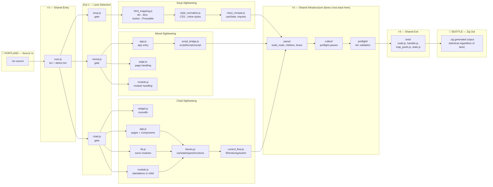

# The I-5 Highway

The compiler is a highway, not a funnel. Lanes exit and re-enter the shared road multiple times during compilation.

## The Shape

One straight line. Parabolas that leave and come back. That's it.

```
          ╭─ soup ─╮              ╭─ soup ─╮
         ╱          ╲            ╱          ╲
━━━━━━━━━━━━━━━━━━━━━━━━━━━━━━━━━━━━━━━━━━━━━━━━━━━━━━━━━━━━━━━━━━━━━━━━━━
.tsz in   lex    detect   shared parse    shared collect     emit      .zig out
━━━━━━━━━━━━━━━━━━━━━━━━━━━━━━━━━━━━━━━━━━━━━━━━━━━━━━━━━━━━━━━━━━━━━━━━━━
         ╲          ╱            ╲          ╱
          ╰ mixed ─╯              ╰ mixed ─╯
         ╲          ╱            ╲          ╱
          ╰─ chad ─╯              ╰─ chad ─╯
                                 ╲    ╱╲    ╱
                                  ╰──╯  ╰──╯
                                  widget app
                                   lib  mod
```

The baseline is the compile path. It's always straight. The parabolas are lane-specific work — they leave the baseline, do their thing, and come back. Some lanes (chad) have parabolas within parabolas (widget/app/lib/module). But the baseline never bends.



## The Key Insight

**Lanes cross back onto I-5 mid-journey.** This is not fork → do work → merge. It's:

1. **I-5 entry** — `core.js` lexes, detects tier
2. **Exit** — lane gate dispatches to lane-specific logic
3. **Lane-specific** — soup maps HTML, mixed handles JSX, chad parses blocks
4. **Re-enter I-5** — shared `parse/` infrastructure (all lanes use the same parser)
5. **Exit again** — lane-specific post-parse transforms (if needed)
6. **Re-enter I-5** — shared `collect/` and `preflight/` passes
7. **I-5 to Seattle** — shared `emit/` generates Zig

The shared infrastructure (parse, collect, preflight, emit) is the highway. The lane-specific logic is the scenic route. You can't get to Seattle without getting back on I-5.

## Why This Matters

- **Adding a new lane** (e.g. a visual builder that emits .tsz) = adding a new exit ramp. parse/ and emit/ don't change.
- **Fixing a parse bug** = fixing it on I-5. All lanes benefit.
- **Fixing a lane bug** = fixing it on the scenic route. Other lanes unaffected.
- **Parity tests** prove all scenic routes lead to the same Seattle. If one route arrives with different cargo, that route has a bug.

## The Chad Fractal

Chad is the most complex scenic route because it has sub-exits:

```
chad.js gate
  │
  ├── widget.js ──→ I-5 (parse) ──→ I-5 (emit)
  │
  ├── app.js ──→ chad/blocks.js ──→ I-5 (parse) ──→ I-5 (emit)
  │   └── (pages and components are ambient — resolved here)
  │
  ├── lib.js ──→ chad/blocks.js ──→ I-5 (parse) ──→ I-5 (emit)  
  │   └── (modules are ambient — resolved here)
  │
  └── module.js ──→ chad/blocks.js ──→ I-5 (parse) ──→ I-5 (emit)
      └── (standalone .mod.tsz OR child of lib — same parse, same emit)
```

Widget takes the express lane (minimal scenic route).
App and lib take the longest routes (ambient resolution, sub-lane detection).
Module is the hybrid — can ride with lib or drive alone.

All arrive at the same Seattle.
