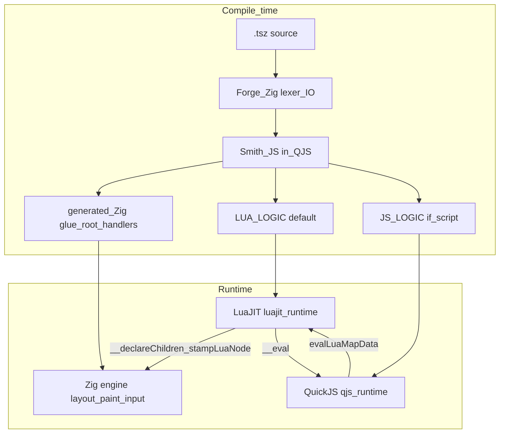

# Architecture Overview

How all the pieces of tsz fit together. **Today’s Smith path is lua-tree:** it emits **`LUA_LOGIC`** (Lua embedded in generated Zig) so **LuaJIT builds the UI tree**; Zig **stamps** it into `layout.Node` for layout and paint. Do not assume a flat static Zig `Node` array is still the default.

## The Big Picture

**Compile time:** **Forge** (Zig) lexes `.tsz` and hosts **Smith** (JavaScript) inside **QuickJS**. Smith emits **generated Zig glue** and, by default, **`LUA_LOGIC`**. **`JS_LOGIC`** is emitted when `<script>` / `_script.tsz` (or similar) is present; many real carts have both. QuickJS is still required at runtime for **`__eval`**, **`evalLuaMapData`**, and **`js_on_press`** when those features appear, even if the `JS_LOGIC` string is short.

**Runtime:** **One native process:** **Zig** hosts the loop, hit-testing, layout, paint, dirty flags, and stamped `Node` graph; **LuaJIT** runs **`LUA_LOGIC`** and typical **Lua-local** UI state; **QuickJS** runs **`JS_LOGIC`** and the eval/handler paths above. See § *Where runtime work actually happens* for the full split.

**State** is not only Zig `state.zig` slots — read that section before debugging “where did my value go?”




Deep dive for the lua-tree model: [LUA_TREE_ARCHITECTURE.md](../compiler/smith/emit_atoms/maps_lua/LUA_TREE_ARCHITECTURE.md) (under `tsz/compiler/…`).

## Where runtime work actually happens

All of this is **one native process**. **Zig** is the host executable. **LuaJIT** and **QuickJS** are **embedded libraries** — not separate apps. There is **no single global “state pool” only in Zig**: lua-tree carts often keep **working state in the Lua VM** (and sometimes **parallel state in `JS_LOGIC`**), while Zig still owns the **stamped `Node` graph**, **layout/paint**, and **dirty signaling**.

### Zig (always)


| Concern                                              | Where it lives                                                                           |
| ---------------------------------------------------- | ---------------------------------------------------------------------------------------- |
| Main loop, SDL, window                               | `engine.zig` and platform glue                                                           |
| Input **device** poll, hit test, which handler fires | Zig (`layout.hitTest`, branches on `on_press` / `lua_on_press` / `js_on_press`)          |
| Flex layout, computed geometry                       | `layout.zig`                                                                             |
| GPU / paint                                          | `gpu/`, paint path                                                                       |
| **State dirty** (“re-run tick updates / maps”)       | Zig — Lua calls `__markDirty()` → host → `state.markDirty()` (also marks layout dirty)    |
| **Layout dirty** (“run flex `layout.layout`”)        | Zig — `layout.markLayoutDirty()` from state, Lua `__declareChildren` / `__clearLuaNodes`, resize, transitions (`needsRelayout`), terminal PTY input, etc.; main loop skips full flex when clear for idle frames |
| **Stamped scene graph**                              | Zig `layout.Node` after `__declareChildren` / `stampLuaNode`                             |
| **Typed state slots**                                | `state.zig` **when the compiler emits slot bridges** (`__setState(slot, …)` from JS/Lua) |
| Hosting both VMs, registering host functions         | `luajit_runtime.zig`, `qjs_runtime.zig`                                                  |


### LuaJIT (`LUA_LOGIC`)


| Concern                                                                                                 | Where it lives                                                                            |
| ------------------------------------------------------------------------------------------------------- | ----------------------------------------------------------------------------------------- |
| Emitted **tree builders** (`App`, `__render`, `__mapLoop`, …)                                           | **Lua**                                                                                   |
| **Lua heap state** — `_state` table, globals (`expandedProject`, `projects`, `tasks`, …) used by the UI | **Lua VM** — first-class app state, not a mirror of Zig slots unless emitted that way     |
| `**lua_on_press`** strings                                                                              | **Evaluated in Lua** after Zig routes the click                                           |
| Reads mouse / FPS / input text                                                                          | Lua calls **Zig host** getters                                                            |
| `**__markDirty`**, `**__declareChildren**`                                                              | Lua → **Zig**                                                                             |
| `**__eval("…")`**                                                                                       | Lua → Zig → **QuickJS** `evalToString`, value back to Lua                                 |
| Consumes `**__luaMapData*`**                                                                            | Filled from **QJS** via `evalLuaMapData` (JS expression evaluated, result wired into Lua) |


### QuickJS (`JS_LOGIC` + eval harness)


| Concern                                                                                   | Where it lives                                        |
| ----------------------------------------------------------------------------------------- | ----------------------------------------------------- |
| Variables and functions in `**JS_LOGIC`** (`var projects`, `setProjects`, init arrays, …) | **QJS heap**                                          |
| `<script>` timers, `setInterval`                                                          | **QJS**                                               |
| `**js_on_press`**                                                                         | **QJS** `evalExpr`                                    |
| `**evalLuaMapData`**                                                                      | **QJS** evaluates JS-shaped expression → data for Lua |
| `**__eval`** targets                                                                      | **QJS** evaluates the string                          |
| `**__setState(slot, …)`** when emitted for JS                                             | **QJS** → Zig `state.setSlot*`                        |


### Misconceptions to avoid

1. **“All state is Zig `state.zig` slots.”** — Often **false** on lua-tree: many values live only in **Lua** (and/or **JS**) until something bridges them.
2. **“QJS → Zig → Lua is the only chain.”** — **False.** Lua and QJS are **peers** that call into Zig; Lua also calls QJS for `__eval` / receives data from `evalLuaMapData`.
3. **“Lua runs the show so Zig doesn’t control anything.”** — **False.** Zig **schedules** the frame, **decides** hit targets, **runs** layout/paint, and **owns** the final `Node` graph; Lua/QJS run **inside** that schedule.

## Emit backends (current vs legacy)


| Backend      | Status                      | Who owns the UI tree at runtime                                                                                                              | Compiler output (simplified)                                           |
| ------------ | --------------------------- | -------------------------------------------------------------------------------------------------------------------------------------------- | ---------------------------------------------------------------------- |
| **Lua-tree** | **Current (Smith / Forge)** | Lua: tables from emitted Lua (`.map()` → loops, components → functions); Zig **stamps** into `Node` via `__declareChildren` / `stampLuaNode` | `**LUA_LOGIC`** + generated Zig bootstrap in `generated_*.zig`         |
| **Zig-tree** | Legacy / older path         | Zig: static `layout.Node` arrays, comptime pools, Zig handler fns                                                                            | `generated_*.zig` with `var root = Node{…}` (little or no `LUA_LOGIC`) |


A cart may also embed `**JS_LOGIC`** for `<script>` blocks alongside `**LUA_LOGIC**`. **QuickJS** is still required for `**__eval`** and `**evalLuaMapData**` even when `JS_LOGIC` is empty:

- `**__eval(jsExpr)**` — Lua calls into `qjs_runtime.evalToString` for expressions not emitted as pure Lua (`[luajit_runtime.zig](../framework/luajit_runtime.zig)` `hostEval`).
- `**evalLuaMapData**` — evaluates JS expressions and feeds map/OA data into Lua (`[qjs_runtime.zig](../framework/qjs_runtime.zig)`).

Layout and painting remain **Zig** (`layout.zig`, `gpu/`) in both backends.

## Layer Breakdown

### 1. Source Layer (`.tsz` files)

The input. TypeScript + JSX syntax that describes UI structure, state, event handlers, styles, and script logic. Organized as **carts** — self-contained app directories.

**Key insight**: `.tsz` is NOT stock TypeScript. It is a custom language that borrows TS/JSX syntax. There is no `tsc`, no `node_modules`, no npm. **Smith’s current app emit centers on `LUA_LOGIC` + lua-tree**; extra **JS** is for scripts and bridges, not a separate “default UI language.”

See: [Cart Structure](systems/cart-structure.md)

### 2. Compiler (`tsz/compiler/`)

**Forge + Smith** (not the legacy monolithic `codegen.zig`-only story):

- `**forge.zig`** — tokenize, QuickJS bridge, pass tokens + source to Smith, write emitted files.
- `**smith_bridge.zig**` — embed QuickJS; load Smith bundle at startup.
- `**smith/**` — collection, parse, preflight, lanes, emit (Zig, Lua tree, soup, etc.). See [Compiler Pipeline](systems/compiler-pipeline.md) and `smith_DICTIONARY.md` in `compiler/`.

Legacy Zig-only pipeline files (`codegen.zig`, `collect.zig`, …) may still exist for reference or hybrid paths; **authoritative behavior** is Smith-driven when using Forge.

### 3. Framework Runtime (`tsz/framework/`)

The engine that runs compiled apps. Generated code imports and calls into this layer.

#### Core modules


| Module               | Role                                                                                                                                       |
| -------------------- | ------------------------------------------------------------------------------------------------------------------------------------------ |
| `engine.zig`         | Main loop: SDL3 init, event dispatch, layout, paint, tick; initializes **both** `qjs_runtime` and `luajit_runtime` when enabled            |
| `layout.zig`         | Pixel-perfect flex layout (ported from Love2D)                                                                                             |
| `state.zig`          | Typed **slot** array + dirty flags — used when emitted; **not** the only place app values live (see § Where runtime work actually happens) |
| `luajit_runtime.zig` | LuaJIT VM: `LUA_LOGIC`, `stampLuaNode`, host fns (`__declareChildren`, `__eval`, …)                                                        |
| `text.zig`           | FreeType font rendering and text measurement                                                                                               |
| `events.zig`         | Input event handling and dispatch                                                                                                          |
| `input.zig`          | Keyboard/mouse state                                                                                                                       |
| `windows.zig`        | SDL3 window management                                                                                                                     |


#### GPU pipeline (`framework/gpu/`)


| Module        | Role                                  |
| ------------- | ------------------------------------- |
| `gpu.zig`     | wgpu initialization and orchestration |
| `rects.zig`   | Rectangle/rounded-rect batch renderer |
| `text.zig`    | GPU text atlas and glyph rendering    |
| `shaders.zig` | WGSL shader source                    |
| `3d.zig`      | 3D mesh rendering with Scene3D        |
| `procgen.zig` | Procedural geometry generation        |


#### Feature modules (build-option gated)


| Module                | Build flag            | Role                                                      |
| --------------------- | --------------------- | --------------------------------------------------------- |
| `qjs_runtime.zig`     | `HAS_QUICKJS`         | QuickJS VM + JS↔Zig bridge; `evalLuaMapData`, script tick |
| `luajit_worker.zig`   | (linked)              | Off-thread LuaJIT workers (compute-only)                  |
| `vterm.zig`           | `HAS_TERMINAL`        | libvterm FFI                                              |
| `classifier.zig`      | `HAS_TERMINAL`        | Semantic terminal classification                          |
| `physics2d.zig`       | `HAS_PHYSICS`         | 2D physics                                                |
| `physics3d.zig`       | `HAS_PHYSICS3D`       | Bullet3D (optional)                                       |
| `canvas.zig`          | `HAS_CANVAS`          | Node graph canvas                                         |
| `effects.zig`         | `HAS_EFFECTS`         | useEffect lifecycle                                       |
| `transition.zig`      | `HAS_TRANSITIONS`     | CSS-like transitions                                      |
| `videos.zig`          | `HAS_VIDEO`           | Video playback                                            |
| `crypto.zig`          | `HAS_CRYPTO`          | Cryptographic primitives                                  |
| `render_surfaces.zig` | `HAS_RENDER_SURFACES` | Off-screen render targets                                 |


#### Build tiers


| Binary     | Includes                                | Use case                  |
| ---------- | --------------------------------------- | ------------------------- |
| Lean `tsz` | Layout + GPU + SDL3                     | Fast builds, minimal apps |
| Full       | + QuickJS, LuaJIT, terminal, physics, … | Full-featured carts       |


(Exact flags vary; see `build.zig` / `build_options`.)

### 4. Generated Code Bridge

**Lua-tree (current):** generated Zig calls `luajit_runtime.evalScript(LUA_LOGIC)`, registers map wrappers, and drives `**__declareChildren`** so Lua tables become `**layout.Node**` for layout/paint. See [LUA_TREE_ARCHITECTURE.md](../compiler/smith/emit_atoms/maps_lua/LUA_TREE_ARCHITECTURE.md).

**Zig-tree (legacy sketch):** static root and Zig handlers only — useful to recognize in old carts or special lanes, not the default mental model:

```zig
const engine = @import("engine.zig");
const state = @import("state.zig");
const Node = @import("layout.zig").Node;

var root = Node{ .style = .{...}, .children = &_arr_0 };
// … _handler_press_N in Zig, etc.
pub fn main() !void { engine.run(&root, _appInit, _appTick); }
```

### 5. Cartridge System

Apps can load as `.so` shared libraries (dev shell, `<Cartridge>`). **Cartridge ABI**: C exports (`app_get_root`, `app_get_init`, `app_get_tick`, …).

See: [Dev Mode](systems/dev-mode.md)

### 6. Dev Tools

- **Inspector / tools carts** — connect over **IPC** (debug protocol) to a running app; not necessarily embedded in every binary. `[devtools.zig](../framework/devtools.zig)` is a stub when the full UI lives in tools.
- `**.claude/hooks/`** — session coordination scripts.

See: [Hook System](systems/hook-system.md), [TSZ_TOOLS_SPEC.md](TSZ_TOOLS_SPEC.md)

## Data Flow

### Compile time

```
.tsz → Forge (lex) → Smith (collect / preflight / parse / emit)
                         → generated_*.zig + LUA_LOGIC (+ JS_LOGIC if script)
```

Imports (`_script.tsz`, components, classifiers) merge or concatenate per Smith rules.

### Runtime (per frame, typical)

```
SDL3 → Zig poll / hit-test → dispatch (Zig fn | lua_on_press → Lua | js_on_press → QJS)
     → dirty? → Zig _appTick + qjs_runtime.tick + luajit_runtime.tick
     → Lua __render may re-stamp → __declareChildren → Zig Node tree
     → layout.zig (flex) → gpu paint → present
```

Lua-tree: many **value updates** happen in **Lua** (or **JS**) heaps; **Zig** sees the effect via `**__markDirty`** and the **restamped** tree, not necessarily via `setSlot` for every field.

### Hot-reload (dev mode)

```
file change → recompile .tsz → rebuild .so → dev shell dlopen → app_get_init()
```

## Key Design Decisions

1. **Multiple state representations**: **Zig slots** when the emitter wires `useState`/bridge IDs; **Lua tables/globals** for much lua-tree UI state; `**JS_LOGIC` vars** when Smith emits parallel JS init or script. They coexist — do not assume one pool.
2. **Three-language runtime (full app build)**: **Zig** = process host, loop, hit-test, layout, paint, dirty bit, stamped `Node`s, optional slots. **LuaJIT** = `**LUA_LOGIC`** tree + most handler strings + Lua-local state. **QuickJS** = `**JS_LOGIC`** + `**__eval**` + `**evalLuaMapData**` + `**js_on_press**` — keep QJS linked whenever those paths exist (even if `JS_LOGIC` is empty).
3. **Lua-tree first**: Expressive UI logic in emitted Lua; Zig authoritative for **geometry and pixels** after stamping. Legacy Zig-tree is the exception.
4. **Build-option gating**: Unused features `comptime` out of lean binaries.
5. **Two worlds**: App (`.tsz`) vs module (`.mod.tsz`) import rules stay isolated.
6. **zluajit (optional)**: Future Zig↔Lua ergonomics; today `luajit_runtime` uses the **Lua C API**. See [ZLUAJIT_EVALUATION.md](ZLUAJIT_EVALUATION.md).

