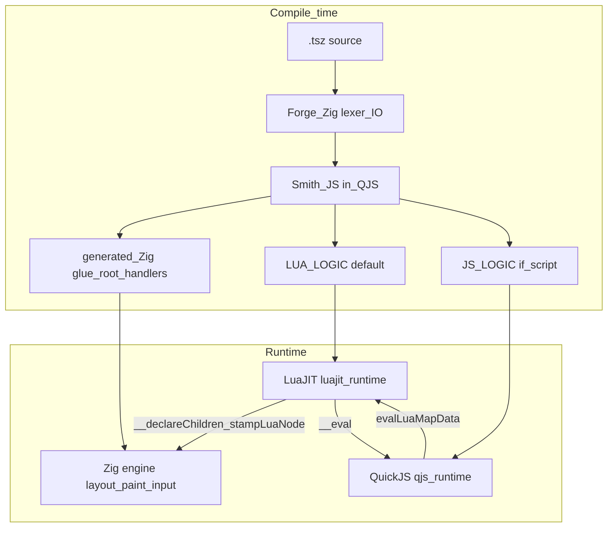

# Architecture Overview

How all the pieces of tsz fit together. **Today’s Smith path is lua-tree:** it emits **`LUA_LOGIC`** (Lua source embedded in generated Zig) so **LuaJIT owns the UI tree** at runtime; Zig **stamps** it into `layout.Node` for layout and paint. Do not assume a flat static Zig `Node` array is still the default.

## The Big Picture

**Compile time:** **Forge** (Zig) lexes `.tsz` and hosts **Smith** (JavaScript) inside **QuickJS**. Smith emits **generated Zig glue** and, **by default, `LUA_LOGIC`** for the cart’s Lua tree and handlers. **`JS_LOGIC`** is added when `<script>` / `_script.tsz` (or similar) is present — it is optional relative to `LUA_LOGIC`, not the other way around.

**Runtime:** The native binary links **Zig** (engine, flex layout, wgpu, input), **LuaJIT** (`luajit_runtime.zig` — loads `LUA_LOGIC`, stamping, handlers), and **QuickJS** (`qjs_runtime.zig` — runs `JS_LOGIC` when present, plus **`__eval`** / **`evalLuaMapData`** bridges from Lua).



Deep dive for the lua-tree model: [LUA_TREE_ARCHITECTURE.md](../compiler/smith/emit_atoms/maps_lua/LUA_TREE_ARCHITECTURE.md) (under `tsz/compiler/…`).

## Emit backends (current vs legacy)

| Backend | Status | Who owns the UI tree at runtime | Compiler output (simplified) |
|--------|--------|----------------------------------|------------------------------|
| **Lua-tree** | **Current (Smith / Forge)** | Lua: tables from emitted Lua (`.map()` → loops, components → functions); Zig **stamps** into `Node` via `__declareChildren` / `stampLuaNode` | **`LUA_LOGIC`** + generated Zig bootstrap in `generated_*.zig` |
| **Zig-tree** | Legacy / older path | Zig: static `layout.Node` arrays, comptime pools, Zig handler fns | `generated_*.zig` with `var root = Node{…}` (little or no `LUA_LOGIC`) |

A cart may also embed **`JS_LOGIC`** for `<script>` blocks alongside **`LUA_LOGIC`**. **QuickJS** is still required for **`__eval`** and **`evalLuaMapData`** even when `JS_LOGIC` is empty:

- **`__eval(jsExpr)`** — Lua calls into `qjs_runtime.evalToString` for expressions not emitted as pure Lua ([`luajit_runtime.zig`](../framework/luajit_runtime.zig) `hostEval`).
- **`evalLuaMapData`** — evaluates JS expressions and feeds map/OA data into Lua ([`qjs_runtime.zig`](../framework/qjs_runtime.zig)).

Layout and painting remain **Zig** (`layout.zig`, `gpu/`) in both backends.

## Layer Breakdown

### 1. Source Layer (`.tsz` files)

The input. TypeScript + JSX syntax that describes UI structure, state, event handlers, styles, and script logic. Organized as **carts** — self-contained app directories.

**Key insight**: `.tsz` is NOT stock TypeScript. It is a custom language that borrows TS/JSX syntax. There is no `tsc`, no `node_modules`, no npm. **Smith’s current app emit centers on `LUA_LOGIC` + lua-tree**; extra **JS** is for scripts and bridges, not a separate “default UI language.”

See: [Cart Structure](systems/cart-structure.md)

### 2. Compiler (`tsz/compiler/`)

**Forge + Smith** (not the legacy monolithic `codegen.zig`-only story):

- **`forge.zig`** — tokenize, QuickJS bridge, pass tokens + source to Smith, write emitted files.
- **`smith_bridge.zig`** — embed QuickJS; load Smith bundle at startup.
- **`smith/`** — collection, parse, preflight, lanes, emit (Zig, Lua tree, soup, etc.). See [Compiler Pipeline](systems/compiler-pipeline.md) and `smith_DICTIONARY.md` in `compiler/`.

Legacy Zig-only pipeline files (`codegen.zig`, `collect.zig`, …) may still exist for reference or hybrid paths; **authoritative behavior** is Smith-driven when using Forge.

### 3. Framework Runtime (`tsz/framework/`)

The engine that runs compiled apps. Generated code imports and calls into this layer.

#### Core modules

| Module | Role |
|--------|------|
| `engine.zig` | Main loop: SDL3 init, event dispatch, layout, paint, tick; initializes **both** `qjs_runtime` and `luajit_runtime` when enabled |
| `layout.zig` | Pixel-perfect flex layout (ported from Love2D) |
| `state.zig` | Global state slot array with dirty flags |
| `luajit_runtime.zig` | LuaJIT VM: `LUA_LOGIC`, `stampLuaNode`, host fns (`__declareChildren`, `__eval`, …) |
| `text.zig` | FreeType font rendering and text measurement |
| `events.zig` | Input event handling and dispatch |
| `input.zig` | Keyboard/mouse state |
| `windows.zig` | SDL3 window management |

#### GPU pipeline (`framework/gpu/`)

| Module | Role |
|--------|------|
| `gpu.zig` | wgpu initialization and orchestration |
| `rects.zig` | Rectangle/rounded-rect batch renderer |
| `text.zig` | GPU text atlas and glyph rendering |
| `shaders.zig` | WGSL shader source |
| `3d.zig` | 3D mesh rendering with Scene3D |
| `procgen.zig` | Procedural geometry generation |

#### Feature modules (build-option gated)

| Module | Build flag | Role |
|--------|-----------|------|
| `qjs_runtime.zig` | `HAS_QUICKJS` | QuickJS VM + JS↔Zig bridge; `evalLuaMapData`, script tick |
| `luajit_worker.zig` | (linked) | Off-thread LuaJIT workers (compute-only) |
| `vterm.zig` | `HAS_TERMINAL` | libvterm FFI |
| `classifier.zig` | `HAS_TERMINAL` | Semantic terminal classification |
| `physics2d.zig` | `HAS_PHYSICS` | 2D physics |
| `physics3d.zig` | `HAS_PHYSICS3D` | Bullet3D (optional) |
| `canvas.zig` | `HAS_CANVAS` | Node graph canvas |
| `effects.zig` | `HAS_EFFECTS` | useEffect lifecycle |
| `transition.zig` | `HAS_TRANSITIONS` | CSS-like transitions |
| `videos.zig` | `HAS_VIDEO` | Video playback |
| `crypto.zig` | `HAS_CRYPTO` | Cryptographic primitives |
| `render_surfaces.zig` | `HAS_RENDER_SURFACES` | Off-screen render targets |

#### Build tiers

| Binary | Includes | Use case |
|--------|----------|----------|
| Lean `tsz` | Layout + GPU + SDL3 | Fast builds, minimal apps |
| Full | + QuickJS, LuaJIT, terminal, physics, … | Full-featured carts |

(Exact flags vary; see `build.zig` / `build_options`.)

### 4. Generated Code Bridge

**Lua-tree (current):** generated Zig calls `luajit_runtime.evalScript(LUA_LOGIC)`, registers map wrappers, and drives **`__declareChildren`** so Lua tables become **`layout.Node`** for layout/paint. See [LUA_TREE_ARCHITECTURE.md](../compiler/smith/emit_atoms/maps_lua/LUA_TREE_ARCHITECTURE.md).

**Zig-tree (legacy sketch):** static root and Zig handlers only — useful to recognize in old carts or special lanes, not the default mental model:

```zig
const engine = @import("engine.zig");
const state = @import("state.zig");
const Node = @import("layout.zig").Node;

var root = Node{ .style = .{...}, .children = &_arr_0 };
// … _handler_press_N in Zig, etc.
pub fn main() !void { engine.run(&root, _appInit, _appTick); }
```

### 5. Cartridge System

Apps can load as `.so` shared libraries (dev shell, `<Cartridge>`). **Cartridge ABI**: C exports (`app_get_root`, `app_get_init`, `app_get_tick`, …).

See: [Dev Mode](systems/dev-mode.md)

### 6. Dev Tools

- **Inspector / tools carts** — connect over **IPC** (debug protocol) to a running app; not necessarily embedded in every binary. [`devtools.zig`](../framework/devtools.zig) is a stub when the full UI lives in tools.
- **`.claude/hooks/`** — session coordination scripts.

See: [Hook System](systems/hook-system.md), [TSZ_TOOLS_SPEC.md](TSZ_TOOLS_SPEC.md)

## Data Flow

### Compile time

```
.tsz → Forge (lex) → Smith (collect / preflight / parse / emit)
                         → generated_*.zig + LUA_LOGIC (+ JS_LOGIC if script)
```

Imports (`_script.tsz`, components, classifiers) merge or concatenate per Smith rules.

### Runtime (per frame, typical)

```
SDL3 events → input / events → handler dispatch (Zig and/or Lua expr strings)
     → state dirty → _appTick / Lua tick / QJS tick
     → layout.zig (flex) → gpu paint → present
```

Lua-tree: dirty callbacks re-run Lua subtrees → `__declareChildren` → Zig `Node` layout.

### Hot-reload (dev mode)

```
file change → recompile .tsz → rebuild .so → dev shell dlopen → app_get_init()
```

## Key Design Decisions

1. **Slot-based state**: O(1) slots and dirty flags; used across Zig and bridges.

2. **Three-language runtime (full app build)**: **Zig** = loop, layout, GPU, stamping; **LuaJIT** = **`LUA_LOGIC`** (tree + handlers); **QuickJS** = **`JS_LOGIC`** when present + **`__eval`** / **`evalLuaMapData`** — QuickJS is not “only for timers.”

3. **Lua-tree first**: Expressive UI logic lives in emitted Lua (Love2D-shaped loops, tables, functions); Zig remains authoritative for **pixels and flex**. Legacy Zig-tree is the exception, not the rule.

4. **Build-option gating**: Unused features `comptime` out of lean binaries.

5. **Two worlds**: App (`.tsz`) vs module (`.mod.tsz`) import rules stay isolated.

6. **zluajit (optional)**: Future Zig↔Lua ergonomics; today `luajit_runtime` uses the **Lua C API**. See [ZLUAJIT_EVALUATION.md](ZLUAJIT_EVALUATION.md).
