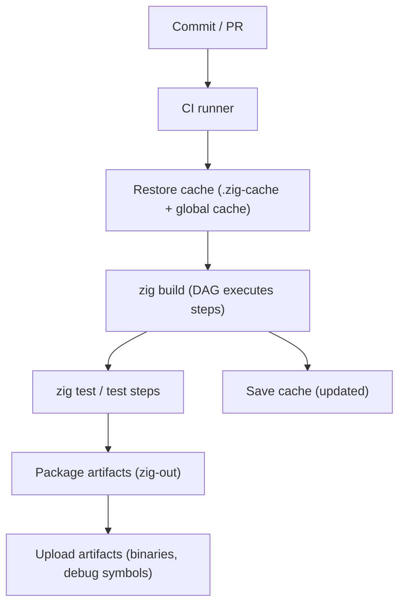
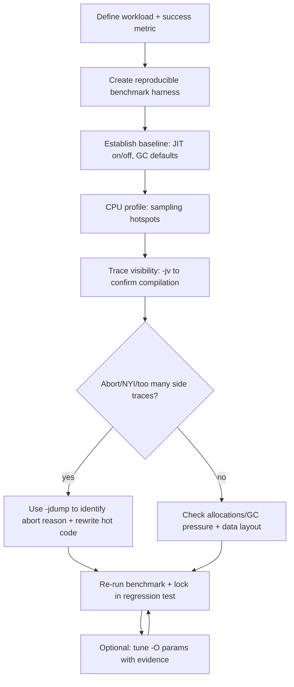
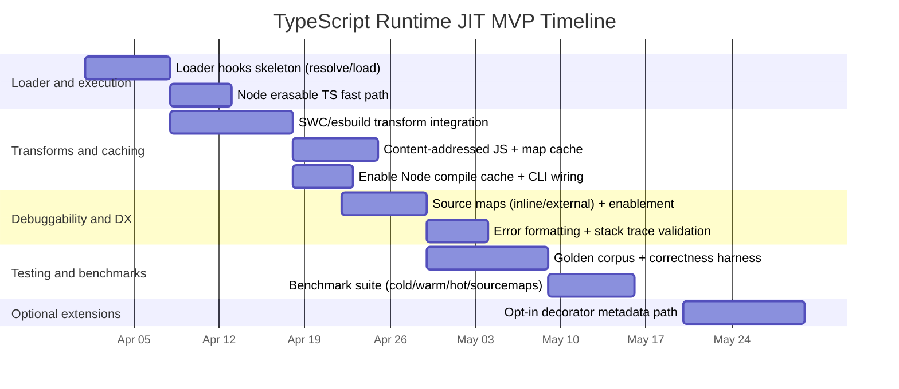

# Fast, Scalable Zig: Performance Practices and Large-Build Engineering

## Executive summary

Zig’s performance story is unusually “direct”: the language lets you control memory representation, safety checks, allocation policy, and low-level codegen hints in a way that can preserve C-like speed while also supporting systematic correctness workflows (especially in Debug/ReleaseSafe). citeturn27view1turn16view1turn18view1 At the same time, large builds require engineering discipline: the Zig Build System’s DAG model, caching layout, and package manifest semantics enable reproducible, cache-friendly builds—but you still need to design module boundaries, dependency policy, and CI caching so rebuilds stay small. citeturn25view0turn25view1turn28view0

A key non-obvious point for large teams is that Zig’s optimization “modes” encode explicit trade-offs among compilation speed, runtime speed, binary size, safety checks, and reproducibility; choosing the right mode per workflow (local dev, CI, profiling, release) is frequently the single biggest lever on total iteration time. citeturn27view1

Prioritized checklist for “fast code + large builds” maintenance:

1. **Separate “iteration builds” from “measurement builds.”** Use Debug/ReleaseSafe for rapid correctness iteration and ReleaseFast/ReleaseSmall only for benchmarking or shipping, since Zig explicitly changes safety checks and other behaviors by mode. citeturn27view1turn16view1  
2. **Design your data layout first (cache-lines, padding, SoA vs AoS), then choose containers to match.** Use plain `struct` unless you actually need C ABI layout (`extern struct`) or bit-level packing (`packed struct`). citeturn17view1turn17view0  
3. **Make allocation strategy explicit at subsystem boundaries.** Accept an `Allocator` in libraries; use arenas for phase/epoch lifetimes; use fixed buffers when a hard bound exists; reserve debug allocators for debug builds. citeturn18view1  
4. **Treat module boundaries as build-time performance boundaries.** A “root module + internal modules + dependency modules” layout reduces recompilation blast radius and keeps “headerless imports” stable. citeturn27view0turn25view1  
5. **Exploit the build DAG and caches in CI.** Cache `.zig-cache` and global cache directories where appropriate; keep install outputs (`zig-out`) as artifacts; prefer content-hash-pinned dependencies (`url`+`hash`) for reproducibility. citeturn25view0turn19view3turn28view0  
6. **Use profiling tools early and keep symbols usable.** Stripping and omitting frame pointers are valuable but can degrade stack traces; choose policies per platform and profiling approach (DWARF vs frame pointers). citeturn19view3turn24view0turn11search12  
7. **If you trial incremental compilation, isolate it behind a workflow flag.** The toolchain exposes `-fincremental` and recommends pairing it with `zig build --watch`, but open issues show it can still diverge from clean builds in edge cases. citeturn6search1turn4view0turn6search14  

Platform-specific advice is not constrained by the request; this report therefore provides cross-platform defaults and calls out platform-specific instrumentation options where they differ.

## Language-level performance practices

Zig’s core performance advantage is that “costly things” tend to be explicit: layout is visible, allocation is explicit via allocators, and safety checks are mode-dependent but overrideable at block scope. citeturn18view1turn16view1 The best methods for keeping code fast at scale focus on preserving this explicitness while making hot-path decisions measurable.

**Memory layout and representation**

Using a plain `struct` gives the compiler more freedom than `extern struct`, which is constrained to match the target C ABI layout; choose `extern struct` only when ABI-compatibility is required (FFI, on-disk ABI contracts, wire formats you deliberately model as C ABI). citeturn17view1

`packed struct` is appropriate for bitfields/flags or exact-width protocol structures, but it creates non-byte-aligned fields whose pointers have special properties and may not be ABI-aligned; this impacts how you pass pointers to functions and how you interface with external ABIs. citeturn17view0turn17view1

Field alignment is a first-class tool: Zig allows per-field alignment annotations (including large alignments like cache-line boundaries), letting you make “hot fields” cache-friendly or enforce SIMD alignment when needed. citeturn17view0turn17view2

Practical pattern (cache-line alignment + cheap “header” fields):

```zig
const std = @import("std");

pub const HotState = struct {
    // Small, frequently accessed fields first (often fit in first cache line).
    len: u32,
    flags: u32,

    // Put large or rarely-used fields on a separate cache line.
    cold: ColdState align(64),
};

pub const ColdState = struct {
    // Rarely read large buffers or maps, etc.
    bytes: []u8,
};
```

Trade-off: aggressive alignment can increase memory footprint and reduce effective cache capacity; it is most valuable when it prevents false sharing or isolates cold data from hot loops. The language makes this layout control explicit, but you should validate with cache-aware profiling and wall-clock benchmarks. citeturn17view2turn11search0

**Data structures and locality**

Zig’s standard library includes data-structure designs aligned with data-oriented layout. A flagship example is `std.MultiArrayList`, which stores separate arrays per field of a struct/tagged union (a “struct-of-arrays” layout) and explicitly calls out memory savings when the original struct has padding. citeturn7search4

This suggests a general rule at scale:

- Prefer **SoA** (e.g., `MultiArrayList`) when tight loops touch only a subset of fields, or when padding/strides waste cache bandwidth.
- Prefer **AoS** (arrays of struct) when operations typically touch most fields together and you want single-pointer locality.

Trade-off: SoA often complicates APIs (you pass around indices/handles instead of pointers to elements); AoS is simpler but can waste memory and cache bandwidth if fields are sparse/access patterns are skewed. `MultiArrayList` exists specifically to make SoA practical without manual per-field arrays. citeturn7search4turn13search21

When using resizable buffers like `ArrayList`, account for pointer invalidation: the stdlib documentation/comments emphasize that pointers into `.items` can be invalidated by operations that resize or free via the allocator. This is a correctness and performance concern (avoid holding pointers across operations that might reallocate; batch growth or reserve capacity where possible). citeturn7search13turn18view1

**Inlining and code size control**

Zig explicitly documents that `inline` can force function inlining and unroll loops at compile time; but it also advises that it’s generally better to let the compiler decide, except for specific scenarios like shaping stack frames for debugging or forcing comptime propagation. citeturn27view2turn15view0

Actionable recommendation: treat `inline` as a targeted tool for (a) small leaf abstractions in hot paths, (b) generic wrappers where specialization matters, and (c) compile-time loop unrolling where you *can prove* the unrolled body stays small. Overuse can increase compile time and code size, harming i-cache behavior and large-build iteration. citeturn27view2turn27view1

```zig
pub fn hashByte(b: u8) u32 {
    // Let the compiler decide by default; use inline only if measurement justifies it.
    return (@as(u32, b) * 2654435761) ^ 0x9e3779b9;
}
```

**Branch prediction hints**

Zig provides `@branchHint(hint: BranchHint)` to hint likelihood, and it is only valid as the first statement of a control-flow branch or function. citeturn16view3

Use this sparingly and only when you have evidence (profiling counters, trace data, production telemetry) that a branch is extremely biased and misprediction cost matters.

```zig
const BranchHint = @import("std").builtin.BranchHint;

pub fn parseDigit(c: u8) ?u8 {
    if (c < '0' or c > '9') {
        @branchHint(.unlikely); // must be first statement in this branch
        return null;
    }
    return c - '0';
}
```

Trade-off: hints can become wrong as workloads evolve; they can hurt performance if they bias optimization incorrectly. Keep them close to measured invariants and add regression benchmarks. citeturn16view3turn11search0

**Bounds checks, runtime safety, and “selective unsafety”**

Slices (`[]T`) have bounds checking, and Zig explicitly calls this out as a reason they’re preferred to pointers in many contexts. citeturn16view2 Runtime safety checks are disabled by default in ReleaseFast/ReleaseSmall for optimization, but Zig allows you to override this per-scope using `@setRuntimeSafety`. citeturn16view1turn27view1

A scalable approach is:

- Keep safety **on** in most code (especially parsing, IO boundaries, network edges).
- Disable checks only in *small, heavily tested* inner loops, and only after profiling shows checks are a bottleneck.
- Alternatively, in ReleaseFast, selectively *re-enable* safety in riskier blocks.

```zig
pub fn sumUnchecked(xs: []const u64) u64 {
    // Hot loop: if proven safe by invariants/tests and profiled as hot.
    @setRuntimeSafety(false);
    var acc: u64 = 0;
    for (xs) |x| acc += x;
    return acc;
}

pub fn parseWithSafety(buf: []const u8) !void {
    // Even in ReleaseFast/ReleaseSmall, keep checks on in parsing.
    @setRuntimeSafety(true);
    _ = buf[0]; // example bounds-checked access
}
```

Trade-off: ReleaseFast/ReleaseSmall can turn safety-checked illegal behavior into unchecked behavior; the documentation is explicit that invoking unchecked illegal behavior can lead to arbitrary results at runtime. citeturn16view1turn27view1

**Allocator strategy as a performance contract**

Zig’s language reference gives a “Choosing an Allocator” flow chart and describes the key principle: unlike C’s default `malloc`, Zig conventionally has **no default allocator**; allocating APIs accept an `Allocator` parameter so callers choose policy. citeturn18view1 It also recommends patterns like using `ArenaAllocator` for CLI-style “allocate lots, free once” lifetimes and for cyclic lifetimes (frame/request arenas), using `FixedBufferAllocator` when memory bounds are known, and using `std.heap.smp_allocator` as a solid general-purpose allocator choice in ReleaseFast. citeturn18view1

This translates into actionable large-codebase conventions:

- Library API: `fn foo(alloc: Allocator, ...) !T` unless allocation is impossible/forbidden.
- Request/frame pipeline: per-request arena; deinit at end of request/frame to free en masse.
- Bulk data import: arena for temporary structures + explicit “promote” step into long-lived allocator.
- Tests: use `std.testing.allocator` or failing allocators to catch leaks and OOM handling. citeturn18view1

## Compiler flags and build options

Zig exposes both build-system options (e.g., `zig build -Doptimize=...`) and compiler CLI flags; the same underlying optimization modes appear consistently: Debug, ReleaseFast, ReleaseSafe, ReleaseSmall. citeturn27view1turn19view3 Zig’s documentation also explicitly describes mode trade-offs (compilation speed, runtime performance, binary size, reproducibility, safety checks). citeturn27view1turn16view1

### Comparison table of recommended modes and flags

The table below summarizes practical, *recommended* settings and their typical effects for large projects. (Build-time and runtime effects depend on target, code size, and link strategy; “↑/↓” indicates typical directional impact.)

| Setting | Typical use | Build time | Binary size | Runtime perf | Key trade-offs / notes |
|---|---|---:|---:|---:|---|
| `-Doptimize=Debug` / `-O Debug` | Local iteration, most tests, debugging | ↓ fastest | ↑ larger | ↓ slower | Safety checks enabled; fastest compilation; not reproducible by requirement. citeturn27view1 |
| `-Doptimize=ReleaseSafe` / `-O ReleaseSafe` | CI tests where you still want checks; “safe perf” baseline | ↑ slower | ↑ larger | ↔/↑ medium | Safety checks enabled but optimized; reproducible build expectation. citeturn27view1turn16view1 |
| `-Doptimize=ReleaseFast` / `-O ReleaseFast` | Shipping performance builds; benchmarks | ↑ slower | ↑ larger | ↑ fastest | Safety checks disabled by default; use `@setRuntimeSafety(true)` in risky blocks. citeturn27view1turn16view1 |
| `-Doptimize=ReleaseSmall` / `-O ReleaseSmall` | Size-constrained shipping; CLI distribution | ↑ slower | ↓ smallest | ↔ medium | Safety checks disabled; size-focused optimization. citeturn27view1turn16view1 |
| `-flto` | Final release artifacts where whole-program optimization helps | ↑↑ link time | ↔/↓ often | ↑ often | Requires LLVM extensions per Zig CLI help; LLVM docs note LTO significantly increases link time but can create faster binaries. citeturn19view3turn20search0 |
| `-fstrip` | Release distribution; smaller artifacts | ↔ | ↓↓ | ↔ | Omits debug symbols per Zig CLI help; reduces post-mortem observability unless you ship separate debug files. citeturn19view3turn21search3 |
| `-fno-omit-frame-pointer` | Profiling builds where frame-pointer unwinding is desired | ↔ | ↔ | ↔/↓ slight | Frame pointers vs DWARF is a profiling trade-off; recommended approach differs by environment (e.g., “embedded: enable frame pointers; desktop: rely on DWARF”). citeturn19view3turn24view0 |
| `-ffunction-sections -fdata-sections` | Help dead-code elimination for size-focused builds | ↔/↑ | ↓ | ↔ | Enables per-function/data sections in Zig; enables link-time garbage collection workflows (common with `--gc-sections`). citeturn19view3turn21search13 |
| `-fsingle-threaded` | Single-thread-only binaries and libraries | ↓ | ↓ | ↔/↑ | Zig docs describe semantic and performance effects (e.g., simplifies some synchronization primitives). Only valid if you can guarantee single-threadedness. citeturn27view1 |
| `-jN` | Large builds on multi-core systems | ↓ often | ↔ | ↔ | Parallel compilation; constrained by RAM/IO and dependency DAG. citeturn4view2turn25view0 |

### Practical build profiles

**Local development default (fast iteration + correctness):**

- `zig build -Doptimize=Debug --summary all` to keep build output interpretable during large refactors. citeturn25view0  
- Keep symbols and frame pointers as needed for profiling and debugging (`-fno-strip`, `-fno-omit-frame-pointer`), then tighten for release. citeturn19view3turn24view0  

**Performance measurement profile (bench + profile):**

- Prefer `ReleaseFast` for runtime measurements, but *either* keep debug info (don’t strip) while profiling, *or* generate external debug symbols, depending on your platform toolchain and deployment constraints. citeturn27view1turn21search3  
- For flamegraphs, ensure call stacks are collectable via DWARF or frame pointers (tool-dependent). citeturn24view0turn11search12  

**Release shipping profile (runtime/size goals):**

- Choose `ReleaseFast` vs `ReleaseSmall` based on your product constraint; optionally add `-flto` for whole-program optimization if link-time cost is acceptable. citeturn27view1turn19view3turn20search0  

## Code organization for large codebases

Zig’s compilation model is explicitly module-based: a compilation is separated into modules, each with a root source file; modules depend on other modules forming a directed graph, and imports use module names when dependencies are declared. citeturn27view0 This model is your primary tool for scaling both build times and code comprehension.

**Modularization and package layout principles**

A large Zig codebase should treat modules as the unit of:

- rebuild invalidation (small changes should only recompile small subgraphs),
- API boundaries (stable import names),
- profiling ownership (hot modules get dedicated benchmarks).

The Zig Build System supports this by letting you define modules and wire imports (including generated Zig sources) through the build graph. In the official “Generating Zig Source Code” example, a build step generates `person.zig`, then the executable’s root module adds an import named `"person"`, allowing `@import("person")` in application code—i.e., “headerless imports” are mediated by module wiring, not ad-hoc include paths. citeturn25view1turn27view0

**Concrete build wiring pattern**

Use `b.standardOptimizeOption` for consistent build-mode selection across all artifacts (app, tests, tools). citeturn27view1turn25view1

```zig
const std = @import("std");

pub fn build(b: *std.Build) void {
    const target = b.standardTargetOptions(.{});
    const optimize = b.standardOptimizeOption(.{});

    const exe = b.addExecutable(.{
        .name = "app",
        .root_module = b.createModule(.{
            .root_source_file = b.path("src/main.zig"),
            .target = target,
            .optimize = optimize,
        }),
    });

    // Internal module import: stable name used by @import("mylib")
    const mylib = b.createModule(.{
        .root_source_file = b.path("src/mylib/root.zig"),
        .target = target,
        .optimize = optimize,
    });
    exe.root_module.addImport("mylib", mylib);

    b.installArtifact(exe);
}
```

This structure is aligned with the build system’s purpose: managing complexity when command-lines become unwieldy, enabling caching/concurrency, handling dependencies, and allowing tools/IDEs to understand the build. citeturn25view0

**Incremental compilation and compile-time discipline**

The toolchain exposes `-fincremental` (“Enable incremental compilation”), and Zig 0.15.1 release notes explicitly describe using `zig build --watch -fincremental` as the typical way to try incremental compilation. citeturn4view0turn6search1 At the same time, open issues show incremental compilation can still fail to match clean builds for valid sources in some situations, so large teams should treat it as an opt-in workflow and gate it behind developer flags until it stabilizes for your codebase. citeturn6search14

Separate but related: compile-time features (`inline` loops, comptime evaluation, code generation) can increase build times if overused; Zig documents that `inline` loops unroll at compile time and that forced inlining should generally be avoided unless necessary. citeturn15view0turn27view2 For large builds, a pragmatic rule is: **use comptime to remove runtime overhead only when that runtime cost is measurable and recurring**, and keep comptime-generated code size bounded to avoid ballooning compilation and link work. citeturn27view1turn20search0

**Diagram: “headerless imports” via module graph**

```mermaid
flowchart LR
  subgraph BuildGraph["zig build DAG"]
    Tool["codegen tool (compile + run)"]
    Gen["generated Zig file (person.zig)"]
    Exe["app executable compile step"]
  end

  Tool --> Gen
  Gen -->|"addAnonymousImport(\"person\")"| Exe

  Exe -->|"@import(\"person\")"| App["src/main.zig"]
```

This mirrors the official example: generation happens as a build step and the result is imported as a module dependency rather than copied into source tree paths. citeturn25view1turn25view0

## Build system and CI practices

The Zig Build System models projects as a DAG of steps that can run concurrently; it is designed specifically to help when you want caching and concurrency, many artifacts, conditional builds, and managed dependencies. citeturn25view0 For large builds, correctness is necessary but insufficient—your CI and caching strategy determines whether developers pay “full rebuild tax” daily.

**Understanding and managing Zig caches**

The build system produces two key directories:

- `.zig-cache`: cached build outputs that accelerate subsequent builds; it is not intended for source control and can be deleted without consequences. citeturn25view0  
- `zig-out`: the “installation prefix,” chosen by users via `--prefix`; build scripts should not hardcode output paths because that breaks caching, concurrency, and composability. citeturn25view0  

The compiler also exposes CLI options to override local and global cache directories (`--cache-dir`, `--global-cache-dir`). citeturn19view3

**Make build output diagnosis routine**

Use `zig build --summary all` to surface which steps are rebuilt vs cached in the build graph; the official docs demonstrate this output format and show how cached compilation lowers subsequent work. citeturn25view0turn6search16

**Interactive workflows: watch and build UI**

Zig 0.15.1 improves `zig build --watch` on macOS and describes a new build system web UI via `zig build --webui`. It explicitly recommends `--watch` as useful for trying incremental compilation, paired with `-fincremental`. citeturn6search1turn4view0

### Table: build and caching strategies for large Zig projects

| Strategy | What it is | Pros | Cons / risks | Best fit |
|---|---|---|---|---|
| Local Zig caches (`.zig-cache`, global cache dirs) | Compiler/build-system caching; deleteable local cache + configurable global cache | Zero extra infrastructure; aligns with Zig build DAG/caching model; fast local rebuilds | Cache warmed per-machine; CI runners often cold unless cached/restored | All teams; baseline approach citeturn25view0turn19view3 |
| CI cache of Zig caches (GitHub Actions cache, etc.) | Persist `.zig-cache` and/or global cache across CI runs via cache action | Can significantly reduce CI wall time when keys are stable; cache keys can incorporate file hashes | Cache invalidation/key design is non-trivial; cache scope/retention limits vary | CI acceleration for monorepos and frequent PRs citeturn10search3turn10search7turn25view0 |
| `sccache`-like compiler result caching | Wrap compiler calls; store cached results locally or in cloud backends | Supports local + multiple remote backends; useful when your build includes heavy C/C++ compilation steps | Works best when compiler invocation and paths are deterministic; Zig-native compilation caching is already built-in, so benefit may be mostly for C/C++ via `zig cc` routes | Mixed Zig+C/C++ workspaces; large CI farms citeturn10search0turn4view0 |
| Remote cache / remote execution (Bazel-style) | Central cache or distributed execution of build “actions” across workers | Shares outputs across team; remote execution scales horizontally; can stabilize build environments | Requires infrastructure, security controls, deterministic action definitions; Zig build is not Bazel, so integration is architectural work | Very large orgs; multi-repo build farms citeturn10search1turn10search5turn10search9 |

**Diagram: CI pipeline with cache and artifacts (generic)**



This matches the split recommended by CI tooling: caches are for speeding up repeat computation; artifacts are for retaining final outputs. citeturn10search3turn10search7turn25view0

## Dependency management and versioning

Zig package metadata is described by `build.zig.zon`, which is explicitly documented as the manifest file for `build.zig` scripts and is intended to make dependency metadata unambiguous. citeturn28view0 For large builds, the goal is to minimize *dependency churn* and *dependency-induced rebuild cascades*, while keeping dependency resolution reproducible.

**Core fields and how to use them**

The manifest documents:

- `name` (required): default name used by downstream packages; `zig fetch --save <url>` uses it as the key in `dependencies`. citeturn28view0  
- `fingerprint`: a globally unique package identifier component; intended to remain stable for a package lineage, and should be regenerated for active forks to prevent identity confusion. citeturn28view0  
- `version`: semver string. citeturn28view0  
- `minimum_zig_version`: semver, currently advisory only (compiler does not enforce yet). citeturn28view0  
- `dependencies`: each dependency must use either (`url` + `hash`) or `path`; `hash` is emphasized as the source of truth, with `url` treated as a mirror for acquiring a package matching that hash. citeturn28view0  
- `lazy`: dependencies can be declared lazily fetched so they are only fetched if actually used. citeturn28view0  
- `paths`: list of included paths used to compute package hash; only included files contribute to the content hash. citeturn28view0  

**Actionable policy for large codebases**

1. Prefer `url + hash` dependencies for reproducibility and CI cacheability, since the manifest model is content-hash-oriented and explicitly treats the hash as the “source of truth.” citeturn28view0turn10search1  
2. Keep `paths` minimal for libraries (include only actual source/interface files) so hash computation and dependency contents stay small. citeturn28view0  
3. Use `lazy = true` for optional features and heavyweight tool dependencies so cold CI paths don’t fetch/build unnecessary packages. citeturn28view0  
4. When updating a dependency `url`, delete the old `hash` as the manifest warns; otherwise you assert that the old hash will be found at the new URL, causing mismatches. citeturn28view0  
5. In monorepos, prefer intra-repo dependencies via `path` for developer ergonomics, but recognize that `path` bypasses hash computation and therefore changes reproducibility/security posture (use with explicit review gates and CI clean builds). citeturn28view0turn25view0  

Minimal example (pinned URL+hash plus local path dependency):

```zig
.{
    .name = "myapp",
    .version = "1.2.3",
    .minimum_zig_version = "0.15.2",
    .dependencies = .{
        .mylib = .{ .path = "../mylib" },
        .http = .{
            .url = "https://example.com/http-v1.0.0.tar.gz",
            .hash = "1220abcd...",
            .lazy = true,
        },
    },
    .paths = .{ "src", "build.zig", "build.zig.zon" },
}
```

Zig’s own download page makes it straightforward to pin toolchain versions across CI and developers; as of this report’s date, Zig 0.15.2 is the latest stable release listed, with master builds available separately. citeturn8search0

## Testing, benchmarking, profiling, large-project patterns, and migration strategies

This final section focuses on the “closing the loop” workflow: how large teams keep performance from regressing while still evolving the codebase, and how to adopt Zig in an existing ecosystem.

**Testing strategy aligned with performance**

Zig’s built-in test tool (`zig test`) builds and runs an executable using the standard library’s default test runner; tests are discovered while resolving the specified source file. citeturn8search5turn15view0 Use this to enforce two complementary invariants:

- **Correctness invariants** validated in Debug/ReleaseSafe (safety checks on). citeturn27view1turn16view1  
- **Performance invariants** validated in ReleaseFast (safety checks off by default), but with explicit correctness coverage for any scopes where you disable runtime safety. citeturn16view1turn27view1  

This pairing matches Zig’s explicit contract that safety checks are disabled by default in ReleaseFast/ReleaseSmall and can be overridden by `@setRuntimeSafety`. citeturn16view1turn27view1

**Benchmarking and profiling toolchain (micro to macro)**

A scalable methodology is to combine:

- **Sampling profilers** for “what’s hot” (CPU time, call stacks): Linux `perf` is designed to record and analyze performance data, and `perf record` produces a `perf.data` file for later analysis. citeturn11search0turn11search8  
- **Flamegraphs** for aggregated stack visualization: `perf` can generate flamegraphs (`perf script report flamegraph`), and FlameGraph-style scripts remain a common workflow. citeturn11search12turn11search5  
- **Call-graph + cache simulators** for deterministic instruction/call relationships: Valgrind’s Callgrind records call history as a call graph and can optionally simulate cache and branch prediction behavior. citeturn11search2  
- **Heap allocation profilers** to control allocation hot spots: Heaptrack traces allocations with stack traces and provides analysis tooling for interpreting heap profiles. citeturn12search0  
- **Instrumentation profilers** for deep timelines: Tracy is a real-time profiler supporting CPU profiling and more; Zig bindings exist in the ecosystem. citeturn11search3turn11search7  

Cross-platform profiling options differ:

- On macOS, Instruments is explicitly positioned as the tool to analyze performance, resource usage, and behavior. citeturn12search2  
- On Windows, Windows Performance Analyzer (WPA) visualizes ETW event traces recorded by WPR/xperf. citeturn12search3turn12search7  

Be deliberate about symbol strategy: stripping symbols reduces size but harms interpretability; GNU `strip` discards symbols from object files, and Zig’s `-fstrip` omits debug symbols. citeturn21search3turn19view3 For call-stack quality, frame pointers vs DWARF is a known trade-off; one practical recommendation set is “embedded: enable frame pointers; desktop: rely on DWARF.” citeturn24view0turn19view3

**Patterns drawn from large Zig projects**

These examples are valuable because they demonstrate real “fast + large” constraints (build time, reproducibility, tooling, and runtime performance), even though details differ by domain.

- TigerBeetle emphasizes CPU-aware data structures and no dependency layering: its performance documentation states that data structures are hand-crafted with CPU considerations (including cache-line alignment), and its blog describes an explicit “no dynamic memory allocation” design choice. citeturn13search21turn13search13  
- ZLS (Zig language server) provides downstream packaging guidance that explicitly recommends build options like `-Doptimize=ReleaseSafe` and `-Dcpu=baseline` (the opposite of “native CPU tuning”)—a common reproducibility trade-off for distributed binaries. citeturn13search12turn27view1  
- Ghostty’s build documentation pins Zig versions per Ghostty version line and describes an official build environment defined by Nix for CI and release artifacts—illustrating toolchain pinning and hermetic build environment strategy for a fast-moving language/toolchain. citeturn13search19turn8search0  
- Bun’s runtime documentation states that its transpiler and runtime are written in Zig, giving a high-profile example of Zig used in a performance-sensitive, multi-language system. citeturn13search1  

**Migration strategies from C/C++ (and mixed-language systems)**

Zig is explicitly also a toolchain: the CLI includes `cc` and `c++` commands, enabling incremental adoption by swapping compilers before swapping languages. citeturn4view0 A high-success migration path in large codebases is:

1. **“Toolchain first”**: use Zig as the C/C++ compiler (`zig cc`, `zig c++`) to normalize cross-compilation, link behavior, and CI environments while leaving code unchanged initially. citeturn4view0turn25view0  
2. **“Interop next”**: use `@cImport` to import C headers directly; Zig documents this pattern and notes that `@cImport` and `zig translate-c` share the same underlying translation, but recommends `translate-c` when you need to pass cflags or edit translated code. citeturn15view0turn14search1  
3. **“Translation correctness”**: Zig warns that translating C with `zig translate-c` must use the same `-target` and matching cflags as the eventual compilation, or you risk parse failures or ABI incompatibilities. citeturn15view0turn14search1  
4. **“Cache-aware interop”**: Zig’s docs state that C translation integrates with Zig caching, and you can inspect caching behavior via `--verbose-cimport`. This matters when large builds include heavy header translation. citeturn15view0turn14search1  
5. **“Zig-native modules last”**: after toolchain + interop stabilize, port leaf modules/hot loops into Zig modules, wire them via the build system module graph, and keep the migration boundary explicit at allocator, error, and ownership boundaries. This aligns with Zig’s “allocator parameter” convention and its module-based compilation model. citeturn18view1turn27view0turn25view0  

**Primary sources and tooling links (selection)**

```text
https://ziglang.org/documentation/0.15.2/
https://ziglang.org/learn/build-system/
https://ziglang.org/download/
https://github.com/ziglang/zig/blob/master/src/main.zig
https://github.com/ziglang/zig/blob/master/doc/build.zig.zon.md
https://docs.tigerbeetle.com/concepts/performance/
https://tigerbeetle.com/blog/2022-10-12-a-database-without-dynamic-memory
https://zigtools.org/zls/guides/packaging/
https://ghostty.org/docs/install/build
https://perfwiki.github.io/main/tutorial/
https://github.com/brendangregg/FlameGraph
https://valgrind.org/docs/manual/cl-manual.html
https://github.com/KDE/heaptrack
https://github.com/wolfpld/tracy
https://github.com/mozilla/sccache
https://bazel.build/remote/caching
```
# Writing Fast LuaJIT for Large Codebases and Large Builds

## Executive summary

LuaJIT performance is dominated by whether your hottest work executes inside a small number of *stable* machine-code traces (few type changes, predictable control flow, limited polymorphism) rather than constantly falling back to the interpreter or generating many side traces. LuaJIT *expects* that most time is spent in loops, detects “hot” loop/call sites, records a linearized path (“trace”), optimizes it, and emits machine code. Hot exits from a trace can later trigger side traces, while “NYI” (not-yet-implemented) operations can force fallback; in LuaJIT 2.1, “trace stitching” can connect traces across certain boundaries instead of abandoning compilation entirely. citeturn28view0turn25view0turn25view2turn26view0turn24view3turn27search0

For large projects/builds, scale failures usually come from (a) trace explosion (too many distinct paths become hot), (b) allocation/GC pressure (millions of short-lived tables/strings/cdata), and (c) startup vs steady-state mismatches (short-lived “build” runs that never warm up). The levers that matter most are: shaping hot code around a few tight loops; avoiding known trace killers in hot paths (closure construction, some iterator patterns, debug hooks); controlling allocation via reuse and data layout; and running disciplined profiling that combines (1) CPU sampling, (2) trace visibility (`-jv`/`-jdump`), and (3) allocation/GC measurement. citeturn26view0turn27search16turn22search9turn28view0turn10view1turn10view2turn3view0turn20search19

Do not “tune flags first.” LuaJIT exposes `-O…` and `jit.opt.start(…)` plus JIT resource limits (e.g., `maxtrace`, `maxmcode`) and hotness thresholds (`hotloop`, `hotexit`). These can help *when you have evidence* (e.g., a short-lived build tool that needs earlier compilation), but they can also hide deeper issues like polymorphic loops or accidental closure creation. Treat JIT/GC settings like compiler flags: change one thing at a time, and lock in benchmarks to prevent regressions. citeturn28view0turn29view0turn22search10turn16view0

## Execution model and JIT behavior that drive performance

### The trace lifecycle that matters for real code

LuaJIT’s trace JIT is anchored on hot loop/call sites. When a “hotcount” triggers, LuaJIT resets the site hotcount and—if it is not already recording and not inside `__gc` or VM-event hooks—enters trace start and begins recording. citeturn25view0turn24view4turn24view3

A simplified view of what happens:

```mermaid
flowchart TD
  A[Interpreter executes bytecode] --> B{Hot loop/call?}
  B -- no --> A
  B -- yes --> C[Start trace recording]
  C --> D[Record linear path + guards]
  D --> E{Abort? (NYI, too complex, etc.)}
  E -- yes --> F[Fallback to interpreter; may retry/penalize]
  E -- no --> G[Optimize IR (-O flags, sinking, ABC, etc.)]
  G --> H[Generate machine code]
  H --> I[Patch/link trace; run mcode]
  I --> J{Exit taken often?}
  J -- no --> I
  J -- yes --> K[Start side trace at hot exit]
  K --> I
  I --> L{Stitch? (2.1 trace stitching)}
  L -- yes --> I
```

The critical performance implication is that you want your program to “spend most of its time” running inside a small set of compiled traces, and you want those traces to have *few exits* and *stable guards*. LuaJIT explicitly documents that trace aborts are common and the compiler may retry; NYI operations cause fallback to the interpreter for that path. citeturn26view0turn10view2turn25view2turn24view3

### Root traces, side traces, exits, and stitching

`-jv` (“verbose”) prints a line per generated trace and explicitly calls out aborts and interpreter fallback; it’s designed to answer “is my hot code actually compiling?” citeturn28view0turn10view2turn10view3

LuaJIT’s own `jit.v` module explains that an inner loop can become hot first (root trace), then a frequently taken exit can become hot and trigger a side trace that runs “around” the inner loop and links back—behavior that looks unusual if you expect a method-based JIT. citeturn26view0turn10view2

From the VM side, the source shows the mechanics:

* A hotcount trigger starts recording a **root trace** (`lj_trace_hot`), but only when the recorder is idle and not inside `__gc`/VM events. citeturn25view0turn24view3  
* A **hot side exit** increments a snapshot counter and, when it reaches `hotexit`, starts a **side trace** (`trace_hotside`). citeturn25view0turn28view0  
* In LuaJIT 2.1, **trace stitching** patches the “link of previous trace” when stopping at certain bytecodes (e.g., call/iter cases shown in the stop handler). This is one reason some older “NYI kills everything around it” patterns behave better on newer codebases/forks. citeturn25view2turn27search0  

### JIT options and resource limits you must understand at scale

LuaJIT exposes a single `-O` mechanism for optimization flags and for key JIT parameters such as:
`maxtrace`, `maxrecord`, `maxside`, `maxsnap`, `hotloop`, `hotexit`, `sizemcode`, and `maxmcode` (with documented defaults). citeturn28view0

Two practical implications for large builds/codebases:

* **Warm-up vs runtime:** if your build tool runs for seconds and exits, default `hotloop=56` may mean much of your code never compiles. Lowering `hotloop` can help *only if* the code is actually traceable and stable. citeturn28view0turn25view0  
* **Trace/code-cache pressure:** big apps can hit the `maxtrace`/`maxmcode` ceilings, at which point compilation may stall or churn. These ceilings exist to prevent unbounded code growth; raising them without fixing trace explosion can just move the problem. citeturn28view0turn22search9  

Programmatically, the `jit.*` library provides the backend for `-O` (e.g., `jit.opt.start("hotloop=10")`) and an introspection point (`jit.status()`) that returns whether the JIT is enabled and which CPU features/optimizations are active. citeturn29view0turn28view0

Also note versioning: `jit.version_num` is documented as deprecated after the switch to rolling releases (with the patch-level frozen). In practice, large projects often run vendor forks with backports, so “behavior by version string” is unreliable—measure with the tools (`-jv`, `-jdump`) instead. citeturn29view0turn28view0

## Coding patterns that help or hurt JIT compilation

### The core rule: stabilize types and control flow in hot loops

A trace compiler optimizes the *path it sees*. Anything that causes frequent guards/exits (data-dependent branches, mixed types, metamethod-heavy generic code) tends to produce either many side traces or interpreter fallback. LuaJIT’s own docs emphasize that NYI features push you back to the interpreter, and that avoiding NYI in hot code typically yields order-of-magnitude wins in systems built on LuaJIT. citeturn26view0turn27search24

### Common anti-patterns and fixes

#### Closure creation (FNEW) in hot paths

A documented real-world regression class is “creating a new closure per request/iteration” in a critical path, triggering a trace abort because closure creation (`FNEW`) is not compiled in the affected scenario. citeturn27search16turn27search26

**Anti-pattern**

```lua
-- Called per request / per file / per node (hot)
local function handler_factory(prefix)
  return function(x)  -- closure each time
    return prefix .. x
  end
end

for i = 1, n do
  local f = handler_factory("item:")
  out[i] = f(i)
end
```

**Fix options (choose based on semantics)**

```lua
-- Option A: hoist the closure; create once, reuse
local prefix = "item:"
local function f(x) return prefix .. x end

for i = 1, n do
  out[i] = f(i)
end
```

```lua
-- Option B: replace closure with explicit parameter passing
local function f(prefix, x) return prefix .. x end
local prefix = "item:"

for i = 1, n do
  out[i] = f(prefix, i)
end
```

The point is not “never use closures,” but “do not allocate closures on the hot path unless you’ve verified it compiles and remains stable.” Use `-jv` to confirm. citeturn10view2turn27search16

#### Generic table iteration (`pairs`/`next`) in hot loops

Lua’s manual states that `next` iteration order is unspecified, and that modifying a table during traversal has undefined behavior. That alone is a correctness hazard in large builds with complex shared structures. citeturn18view2

Historically, `next()` was also a LuaJIT NYI pain point; Cloudflare’s post shows how it affected traces and how to inspect the impact via `-jv`/`-jdump`. Even with improvements and stitching paths in newer forks, generic iteration still tends to be harder to optimize than numeric loops over arrays. citeturn22search5turn27search7turn27search0turn18view2

**Anti-pattern**

```lua
-- Hot: called for millions of nodes in a build graph
local sum = 0
for k, v in pairs(t) do
  sum = sum + v
end
```

**Fix: if you can use arrays, do so**

```lua
local sum = 0
for i = 1, #arr do
  sum = sum + arr[i]
end
```

If you *must* iterate key-value maps in hot code, consider precomputing a stable key list once (outside the hot loop) and iterate that list; this trades memory and maintenance complexity for more stable inner-loop behavior. Validate with `-jv`/`-jdump`. citeturn10view2turn10view1turn18view2

#### Turning the whole JIT on/off repeatedly

LuaJIT exposes `jit.on()`/`jit.off()` as global controls and per-function/module variants. Community guidance in LuaJIT’s own issue tracker warns that turning the whole JIT off and on is *really expensive* and should not be done in normal code (except debugging). citeturn8search6turn29view0

Prefer targeted approaches:

* Disable problematic functions/modules using `jit.off(func)` / the documented idiom `jit.off(true, true)` in a module’s main chunk for debugging. citeturn29view0  
* From C embedding, control granularity with `luaJIT_setmode` (engine vs function vs allsubfunc, and flush modes). citeturn11view3turn29view0  

#### Excessive FFI type parsing and anonymous struct churn

LuaJIT’s `ffi.*` docs explicitly call out performance guidance:

* If you create many objects of one kind, parse the cdecl once with `ffi.typeof()` and reuse the ctype constructor. citeturn29view1  
* Repeated anonymous `struct` declarations create distinct ctypes; this can inflate traces because the JIT considers them different types. citeturn29view1  

**Anti-pattern**

```lua
local ffi = require("ffi")

for i = 1, n do
  local x = ffi.new("struct { int a; int b; }", i, i+1) -- new anonymous type each time
  use(x)
end
```

**Fix**

```lua
local ffi = require("ffi")
ffi.cdef[[ typedef struct { int a; int b; } pair_t; ]]
local pair_t = ffi.typeof("pair_t")

for i = 1, n do
  local x = pair_t(i, i+1)
  use(x)
end
```

### High-impact micro-optimizations that scale in large codebases

These are “small” changes that become big in million-iteration loops:

* Prefer locals over globals in hot code: in Lua 5.1, global accesses are resolved through a function/environment table, while locals are direct. This implies extra table lookups and metatable exposure for globals. citeturn16view0  
* Keep hot loops simple and type-stable; use `-jv` to ensure traces are created and not falling back or aborting. citeturn10view2turn26view0  
* Avoid building large strings via repeated concatenation; use the string buffer library instead (next section). citeturn12view0  

### Optimization techniques comparison

| Technique | What it changes | Typical impact | Complexity | Risks / trade-offs | When it’s the right move |
|---|---|---|---|---|---|
| Confirm trace coverage with `-jv` | Makes compilation/fallback visible | Often *largest* insight-per-minute | Low | Requires learning trace vocabulary | Always first when performance is surprising citeturn28view0turn10view2 |
| Deep inspection with `-jdump` | Shows bytecode/IR/mcode; shows abort reasons | High diagnostic power | Medium | Noisy output; not for “always on” | When `-jv` shows aborts / many side traces citeturn10view1turn28view0 |
| Reduce closure creation in hot path | Avoids FNEW abort/penalties | High when the code is request-per-call | Medium | Might change semantics; could increase parameter passing | When profilers show time in routing/callback wrappers citeturn27search16turn27search26 |
| Replace generic iteration with numeric loops | Stabilizes hot-loop optimization | Often high | Low–Medium | Requires data structure redesign | Array-like data, build graphs, tight aggregations citeturn18view2turn22search5 |
| Use `string.buffer` for heavy string work | Cuts allocations, copies, GC pressure | High for log/build-output generation | Medium | API adoption; must avoid `..` fallback | Many intermediate strings or serialization citeturn12view0 |
| Reuse `ffi.typeof()` constructors | Cuts type parsing overhead, reduces trace variety | Medium–High | Low | Upfront refactor; requires clear types | High-volume cdata creation or abstract data types citeturn29view1 |
| Fix FFI lifetime/anchor bugs | Prevents UAF/stale pointers; can reduce GC surprises | Correctness-critical | Medium | Requires discipline around references | Any code storing pointers derived from cdata/strings citeturn11view0 |
| Tune `hotloop/hotexit` | Changes when compilation starts / side traces spawn | Medium (situational) | Low | Can worsen trace explosion if code is unstable | Short-lived tools or verified stable loops citeturn28view0turn29view0 |
| Raise `maxmcode/maxtrace` | Allows more compiled code | Medium (situational) | Low | Masks trace explosion; more memory | Only after proving the app needs bigger caches citeturn28view0turn22search9 |
| Enable/confirm GC64 for large heaps | Removes “low-address” limits; changes bytecode format | High for big-memory workloads | Medium | Platform/build sensitivity; must align bytecode targets | Multi-GB memory, big dependency graphs, servers citeturn21view0turn20search3turn28view0 |

## Memory management and GC tuning for large codebases

### Lua’s incremental mark-and-sweep GC knobs you actually use

Lua 5.1 uses an incremental mark-and-sweep collector controlled by (1) **pause** (“how long to wait before starting a new cycle”) and (2) **step multiplier** (“how aggressively GC runs relative to allocation”). Larger pause means less aggressive collection; larger step multiplier means more aggressive steps (more CPU, fewer memory spikes). citeturn16view0

Lua exposes these in Lua with:

```lua
-- Example: more frequent GC cycles, moderately aggressive collection
collectgarbage("setpause", 120)   -- 120% (wait ~20% growth before new cycle)
collectgarbage("setstepmul", 300) -- 300% (more aggressive incremental steps)
```

Guideline for large builds: treat GC tuning as a latency/throughput trade-off. If your build tool spends too much time GC’ing, raise pause and/or lower step multiplier; if it experiences memory blowups or long pauses at awkward times (e.g., linking stages), lower pause and/or raise step multiplier, and measure total runtime and peak RSS. citeturn16view0turn22search9

### Allocation pressure: tables/strings vs buffers and typed memory

LuaJIT provides a built-in **string buffer** library intended to eliminate intermediate string allocations, copies, string interning work, and GC overhead. Buffers are GC-managed objects you should *reuse* (e.g., `buf:reset()`), and the docs explicitly warn that using `..` with buffers returns a string and defeats the purpose. citeturn12view0

**Practical pattern: reusable output buffer in a build step**

```lua
local buffer = require("string.buffer")
local buf = buffer.new(65536)

local function emit_line(key, value)
  buf:put(key):put("="):put(value):put("\n")
end

-- ... in hot loop:
buf:reset()
for i = 1, n do
  emit_line(keys[i], vals[i])
end
local out_str = buf:get()  -- one string materialization at end
```

The buffer docs also note that strings and buffers max out just below ~2GB, and for truly huge data you should map memory/files via FFI rather than constructing giant Lua objects. citeturn12view0turn11view1

### FFI memory safety and GC interaction (the “large project footgun”)

LuaJIT’s FFI semantics are explicit:

* All explicitly or implicitly created cdata objects are garbage collected. citeturn11view0turn29view1  
* **Pointers are cdata too, but GC does not follow pointers.** If you assign an array to a pointer field, you must keep the original array cdata alive, or you get stale pointers. LuaJIT’s docs show a “WRONG!” example and the corrected pattern. citeturn11view0  
* Converting Lua strings to `const char*` has similar lifetime requirements: you must keep the string object alive, or the pointer eventually points to overwritten data. citeturn11view0  

In large builds (where you may cache C pointers in graph nodes), enforce an “anchor rule”: any stored pointer must have an explicit owning reference (the backing cdata/string) stored alongside it.

### `ffi.gc` and resource lifecycle

The `ffi.*` docs describe `ffi.gc(cdata, finalizer)` as the FFI analogue of userdata `__gc`: it lets you bind unmanaged resources (like `malloc`) into GC lifetimes, and also remove a finalizer (`ffi.gc(p, nil)`) before manual free. citeturn29view1turn16view0

For build tools, using `ffi.gc` can prevent leaks when integrating native libs, but it can also create GC work you didn’t measure. Large projects typically combine `ffi.gc` with explicit “release phases” (e.g., end of a compilation unit) and sometimes call `collectgarbage("collect")` at known-safe points—only if end-to-end benchmarks show improvement. citeturn16view0turn29view1

### GC64 and large heaps

LuaJIT’s installation docs state that *all* 64-bit ports use 64-bit GC objects by default (`LJ_GC64`), and on x64 you can select the older 32-on-64 mode via `XCFLAGS=-DLUAJIT_DISABLE_GC64`, with a note about bytecode format differences. citeturn21view0turn28view0

For ecosystems that historically hit a ~2GB GC-managed memory limit, GC64 is the canonical solution. OpenResty documents enabling GC64 with `make XCFLAGS='-DLUAJIT_ENABLE_GC64'` and describes a 47-bit low address space (~128TB) for GC-managed objects in that mode; OpenResty also announced enabling GC64 by default for x86_64 in its bundled LuaJIT build (with a disable flag). citeturn20search3turn20search25turn21view0

## Scaling architecture for large projects and large builds

### Module organization: keep hot paths small, cold paths cold

Large LuaJIT codebases tend to scale when they intentionally separate:

* **Hot inner loops:** numeric loops, data transforms, hashing, dependency scanning. Keep these modules “boring”: minimal dynamic dispatch, minimal metatable magic, few allocations. Validate trace coverage with `-jv`. citeturn10view2turn26view0  
* **Cold orchestration:** CLI parsing, I/O, plugin loading, config. It’s fine if much of this stays interpreted; LuaJIT’s own docs emphasize the interpreter is quite fast and not everything must compile. citeturn26view0turn28view0  

Lua 5.1’s module system supports this naturally: `require` loads modules once and caches them, and `package.preload` allows bundling loaders for specific modules. citeturn19view0turn16view0

### Build/distribution strategy: bytecode, embedding, and determinism

LuaJIT supports saving/listing bytecode via `-b…`, including output as raw bytecode, C/C++ source/header, or an object file; the docs state that raw bytecode is treated as portable and can be loaded like Lua source, and that object files can be linked and loaded via `require()` (with symbol-export details for ELF systems). citeturn28view0

Concrete examples from LuaJIT docs and tooling:

```bash
# Save a module to bytecode (strip debug info by default)
luajit -b mymod.lua mymod.raw

# Keep debug info (useful for diagnostics)
luajit -bg mymod.lua mymod.raw

# Deterministic bytecode generation (helps caching/repro builds)
luajit -bd mymod.lua mymod.raw

# Generate an object file for static embedding
luajit -b mymod.lua mymod.o
```

citeturn28view0

For large builds, deterministic bytecode plus content-hash-based caching can speed incremental rebuilds and reduce “mystery diffs” in build artifacts; just ensure the runtime that loads the bytecode matches your deployment assumptions, and account for GC64 vs non-GC64 bytecode flags (`-W`/`-X`). citeturn28view0turn21view0

### Concurrency and parallelism: coroutines vs worker processes

Lua’s coroutines are cooperative (“collaborative multithreading”): a coroutine only yields by explicitly calling `coroutine.yield`, and `coroutine.resume` runs until yield/return/error. This is excellent for structuring I/O pipelines and incremental build graph traversal, but it does not automatically use multiple CPU cores. citeturn16view0

If you need parallel compilation for large builds, the typical approach is **multiple OS processes** (or multiple isolated Lua states embedded per host thread). Lua 5.1 provides `os.execute` as a C `system` wrapper for launching commands, which is often sufficient for build orchestration in combination with a jobserver/queue design. citeturn16view0

If you rely on yielding across mixed C/Lua stacks, note that LuaJIT’s “Coco” coroutine extension explicitly warns: JIT-compiled functions cannot yield if a coroutine does not have a dedicated C stack. This matters for advanced coroutine integration patterns and embedding. citeturn27search12

### JIT-disabled environments and platform constraints

LuaJIT’s install docs explicitly note that the JIT compiler is disabled for iOS (due to runtime code generation restrictions) and also disabled for some console targets, leaving only the (still fast) interpreter; FFI may also be disabled in such environments. Large projects should keep “must be fast” paths performant under the interpreter too, as a portability fallback. citeturn21view0turn26view0

## Profiling, benchmarking, and tooling workflow

### A concrete workflow that scales past “microbench some function”



This ordering is aligned with LuaJIT’s own tooling intent: `-jv`/`-jdump` exist to show where the compiler “punts” and why, and the built-in profiler exists to quantify time distribution. citeturn28view0turn10view2turn10view1turn3view0

### Sampling profiler and built-in tools

LuaJIT ships an integrated sampling profiler (`-jp`) and documents its usage under the “Profiler” extension topic. It can be started from the command line and provides a way to focus on hotspots without external tooling. citeturn28view0turn3view0

For trace visibility:

* `-jv` prints one line per trace, plus abort/fallback messages (examples and output format are documented in the module header). citeturn10view2turn28view0  
* `-jdump` can emit: trace lines, traced bytecode, IR, snapshots, and machine code; and supports ANSI/HTML output modes and rich feature flags (documented in the module header). citeturn10view1turn28view0  

Concrete commands straight from the shipped `jit` modules:

```bash
# Trace-level visibility
luajit -jv myapp.lua
luajit -jv=myapp.out myapp.lua
```

citeturn10view2turn10view3

```bash
# Dump IR + machine code for loops; view with ANSI colors in less
luajit -jdump=im -e "for i=1,1000 do for j=1,1000 do end end" | less -R

# Dump IR + snapshots for a program
luajit -jdump=is myapp.lua | less -R

# HTML output
luajit -jdump=+aH,myapp.html myapp.lua
```

citeturn10view1

### External profilers and “whole-system” flame graphs

In production-scale systems built on LuaJIT, whole-system CPU profiling is often done with Linux sampling tools and visualized as flame graphs; OpenResty provides a detailed walkthrough for Lua-land CPU flame graphs for JIT-compiled Lua code. citeturn4search26

One subtlety: some sampling approaches require correct unwinding through JIT frames, and LuaJIT’s own profiling mechanism interacts with JIT code generation. A deep dive on LuaJIT unwinding and profiling trade-offs (including “trace explosion” risk) is discussed by Polar Signals. citeturn22search9

### Debugging JIT-generated code with GDB (advanced)

LuaJIT includes a GDB JIT client (`lj_gdbjit.c`) that can expose debug information about JIT-compiled code to GDB, but the source explicitly warns that enabling it always has non-negligible overhead and is not for release mode. citeturn8search5

### Benchmark harness guidelines specific to trace JITs

For trace JIT benchmarking to be meaningful:

* Include a **warm-up phase** (or a steady-state measurement window) so hot loops reach `hotloop` and compile, unless you are explicitly measuring cold-start performance. LuaJIT’s defaults (e.g., `hotloop=56`) and the trace start logic make this unavoidable. citeturn28view0turn25view0turn24view4  
* Record both **JIT-on** and **JIT-off** results (`-joff`) to distinguish algorithmic improvements from compilation effects and to ensure interpreter fallback is acceptable for portability. citeturn28view0turn26view0  
* Treat non-determinism as a test risk: table iteration order is undefined in Lua; LuaJIT also has non-deterministic behaviors (e.g., around hot counts and trace heuristics) that can lead to different compilation paths across runs. citeturn18view2turn22search10  

## Case studies and regression prevention practices

### entity["organization","OpenResty","nginx + luajit platform"]: scaling with tooling and GC64

OpenResty’s ecosystem is one of the largest production deployments of LuaJIT. Two themes show up repeatedly:

* Deep investment in profiling workflows (including CPU flame graphs for Lua-land code). citeturn4search26  
* Systematic resolution of memory scaling limits via GC64, with documented build flags (`-DLUAJIT_ENABLE_GC64`) and a move to enable GC64 by default in x86_64 builds. citeturn20search3turn20search25turn21view0  

This is a model for large “build-like” workloads too: if your build graph can exceed legacy GC-managed memory limits, GC64 is an architectural, not micro-optimization, decision. citeturn21view0turn20search3

### entity["company","Kong","api gateway vendor"]: closures, trace aborts, and CI nondeterminism

Kong documents a “mysterious performance regression” caused by creating a new closure in the critical request path (triggering `FNEW` and thus trace abort in that scenario). This is the canonical example of “a small abstraction that looks harmless” becoming catastrophic in LuaJIT hot code. citeturn27search16turn26view0

Kong also documents intermittent CI failures on ARM64 and notes that Lua itself has nondeterminism (like undefined table iteration order) and that LuaJIT has nondeterministic JIT behaviors (hot loop count, side trace penalties, and thousands of traces leading to different compilation paths). For large projects, this is a direct argument for (a) deterministic test fixtures, (b) stress runs that generate many traces, and (c) capturing trace logs in CI when diagnosing flakiness. citeturn22search10turn18view2

### entity["company","Cloudflare","internet infrastructure company"]: understanding NYI via trace tools

Cloudflare’s walk-through shows how to interpret `-jv` and `-jdump` output on simple nested loops, reinforcing the practical learning loop for engineers: use `-jv` first to see traces and links, then use `-jdump` to inspect bytecode/IR/mcode and understand why a path compiles or aborts. citeturn22search5turn10view1turn10view2

### entity["organization","Tarantool","lua application server + database"]: production-grade profilers and runtime metrics

Tarantool embeds LuaJIT and ships additional profilers:

* `misc.sysprof` for sampling profiler modes (including callchain stack dumps). citeturn17search7  
* `misc.memprof` for allocation/memory pressure reports to find GC-heavy sites. citeturn20search19  
* `luajit.getmetrics` for runtime metrics tables including GC-associated counters. citeturn5search12  

Even if you’re not using Tarantool, these tools illustrate what “large-scale LuaJIT observability” looks like: CPU, allocations, and GC metrics as first-class signals rather than ad-hoc prints. citeturn17search7turn20search19turn5search12

### entity["organization","Neovim","text editor project"]: large embedding constraints

Neovim’s docs state that Lua 5.1 is the permanent plugin interface, and that extensions supported by some Lua 5.1 interpreters “like LuaJIT” (e.g., `goto`) are not part of Neovim’s supported contract—highlighting an important large-project rule: do not make your app/plugins depend on LuaJIT-only syntax unless you control the deployment. citeturn17search0turn17search4

Neovim issue history also shows practical distribution pitfalls: missing `jit.*` runtime files (like `jit.vmdef`) can break tooling, which matters if your large project expects to use `-jv`/`-jdump` modules in deployments. citeturn17search5turn21view0

### Performance review checklist for large LuaJIT changes

Use this as a gate in code review for changes that touch hot paths, build graph traversal, parsers, or serialization:

* Confirm traces exist for the hot loop/function under representative inputs (`-jv`), and verify no frequent aborts or interpreter fallbacks in the hottest region. citeturn10view2turn26view0  
* If regressions: use `-jdump` to capture the abort reason (NYI vs complexity vs exits) and attach it to the PR. citeturn10view1turn26view0  
* Check for new closure allocation patterns in hot code (especially per-iteration/per-request). citeturn27search16turn27search26  
* Check for generic iteration (`pairs`/`next`) introduced into hot loops; validate with `-jv` and remember Lua’s iteration semantics are unspecified. citeturn18view2turn22search5  
* For new FFI usage: confirm lifetimes/anchors (no dangling pointers), and use `ffi.typeof()` caching when allocating many objects. citeturn11view0turn29view1  
* For string-heavy outputs: prefer `string.buffer` and reuse buffers (`reset`) rather than building thousands of intermediate strings. citeturn12view0  
* Any JIT/GC tuning (`-O…`, `jit.opt.start`, `setpause/setstepmul`) must include benchmark evidence, and must be pinned in CI to detect regressions. citeturn28view0turn29view0turn16view0turn22search10  

### Recommended “default” configuration posture for large builds

These are not universal “best settings,” but a safe, evidence-driven starting posture:

* Start with defaults (`-O3`, default parameters) and *only* tune after trace/profiler evidence. LuaJIT documents `-O3` as the default optimization level and warns that disabling optimizations doesn’t reduce compilation overhead but does slow execution; `-Ofma` is intentionally off by default due to accuracy/determinism trade-offs. citeturn28view0turn29view0  
* If your workload is short-lived (typical “build tool” runs), trial a *small* decrease in `hotloop` (e.g., 56 → 10) only after verifying the code is traceable and stable, and watch for trace explosion or higher compile overhead. citeturn28view0turn22search9turn25view0  
* For very large heaps/graphs, ensure GC64 alignment across your build and deployment, following LuaJIT’s documented defaults for 64-bit ports and OpenResty’s build guidance where relevant. citeturn21view0turn20search3turn28view0
# Designing and Implementing Runtime JIT Compilation for TypeScript Source

## Executive summary

A practical way to “JIT-compile TypeScript at runtime” is to treat TypeScript as a *front-end syntax and metadata layer* and rely on a mature JavaScript engine’s existing tiered JIT pipeline to produce optimized machine code at runtime. In this model, your runtime performs **on-demand TypeScript-to-JavaScript transformation** (often “type stripping” plus a small set of syntax transforms) and then hands JavaScript to an engine like V8 to do what it already does well: interpret/compile baseline code fast, gather runtime feedback, and optimize hot functions with speculative JIT compilation. citeturn14view0turn14view1turn13view0

Key constraints shape the architecture:

TypeScript’s types are generally **erased** and therefore unavailable to the runtime unless you *explicitly emit metadata* (decorators + metadata emission) or *generate/ship a separate runtime type description*. citeturn24search18turn8search12turn25view0turn26view0

The fastest “JIT-from-TS” execution paths in 2026 exist in mainstream runtimes (notably Node.js, Deno, Bun) and are converging on a common pattern: **transpile (or strip) at load time + cache + run on an engine JIT**. Node.js now has **built-in TypeScript type stripping** (stable) for “erasable” syntax and exposes **compile cache** facilities that persist V8 code cache on disk to speed subsequent startups. citeturn12view0turn18view2turn19view0  Deno’s `deno run` does **not type-check by default**, making type-checking opt-in via `--check` (or `deno check`). citeturn28search7turn28search1  Bun runs `.ts/.tsx` by transpiling on the fly and exposes a `Bun.Transpiler` API. citeturn11search8turn11search2

Recommended architecture (balanced for performance, compatibility, and ergonomics): implement a **dynamic module loader for Node.js** that performs **fast-path Node native type stripping** where possible, falls back to **SWC/esbuild/Babel** transforms when needed (TSX, legacy decorators, non-erasable constructs), emits high-quality source maps, and enables Node’s **module compile cache** + an additional content-addressed cache for transformed sources. citeturn12view0turn7search5turn7search4turn27view0turn18view2turn22view0

This approach is substantially lower-risk than compiling TypeScript directly to native code with a custom LLVM/Cranelift JIT, which would require re-implementing large parts of JavaScript/TypeScript runtime semantics and a robust GC/interop story; Cranelift and LLVM are excellent backends but do not remove the “language semantics” cliff. citeturn10search3turn4search30

## Goals and what “JIT” means here

“JIT” is ambiguous in the TypeScript ecosystem; for design rigor, it helps to make the target semantics explicit.

Inside a modern JS engine, JIT commonly means **tiered execution**: code starts in an interpreter or baseline tier, the engine gathers runtime feedback (shapes/types/inline-cache data), and then produces more optimized machine code for “hot” functions. V8’s pipeline, for example, compiles code to bytecode (Ignition), tracks how code behaves at runtime, and feeds bytecode + feedback into optimizing compilers (e.g., TurboFan and the “fast optimizing” Maglev tier) to produce speculative optimized machine code. citeturn14view0turn14view1turn10search0  SpiderMonkey describes similar tiering, where scripts/functions become hotter and tier up; it also highlights *lazy parsing* and “delazification” (compiling inner functions when they are first executed), which is a concrete example of per-function on-demand compilation. citeturn13view0

For TypeScript-at-runtime systems, “JIT” typically refers to one (or more) of the following operational goals:

Per-function compilation semantics: Your system ensures that code is not necessarily fully compiled/transformed upfront. At the engine layer, per-function execution units are explicit (SpiderMonkey produces a distinct “script” per function and can defer compilation until first execution). citeturn13view0  At the TypeScript layer, “per-function” is less natural because module loading is the primary unit, but you can approximate it by splitting modules, using lazy imports, or generating wrappers that defer loading heavy code paths until needed (design inference supported by engine behavior). citeturn13view0turn14view0

On-demand transpile + optimize: When code is encountered (typically at module load), the runtime transforms TypeScript to JavaScript just-in-time. Engines then JIT-optimize the resulting JavaScript based on runtime feedback. Tools like ts-node explicitly frame themselves as executing TypeScript by “JIT transforming” it into JavaScript for Node.js. citeturn7search26turn14view0

AOT vs JIT tradeoffs: AOT compilation (prebuilding `.js` and possibly bundling) improves predictability and cold-start behavior at the cost of a build step, while JIT improves iteration speed and can exploit runtime feedback for peak performance but has warmup costs. Within engines, even “JIT” pipelines still use caching and tiering to reduce latency (e.g., baseline tiers like Sparkplug; code cache reuse). citeturn14view0turn18view2turn16view1  GraalVM’s Node.js runtime explicitly calls out that achieving peak performance usually takes longer warmup than V8, illustrating a real-world JIT tradeoff: higher warmup cost for comparable peak results in some cases. citeturn20view0

A realistic goal statement for a custom “TS JIT runtime” in 2026, absent special constraints, is:

Load `.ts` sources directly, perform fast/compatible transformation to runnable JS at module-load time, enable incremental caching (source + bytecode/code-cache), preserve debuggability via source maps, and offer opt-in runtime metadata/type reflection when needed—while leaving “true” machine-code JIT to the underlying engine (V8/SpiderMonkey/GraalJS). citeturn12view0turn18view2turn22view0turn14view0turn13view0

## Inputs and runtime metadata requirements

### Input forms you may support

Raw `.ts/.mts/.cts` files: These are implementation files containing *both executable code and types*. They can be executed only after stripping types (and possibly transforming non-erasable TS constructs). Node.js’s built-in TypeScript support is explicitly based on executing TypeScript that contains only “erasable” syntax by replacing TS syntax with whitespace and performing no type checking. citeturn12view0turn19view0

Precompiled `.js` plus source maps: This is the “AOT” path. Node can map stack traces back to original sources when source maps are enabled (`--enable-source-maps` or programmatic support via `node:module`), but enabling source maps can introduce latency when `Error.stack` is frequently accessed. citeturn23search3turn22view0turn8search18turn8search2

Type declarations `.d.ts`: `.d.ts` files contain only type information and produce no JavaScript outputs; they are used for type-checking, not execution. citeturn8search12turn8search1  In a runtime-JIT system, `.d.ts` can serve as optional input for (a) type-checking modes, (b) generating runtime validators/schemas, or (c) developer tooling/IDE integration—but not as executable artifacts. citeturn8search12turn9search1turn9search21

### What “runtime metadata” can realistically mean for TypeScript

TypeScript does not preserve its full static type system at runtime by default: the language and tooling repeatedly emphasize that types are erased (for example, the handbook notes that types are “fully erased” in runtime behavior explanations). citeturn24search18  Therefore, any design that claims runtime specialization based on TypeScript types needs an explicit metadata strategy.

Decorator-based metadata (limited but conventional): TypeScript supports experimental decorators and can emit decorator metadata when `experimentalDecorators` and `emitDecoratorMetadata` are enabled; this works with the `reflect-metadata` library and results in emitted metadata such as `design:type`, `design:paramtypes`, and `design:returntype`. citeturn24search3turn26view0turn25view0  This is widely used in DI/ORM frameworks, but it is limited (e.g., generics and many TypeScript-only types are not faithfully representable), and it couples you to a particular decorator flavor. citeturn26view0turn24search3  On the runtime side, Node’s built-in TS type stripping explicitly states decorators are not transformed and will error until decorators are natively supported in JavaScript. citeturn12view0

Transformer-generated RTTI (richer, more explicit): Projects like **typescript-rtti** and **Deepkit runtime types** use TypeScript transformers to emit comprehensive runtime type information or compiled type descriptors that can be queried at runtime—moving beyond the limited decorator metadata approach. citeturn9search1turn9search21  This is typically implemented as an AOT step (or a hybrid “JIT transform” step in a loader) because it requires access to TypeScript’s type checker and symbol graph. citeturn7search2turn9search1turn9search21

Runtime parsing of `.d.ts` or TS AST (powerful but heavy): You can ship a type parser/typechecker in the runtime and load `.d.ts` on demand, but the TypeScript Compiler API approach implies building `Program` graphs and diagnostics pipelines, which is non-trivial in both performance and engineering complexity. citeturn7search2turn7search3turn8search12

Implication for architecture: treat “runtime type awareness” as an opt-in subsystem with clear cost boundaries. Most “run TS directly” tools intentionally default to *transpile-only* because full type-checking is a different performance envelope. citeturn12view0turn7search4turn7search5turn28search7

## Toolchain and runtime substrate options

### Transpilers and compilers

TypeScript compiler (`tsc`) and Compiler API: The `tsc` toolchain provides full type-checking and can emit JavaScript and declarations; the Compiler API exposes the ability to create a `Program`, emit outputs, and gather diagnostics; it also includes simpler string-to-string transforms like `ts.transpileModule`. citeturn7search2turn7search30turn7search3turn8search23  This is the most semantically faithful option but is heavier for “JIT on import” workloads (design inference supported by the existence of lighter transpile-only tools and Node’s “type stripping is lightweight” emphasis). citeturn12view0turn7search24

SWC: SWC explicitly supports compiling TypeScript/TSX to JavaScript but does not type-check; SWC’s own docs recommend continuing to use `tsc` to detect type errors. citeturn7search5turn7search21  This separation matches JIT-runtime use: SWC for fast transforms, `tsc` as an optional parallel checking step.

esbuild: esbuild treats TypeScript types as comments and does not type-check; its docs describe running `tsc --noEmit` in parallel if you need type checking. citeturn7search4turn7search0  Like SWC, this lends itself to “runtime transpile + optional check” architectures.

Babel: TypeScript’s own documentation recommends the common hybrid: Babel for TypeScript transpilation (fast JS emit because Babel does not type-check), and `tsc` for type-checking and `.d.ts` generation. citeturn27view0  This is essentially a “runtime JIT” pattern split across tools.

Node.js built-in stripping/transform: Node.js can execute TypeScript that only uses erasable syntax by default; transformation of non-erasable constructs (e.g., enums, parameter properties) is behind `--experimental-transform-types`. Node does not read `tsconfig.json` and intentionally does not support behaviors that depend on it (e.g., `paths`). citeturn12view0  Node also exposes `module.stripTypeScriptTypes()` to strip (or transform) TS code programmatically, warning that output should not be considered stable across Node versions. citeturn19view0

### Runtime “execution engines” and embedder environments

V8 (Node/Chrome): V8’s tiered execution and optimizing compilers (TurboFan, Maglev) are designed to exploit runtime feedback such as object shapes and observed types to produce optimized code, and are the dominant substrate for Node’s JIT behavior. citeturn14view0turn14view1turn10search0

SpiderMonkey (Firefox): SpiderMonkey documents a multi-tier JIT strategy and explicitly describes lazy parsing/delazification and inline caches feeding higher-tier optimizers (WarpMonkey). This is a strong model for “per-function JIT” semantics. citeturn13view0

QuickJS: QuickJS is positioned as a small embeddable engine with a “fast interpreter” and low startup time; it is attractive for sandboxing/embedding scenarios where minimal footprint matters more than peak JIT throughput. citeturn21view0turn21view1  Practically, it implies *less* JIT and more interpreter/bytecode-style execution (which impacts peak performance goals). citeturn21view0

GraalVM / GraalJS: GraalVM runs JavaScript on the JVM and provides a Node.js runtime based on GraalJS; it notes broad npm compatibility and that warmup to peak performance typically takes longer than V8 (a classic JIT warmup tradeoff). citeturn20view0turn20view1turn20view2

## Approach options and tradeoffs

### Candidate approaches

Runtime transpile-to-JS, then rely on JS engine JIT (most compatible): This approach transforms TypeScript to JavaScript at module-load time using Node’s built-in type stripping or a fast transpiler (SWC/esbuild/Babel), then runs on V8/SpiderMonkey/GraalJS. It matches the ecosystem’s direction: Node now ships TS stripping directly, and fast transpilers emphasize transpile-only semantics plus optional type checks in parallel. citeturn12view0turn7search4turn7search5turn27view0turn14view0

Compile to WebAssembly (TypeScript-like subset) and execute via engine Wasm JIT (performance isolation, narrower semantics): WebAssembly is designed for compact representation, fast validation/compilation, and predictable low-level execution; it has formal semantics and broad engine support. citeturn10search2turn10search10  However, compiling “full TypeScript” to Wasm is not straightforward; in practice, you use a TS-like language with restrictions (e.g., AssemblyScript) and accept semantic gaps vs JavaScript/TypeScript. citeturn4search30turn10search2  You also incur interop overhead when crossing the JS↔Wasm boundary and need a strategy for GC/object graphs when interoperating with JS (design inference supported by Wasm’s low-level model and typical embedding patterns). citeturn10search2turn13view0

Embed a custom native JIT (LLVM/Cranelift) for a TS-derived IR (highest effort, largest surface): Cranelift is a compiler backend that takes an IR and emits machine code as a library, and LLVM’s ORC provides JIT compilation infrastructure. citeturn10search3turn4search30turn4search29  The hard part is not “emitting machine code” but deciding what language you are compiling: if you want JavaScript/TypeScript semantics (dynamic objects, prototype chains, exceptions, async, etc.), you effectively build a JS VM. This is why such projects usually narrow the language (subsets, scripting DSLs) rather than attempt “full TS.” citeturn9search15turn10search3

Use runtime type feedback to specialize JS (domain-specific optimization): Modern engines already specialize based on runtime feedback (V8 tracks shapes/types; SpiderMonkey builds inline caches and feeds optimizers). citeturn14view0turn13view0  A TypeScript-JIT system can add specialization above the engine in limited cases: for example, generate Wasm kernels for numeric hot loops, or generate multiple JS versions guarded by runtime checks. This is most rational when you have domain knowledge the engine cannot infer (e.g., stable tensor shapes), and you can isolate hot loops while keeping the rest in JS (design inference grounded by engine tiering behavior and Wasm’s positioning). citeturn14view0turn10search2

### Comparison table of three candidate approaches

| Dimension | Runtime TS→JS + engine JIT (Node loader + SWC/esbuild) | TS-like→Wasm (AssemblyScript-style) | Custom native JIT (LLVM/Cranelift backend) |
|---|---|---|---|
| Startup latency | Good with caching; can be excellent using Node type stripping + compile cache. citeturn12view0turn18view2 | Medium: compilation/instantiation cost depends on module size; fast validation/compilation is a Wasm design goal. citeturn10search2 | Often poor initially; high engineering to approach good cold-start (inference). |
| Warmup / peak throughput | Excellent peak due to mature JIT tiers (Maglev/TurboFan; ICs, etc.). citeturn14view0turn13view0 | High throughput for numeric kernels; less ideal for dynamic object-heavy code (inference supported by Wasm’s low-level design). citeturn10search2 | Potentially excellent for a constrained language; very hard for full JS semantics (inference). |
| Language compatibility | Highest: preserves JS/TS runtime behavior if transforms are correct; supports full Node ecosystem. citeturn27view0turn12view0 | Lower: requires subset and different standard library/FFI model. citeturn4search30turn10search2 | Variable; typically a subset or a different language-in-disguise. citeturn9search15turn10search3 |
| Type safety | Compile-time only unless you add a checker/transformer; aligns with transpile-only tool behavior. citeturn7search4turn7search5turn27view0 | Stronger low-level typing within Wasm; but differs from TS structural typing; still need boundary validation (inference). citeturn10search2 | Can bake types into IR; but requires your own type system semantics (inference). |
| Debugging & source maps | Strong: Source maps are standard; Node supports Source Map v3 and has programmatic APIs. citeturn22view0turn23search3 | Harder: debugging often uses different toolchains; mapping TS-like source to Wasm requires additional infrastructure (inference). citeturn10search2 | Hard: custom debugger integration required (inference). |
| Security / sandboxing | Depends on host; Node `vm` is not a security boundary; use process isolation for untrusted code. citeturn15view1turn6search13 | Better sandbox story in principle via Wasm containment; still must harden host APIs (inference). citeturn10search2 | Large attack surface; JIT backends and native code generation demand strict hardening (inference). citeturn10search3turn4search30 |
| Engineering complexity | Low–medium; you build loader, caching, transforms, tooling integration. citeturn17view0turn18view2turn7search5 | Medium–high; requires subset discipline and interop/runtime library design. citeturn4search30turn10search2 | Very high; requires VM-level runtime semantics, GC/interop, and platform support (inference). |

Given “no specific constraint” on latency/platform and a desire for correctness + ergonomics, the first approach is the strongest default.

## Integration strategies and operational concerns

### Node.js integration primitives

Dynamic module loaders and hooks: Node exposes customization hooks (sync and async) via `module.register()` / `module.registerHooks()` that can intercept resolution and loading, and can return formats including `module-typescript` and `commonjs-typescript`. citeturn17view0turn19view2  This is the cleanest way to implement a TypeScript-on-demand pipeline while preserving Node’s module semantics.

Native TypeScript support as a fast path: Node’s TypeScript module support (stable type stripping) executes TypeScript containing only erasable syntax by replacing TS syntax with whitespace; it does not perform type checking and ignores `tsconfig.json`. citeturn12view0  It additionally requires correct usage of type-only imports (`import type`) to avoid runtime errors under stripping semantics. citeturn12view0turn7search18

Compilation caching: Node’s module compile cache can persist on-disk V8 code cache for CommonJS, ESM, and TypeScript modules, improving subsequent startups; it is not reusable across Node versions and can affect code coverage precision. citeturn18view2turn18view0  For eager sharing (parent spawning workers), `module.flushCompileCache()` exists to flush accumulated cache to disk. citeturn18view2

Lower-level compile caching via `vm`: If you execute code via `node:vm`, `vm.Script.createCachedData()` produces a V8 code cache buffer; Node documents that this code cache contains no JavaScript-observable state and can be saved alongside source, while also noting acceptance can be rejected (`cachedDataRejected`). citeturn16view1turn6search1  This is useful for “evaluate TS snippets” APIs, REPL-like environments, or plugin sandboxes where you are not using Node’s module loader.

Caveat on cache format/stability: V8 code cache is an internal format; V8 developers have explicitly noted that making it stable is difficult and can be a security concern (deserialization safety), so you should treat code cache as version- and flag-sensitive. citeturn3search1turn18view0

Native addons: If you do cross-language JIT or performance kernels, Node-API (N-API) is an ABI-stable interface to write native addons and insulate them from changes in the underlying JS engine. citeturn5search23turn5search17  This matters if you embed LLVM/Cranelift or expose Wasm/native kernels.

### Performance considerations

Startup and warmup: Turning TypeScript into JavaScript at load time adds CPU and I/O overhead. Node’s built-in type stripping is designed to be lightweight and to preserve locations via whitespace replacement so that source maps may be unnecessary in stripping mode; transforms that generate new code (e.g., `--experimental-transform-types`) enable source maps by default. citeturn12view0turn19view0  Engine warmup is inherent in tiered JIT pipelines: V8 collects runtime metadata and compiles hot paths into optimized code; GraalVM highlights that warmup to peak can be longer than V8. citeturn14view0turn20view0

Memory: Tiered JITs consume memory for bytecode, inline caches, profiles, and machine code; V8 has historically used an interpreter partly to reduce baseline code memory, and Node’s compile cache uses V8 code cache stored on disk. citeturn14view1turn18view2

Deoptimization and polymorphism: Both V8 and SpiderMonkey rely on speculative optimizations and can bail out/deopt when assumptions break; SpiderMonkey explicitly describes bailouts returning to baseline execution when higher-tier assumptions fail. citeturn13view0turn14view0  For TS JIT systems, this means TS types do not guarantee deopt-free execution—runtime shapes still dominate (design inference grounded by engine docs). citeturn14view0turn13view0

Offloading compilation work: Worker threads can be used to parallelize CPU-heavy tasks like transpilation while keeping the main thread responsive. (This is a design inference; Node and GraalVM both discuss worker threads as the parallelism unit, and Node permissions explicitly mention controlling worker creation.) citeturn6search15turn20view0

### Correctness and type-safety

Transpile-only limitations: Fast transpilers intentionally do not type-check, and single-file transform pipelines can run into correctness hazards when TS features require type interpretation. TypeScript’s `isolatedModules` exists specifically to warn about code that cannot be correctly interpreted by a single-file transpilation process. citeturn7search18turn7search4turn7search5  esbuild and SWC both explicitly recommend running `tsc` separately for type checking. citeturn7search4turn7search21

Node’s built-in stripping constraints: Node requires explicit `type` imports for correct stripping and refuses TypeScript files under `node_modules` in part to discourage publishing TS directly; these constraints affect compatibility and must be designed around. citeturn12view0

If you need runtime type safety: You must add runtime validation (e.g., generated validators) or adopt a runtime type system. Transformer projects (typescript-rtti, Deepkit type compiler) exist precisely to bridge compile-time types into runtime artifacts. citeturn9search1turn9search21turn24search2

### Debugging and source maps

Source map generation: TypeScript supports `inlineSourceMap` (embed map in JS) and `inlineSources` (embed original source in the map). citeturn8search18turn8search2  For runtime transpile, you typically want either inline maps (for ephemeral code) or external maps in a cache directory (for large graphs).

Node source map support and overhead: Node supports Source Map v3 for stack traces; it can be enabled with `--enable-source-maps`, `NODE_V8_COVERAGE`, or programmatically via `module.setSourceMapsSupport()`. citeturn22view0turn23search3  Node’s documentation warns that enabling source maps can introduce latency when `Error.stack` is accessed frequently. citeturn23search3

### Security and sandboxing

Running untrusted TypeScript/JavaScript: Node’s `node:vm` module is explicitly not a security mechanism and should not be used to run untrusted code; Node’s security policy also notes that V8’s internal sandbox is not a Node.js security boundary. citeturn15view1turn6search13

Permissions and containment: Node has a permissions model that restricts access to resources (FS, child processes, workers, addons, WASI) but explicitly notes it does not protect against malicious code—Node trusts code it runs. citeturn6search16turn6search15  Deno, by contrast, positions itself as a secure runtime and layers permissions into CLI workflow; at minimum, you can model your threat boundaries similarly even if you target Node. citeturn28search16turn6search15

Practical implication: a TS JIT system that executes third-party or user-provided code should prefer **process isolation** (separate Node process with restricted permissions, OS sandboxing/containers) over in-process `vm` isolation (design inference supported by Node’s explicit warning). citeturn15view1turn6search16

## Existing projects and research landscape

### Production-grade and widely used projects

**ts-node** — Executes TypeScript on Node.js by transforming TypeScript to JavaScript at runtime (“JIT transform” framing) and integrates with Node’s module system; it also documents using SWC as an alternative transpiler for speed. citeturn7search26turn2search11

**SWC** — A Rust-based compiler infrastructure that transpiles TypeScript/TSX but does not type-check; SWC recommends continuing to use `tsc` for type errors. citeturn7search5turn7search21

**esbuild** — A very fast bundler/transpiler that parses TypeScript but treats types as comments and does not type-check, recommending separate `tsc` checking. citeturn7search4turn7search0

**Babel TypeScript preset** — TypeScript’s documentation describes the common hybrid: Babel for transpilation and `tsc` for type-checking and `.d.ts` emission, because Babel does not type-check and cannot emit `.d.ts`. citeturn27view0

**Node.js TypeScript support** — Node can run TypeScript containing erasable syntax via lightweight type stripping (stable), with optional experimental transforms for non-erasable constructs; it ignores `tsconfig.json` by design and documents specific TS syntax limitations (e.g., decorators not supported). citeturn12view0turn19view0

**Node module compile cache** — Node can persist V8 code cache to disk for modules (including TypeScript modules) to speed compilation in future runs, with explicit portability and version limitations. citeturn18view2turn18view0

**Deno** — Runs TypeScript without extra configuration; `deno run` does not type-check by default, enabling type checking via `--check` or `deno check`. citeturn28search16turn28search7turn28search1

**Bun** — Runs TypeScript/TSX by transpiling on the fly and exposes `Bun.Transpiler` for programmatic transforms. citeturn11search8turn11search2turn11search1

### Runtime type metadata / reflection projects

**reflect-metadata + emitDecoratorMetadata** — TypeScript can emit decorator metadata (experimental) that works with `reflect-metadata`, enabling limited design-time type info at runtime. citeturn25view0turn26view0

**typescript-rtti** — A transformer-based approach to emitting comprehensive runtime type information (RTTI) and exposing reflection APIs across environments. citeturn9search1

**Deepkit runtime types** — Uses a TypeScript transformer (“type compiler”) to generate runtime type information and provides runtime tooling around it. citeturn9search21

### “TS JIT” experiments and adjacent systems

**TypeRunner** — A “high-performance TypeScript compiler” project oriented around making TypeScript compilation fast enough that you can run `.ts` directly with type checking enabled (ambitious “runtime TS” positioning). citeturn9search0

**ts-native** — An embeddable JIT compiler and FFI for a constrained TypeScript-like subset, illustrating the “subset + native JIT” direction rather than full TS. citeturn9search15

### Engine docs and foundational papers

**V8 TurboFan and tiering docs/blogs** — V8 documents TurboFan as an optimizing compiler and explains its Ignition+TurboFan pipeline; the Maglev blog provides a current description of how V8 collects runtime metadata and uses it to generate speculative optimized machine code. citeturn14view1turn10search0turn14view0

**SpiderMonkey internals documentation** — SpiderMonkey documents tiered JIT compilation, inline caches, and lazy parsing/delazification, which is directly relevant to “per-function” JIT semantics. citeturn13view0

**WebAssembly paper (PLDI 2017)** — A foundational paper describing Wasm’s motivation, design, formal semantics, and goals like fast validation/compilation and compact representation. Authors include **Andreas Haas**, **Andreas Rossberg**, **Derek Schuff**, **Ben Titzer**, **Michael Holman**, **Dan Gohman**, **Luke Wagner**, **Alon Zakai**, and **JF Bastien**. citeturn10search2

**Truffle: A Self-Optimizing Runtime System** — A major research line behind GraalVM’s Truffle framework; it describes self-optimizing AST interpreters that rewrite based on runtime feedback (highly relevant to “runtime specialization” discussions). citeturn10search21turn20view2

**Translation validation for V8 JIT (TurboTV, ICSE 2024)** — Illustrates modern testing strategies for optimizing JITs, using fuzzing and validation to detect miscompilations in TurboFan. citeturn10search8turn10search16

## Recommended architecture and MVP plan

### Recommended architecture

The recommended architecture is a **Node-first TypeScript JIT loader** that leverages (a) Node’s built-in stripping when possible, (b) a fast external transpiler when required, and (c) Node’s compile cache + source cache to reduce repeated work.

High-level components and responsibilities:

Resolver and loader hooks: Implement `resolve` and `load` hooks (via `module.register()`/`module.registerHooks()` or `--loader`) to support `.ts/.mts/.cts/.tsx` and optional `tsconfig`-style path mapping when desired. Node’s own docs emphasize that built-in TS stripping does not support `tsconfig.json` features like `paths`, so a “full support” loader must handle this explicitly. citeturn17view0turn12view0turn7search6

Transform pipeline:
- Fast path: if a module is “erasable” TypeScript, let Node handle it (type stripping) or call `stripTypeScriptTypes(code, { mode: "strip" })` to preserve locations without source maps. citeturn12view0turn19view0
- Transform path: if a module uses TSX, enums/namespaces/parameter properties (or legacy decorators), transpile via SWC/esbuild/Babel. For Node’s own transform mode, `stripTypeScriptTypes(..., { mode: "transform", sourceMap: true })` exists but is warned as unstable output across Node versions, which is a reason to prefer an explicit external transformer if you need long-lived reproducibility. citeturn19view0turn12view0turn7search5turn7search4turn27view0

Caching:
- Enable Node’s module compile cache (persisted V8 code cache) for module compilation speedups on subsequent runs; design around its portability/version limitations. citeturn18view2turn18view0
- Additional content-addressed cache for transformed JS + source maps keyed by (source hash, transform options, transformer version, Node version). This cache is for your own transforms and complements Node’s V8 code cache (design inference grounded by Node compile cache semantics and Deno’s hashing-based caching precedent). citeturn18view2turn11search13turn11search6

Source maps and debugging:
- Emit Source Map v3 artifacts for transformed code and enable Node source map support either via `--enable-source-maps` or `module.setSourceMapsSupport()` early. citeturn22view0turn23search3
- Provide guidance to users about `Error.stack` overhead when source maps are enabled, possibly offering “dev on / prod off” modes. citeturn23search3

Optional runtime metadata:
- Provide opt-in metadata strategies: (a) legacy decorators + `emitDecoratorMetadata` + `reflect-metadata` (limited), or (b) transformer-based RTTI generation (typescript-rtti/Deepkit) integrated into the loader pipeline for specific modules only. citeturn26view0turn25view0turn9search1turn9search21
- Document that Node’s built-in TS support does not transform decorators today, so decorator-heavy apps will require your transform pipeline. citeturn12view0

Security model:
- If executing untrusted code, run in a separate process with explicit permission restrictions; do not rely on `node:vm` as a sandbox. citeturn15view1turn6search16turn6search13

### High-level architecture diagram

```mermaid
flowchart LR
  A[Input: .ts/.mts/.cts/.tsx/.js + optional .d.ts] --> B[Module Resolver + Loader Hooks]
  B --> C{Transform needed?}

  C -- No: erasable TS --> D[Node Type Stripping]
  C -- Yes --> E[External Transpiler\n(SWC / esbuild / Babel / tsc subset)]

  D --> F[JavaScript Source]
  E --> F

  F --> G[Source Map Generator\n(if code positions change)]
  F --> H[Node Module Compilation]
  G --> H

  H --> I[V8 Code Cache\n(Node compile cache)]
  H --> J[Execute in Engine\n(V8 tiers: interpret + optimize)]

  K[Optional RTTI Pipeline\n(decorators/transformers)] --> E
  L[Content-addressed JS+map cache] <--> E
  M[Disk cache for V8 bytecode/code-cache] <--> I
```

### Pros and cons of the recommended approach

Pros:
- Highest compatibility with JavaScript semantics, because the “real JIT” remains the engine’s responsibility and you target the engine’s native language (JS). citeturn14view0turn13view0
- Strong ecosystem integration: Node’s loader hooks, built-in TS stripping, and compile cache provide first-class primitives for this architecture. citeturn12view0turn17view0turn18view2
- Flexible performance posture: you can choose lightweight stripping, fast transpilation, optional type checking, and caching layers independently. citeturn12view0turn7search21turn7search4turn18view2

Cons:
- “Type-driven JIT” is not automatic: TS types are erased; any runtime type specialization requires explicit metadata generation and has costs. citeturn24search18turn9search1turn26view0
- Loader complexity: path mapping, TSX, decorators, and edge-case TS constructs require careful, tested transforms; single-file transpilers have known limitations that TypeScript flags with `isolatedModules`. citeturn7search18turn12view0turn27view0
- Debug/observability tradeoffs: source maps improve debugging but can affect runtime latency in stack-heavy workloads. citeturn23search3turn22view0

### Implementation steps with effort sizing

Effort sizing is inherently project-dependent; the estimates below are qualitative.

Small effort: “Node-native TS execution wrapper”
- Provide a CLI wrapper that enables Node type stripping and optionally `--experimental-transform-types`.
- Enforce/validate “erasableSyntaxOnly” style constraints and type-only import hygiene, and optionally enable Node compile cache. citeturn12view0turn18view2

Medium effort (recommended MVP): “Full loader + SWC/esbuild fallback + caching”
- Implement loader hooks (`resolve`, `load`) that support `.ts/.mts/.cts/.tsx` and emit runnable JS; choose SWC or esbuild as the primary transformer, with a clear compatibility matrix. citeturn17view0turn7search5turn7search4
- Integrate Node compile cache and a content-addressed transform cache; implement robust invalidation (source hash + options + Node version). citeturn18view2turn18view0
- Implement source map emission and ensure Node source map support is enabled early; document performance implications. citeturn22view0turn23search3

Large effort: “Runtime RTTI + specialization + sandbox”
- Add optional RTTI generation (typescript-rtti/Deepkit) and a reflection API surface; ensure it composes with transforms and source maps. citeturn9search1turn9search21turn26view0
- Add optional domain-specific JIT (Wasm kernels, specialized JS stubs) driven by runtime profiling (inference, built atop engine tiering concepts). citeturn14view0turn10search2
- Add strong isolation (separate process/container orchestration) for untrusted code execution. citeturn15view1turn6search16

### Minimal viable prototype plan

Required components (MVP):
- Loader entrypoint: an ESM loader or `module.register()`-based setup that installs hooks before app code runs. citeturn17view0turn11search0
- Transformer: SWC or esbuild transform pipeline (TS→JS), with an option to bypass for erasable TS and let Node strip types. citeturn7search5turn7search4turn12view0
- Cache layer:
  - Enable Node compile cache (`module.enableCompileCache`) and expose a CLI flag to configure directory/portable mode. citeturn18view2turn18view0
  - Transform cache for JS+map artifacts (content-addressed) (design inference).
- Source maps: emission plus `--enable-source-maps` recommendation or programmatic enablement via `module.setSourceMapsSupport()`. citeturn22view0turn23search3
- Optional “type-check mode”: a separate command (`tsjit check`) that runs `tsc` diagnostics or `deno check`-like behavior; for MVP, keep it out of the hot path (design inference grounded by ecosystem split between transpile and check). citeturn27view0turn7search2turn28search1

Proposed public APIs (illustrative):

```ts
// CLI
// tsjit run entry.ts
// tsjit run --cache-dir .cache/tsjit --compile-cache --source-maps entry.ts
// tsjit check entry.ts

// Programmatic
interface TSJitOptions {
  transformer: "node-strip" | "swc" | "esbuild" | "babel";
  cacheDir?: string;
  enableNodeCompileCache?: boolean;
  sourceMaps?: "off" | "inline" | "external";
  typeCheck?: "off" | "on-demand" | "separate-command";
  metadata?: "none" | "emitDecoratorMetadata" | "rtti-transformer";
}

export function registerTSJit(opts: TSJitOptions): void;
```

### Benchmark suite design and testing plan

A credible benchmark plan should separate “transform costs” from “engine JIT costs” and measure cold vs warm behavior.

Benchmark suite (simple but diagnostic):
- Cold start module load: measure time from process start → first successful execution of a function in a TS module, with and without Node compile cache enabled. citeturn18view2turn14view0
- Warm reload: repeat run with caches populated; attribute gains to (a) transform cache hit rate, (b) Node compile cache reuse. citeturn18view2turn11search13
- Transform throughput: transform N modules (e.g., 1k small modules) and report total time + memory; compare SWC vs esbuild vs Node strip-only path. citeturn7search5turn7search4turn12view0
- Hot loop throughput: run a numeric kernel long enough to trigger optimization tiers; record time-to-steady-state and steady-state throughput (engine JIT behavior). citeturn14view0turn13view0
- Source map overhead microbench: throw and capture stack traces at a controlled rate with source maps enabled vs disabled (because Node warns about `Error.stack` overhead). citeturn23search3turn22view0

Correctness testing:
- Golden tests: compile a curated TypeScript corpus through your pipeline and compare runtime outputs to `tsc` outputs for modules exercising enums, namespaces, parameter properties, type-only imports, and TSX transformations. Node documents which TS constructs require transforms and which will throw. citeturn12view0turn19view0turn7search18
- Type-check parity tests (optional): run `tsc` diagnostics on the same corpus and ensure your “transpile-only” mode does not claim type safety. citeturn27view0turn7search2
- Fuzz/invariant testing (advanced): draw from JIT correctness research patterns (e.g., fuzzing and validation for JIT compilers) if you begin doing any code generation beyond syntactic TS→JS transforms. citeturn10search8turn10search16

### Prototype timeline



This timeline assumes an MVP “medium effort” scope and prioritizes correctness, caching, and debuggability before advanced runtime metadata emission. citeturn12view0turn18view2turn23search3turn7search5turn7search18


